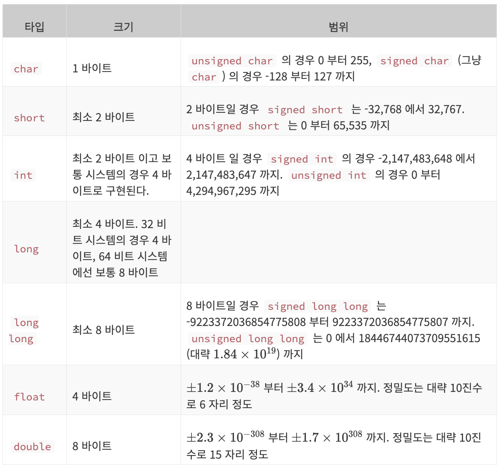
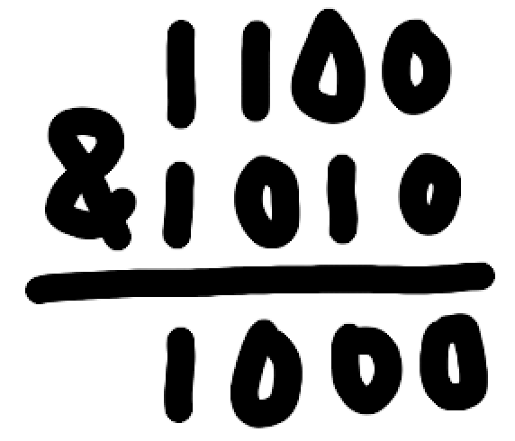
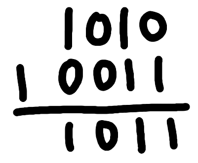
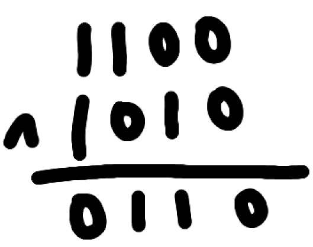
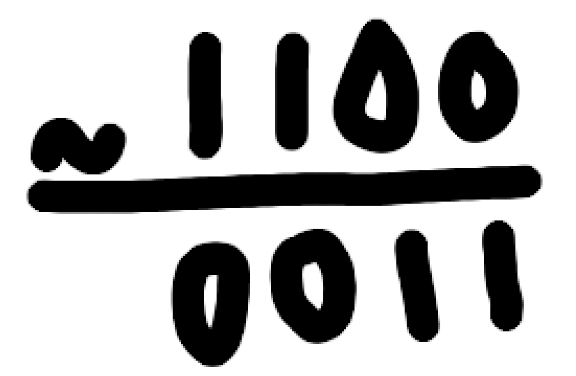
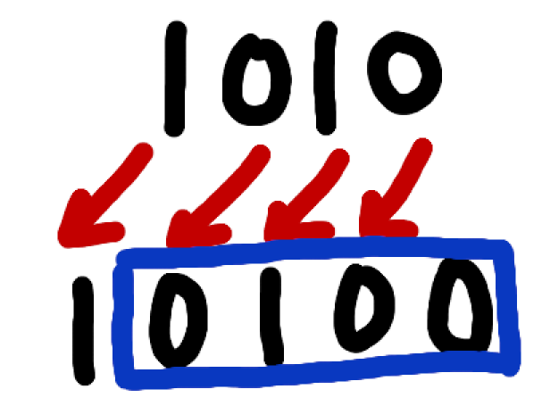
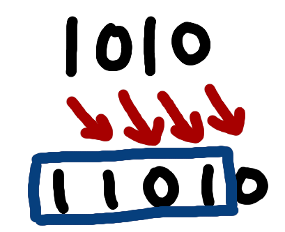
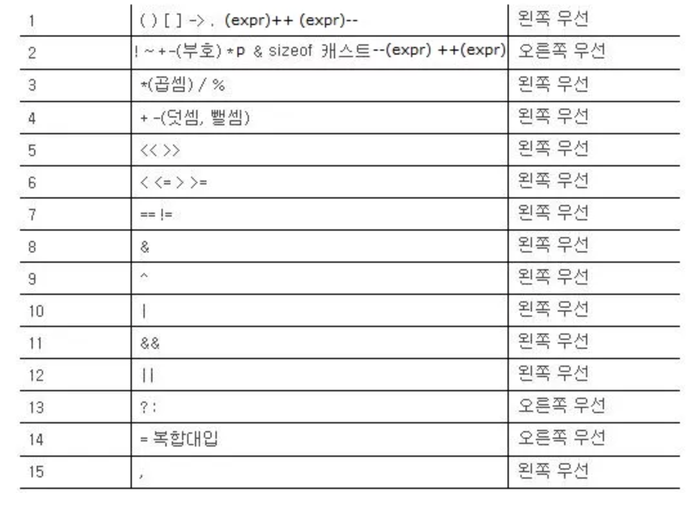
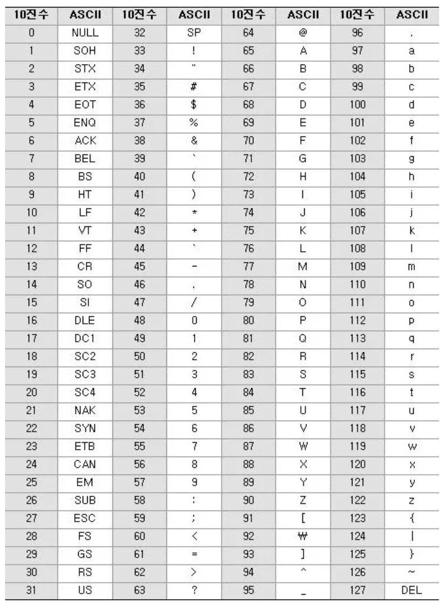

이번 주차는 C에 대해 공부를 하는 시간이였다.

그 전에 앞서 참고자료를 따라서 visual studio를 설치하려했는데, 지원이 종료된다는 얘기를 보았다.

이유가 궁금해서 찾아보니, macOS는 기본적으로 UNIX기반이기 때문에 C언어 개발에 필요한 도구들을 기본적으로 제공하거나, 간단하게 설치할 수 있으나, Window의 경우 C언어 개발 도구를 기본적으로 제공하지 않기 때문에, Visual Studio등의 C컴파일러와 개발도구를 포함한 개발환경을 별도로 설치해야 한다.

결론 : 맥에 참고자료에서 쓴다고 무지성으로 Visual Studio를 깔려고 한건 바보같은 행동이였다.

## C 시작하기

#### hello.c

가장 기본이 되는 hello.c파일을 먼저 만들어 보았다.

```c
#include <stdio.h>
int main() {
  printf("Hello, World! \n");
  return 0;
}
```

csapp에서 봤던 내용처럼 hello.c라는 파일을 (gcc -o hello hello.c) 컴파일러 (여기선 gcc)가 컴파일하고 어셈블러와 링커를 거쳐 hello라는 실행파일을 만들어서 결과적으로 Hello, World!가 print되었음을 확인 할 수 있었다.(./hello 를 통해 실행파일을 실행해보면 당연히 Hello, World!가 나옴.)

#### 코드 분석

코드의 첫 번째 줄 부터 무슨 역할을 하는지 살펴보면,

```c
#include <stdio.h>
```

#include는 괄호안의 파일을 컴파일 할때 우리의 파일(hello.c)에 복사한다. 여기선 stdio.h를 사용하였다.

> stdio.h : STanDard Input Output 의 약자로, 표준 입출력이란 의미. 입력과 출력(파일에 데이터를 쓰고, 화면에 출력), 입력을 받아들이는 것(파일을 읽는 것)을 수행할 기능을 제공함.
> .h 로 끝나는 파일은 헤더파일 이라고 하는데 간단하게
>
> - 함수 선언 : 다른 소스 파일에서 함수들을 사용할 수 있도록 선언.
> - 매크로 정의 : 코드 재사용과 가독성을 높이는 매크로 정의(코드 조각을 재사용가능하게).
> - 타입 정의 : 사용자 정의 타입을 정의.
> - 상수 정의 : 자주 사용되는 고정된 값을 정의.
> - 외부 변수 선언 : 다른 소스파일에서 사용 될 수 있는 전역 변수 선언.  
>   앞에서 보았던 stdio.h의 경우에는 printf, scanf 등의 함수가 정의 되어있고, 이 헤더 파일을 포함 함으로 해당 함수들을 사용할 수 있는 것.

그리고 가장 까먹기 쉽고 주의 할 점은 함수의 선언 또는 헤더파일 선언 부분을 제외하고는 ;을 찍어주어야 한다는 것이다.

```c
int main()
```

다음으로는 함수의 선언이다.  
위는 main이라는 함수를 선언한 것으로, main은 모든 C프로그램이 처음으로 시작하는 부분이다.  
프로그램을 실행한다는 말은 cpu의 명령어 레지스터에 프로그램의 시작 명령어 주소값을 전달하는 것인데 여기선 main에서 첫 번째로 실행할 명령어의 주소값이 전달된다.  
왼쪽의 int(Integer)는 이 함수가 끝날 때 정수값을 반환한다는 뜻이다.

```c
pritf("Hello, World! \n")
```

가장 핵심인 printf이다.  
해당 함수는 괄호안의 내용을 화면에 출력해주는 함수이다.

> \n : 개행 문자(Escape character)

```c
return 0;
```

앞서서 int main()이기에 함수가 끝날 때 정수값을 반환한다고 했는데 여기선 0을 반환하고있다. 왜 1, 2도 아닌 0이냐면 0을 반환한다는 행위는 컴퓨터에게 _프로그램이 무사히 종료되었다._ 라는 것을 알리는 것이기 때문이다. 만약 _1을 반환한다면 프로그램이 무사히 종료되지 않았다._ 를 의미한다.

```c
/*
여러 줄
주석 달기
*/

// 한 줄 주석
```

C에서는 두 가지 형태의 주석을 지원하며 컴파일러는 이를 무시한다.

당장에 작성한 코드를 이해 할 수 있다고 하더라도 나중에는 분명 이해하기 힘들다. 꼭 주석을 달도록 하자.

#### 기수법

- 16진수  
  매번 볼 떄마다 헷갈려서 한 번 정리를 해야겠다.  
  0,1 의 이진수로 표현을 하게 되면 너무 길어진다. 그래서 16진수를 사용하게 되었다.  
  16진수는 숫자를 16개를 필요로 한다. 하지만 우리가 가진 건 10개 밖에 없다. 그래서 알파벳 A~F 까지를 추가로 사용한다.  
  그래서 A(10), B(11), C(12), D(13), E(14), F(15)가 된다.

  > 123 = 7 \* 16 + 11 = 0x7B  
  > 이 때 0x는 16진수임을 나타내는 지표.

  이제 16 진수를 2진수로 나타내면 각 자리수를 2진수로 변환한다. 이 때 주의점은 맨 앞자리를 제외하고는 모두 반드시 4자리를 채워야 한다는 것이다.

  > 0x418E  
  > 4 : 100 (맨앞자리)  
  > 1 : 0001  
  > 8 : 1000  
  > E : 1110

  물론 반대로 갈 때는 4자리 씩 뒤에서 부터 끊어가며 계산 하면 된다.

## 메모리

#### 메모리의 단위

흔히 말하는 메모리는 휘발성 메모리인 RAM을 가리킨다.  
메모리는 주소를 통해서 바로 접근 할 수 있기 때문에 하드웨어 등의 저장장치에 비해 빠른 접근을 제공한다.  
메모리의 소자는 0 또는 1을 보관할 수 있고, 이 이진수 자리를 가리켜 **비트(Bit)** 라고 한다.  
그리고 이 비트를 8개를 묶어 바이트(Byte)라고 한다.(4비트를 묶어 니블(nibble)이라고도 하는데 잘 안씀)  
8비트로 나타낼 수 있는 수는 $2^{8} = 256$ 0부터 시작해서 255까지의 숫자를(0~0xFF) 까지 256개의 숫자를 나타낼 수 있다.

## 변수

#### 변수란?

컴퓨터는 정보를 기억하기 위해 메모리에 전기적인 신호를 써 놓는다.  
메모리의 각 방에 데이터를 저장하고, 이 방을 가리키기 위해 16진법으로 주소값을 나타낸다.  
허나 이 데이터에 접근할 때마다 0x12345678 주소를 매번 사용해야 한다면 너무 불편하다.  
그래서 사용하는 것이 **변수(variable)** 이다.

> a라는 변수에 내가 가진 과자의 수를 저장했다고 해보자.  
> 그럼 컴퓨터는 메모리의 어딘가 a에게 방을 내어주고 과자의 수를 저장한다.  
> 만약 과자를 3개를 더 얻는다면 a = a + 3이라는 간단한 수식으로 과자의 수를 늘릴 수 있게 되는 것이다.  
> 이게 아니였다면 0x132... ~ 0x1324... 사이의 모든 내용을 불러와서 3을 더하고 다시 저장해야하는 불상사가 있었을 것이다.

#### 변수 선언하고 사용해보기

```c
#include <stdio.h>

int main(){
    int a;
    a = 10;
    printf("a의 값은 : %d \n", a);
    return 0;
}
```

```c
#include <stdio.h>

int main(){
    int a;
    a = 127;
    printf("a의 값은 %d 진수로 %o 입니다. \n", 8, a);
    printf("a의 값은 %d 진수로 %d 입니다. \n", 10, a);
    printf("a의 값은 %d 진수로 %x 입니다. \n", 16, a);
    return 0;
}
```

```c
#include <stdio.h>

int main(){
    float a = 3.141592f;
    double b = 3.141592;
    printf("a : %f \n", a);
    printf("b : %f \n", b);
    return 0;
}
```

```c
#include <stdio.h>

int main() {
    float a = 3.141592f;
    double b = 3.141592;
    int c = 123;
    printf("a : %.2f \n", a);
    printf("c : %5d \n", c);
    printf("b : %6.3f \n", b);
    return 0;
}
```

아까 hello.c에서 알아본 것은 제외하고 코드를 따라가보자.

#### 코드 분석

```c
int a;
```

int 형의 데이터를 a라는 변수에 저장하겠다고 컴파일러에게 알려주는 것.

> 

> 데이터 형식은 표에서 보다시피 다양한 종류가 있다.

> 이 때 주의할 점은 char, float, double을 제외하고는 정확히 타입의 크기가 정해지지 않았다.

```c
a = 10;
```

변수 a에 10을 집어넣겠다.

```c
printf("a의 값은 : %d \n", a)
```

앞서 보았던 printf이지만, %d라는 것이 들어가있다.  
이는 _%d가 출력 될 자리에 ""다음에 오는 첫 번째 변수를 10진수로 출력하라_ 라는 뜻이다.

```c
printf("a의 값은 %d 진수로 %o 입니다. \n", 8, a);
    printf("a의 값은 %d 진수로 %d 입니다. \n", 10, a);
    printf("a의 값은 %d 진수로 %x 입니다. \n", 16, a);
```

위에서 말했듯이 %d는 ""이후 첫 번째 변수를 10진수를 출력하는 것이다. 그럼 %o와 %x는 무엇인가.  
%o 는 8진수, %x는 16진수를 의미한다. 그럼 각각의 printf문에서 2번째 변수인 a를 출력하게 되는 것이다.

```c
float a = 3.141592f;
double b = 3.141592;
```

여기서와 같이 실수형에는 float double 이 있다.  
근데 float에는 뒤에 f를 붙혀주었는데 double에는 붙히지 않았다.  
그 이유는 기본적으로 f가 붙지 않은 실수는 double로 인식을 한다.  
이를 float에 할당하게 되면 컴파일러는 double을 float로 변환을 해야 하며 이 과정에서 경고가 발생할 수 있다.  
이 때 f접미사를 사용하면 컴파일러가 변환 할 필요 없이 실수 상수를 그대로 float타입으로 명시할 수 있다.

```c
printf("a : %f \n", a);
printf("b : %f \n", b);
```

이번엔 %f가 등장하였다. 만약 float a, double b 로 선언 한 상황에서 a = 3f, b = 3으로 하더라도 3인 int뒤에 f가 붙었다는 오류, b를 %d로 출력하면 이상한 숫자가 출력된다.  
%f를 이용해서 출력을 할 때는 항상 소수점이 뒤에 꼭 있어야 한다.

```c
printf("a : %.2f \n", a);
printf("c : %5d \n", c);
printf("b : %6.3f \n", b);
```

이번엔 f 앞에 .2가 붙어있다.  
이는 **무조건** 소수점 이하 둘째 자리까지 표시하라 는 의미이다.  
d앞에 붙은 5는 숫자 자리수를 **되도록이면** 5자리로 맞추라는 의미이다.  
이 때 무조건과 되도록의 차이는 전자는 진짜 무조건 지켜야 한다. 후자는 6자리수에 적용 될 경우 그냥 6자리가 출력된다. 꼭 지키지는 않아도 되는 것이다.  
f 앞에 붙은 6.3은 위 두가지를 합친 것이다.  
6자리로 표현하되, 소수점 아래 셋째 자리까지 표시하라는 의미이다.

#### 변수 선언 시 주의점

- 대소문자를 구별한다 : a, A는 다른 변수이다.
- 숫자가 제일 앞에 위치 할 수 없다 : 1abcd(x)
- 변수에는 오직 알파벳, 숫자, \_ 만 넣는다
- 변수의 이름에는 띄어쓰기를 넣지 않는다(대신 \_)
- 이미 사용된 예약어 는 변수명으로 사용하지 못한다 : long, double, int, enum 등.

## 연산자

#### 연산자의 주의점

'+', '-', '\*' 연산자는 파이썬과 같으니 넘어간다.

- "%" 나머지 연산자 :
  나머지를 출력하기 때문에 int에만 사용 가능하다. %d, %o 등과 혼용될 수 있기 때문에 %%로 사용한다.
- "/" 나누기 연산자 :
  처음에 변수를 int로 선언했다면 나눈 결과 또한 정수로만 출력이 된다.  
  이 때, int a, double b를 계산하게 되면, 실수로 출력된다. 그 이유는 컴파일러가 산술 변환이라는 과정을 거치기 때문이다.
  > 산술변환 : 자료형이 다른 두 변수를 연산할 때, 숫자의 범위가 큰 자료형으로 자료형들이 바뀌는 것.

#### 코드 분석

```c
#include <stdio.h>

int main() {
    int a = 1, b = 1, c = 1, d = 1;

    a = a + 1;
    printf("a : %d \n", a);
    b += 1;
    printf("b : %d \n", b);
    ++c;
    printf("c : %d \n", c);
    d++;
    printf("d : %d \n", d);

    return 0;
}
```

```c
#include <stdio.h>

int main() {
    int a = 1;

    printf("++a : %d \n", ++a);

    a = 1;
    printf("a++ : %d \n", a++);
    printf("a : %d \n", a);

    return 0;
}
```

각각 모두 1을 더하는 연산이다. 이 때 중점적으로 봐야할 부분을 보자.

```c
++c;
```

전위형(prefix)라고 하며, 1을 더해주는 연산이지만, 먼저 1을 더해준 후 결과를 반환한다.

```c
d++
```

후위형(postfix)라고 하며, 1을 더해주는 연산이지만, 결과를 반환한 후 1을 더해준다.

이 차이점을 단적으로 보여주는 코드가 2번째 코드이다.

```c
printf("++a : %d \n", ++a);
```

이 경우에는 a에 1을 먼저 더한 값인 2을 printf함수에 반환하여 2를 출력한다.

```c
a = 1;
printf("a++ : %d \n", a++);
printf("a : %d \n", a);
```

이 경우에는 a의 값을 prinf함수에 반환하여 1이 먼저 출력 된 뒤, 1을 더하여 이후 a를 출력하면 2가 출력된다.

#### 비트 연산자

비트 연산은 말그대로 비트 하나하나를 비교하는 연산이다.

- "&" (And) :  
   

  이렇게 각 비트가 둘다 1일 떄만 1이 된다.  
  만약 자리수가 다른 두 숫자를 연산하게 되면 앞에 0을 추가하여 자리수를 맞추어 연산하게 된다.

- "|" (OR) :  
     
  이렇게 각 비트 중 하나만 1이여도 1이 된다.  
  주의해야 할 점은 int a = 0xAF(10101111) 이라고 선언 할 경우 반전을 하게 되면
  ~a = 0xFFFFFF50(11111111 11111111 11111111 01010000)이 된다는 점이다.  
  int 자료형은 4바이트 즉 32비트이기 때문에 10101111이라고 선언하더라도 실제로 컴퓨터에는 00000000 00000000 00000000 10101111 로 저장되게 된다.  
  따라서 반전을 하면 저런 결과가 나오게 되는 것이다.
- "^" (XOR) :  
     
  이렇게 각 비트가 다를 경우에만 1이 된다.

- "~" (반전 연산) :  
     
  이렇게 각 비트를 반전 시켜서 표기한다.
- "<<" (쉬프트 연산) :  
   비트를 왼쪽으로 쉬프트 시키는 연산.  
   예를 들어 a << 1 일 경우  
     
  앞의 쉬프트 된 숫자가 갈 자리가 없으면 버려지고, 뒤는 무조건 0으로 채운다.
- ">>" (쉬프트 연산) :  
  비트를 오른쪽으로 쉬프트 시키는 연산.  
  예를 들어 a >> 1 일 경우  
     
  마찬가지로 뒤의 쉬프트 된 숫자는 버려지고, 앞은 아까처럼 무조건 0이 아닌 제일 앞의 숫자로 채워진다.

#### 복잡한 연산

중첩된 혼합 연산의 경우 무엇을 먼저 연산 할 지에 우선 순위와 연산 방향이 존재한다.  


## 음수의 표현

#### 2의 보수 표현법

먼저 2진수의 덧셈을 알아보자.  
2진수의 덧셈은

- 1 + 1 = 10
- 1 + 0 = 1
- 0 + 1 = 1
- 0 + 0 = 0  
  이다.

그렇다면 어떤 수 x의 음수표현인 -x를 구하려면 더해서 0이 나오는 수를 생각하면 된다.  
만약 4비트만 기억을 한다고 했을 때, 0111과 더하여 0000이 나오는 이진수는 1001이 될 것이다.  
덧셈을 하면 10000이 되는데 앞의 1은 버려질 테니 0000이 되는 것이다.

이렇게 덧셈을 고려하여 가장 자연스러운 방법으로 음수를 표현하는 방식을 2의 보수 표현이라고 한다.  
0000을 제외한 경우 2의 보수 표현에서는 부호를 바꾸기 위해서는 비트들을 반전 시키고 1을 더하면 된다.  
또한 제일 앞의 비트가 부호라고 생각하면 되기 때문에, 1101 의 경우 음수가 될 것이고, 무슨 수인지 알고 싶다면 0011 즉 -3임을 쉽게 알 수 있다.

이같은 표현법의 장점으로는

- 양수나 음수 사이의 덧셈 시 굳이 부호를 고려하지 않아도 된다.
- 맨 앞의 비트를 사용하여 부호를 빠르게 알 수 있다.

추가로 1000의 경우 음수이지만 변환 하여도 1000이다.  
그렇기 때문에 int의 범위를 살펴보면 -2,147,483,648 ~ 2,147,483,647로 음수가 한 개 더 많은 것을 알 수 있다.

만약

```c
#include <stdio.h>

int main() {
    int a = 2147483647;
    printf("a : %d \n", a);

    a++;
    printf("a : %d \n", a);

    return 0;
}
```

를 수행한다면 결과는

```c
a : 2147483647
a : -2147483648
```

가 나오게 된다.

a의 값이 int가 표현할 수 있는 최대값이기 때문에, 음수가 되어버리는 경우가 발생하는 것이다.  
이 같은 경우를 **overflow**라고 표현하며, C에서 따로 알려주지 않기 떄문에 주의해서 사용하여야 한다.

unsigned int 일 경우에는 음수가 없고, 0 ~ 4294967295 수를 표현 할 수 있기 때문에 2의 보수 표현을 통해 해석될 수를 그냥 양수로 생각 한다.

```c
#include <stdio.h>

int main() {
  unsigned int b = -1;
  printf("b 에 들어있는 값을 unsigned int 로 해석했을 때 값 : %u \n", b);

  return 0;
}
```

이렇게 -1을 넣게 되면 0xFFFFFFFF 이므로 11111111111111111111111111111111 즉 4294967295 이 된다.

물론 unsinged int 에서도 overflow는 발생한다. 앞선 4294967295에 1을 더하게 되면 100000000000000000000000000000000이니까 앞의 1은 날아가고 0이 반환되게 된다.

## 문자 입력 받기

#### 코드 분석

```c
#include <stdio.h>

int main() {
    char a;
    a = 'a';

    printf("a 의 값과 들어있는 문자는? 값 : %d , 문자 : %c \n", a, a);
    return 0;
}
```

해당 코드를 실행하면 결과는 값 97과 문자 a가 출력이 된다.

```c
char a;
a = 'a';
```

먼저 char형 변수를 선언하고 a라는 변수에 문자 a를 대입하고 있다. 여기서 주의 할 점은 모든 문자는 작은 따옴표 (' ') 로 묶어 주어야 한다는 점이다.  
그렇지 않는다면 변수 a로 받아들여 변수 a에 변수 a를 저장하라??? 읭?? 하며 a 는 NULL 이 되어 버린다.

```c
printf("a 의 값과 들어있는 문자는? 값 : %d , 문자 : %c \n", a, a);
```

인지해야 할 점은 컴퓨터는 변수 a가 문자인지 숫자인지를 모른다는 것이다.  
해당 변수를 사용할 때 문자로 보고 사용하느냐, 숫자로 보고 사용하느냐에 따라 달라질 뿐이다.  
위 printf문에서는 %d는 숫자(정수)로 본 것이고, %c는 문자로 본 것이다.  
이 때 'a'가 어떻게 정수 값이 되나요?? 라고 한다면 ASCII에 대응되는 숫자를 출력하게 된다.

> 

#### scanf

scanf는 화면(키보드)로 부터 결과를 받아들이는 입력함수이다.  
scanf함수는 입력을 하기 전까지 계속 기다리며, 엔터를 눌러야만 입력으로 처리된다.

#### 코드 분석

```c
#include <stdio.h>

int main() {
    double celsius;

    printf("섭씨 온도를 화씨 온도로 바꿔주는 프로그램 입니다. \n");
    printf("섭씨 온도를 입력해 주세요 : ");
    scanf("%lf", &celsius);

    printf("섭씨 %f 도는 화씨로 %f 도 입니다 \n", celsius, celsius / 5 + 32);

    return 0;
}
```

```c
double celsius;
```

double 형 변수를 선언하였다.

```c
scanf("%lf", &celsius);
```

앞선 printf와 마찬가지로, scanf도 변수 타입마다 입력받는 포맷을 다르게 해야한다.

이 떄 주의할 점은 prinf에서는 double이던 float이던 모두 %f로 출력이 가능했지만, scanf에서는 double에는 %lf float에는 %f를 사용해야 한다.

```c
printf("섭씨 %f 도는 화씨로 %f 도 입니다 \n", celsius, 9 * celsius / 5 + 32);
```

위에서 말했듯 double형이여도 %f로 출력이 가능하다.

만약 섭씨를 화씨로 바꿀 때 9 x celsius / 5 + 32 라고 한 걸 9 / 5 x celsius + 32 로 바꾸면 결과가 달라질까?

후자는 double이 아닌 int 형 연산을 수행해서 연산 결과가 달라진다.

이제 scanf의 입력 형식에 대해 좀 더 자세히 알아보겠다.

```c
#include <stdio.h>

int main() {
    char ch;

    short sh;
    int i;
    long lo;

    float fl;
    double du;

    printf("char 형 변수 입력 : ");
    scanf("%c", &ch);

    printf("short 형 변수 입력 : ");
    scanf("%hd", &sh);
    printf("int 형 변수 입력 : ");
    scanf("%d", &i);
    printf("long 형 변수 입력 : ");
    scanf("%ld", &lo);

    printf("float 형 변수 입력 : ");
    scanf("%f", &fl);
    printf("double 형 변수 입력 : ");
    scanf("%lf", &du);

    printf("char : %c, short : %d , int : %d ", ch, sh, i);
    printf("long : %ld, float : %f, double : %f \n", lo, fl, du);
    return 0;
}
```

하나씩 뜯어서 보도록 하겠다.

```c
printf("char 형 변수 입력 : ");
scanf("%c", &ch);
```

먼저 문자를 입력받는 부분이다.  
한글은 2바이트 이상을 차지하기 때문에 최대 1바이트를 저장 할 수 있는 char형에 한글을 치면 버퍼오버플로우(Buffer Overflow)가 발생한다(공격자가 버퍼오버플로우를 이용하여 다른 코드가 실행 될 수 있도록 할 수 있다고 한다).

또한 char형 변수를 선언할 때는 문자를 보관하기 위해 쓸 수 있도록 한다.  
정수 데이터를 보관 할 수는 있지만, int를 두고 char을 이용할 이유가 없기 때문이다.

```c
printf("short 형 변수 입력 : ");
scanf("%hd", &sh);
printf("int 형 변수 입력 : ");
scanf("%d", &i);
printf("long 형 변수 입력 : ");
scanf("%ld", &lo);
```

다음은 정수형 변수를 입력받는 부분이다.  
short형, long형 모두 int와 같은 정수형 변수이고, printf에서는 long(%ld)을 제외하고는 %d로 모두 출력 가능하지만, scanf에서는 %hd, %d, %ld로 구분하여 사용해야 한다.

```c
printf("float 형 변수 입력 : ");
scanf("%f", &fl);
printf("double 형 변수 입력 : ");
scanf("%lf", &du);
```

앞서 언급했듯이 출력할 때는 %f로 모두 출력이 가능하지만, scanf로 입력 받을 때는 %lf 와 %f로 반드시 구분하여야 한다.

#### 추가 주의사항

코어타임에 알게 된 새로운 내용이다.

scanf로 입력을 받는 경우의 예시들을 나열해보겠다.

사전에 인지해야 할 내용은 scanf는 포맷 문자열의 공백을 하나 이상의 공백으로 처리한다는 것이다.  
이제 코드를 살펴보자.

```c
scanf("%d %d", &a, &b);
```

포맷 문자열에 공백이 한 개 있으니 입력 할 때,

```c
5 6
5          6
```

둘 모두 입력이 정상적으로 된다.

```c
scanf("%d%d", &a, &b);
```

그렇다면 둘 사이의 공백을 없애면 어떻게 될까  
공백이 없다하더라도 두 입력을 구분해야하기 때문에 띄어쓰기가 필요하다.

```c
5 6
5          6
```

둘 모두 정상적으로 입력 된다.

```c
scanf("%d, %d", &a, &b);
```

이 경우에는 %d이후에 빈칸이 없다. 즉 ,를 바로 받기를 기대하고 있다.

```c
5 6   //안됨
5, 6  //됨
5 ,6  //안됨
```

그렇기 때문에 쉼표를 넣어주더라도 공백이 들어가면 제대로 입력받지 못한다.

```c
scanf("%d , %d", &a, &b);
```

이 경우에는 , 전에 빈칸이 있기 때문에

```c
5,6
5      , 6
```

모두 입력이 가능하다.
