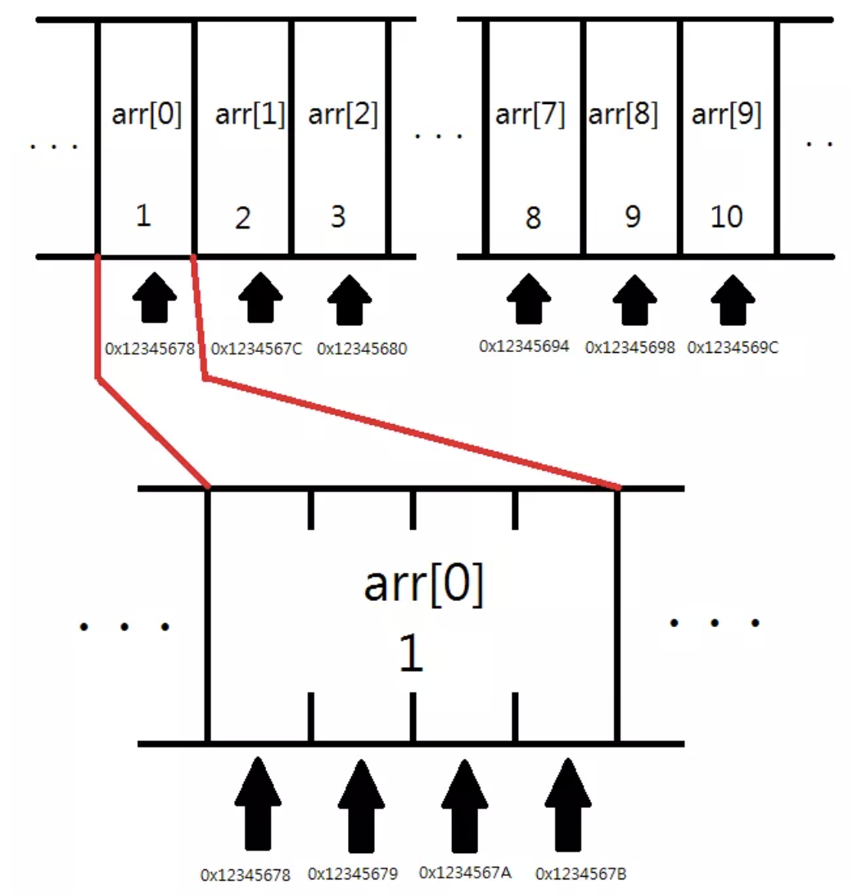

오늘은 어제에 이어서 c언어 공부를 했다.

## 포인터

#### 사전지식

먼저 짚고 갈 점은 모든 데이터들은 메모리 상에 특정 공간에 저장 되어 있다는 것이다.  
메모리의 각각의 공간은 1바이트를 가지고, 예를 들어 int형 변수를 정의한다면 4칸을 차지하게 된다.  
어떤 공간의 정보를 사용해야 할 지 구분하기 위해서 각 공간에 고유 주소(address)를 붙이고,

```c
int a = 123;
```

<p align="center">
</p>

16진수로 표현된 메모리 주소(0x152839)로 부터 4바이트의 공간을 차지 하면서 123 이라는 값이 저장되게 되는 것이다.

만약

```c
a = 10;
```

라고 a에 10을 대입하게 되면, 메모리주소(0x152839)로 부터 4바이트의 공간에 있는 데이터를 10으로 바꾸게 되는 것이다.

#### 포인터란

말그대로 가리키다 를 의미한다.

포인터 또한 앞서 나왔던 int 형 변수, float 형 변수 등과 함께 하나의 변수(포인터 변수)이다.  
int형이 정수, float형이 실수를 저장하는 변수였다면 포인터는 **메모리 주소**를 저장하는 변수이다.

그 중에서도 메모리 상에 위치한 특정 데이터의 **시작 주소값**을 저장하는 변수이다.

```c
int* p;
int *p;
```

포인터는 위와 같은 방식으로 정의 할 수 있고, 둘 다 같은 뜻이다.  
코드에서 볼 수 있듯이, 포인터에도 자료형이 존재한다.  
위 코드에서는 포인터가 메모리 상의 int형 데이터의 주소값을 저장한다는 것이 된다.

#### & (참조)연산자

&연산자를 AND 연산자와 혼동할 수 있는데, &연산자는 피연산자가 두 개가 필요한 이항 연산자이며, 사용할 때는 && 로 사용을 한다.  
&연산자의 경우 피연산자 하나에만 적용되는 단항연산자이며, _주소값을 불러오기 위해_ 사용한다.

```c
&a
```

사용법은 위와 같이 단순하다.

#### 코드 분석

```c
#include <stdio.h>

int main() {
    int a = 2;

    printf("%p \n", &a);
    return 0;
}
```

위 코드를 실행하면 int값 2를 저장하는 변수 a의 메모리 주소를 16진수의 형태로 출력하게 된다.  
그러나 결과를 보면 0x7ffe6e7ea3e4로 8바이트가 아님을 알 수 있는데, 이는 단순히 앞의 0들이 잘려나간 것이니 참고하면 되겠다.  
결과적으로 int형 변수 a는 메모리주소(0x7ffe6e7ea3e4 )를 시작으로 4바이트의 공간에 2를 저장하고 있었다. 라고 정리 할 수 있다.

```c
#include <stdio.h>
int main() {
  int *p;
  int a;

  p = &a;

  printf("포인터 p 에 들어 있는 값 : %p \n", p);
  printf("int 변수 a 가 저장된 주소 : %p \n", &a);

  return 0;
}
```

이제 &연산자를 통해 얻은 메모리 주소값을 p라는 int형 포인터 변수에 저장하는 코드이다.  
결과는 당연히 둘 다 0x7ffe6e7ea3e4를 출력하게 된다.

한 번 정의된 변수의 주소값은 변하지 않지만, 위 코드를 여러번 실행 해보면 매번 다른 값이 나오는 걸 알 수 있다.  
이는 ASLR(Address Space Layout Randomization)이라는 기법 때문인데, 프로그램이 실행 될 때마다 메모리 주소 공간을 무작위화 하여 배치하는 보안 강화 기술이다.  
그렇기 때문에 코드를 실행할 때마다는 바뀌지만 한 코드 내에서는 변수의 정의된 메모리 주소는 불변이다.

#### \* (역참조)연산자

\* 연산자는 곱셈 연산자와 혼동될 수 있으나, 곱셈 연산자는 이항연산자이다.  
앞서 & 연산자가 value의 주소값을 가져오는 연산자였다면, 주소값에서 해당 주소값이 가리키고 있는 곳에 저장 된 **value를 가져오는 연산자**가 \* 연산자 이다.

즉 *포인터를 포인터에 저장된 주소값에 위치한 value로 취급*하는 것이다.

#### 코드 분석

```c
#include <stdio.h>

int main(){
    int* p;
    int a;

    p = &a;
    a = 2;

    printf("a의 값 : %d \n", a);
    printf("*p의 값 : %d \n", *p);

    return 0;
}
```

해당 코드에서는 포인터 변수 p에 변수 a의 주소값을 저장했고, 변수 a 에 값 2를 저장했다.  
출력으로는 a변수에 저장 된 값, p포인터에 저장 된 주소값에 저장 된 값을 출력했다.
포인터 변수 p는 변수 a의 메모리 주소 값을 가지고 있기 때문에 결과는 같은 값이 출력된다.

```c
#include <stdio.h>

int main() {
    int* p;
    int a = 2;

    p = &a;
    *p = 3;

    printf("a의 값 : %d \n", a);
    printf("*p의 값 : %d \n", *p);
    return 0;
}
```

해당 코드에서는 포인터 변수 p에 변수 a의 주소값을 저장하고, 역참조를 통해서 포인터 p에 저장된 주소값의 값을 3으로 저장했다.  
출력값을 보면 처음 a를 선언할 때 2로 초기화를 했지만, 역참조를 통해 a의 값을 3으로 저장했기 때문에 둘 다 3이 출력 됨을 알 수 있다.

<p align="center">
</p>

메모리 공간을 살펴보면 이런 식으로 포인터 또한 변수이기 때문에 공간을 차지하고있고, 포인터 p가 변수 a를 가리킨다라고 표현한다.

#### 포인터의 타입

포인터는 주소값을 저장하는 곳이라고 계속 얘기해왔다.  
근데 주소값만 저장할 거면 32비트 환경에선 4바이트, 64비트 환경에서는 8바이트 일 텐데 왜 굳이 타입이 필요한 걸까??

이유는 포인터에 저장되는 주소값이 변수가 저장된 공간의 시작 주소값이라는 점에 있다.  
\* (포인터)로 값에 접근을 했을 때 컴퓨터는 메모리에서 시작 할 곳은 알지만 거기서 부터 얼마나 읽어야 하는지를 알 수 없다.
