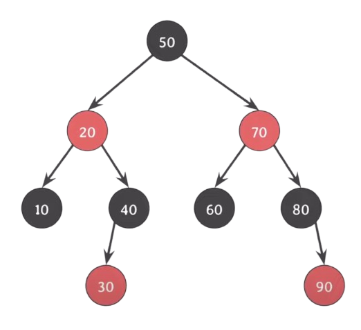

오늘 C언어를 이용한 스택, 큐, 이진트리의 구현을 해보면서 구조체의 선언과 메모리 할당에 대해 새로 이해한 내용을 정리하려한다.

## 구조체 정의

```c
typedef struct _queue
{
	QueueNode *head;
	QueueNode *tail;
} Queue;
```

이런 식으로 \_queue라는 구조체를 선언을 하였으며, 별명을 Queue로 하였다.

구조체의 정의는 컴파일러에게

Queue라는 구조체는 이  
크기(16바이트)를 가지면서,  
멤버로 head, tail포인터를 가지고 있어.  
얘는 메모리 상에 이런식으로 배치가 될거야.  
라는 것을 알려주는 행위 이다.

정의만으로 실제로 스택에 인스턴스화가 되지는 않지만, 나중에 이렇게 쓸거야~ 를 알려주는 것이다.

그럼 이후 런타임 시간에 메모리의 할당 등이 일어나면서 사용을 하는 것이다.

> 런타임 시간에는 구조체에 대한 정보를 알고 있지 않다.  
> 컴파일러가 구조체를 보고서 정해놓은 레이아웃을 사용하는 것이다.

## 구조체의 선언

이제 특정 함수에서 구조체를 사용하는 경우에 대해 알아보겠다.

- 구조체 변수로서 사용할 때

  ```c
  Queue queue;
  ```

  이렇게 선언을 했다면 queue는 Queue 자료형의 변수로서 스택에 구조체가 인스턴스 화가 된다.  
  스택은 메모리의 할당과 해제를 자동으로 관리한다.  
  queue.head, queue.tail 로 구조체의 멤버를 사용하려면 먼저 초기화를 해주어야 한다.  
  현재 상태에서는 각 포인터에 접근을 하게 될 경우 쓰레기 값을 가지고 있기 때문에 최악의 경우 segment fault가 발생하지 않아 찾지 못하는 버그를 유발하게 된다.  
  때문에 NULL로 초기화를 해주고 사용을 하는 것이다.

  > NULL로 초기화 되지 않은 포인터를 사용할 경우 우연히 민감한 정보에 접근이 가능할 수도 있다.

- 구조체 포인터로서 사용할 때

  ```c
  Queue *queue;
  ```

  이렇게 선언을 하게 되면 우리는 Queue라는 구조체를 가리킬 수 있는 queue라는 포인터를 선언한 것이다.  
  때문에 쓰레기 값을 가리키고 있는 포인터 하나를 선언한 것이지 우리가 의도한 대로는 사용할 수 없는 상태이다.  
  이 때는 malloc을 사용하여 동적으로 메모리 공간(힙)을 할당 해 주어야 한다.

  ```c
  Queue *queue = (Queue *)malloc(sizeof(Queue));
  ```

  > 이 때, malloc이 반환하는 void* 은 암시적으로 해당 포인터 타입으로 변환이 되지만, (Queue *) 이라는 명시적인 형 변환으로 컴파일러와 다른 코드를 읽는 사람에게 해당 타입임을 알려주는 것이 좋다.

  저렇게 malloc을 사용하게 되면 Queue 구조체를 담을 수 있는(Queue의 크기만큼 = 16 바이트) 비어있는 빈 공간을 할당받게 된다.  
  이 때 중요한 점은 저 공간은 구조체를 담을 수 있는 **빈 공간** 이라는 것이다.

  > 여기서의 **빈 공간**은 무조건 비어있다는 것은 아니다.  
  > 여기서 부터 여기까지 너써~ 한 것이 때문에 다른 값이 들어있을 수도 있다.

  여기서 앞서 짚고 간 개념이 등장한다.  
  컴파일러는 우리의 구조체가 어떠한 형이고, 크기이고, 멤버는 누구이고, 메모리 공간에 어떻게 배치할 지를 알고 있다.

  그렇기 때문에 이후 우리가

  ```c
  Queue *queue = (Queue *)malloc(sizeof(Queue));
  queue->head = NULL;
  queue->tail = NULL;
  ```

  로 각 멤버 포인터들을 초기화 할 때에 빈 공간이였음에도 아 여기에 head포인터를(8바이트) 저장하고 얘는 NULL을 가리키는 구나!(tail도 마찬가지)가 가능한 것이다.

  또한 이 경우 free를 통해 사용후에는 메모리 해제를 해주며 메모리 누수를 방지해야 한다.(힙은 사용자가 임의로 할당, 해제하는 공간)

## RB tree

#### RB tree의 정의

레브블랙트리(Red-Black Tree)는 이진탐색트리의 한 종류로 스스로 균형을 잡는 트리이다.

> 균형(Balance) : BST의 경우 모든 노드가 한쪽으로 치우치는 worst case가 발생하는 단점(O(n))이 있다.  
> 이걸 방지하기 위해 스스로 균형을 맞추며 삽입, 삭제, 검색이 O(logn)이 될 수 있도록 한다.

또한 모든 노드는 Red 혹은 Black이다.

<center></center>
