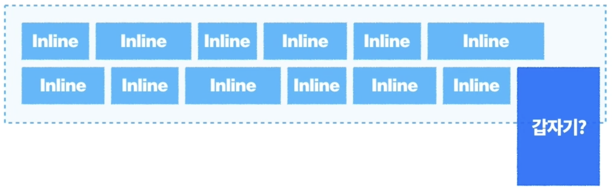
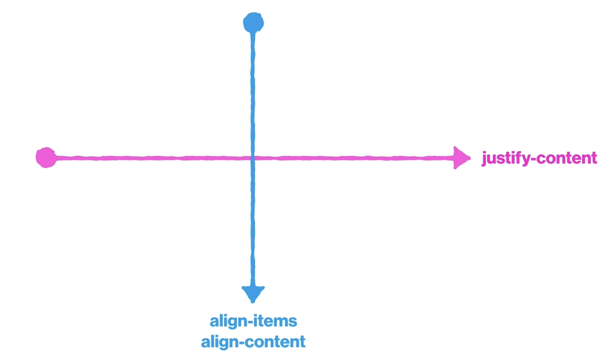
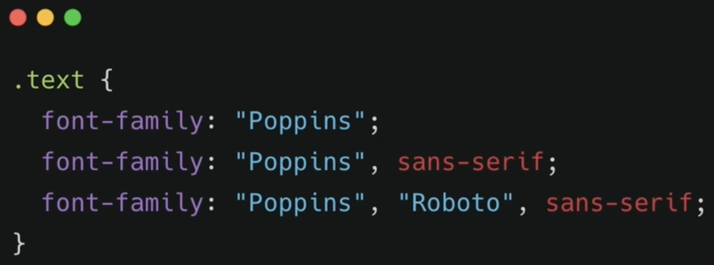
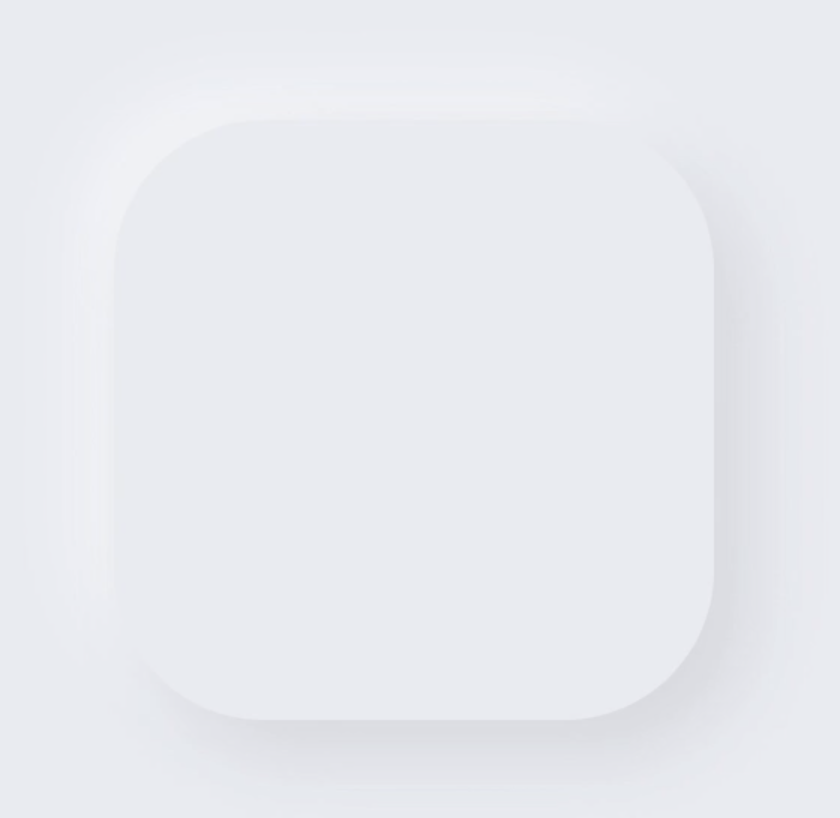

[생활코딩](https://www.youtube.com/@coohde "생활코딩") 채널을 통해 배운 내용을 정리하려 한다.

## CSS(Cascading Style Sheet)

### box_model

{: style="display: block; margin-left: auto; margin-right: auto; width: 80%;" }

{: style="display: block; margin-left: auto; margin-right: auto; width: 60%;" }

html의 모든 요소는 박스로 이루어져 있다.  
그런 박스가 일정한 형태의 모델로 이루어져있기 때문에 이를 box model이라고 부른다.  
예를 들어서 봉지라면을 생각했을 때 여러가지 종류의 라면이 있지만 봉지안에는 면, 스프가 들어있다는 것을 알고 있다.  
박스 또한 제각각 다르게 생겼다고 그 안의 구조는 동일하다는 것이다.

#### content

- width
- height

#### padding

Border과 content 사이의 여백.

#### border

```html
border: 1px solid #000
```

```html
border: none
```

```html
border-radius: 4px
```

```html
border: 굵기 스타일 색상
```

#### margin

요소 사이의 간격.

margin을 줄 때는 margin-top, margin-bottom 중 하나만 웬만하면 사용하는 것이 좋다.

#### padding과 margin

일일히 top left bottom right 적어주기가 귀찮다.

```html
padding : top right bottom left
```

```html
padding : (top,bottom) (right,left)
```

```html
padding : (top,bottom) (right,left)
```

```html
padding : top, right, bottom
```

top과 bottom, right 와 left는 짝임.

그래서 bottom이 비어있으면 top의 값, left가 비어있으면 right의 값을 가짐.

#### box sizing

{: style="display: block; margin-left: auto; margin-right: auto; width: 80%;" }

정사각형의 모양을 만드려고 했는데, padding을 더하다 보면 그 값만큼 제하고 계산을 해야 하네?  
불-편 😡

모든 html요소는 기본적으로 box-sizing : content-box 로 설정되어있다.

이런 상태에서 width 와 height를 설정해 주게 되면, content box 만의 width height를 설정하게 되기 때문에 padding margin 등의 변동이 생기면 목표로 한 크기에서 벗어나게 됨.

{: style="display: block; margin-left: auto; margin-right: auto; width: 80%;" }

허나 우리가 자연스럽게 생각하는 크기는 저 둘도 포함한 전체의 크기임.

{: style="display: block; margin-left: auto; margin-right: auto; width: 80%;" }

그래서 영역의 크기를 border box로 하게 되면 우리가 생각하는 크기가 된다.

보통은 전체 설정을 바꿔주고 시작한다.

```html
* { box-sizing: border-box; }
```

### box

box의 type에 따라 box model이 어떻게 작동할지가 달라진다.

따라서 type 별로 구분해서 공부할 필요가 있다.

- block
- inline
- inline block
- flex

#### box type

display 속성값에 따라 box type이 달라진다.

모든 html 요소는 display 속성을 가지고 있다.

#### block

block -> 길막

{: style="display: block; margin-left: auto; margin-right: auto; width: 80%;" }

남은 공간이 있음에도 자신이 영역을 쭈욱 차지해서 다른 요소가 침범하지 못하도록 길막하는 성질이 있다.

- 따로 width를 선언하지 않은 경우에는 width = 부모의 content-box의 100%를 차지한다.  
  {: style="display: block; margin-left: auto; margin-right: auto; width: 80%;" }

- width를 선언한 경우, 남은 공간은 자동으로 margin으로 채운다.
  {: style="display: block; margin-left: auto; margin-right: auto; width: 80%;" }
  해당 margin은 분명 존재하는데 개발자 도구에서는 - 로 표기가 되는데 이건 나중에 css 디버깅할 때 방해 요인이 될 수 있다.  
  그러니까 각 box type의 특징을 이해할 필요가 있다.

  여기서 자동으로 생기는 margin을 컨트롤 하게 되면,

  ```html
  margin-left: auto
  ```

  이런 경우에는 오른쪽으로 요소가 밀리게 되는데 이는 오른쪽으로 정렬된 것이 아니라, 자동으로 생기는 margin이 기본적으로 오른쪽에 생기는데 이를 왼쪽에 생기게 한 것이다.

  ```html
  margin-left: auto; margin-right: auto;
  ```

  이렇게 하게 되면 자동으로 생기는 margin을 양쪽으로 사이좋게 생긴다. => 가운데 정렬과 같은 역할이 된다.

- 부모의 height를 따로 선언하지 않은 경우 자식 요소의 height의 합이 곧 부모의 height가 된다.

block은 width height padding margin을 모두 사용할 수 있다!!

#### inline

inline -> 흐름

block과 정 반대라고 생각할 수 있다.

{: style="display: block; margin-left: auto; margin-right: auto; width: 80%;" }

요소들이 쭈루룩 나열되다가 어 넘어가네? 하면 줄바꿈 해서 쭈루룩 나열한다.

#### block vs inline

면(영역) vs 선(흐름) 으로 생각하면 좋다.

- block : 영역을 잡기 위해 사용하는 box type(width height padding margin을 모두 사용 -> 영역이니까).

- inline : 콘텐츠를 옆으로 흐르게 하는 흐름

  {: style="display: block; margin-left: auto; margin-right: auto; width: 80%;" }

  그런데 갑자기 이런 흐름을 깨는 요소가 오면 굉장히 싫어할 것이다.

  때문에 width, height, padding-top, padding-bottom, border-top, border-bottom, margin-top, margin-bottom이 사용불가하다.

  {: style="display: block; margin-left: auto; margin-right: auto; width: 80%;" }

  {: style="display: block; margin-left: auto; margin-right: auto; width: 80%;" }

  {: style="display: block; margin-left: auto; margin-right: auto; width: 80%;" }

  위 그림을 보면 이해할 수 있다. inline box에 padding-top을 주었을 때 영역으로서의 의미가 있었다면 아래그림처럼 흐름이 흐뜨러졌겠지만, 이 경우는 룰을 깨버리는 넌씨눈이기 때문에 다른 요소를 덮어버리고 다른 요소들은 어머 쟤 뭐야 하면서 자기 갈 길을 가는 모습이다.

#### inline-block

짬뽕이다.  
inline 처럼 옆으로 흐르면서, block 처럼 영역을 잡게 할 수도 있다.

그렇기 때문에 inline에서는 사용하지 못했던 속성들이 모두 사용이 가능하다.

### float

float는 블록 요소들을 가로배치를 하기 위해서!!

block -> 길막! 그럼 가로배치가 어려운데 이걸 해결해준다!

아래에서 가로배치를 하기위해서 float가

1. 얼마나 레이아웃을 망가뜨리는지
2. 그걸 어떻게 고쳐야 하는지

를 알아보려고 한다.

#### float를 쓰면 일어나는 일

{: style="display: block; margin-left: auto; margin-right: auto; width: 80%;" }

float는 말 그대로 요소를 붕 띄우는 것이다.  
그럼 해당 요소의 부모는 float된 요소를 집나간 자식으로 여긴다.

{: style="display: block; margin-left: auto; margin-right: auto; width: 80%;" }

앞서 height를 선언하지 않은 부모는 자식의 height의 합을 가진다고 했다.  
근데 자식이 저렇게 집을 나가 버리면 나머지 요소들은 그 자리를 차지하고, 부모는 아 노랑 파랑만 우리 애구나 하고 높이를 맞추게 된다.

또한 그 어떠한 type도 float를 하게 되면, block으로 신분이 바뀐다. 고로 width, height, padding, margin을 모두 사용할 수 있게 된다.  
하지만 하자가 좀 있다.  
바로 길막을 하지 못하는 block이 된다는 것이다.  
그렇기 때문에 content의 크기만큼을 가지고 붕 뜨게 된다.
또한 width를 주었을 때 원래 block은 margin을 자동으로 채워서 영역을 차지하는데, 이 경우에는 자동으로 생기던 margin이 생기지 않는다(물론 margin을 못 주는 것은 아니다).

{: style="display: block; margin-left: auto; margin-right: auto; width: 80%;" }

이걸 생각을 하면서 두 요소를 float를 주게 되면, 빨간색은 붕 떠서 갈수있는 공간 중 가장 왼쪽으로 가게 될 것이고 부모는 자식들이 어 쟤네 둘 밖에 없네 하고 height도 줄어들 것이다. 노란색은 붕떴다가 어? 갈 곳이 없네? 하고 두리번 하다가 빨간색 옆에 자리가 있는 것을 보고 그쪽으로 갈 것이다. 이렇게 가로 배치가 가능해지게 된다.

{: style="display: block; margin-left: auto; margin-right: auto; width: 80%;" }

마지막으로 파랑이 까지 float해주게 되면 어 빨강이있네 어 노랑이 있네 어 자리가 없네??? 가 되어서 어쩔 수 없이 밑으로 가게 된다.

그러고 부모는 height가 0이 된다. 그럼 영역을 차지하지 않는다는 것이고, 곧 요소가 존재하지 않는 것이 된다.

이것은 엄청난 레이아웃의 붕괴를 가져오게 된다.

{: style="display: block; margin-left: auto; margin-right: auto; width: 80%;" }

그래서 형제 요소가 영역을 차지 하지 않는 형의 자리를 차지한 것을 알 수 있는데, 그러나 글씨를 보면 뭔가 이상하게 나열되어 있음을 알 수 있다.

이는 float로 인해 발생하는 상황 중 float된 요소를 다른 요소는 없는 것으로 취급을 하지만 inline의 성질을 띄는 이미지나 텍스트의 경우는 어...어딘가 float된 애가 날 지켜보는것 같아...ㄷㄷㄷ 하고 기가막히게 눈치를 채고 피해간다.

이렇기 때문에 float는 잘 사용하지 않는 추세이다.  
하지만 왜 안쓰는지를 알아야 float를 사용한 코드를 고칠 수 있겠지???? 알아야겠지???

#### float로 인해 망가진 layout을 고쳐보자

- 댕꿀 쉬운방법  
  부모에게 overflow: hidden을 주게되면 부모가 집나간 자식을 찾더라 이유는 모르게씀?????
- 어려운 방법  
  clearfix : float로 인한 layout의 망가짐을 해결하기 위해 등장한 clear 속성으로 고치는 행위.  
  예를 들어 float: left로 띄워진 형제를 가지는 요소가 있다면 해당 요소에게 clear: left를 주어서 자 지금부터 너에게 float: left를 받은 요소를 찾는 능력을 줄게. 가 되는 것이다.  
  그래서 형제 요소는 잃어버린 형제를 감지하고 다시 자기 자리로 가게 되고, 부모는 여전히 float된 자식을 찾지 못하지만 해당 자식을 감지하는 다른 자식을 통해서 제대로된 height를 알 수 있게 된다.

  따라서 clear는 left, right, both 의 속성을 가질 수 있다.

  근데 단순히 스타일을 위해 아무 의미가 없는 html요소를 추가한다?????? 😡😡😡😡 불 - 편 용납할 수가 없다.

  이를 위한 방법을 아래에서 제시한다.

- Pseudo-element  
  html에는 존재하지 않는 가상 요소를 css로 만드는 것이다.  
  가상 요소는 각 요소당 2개씩 만들 수 있다.

  {: style="display: block; margin-left: auto; margin-right: auto; width: 80%;" }

  {: style="display: block; margin-left: auto; margin-right: auto; width: 80%;" }

  이런 식으로 ::after을 사용하여 필수 속성인 content에 넣고 싶은 내용을 작성함으로 가상 요소를 만들 수 있다(block type은 inline).

  이제 원래 목적을 위해 가상 요소를 만드려고 하면, clear는 block type에만 사용할 수 있다.

### position

자유자재로 요소를 이동시키기 위한 것

기준점에 따라 방법이 달라지니 type을 확실히 알 것

top left right bottom 속성값을 가짐. top bottom 중 하나, right left 중 하나 이렇게만 사용하는게 정신건강에 좋아.  
물론 피치 못할 경우는 괜찮다.

- static
- relative
- absolute
- fixed
- sticky

Type -> 기준점

내가 어떤 position을 사용하고 있는지 -> 해당 position은 무엇을 기준으로 요소를 위치시키는지.

#### static

모든 요소의 기본 position 값.

#### relative

자신이 원래 있던 자리를 기준으로 이동시킨다.

{: style="display: block; margin-left: auto; margin-right: auto; width: 80%;" }

float와 마찬가지로 현재위치에서 일단 붕 뜬다.  
그러나 float와 다른 점은 본인의 기존 위치를 알고 있다는 점이다.  
그렇기 때문에 layout을 폭파시키지 않는다.  
집 나간 자식 vs 도리는 다하는 집 나간 자식..?

#### absolute

float를 했을 때와 동일한 현상(clearfix 제외)

- 집나감.
- display 가 block 으로 바뀜.
- 하지만 길막 못하는 block(margin auto 가 안생김).

근데 float와 다르게 inline요소들이 눈치를 못챈다.  
완전히 그냥 나만의 세상에 산다.

absolute는 자신이 기준으로 삼고 싶은 요소를 선택할 수 있다.  
자신의 조상 요소 중 position이 static이 아닌 요소를 기준으로 자신을 위치시킨다.

어떤 걸 기준으로 할지 확실히 설정해 줄 필요가 있다.  
그러니까 사용할 때는 absolute 줄거니까 기준점을 먼저 정하고 원하는 위치로 옮겨야지~ 의 사고의 흐름이 되어야 한다.

보통은 position relative를 사용해서 기준을 잡아주는게 현명하다.

#### fixed

absolute와 같은 현상이 일어난다.

기준점이 viewport를 기준으로 정해져있다.

> viewport : 브라우저 창의 전체 크기

#### z-index

{: style="display: block; margin-left: auto; margin-right: auto; width: 80%;" }

position static을 제외하고는 모두 붕 뜨게 되는데 그 위치를 나타내는 것.

위로 갈 수록 index가 커진다.

#### float position 정리

두 요소를 나란히(가로배치) 두고 싶으면 float, 특정 위치에 옮겨서 고정하고 싶을때 position을 사용하면 되는데,

원래있던 자리에서 집을 나가서(원래 맥락에서 떼어내서) 특정 위치에 고정시키고 싶다 -> absolute
viewport 기준으로 옮겨야 하나? -> fixed
원래 있던 위치를 유지하면서 조금 옮기고 싶나 -> relative

#### 사소한 팁

- img
  ```html
  .card-carousel img { display: block; width: 100%; height: auto; }
  ```
  이미지를 다룰때 가장 많이 쓰는 구조로, img는 본디 inline이지만 사진 파일 자체의 크기가 있기 때문에 width height를 사용할 수 있다.  
  하지만 약간의 오차가 있을 수 있기 때문에 display: block을 통해 확실하게 하면 좋다.
- transform

  ```html
  transform: translate(X, Y);
  ```

  ```html
  transform: translateX();
  ```

  ```html
  transform: translateY();
  ```

  모양을 변형 시킬때 사용하는 속성으로 다양한 함수를 제공하니 필요할 때 찾아보고 쓰면 된다.

  실습예제에서는 화살표를 50%위치에 뒀는데, 화살표의 중심을 기준으로 위치하는게 아니다 보니 살짝 쳐졌다.

  이때 transform은 자기 자신을 기준으로 삼기 때문에 transformY(-50%)를 통해 본인의 높이의 반만큼 위로 올려주었다.

  그래서 우리가 absolute로 50% 가운데 배치를 할 때는 transform: translate를 사용해서 가운데 위치하게 한다.

- button  
  button의 width를 정할 떄 고정 값으로 주게되면, 글씨가 넘어갈 수도 있다.  
  button은 기본으로 브라우저에서 먹이는 css가 굉장히 구리기 때문에 처음부터
  ```html
  button { border: none; background-color: #fff; }
  ```
  이렇게 없애고 하면 좋다.
  하지만 padding으로 주면 글씨의 양 옆에 무조건 주기 때문에 더 재사용성이 좋다.
- inline-block  
  inline-block을 사용하면, 원치않는 오차가 생길 수도 있다.  
  왜 그런지는 모르겠음.  
  그래서 inline-block을 사용하는 것을 선호하지 않는다.
- inline-block 들 의 정렬  
  block 안에 들어있는 inline이나 text 등의 정렬에는 text-align을 사용하기 때문에 이때도 사용할 수 있다.

### flex box

이게 찐뚱 댕꿀맛이다. 정렬의 왕! 과장 조금 보태서 얘만 써도 된다.

사고의 흐름

- flex box 선언.
- 가로 세로 정렬 정의.
- 한 줄안에 다 넣을지 여러줄을 만들지 결정.
- 씹고 뜯고 맛보고 즐기기.

#### flex box 선언

```html
.flexbox { display: flex; }
```

flex도 결국엔 box의 타입의 일종이다.  
flex, inline-flex 는 각각 block, inline과 비슷한 성격을 가지지만 걔네가 못하는 아주 마법같은 일들을 할 수 있다.

근데 문제는 이걸 누구한테 해줘야해?? => 정렬하려는 요소를 가진 부모에게 해준다.

#### 가로 세로 정렬 정의

```html
.flexbox { display: flex; flex-direction: row; }
```

어느 방향으로 정렬을 할거냐~ (가로: row, 세로: column)

중요한점! : flex를 사용하면 axis(축) 보이지 않는 두개의 축이 생긴다.  
이건 정렬 방향에 따라 바뀐다. main axis(flex 방향), cross axis(main과 수직).

{: style="display: block; margin-left: auto; margin-right: auto; width: 80%;" }

정렬 방향과 일치하는 main axis를 기준으로 정렬이 하고 싶으면 justify-content, 그와 수직인 cross axis를 기준으로 정렬하고 싶으면 align-items, align-content를 사용한다.

flexdirection : row 일떄

- justify-content

  - space-around : 각 요소의 양쪽 여백이 엔빵
  - space-between : 각 요소 사이의 공간이 엔빵

- align-items
  - center : !!!!!! 위 아래 가운데 정렬 😆
  - space-around, space-between 사용하기 부적합하다.

column은 돌려서 생각 하면 된다.

flex-wrap을 wrap으로 줬을 때는 요소가 넘어가면 아래에 위치하기 때문에 그럼 복수의 flex line이 생기게 된다.

{: style="display: block; margin-left: auto; margin-right: auto; width: 60%;" }

그럼 이 상태에서 align-items를 하게 되면, 각각의 cross axis를 기준으로 정렬이 되어 버리게 된다.

만약 우리가 이걸 원치 않고, 커다란 하나의 기준을 기준으로 전체를 정렬하고 싶다면, 어떻게 해야 할까??

이 때 사용하는 것이 align-content이다.

align-content는 전체 큰 하나의 축을 기준으로 정렬을 하게 된다.

그럼이제 요소가 복수 생겼으니까 space-around, space-between을 사용할 수 있게 되었다!

정리하자면, align-items는 각 라인에는 요소가 하나이다. 그렇기 떄문에 요소 사이의 간격을 관리하는 space ~가 불가능하다.  
허나 align-content에서는 전체 라인을 기준으로 요소가 복수 존재하기 때문에 가능하다.

헷갈리잖아??? -> 선 align-items 후 align-content 쓰세요~

#### order

우리는 html을 순서대로 마크업을 해야하고 이건 눈에 보이는 순서와 다를 수 있다.

그래서 css를 통해 순서를 바꿔주는데 그때 매우 유용한 기능이다.

```html
order: 1, order: 2
```

로 사용이 가능하다.

#### 한 줄 안에 다 적을거니??

```html
.flexbox { display: flex; flex-wrap: nowrap; }
```

무조건 한 줄에 넣어야 할 때 자식의 크기를 줄여서라도 한 줄에 욱여 넣는 기적(nowrap).

공간이 없으면 여러줄에 걸쳐서라도 넣겠다(wrap).

### media query

반응형 웹을 만들기 위해서 필수!

- viewport, meta

  ```html
  <meta name="viewport" content="width=device-width" />
  ```

- media query

  ```html
  @media screen and (min-width: 768px) { // magic~~ }
  ```

  768px 이상일 때는 요 스타일을 적용해주세요~

  > vh(viewport height) , vw(viewport width)  
  > 1vh(w)는 viewport 높이(너비)의 1%라고 생각하면 된다. 100vh(w)는 전체.

반응형 웹을 만들 때 순서는 모바일 부터 만들기 시작해서 점점 확장 공사를 해나가듯이 만들어 간다.

iphone 5/SE에서 시작해볼 것 이게 제일 작은거라서 여기서 안터지면 웬만하면 안터짐!

### typhography

텍스트를 예쁘게 디자인 한다!

웹은 정보를 공유하는 매개체이고, 대다수는 텍스트로 되어있다.  
어떤식으로 텍스트를 디자인 하냐에 따라 가독성이 달라지고, 사용자 경험이 달라진다!

- font-size
- line-height
- letter-spacing

#### font-size

글씨의 크기를 의미한다.

- 절대 단위(absolute unit)
  - px
- 상대 단위(relative unit)
  - em : 실제로 적용된 폰트 사이즈 => 1em. 비추!
  - rem(root em) : html에 적용된 폰트 사이즈 => 1rem

#### line-height

줄간격을 의미한다.

- 절대 단위(absolute unit)
  - px
- 상대 단위(relative unit)
  - em : 실제로 적용된 폰트 사이즈 => 1em. 이 떈 추천! 또한 em을 생략해도 됨.
  - rem(root em) : html에 적용된 폰트 사이즈 => 1rem

line-heingt 값에 관계 없이 글씨는 줄 간격의 가운데에 정렬이 된다는 것 기억!

#### letter-spacing

자간을 조정할 때 사용한다.

- px
- em 여기서도 이걸 추천! 또한 em 생략은 안돼!

#### font-family

폰트 서체를 나타낼 때 사용한다.

{: style="display: block; margin-left: auto; margin-right: auto; width: 80%;" }

여러개 있는거는 poppins 폰트가 없으면 아무 sans-serif 써서 보여줘 라는 것.

#### font-weight

100단위로 키워가면서 쓰는 것이 약속.

light : 300

regular : 400

Bold : 700

Black : 900

#### color

글씨 색상 값 변경.

- hex

  #0066ff

- rgb  
  rgb(0, 102, 255)

- rgba  
  rgba(0, 102, 255, 1) 얘는 rgb에 투명도(alpha)가 추가된 것.

- text-align

  텍스트를 정렬하는 속성

  - left
  - right
  - center

- text-indent

  들여쓰기 할 때 사용한다.

- text-transform

  알파벳 베이스의 언어에만 유효한 것으로

  - none
  - capitalizer
  - uppercase
  - lowercase

  {: style="display: block; margin-left: auto; margin-right: auto; width: 80%;" }

- text-decoration

  텍스트를 꾸민다

  - none(anchor 태그 쓸 때, 밑줄 없애기 위해 자주 씀)
  - underline
  - line-trough
  - overline

- font-style
  - normal(em 태그로 마크없 했을 때 노말로 돌려주기 위해 사용함)
  - italic
  - oblique

### webfont를 사용하는 법

- 가져다 쓴다.
- 직접 파일을 제공한다.

#### 가져다가 쓴다

[구글 웹폰트](https://fonts.google.com/)에 다양한 폰트들이 제공되고 있다.

사용할 때는 body 안에 적용해 주면 문서 내 모든 폰트를 변경할 수 있다!

#### 직접 파일을 제공한다

요거는 강의 참고!

### typography 라이브러리 만들어보기

{: style="display: block; margin-left: auto; margin-right: auto; width: 80%;" }

보통 어울리는 line-height, letter-space를 font-size와 함께 세트로 정의 한다.

라이브러리를 만들때는 이름에 일관성이 있는게 중요하다.
그래서 font size와 관련 된 내용은 .fs로 시작하는 등의 작업을 한다.

css파일로 라이브러리를 만들어서 사용할 때 class에 딸깍딸깍 추가만 해주자는 것이다.

자세한 내용은 실습한 걸 다시 보자!

### background

#### background-color

배경의 색상을 지정하고 싶을 때 사용한다.

- hex
- rgb
- rgba

#### background-image

- url()  
  어떤 이미지를 쓸지 경로 지정.

#### background-repeat

- repeat, no-repeat  
  이미지를 넣으면 기본적으로 반복적으로 들어간다.

#### background-size

- contain  
  요소안에 이미지의 모든 면이 들어갈 수 있도록 된다.
- cover  
  요소 안에 빈 공간을 남기지 않도록 꽉 차게, 대신 이미지는 좀 가려질 수 있다.
- custom  
  가로세로를 커스텀 할 수도 있다.

#### background-position

어디에 사진이 위치할 것이냐

- x  
  center, 수치
- y  
  center, 수치

#### 생각해보기

이미지를 넣어줄 때는 background 로 넣을 수도 있고, img 태그로 넣을 수도 있다.  
만약 airbnb 실습처럼 유저가 어떤 이미지를 넣을 지 모르는 경우 물론 img 태그로 넣는 것이 SEO 측면에서 더 좋겠지만, 이미지의 크기에 따라 class를 별도로 넣어 js로 처리하거나, 서버에서 전처리를 거치거나 등의 비용이 필요할 것이다. 이 이미지 하나를 위해서?????😡  
이러면 img 태그를 사용할 게 아니라 background-image를 쓰는 게 낫겠지?? 라는 판단.

- sr-only  
  스크린 리더를 사용하는 유저들에게 더 풍부한 정보를 주기 위해 마크업하였으나 눈에는 보이지 않아야 하는요소들을 처리하는 class.

  ```html
  .sr-only { position: absolute; z-index: -100; width: 1px; height: 1px;
  overflow: hidden; opacity: 0; }
  ```

  display: none으로 하게 되면 아예 존재를 안해게 되어서 sr 도 읽지 않기 때문에 저렇게 처리를 해준다.

- flex-grow  
  flex를 사용하다보면 width를 명시해주지 않은 애는 content만큼만 차지하고 margin이 남게 된다. 이 때 남는 공간을 얘로 다 채울 거니? 의 속성이 flex-grow이다.  
  1일 땐 채우고, 0이면 절대 채우지 않는다.
- flex-shrink  
  fleck-grow와 반대로, 얘는 줄어들면 안돼! 라고 하는 것이다.  
  양의 정수는 곧 줄어들어도 괜찮은 정도를 나타내며, 0은 안돼!를 의미한다.

- cursor  
  버튼에 마우스 올렸을 때 뭔가 누르는 느낌을 주고싶다?? cursor: pointer를 하면 그 손가락으로 바뀐다.

### transition

뾰로롱~ 하고 변하게 하는것.

- property : 어떤 값이 변할 것인지(여러개 컨트롤 하고 싶으면 all)  
  세세하게 컨트롤 하고 싶다면, (A 내용, B 내용) ,로 구분하면 됨.
- duration : 얼마동안 일어날 것인지(ms, s)
- timing-function : 변화의 속도를 지정해둠
  - ease-in : 처음에는 천천히 나중에 휙
  - ease-out : 처음에는 휙 나중엔 천천히
  - ease-in-out : 짬뽕
  - cubic-bezier()  
    [참고사이트](https://cubic-bezier.com/#.17,.67,.83,.67)
- delay : 지연

### animation

transition과의 차이?? => transition은 속성이 바뀌었을때, 변화할 때 스르륵 바뀌는 것 / animation은 그냥 바꾸고 싶을 때 우왕 하고 바꾸는 것(끝나면 원래대로 돌아감).

animation은 속성값이 많다.  
그러니까 쪼개서 쓰는 걸 추천.

{: style="display: block; margin-left: auto; margin-right: auto; width: 80%;" }

#### @keyframes

```html
@keyframes name { from{ } to { } }
```

```html
@keyframes name { 0%{} 50%{} 100%{} }
```

더 잘게 나눌 수도 있다.

#### animation timing function

- timing-function : 변화의 속도를 지정해둠
  - ease-in : 처음에는 천천히 나중에 휙
  - ease-out : 처음에는 휙 나중엔 천천히
  - ease-in-out : 짬뽕
  - cubic-bezier()  
    [참고사이트](https://cubic-bezier.com/#.17,.67,.83,.67)

#### animation delay

마찬가지

#### iteration count

몇 번 반복할거니를 나타낸다.

#### direction

alternate => 번갈아서! 이걸로 뚝뚝 끊기는게 아니라 와리가리 하게 할 수 있다.

### User Action Pseudo-classes

유저의 액션에 따라 스타일이 달라지는 경우 사용하기 좋다.

동적 가상 클래스 선택자

- hover : 마우스 갖다 댔을 때
- focus : 눌러서 커서가 선택 되었을 때
- active : 클릭 할 때

### box shadow

{: style="display: block; margin-left: auto; margin-right: auto; width: 80%;" }

이런게 가능한 음영.

- h-offset : x
- v-offset : y
- blur : 흐림 정도(px)
- spread : 그림자 크기
- color : 색상

### opacity

투명도(0~1)!

### overflow

overflow-x, overflow-y 도 가능!

- visible

- auto

- scroll

- hidden

#### visible

모든 요소의 기본값. 다 보여줘라 ~ 터지든 말든 ~

#### auto / scroll

넘쳐 흐르면 알아서 하쇼 / 넘쳐 흐르면 알아서 스크롤로 표시하쇼

둘 다 스크롤 해서 볼 수 있게 됨.

#### hidden

넘치는건 그냥 숨겨버려(에라이 짤라 뿌려).  
물론 스크롤도 안된다.

### transform

위에서 적었던 transform을 자세히 알아본다.

옮기기 전 기존의 위치를 기억하고 있기 때문에 옮겨도 주변에 영향을 주지 않는다.

- translate

- scale

- rotate

#### translate

x, y축으로 이동을 시킬 수 있다(%{자신의 사이즈를 기준으로}, px).

물론 translateX(), translateY()로 각각 사용할 수도 있다.

#### scale

사이즈를 조절할 때 사용한다(N, 0~1, 자연수 / x, y).

#### rotate

회전!(N deg)

이때 deg는 꼭 붙혀야 한다.

### visibility

- visible(default)
- hidden

중요한점! 자신의 자리는 차지하고 있지만, 즉 박스가 없는 존재가 되는 것이 아니라 눈에만 보이지 않는 것!

visibility: hidden vs display: none

눈에 보이지 않는 것과 box의 type 이 none? 얘는 존재 하지 않는 것!

### CSS란

HTML이 정보에 집중 할 수 있도록 디자인 기능을 분리하여 새로 만들어낸 것.
1
장점 : 웹페이지를 해석하는 검색엔진, 스크린 리더 등이 필요한 정보를 더 잘 가져와서 처리할 수 있게 된다.
일괄적인 처리가 가능하다.

#### 사용법

```html
<style></style>
```

태그를 통해서 여기서부터는 CSS의 문법에 따라 해석하세요 라고 알려준다.

```html
<head>
  <style>
    h2 {
      color: blue;
    }
  </style>
</head>
<body>
  <h1 style="color:red">Hello World!</h1>
  <h2>Hello World!</h2>
</body>
```

여기서 h2 { color : blue }, color: red 부분만이 CSS의 문법이다. 다른 ""나 style 태그는 웹페이지에게 여기서부터 CSS예요 라고 알려주어야 하는 HTML 문법이다.

참고로 style 태그를 사용한 것은 내부 스타일, h1 태그 내에 선언한 것은 인라인 스타일이다. 우선순위는 인라인 스타일이 더 높다.

### Selector(선택자)

### 김버그님 강의 내용 추가

#### type selector

html 태그 selector로 태그를 직접적으로 지칭.

#### class selector

.class 로 지칭하며 한 번의 스타일링으로 여러 요소에 적용이 가능하다.  
또한 한 class="" 안에 띄어쓰기로 구분해서 여러가지 class를 적용할 수 있다.

#### ID selector

신분증과 같다. 때문에 유일하다.

#id로 지칭하며, 특정 요소를 콕 집을 수 있다.

#### Child combinator(자식 선택자)

자식 : 직접적으로 감싸는 내용.
자손 : 그 내부의 내용.
형제 : 같은 계층의 내용.

parent > child

#### Descendent combinator(자손 선택자)

parent descendents

#### Sibling Conbinators(형제 선택자)

- \+  
  해당 요소 바로 다음의 누군가 하나만 선택.
- ~  
  해당 요소 다음의 모든 누군가를 선택.

#### Structural Pseudo-classes(구조적 가상 클래스 선택자)

- element:fist-child
- element:last-child
- element:nth-child(n) => 홀짝도 가능하긴 함.

이 때 element는 찾고 싶은 요소 즉 element 중 첫 번째 요소.. 등.

### CSS의 우선순위

뒤에 정의 된 것이 앞의 것을 덮어쓴다(Cascading : 흐르다~).

#### CSS 선택자 우선순위

올림픽 종합 순위내는 거랑 유사해.

금메달 순(선택자의 점수가 높은 걸 많이 갖고 있으면 우선시 된다.)

그럼 어떤게 점수가 높지??

- 금  
  id 선택자(유일 하잖아?)
- 은  
  class 선택자(pseudo-class 포함).
- 동  
  div, strong, p 등 tag의 태그 선택자.

#### Rule Breakers

꼭 필요한거 아니면 쓰지 마세요!

- inline style(이럼 못찾을 수도 있어..)  
  위에서 금은동이 날고 기어도 이걸 못이긴다.
- !important  
  세계관 최강자. 가슴이 웅장해짐.

### Grid System

- container  
  grid system이 적용되는 범위.
- column
  일정 크기로 나누어진 세로 칸(보통 12개).
- gutter  
  너무 따닥따닥 붙었네, 간격을 위한 여백을 주자.

#### Bootstrap을 사용한 반응형 grid system

container의 자식으로는 row만 넣고, row의 자식으로는 col로 시작하는 애만 넣고, 그 자식으로 내가 넣고 싶을 것을 넣는다.

### 기존 내용

총 3가지의 선택자가 존재한다.

#### 태그 선택자

태그를 바탕으로 css를 적용한다.

{: style="display: block; margin-left: auto; margin-right: auto; width: 70%;" }

#### id 선택자

```html
<head>
  <style>
    #select {
      color: blue;
    }
  </style>
</head>
<body>
  <h1 id="select">Hello World!</h1>
</body>
```

HTML과 CSS의 사용설명서에 id라는 속성을 사용하고 속성값을 주면 그 속성값에 해당하는 태그를 CSS에서 선택할 때 그 태그의 앞에 #을 붙히라고 한다.  
h1태그 안의 값은 모두 HTML문법이다.

이런식으로 id 값을 기준으로 하나를 특정하여 css를 적용할 수 있다.

#### class 선택자

```html
<head>
  <style>
    .select {
      color: blue;
    }
  </style>
</head>
<body>
  <h1 class="select">Hello World!</h1>
</body>
```

id와 class의 차이를 이해해야한다.

class는 대상을 관리하기 쉽도록 그룹으로 묶는 것이다.  
id는 개별의 대상을 관리하기 위한 것이다.  
때문에 id는 고유해야 하며, class는 같을 수 있다.

> 우선순위 :
> 위에서 말한 것 처럼 인라인 스타일이 우선순위가 가장 높고 그 다음으로 id선택자, class 선택자 , tag선택자 순의 우선순위를 가진다.

### 부모 자손/자식 선택자

```html
<head>
  <style>
    ul li {
      color: red;
    }
    ol li {
      border: 1px solid red;
    }
    #selector > li {
      border: 1px solid blue;
    }
    ol,
    ul {
      background-color: white;
    }
  </style>
</head>
<body>
  <ul>
    <li>1</li>
    <li>2</li>
    <li>3</li>
  </ul>
  <ol id="selector">
    <li>1</li>
    <li>
      2
      <ol>
        <li>4</li>
        <li>5</li>
      </ol>
    </li>
    <li>3</li>
  </ol>
</body>
```

이렇게 사용하게 되면 ul태그의 하위에 있는 li태그만 빨간 글씨를 가지게 된다.  
즉 ul이 부모이고 li가 자식이다.

ol태그의 자손인 모든 li들은 빨간색 테두리를 가지게 된다.

중복되는 css는 ,로 한번에 쓸 수 있다.
id가 selector인 태그의 직계 자식들만 파란색 테두리를 가지게 된다.

#### 참고 자료

[CSS 연산자 연습용 사이트](https://flukeout.github.io/#)  
CSS cheat sheet 검색

### pseudo 클래스 선택자

```html
<style>
  a:link {
    color: black;
  }
  a:visited {
    color: red;
  }
  a:hover {
    color: yellow;
  }
  a:active {
    color: green;
  }
  a:focus: {
    color: white;
  }
</style>
```

가상클래스 선택자로서 요소의 상태에따라서 선택하는 선택자라고 생각하면 된다.  
이 때, visited는 보안상의 이류로 쓸 수있는 속성이 제한되어있고, focus는 항상 밑에 둔다는걸 기억하자.

### 속성

#### font-size

px은 고정, em, rem은 가변이다.  
현재는 rem을 웬만하면 쓰자!

사용자가 브라우저의 글꼴크기를 바꾼다면 px은 바뀌지않고 rem은 바뀐다!(사용자에게 권한을 준다)

rem의 폰트 크기는 html의 폰트 크기에 비례한다.

#### color

name, hex(16진수), rgb(xx, xx, xx) 3가지 방법이 있다.

#### text-align

center : 가운데
left, right : 좌, 우
justify : 좌, 우 균등하게

#### font

font-family : 글꼴1, 글꼴2, 글꼴3 serif;

button, input, textarea 등의 form 관련 요소는 body에 적어줘도 적용 안된다.

그래서 따로

```html
button, input, textarea { font-family: '글꼴', fallback; }
```

이런식으로 적어준다.

1이 없으면 2, 2가없으면 3.

뒤에는 항상 serif, sans-serif, cursive, fantasy, monospace 중 하나를 적어줘야한다.

> serif, sans serif, monospace :
> {: style="display: block; margin-left: auto; margin-right: auto; width: 70%;" }  
> sans는 부정을 의미하고, serif는 장식을 의미한다.  
> monospace는 고정폭(글자의 폭).

font-weight : bold;

line-height : 2(default 1.2, 폰트의 배수) 또는 px로 도 지정 가능한 줄간격.

font : 축약형

{: style="display: block; margin-left: auto; margin-right: auto; width: 70%;" }

[구글웹폰트](https://fonts.google.com/)도 사용할 수 있다는 것 참고.

### 상속

css에는 상속되는 것이 유리하고 아닌 속성들이 있다(ex: color, border).

### Cascading

cascading은 여러 스타일 규칙이 충돌할 때 어떻게 우선순위를 정하고 최종 스타일을 결정할 지를 정의한다.

CSS는 웹브라우저 제작자 뿐만 아니라 사용자 또한 권한을 가져야 한다는 생각 아래 만들어졌다.  
이를 위해선 규칙이 필요했고 그것이 우선순위 이다.  
웹브라우저 < 사용자 < 저자 순으로 우선순위를 가지며, 이건 간단한 이야기 이다.

#### Cascading 규칙

앞서서 언급했듯이 우선순위는 인라인 css, id, class, tag, 브라우저 순서이다.

기준은 누가 더 명시적이고 구체적인가 -> 포괄적이고 일반적인가 순서이다.

다만 속성 : 값 !important 를 하게 되면 그 무엇보다 우선순위가 높게 된다.

### inline block

다른 요소들과 같은 하나의 줄에 위치하는 요소를 inline element 라고 부르고, 혼자서 다 쓰는 요소를 block element라고 부른다.

이는 display 속성으로 바꿔 줄 수 있다.

### box model

각각의 태그들이 웹페이지에 표현 될 때 태그의 부피감을 결정한다(여백, 위치, 크기 등).

> box라고 부르는 이유는 각 요소들은 테두리에 박스가 있기 때문이다. (border 쓰면 보임!)

margin : 다른 요소와의 간격
padding : 콘텐트와 테두리 사이의 간격.
width : 가로 길이(inline은 width 와 height는 무시된다.).

출처 : [littleWebHut](https://www.littlewebhut.com/css/selectors/), [생활코딩](https://www.youtube.com/@coohde)
