[김버그님 강의](https://edu.goorm.io/learn/lecture/20583/%EA%B9%80%EB%B2%84%EA%B7%B8%EC%9D%98-html-css%EB%8A%94-%EC%9E%AC%EB%B0%8C%EB%8B%A4)를 통해 배운 내용을 정리하려 한다.

## Mark UP

여기서의 마크업이란, 특정 웹사이트의 주요 요소들을 HTML를 사용하여 표현해 보는 것을 의미한다.

### 중점적으로 생각해 볼 것

마크업을 함에 있어서 가장 최우선으로 진행해야 할 것은 위에서 말한 주요 요소, 또는 나아가서 최소한의 단위로 요소를 자르는 것이다.

#### 실습 및 작성 팁!

- [html escape code](https://developer.mozilla.org/en-US/docs/Glossary/Character_reference) : 문서 내에서 ('<', '&' 등) 브라우저 입장에서 렌더 중 헷갈리는 문자들이 있다. 이걸 방지하기 위해 코드는 코드이고, 텍스트는 텍스트일 뿐이다 를 알려주기 위해 사용하는 것이 escape code(entity)이다.  
  외울 필요는 없고 필요할 때 찾아서 보자!

- feature box 만들어보기  
  feature box는 제품에 대해서 이런 기능이 있고 이런게 좋다 에 대한 내용을 설명하는 요소를 의미한다.

  {: style="display: block; margin-left: auto; margin-right: auto; width: 80%;" }

  여기서 짚고 갈 점은 img 태그를 사용함에 있어 src, alt는 반드시 필요한 속성이지만, 만약 이미지를 표현하기가 어렵거나 딱히 의미를 가지지 않는 경우라면 alt를 비워놓는 것이 더 좋은 마크업이다.  
  주의 할 점은 비워놓으란 것이지 적지 않는다는 것이 아니다!

  {: style="display: block; margin-left: auto; margin-right: auto; width: 80%;" }

  여기서 부터는 마크업 하는 개발자의 관점의 차이이지만, 저 폴더 이미지가 특별한 의미를 가지지 않는다고 생각할 수 있다.  
  결국 유저들에게 정보를 전달하는 것은 본문의 내용이지 이미지가 바뀌더라도 소개하는 내용에 영향을 주지 않는다는 것이다.  
  이렇게 생각한다면 저 이미지도 꾸미는 역할에 더 가깝게 된다. 그럼 CSS파일에서 이미지를 넣어 줄 수도 있다.

  {: style="display: block; margin-left: auto; margin-right: auto; width: 80%;" }

- groom edu header 만들어보기

  {: style="display: block; margin-left: auto; margin-right: auto; width: 80%;" }

  여기서 배울 수 있는 점은 이미지를 제목으로 사용하고 있을 때, 제목과 이미지를 모두 사용해야한다면 CSS로 굳이 제목을 지워주어야 하는 번거로움이 있다.  
  이럴 땐 제목 대신에 alt속성값을 제목으로 넣어주면 정보의 전달을 확실히 할 수 있다.

- Breadcrumb 과 Pagination 만들어보기

  Breaadcrumb란 링크를 타고 링크로 들어가는 앵커의 나열을 의미한다.  
  즉 보통 웹사이트의 우측 상단에서 웹사이트에서의 유저의 현재위치가 어딘지 한 눈에 보여주고, 각 패스를 클릭하여 되돌아 갈 수 있는 네이게이션 텍스트이다.

  이름의 유래는 헨젤과 그레텔에서 빵 조각을 통해 집을 찾아간 것에서 유래했다고 한다.

  Pagination은 페이지 간의 이동을 할 때(1, 2, 3), 사용하는 링크들의 집합을 의미한다.

  {: style="display: block; margin-left: auto; margin-right: auto; width: 60%;" }

  해당 Breadcrumb를 구현하는 과정에서 위에서 배웠던 내용에 대해 다시 예시를 볼 수 있다.

  그림에서 보이는 아이콘과, / 는 특별한 의미를 가지지 않는 디자인 요소이다.  
  그렇기 때문에 img 태그를 사용하거나 사이에 / 를 추가하기 보단 CSS로 처리하는 것을 택하였다.  
  다시 한 번 정보로서의 역할에 충실해야 한다는 것을 상기하면 좋다!

  {: style="display: block; margin-left: auto; margin-right: auto; width: 90%;" }

  pagination을 살펴보면 anchor 태그들이 병렬적으로 나열되어 있음을 알 수 있다.  
  이는 리스트로 바라볼 수 있으며 리스트 중에서도 순서가 있는 ordered-list로 볼 수 있는 것이다.  
  또한 ol 또는 ul 태그는 직계 자식으로 li 태그만을 가질 수 있기 때문에 li 태그 안에 a 태그를 넣어줘야 한다는 것 또한 알 수 있다.

  주어진 예시에서 previous 버튼은 비활성화 되어 있기 때문에 CSS를 사용하여 비활성화 해주고, ...을 나타낸 버튼은 disabled 속성을 사용하여 비활성화를 해주었다.

  새롭게 배운 것 중 하나는 WAI-ARIA 라는 것인데, 스크린 리더를 사용하거나 앞을 볼 수 없는 사람들에게도 정보를 제공하기 위해서 사용하는 것이다.

  만약 그냥 previous, link 1, link 2 라고 읽어버리면 아무런 도움이 되지 않는다.

  눈으로 보는 것과 읽었을 때 더 정확한 정보를 전달하기 위해 다르게 쓰고 싶을 때는 aria-label 속성을 사용하여 이름을 지정하여 준다.

  이렇게 사용하여 주면 더 정보가 정확하게 마크업 되었기 때문에 더 많은 사용자들에게 정보를 효과적으로 전달할 수 있는 것이다.

  앞을 볼 수 없는 사람들에게도 서비스를 제공할 수 있도록 하는 것이 프론트 엔드 개발자의 역할이다.

- Product Card 만들어보기

  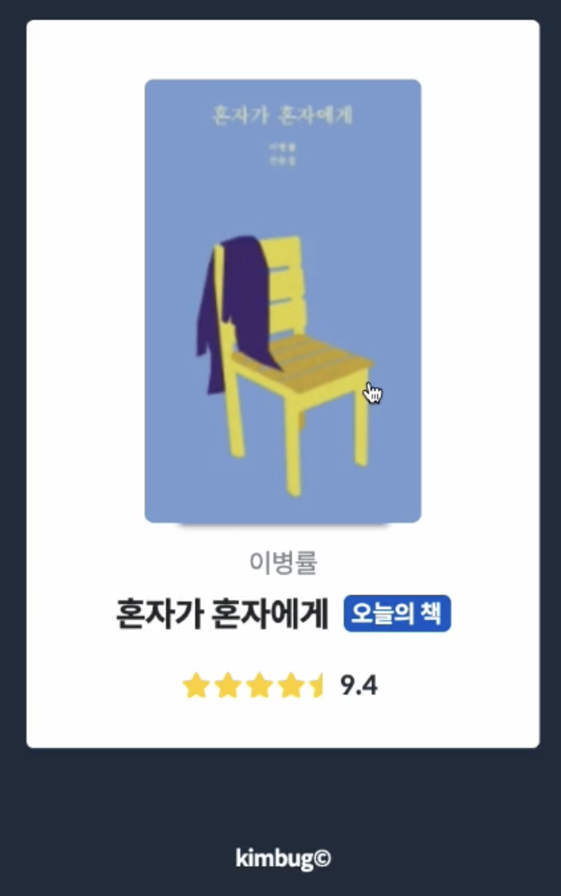{: style="display: block; margin-left: auto; margin-right: auto; width: 90%;" }

  다음과 같은 상황에서는 이미지가 이 책을 보여주는 의미를 가진다. 다른 이미지로 바뀌면 의미가 달라져 버린다.  
   그렇기 때문에 이미지를 HTML에서 사용할 것이다.  
   이 때, alt 속성값에 또 "혼자가 혼자에게" 를 적기에는 밑에서 해당 이미지를 설명하는 제목이 있기 때문에 중복이 되게 된다.  
   이럴 경우에도 alt 필드를 "" 로 비워 두는게 더 정확한 마크업이 될 것이다.
  이후 아래의 요소들은 물론 순서대로 마크업 하는 것도 괜찮다.  
   하지만 의미에 맞게 마크업을 하고 싶다면, 이병률 이라는 정보 보다도 위의 이미지에서 alt를 안 적어 주기도 했고, 제목이 더 중요한 정보라고 생각할 수 있기 때문에 제목을 먼저 적어 주었다.  
   오늘의 책으로 선정되었다는 것을 강조하고 싶은 라벨이기에 span 대신에 strong을 사용하여 강조하고, aria-label을 사용하여 정확한 의미를 적어준다.
  아래의 평점 같은 경우는 그냥 별이 있고 9.4가 있는 것 보다는, 9.4점 짜리의 평점을 가진 책이라는 것을 알리는 것이 중요하니까 핵심은 9.4가 된다.

  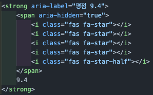{: style="display: block; margin-left: auto; margin-right: auto; width: 90%;" }

  그렇기 때문에 span 태그로 따로 감싸주고 별들은 스타일 적인 요소이기 때문에 스크린 리더가 읽지 않도록 aria-hidden 속성을 부여한다.

- instagram 프로필 만들어보기
  {: style="display: block; margin-left: auto; margin-right: auto; width: 90%;" }

  여기서 posts는 112개, followers는 274명, following은 238명 이라는 key, value 형태로 정보를 가진다.

  이럴 때 사용하기 좋은 것이 definition list이다.

  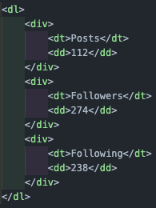{: style="display: block; margin-left: auto; margin-right: auto; width: 90%;" }

  여기서도 posts가 112 인 것이지, 112가 posts인 것이 아니기 때문에 dt에 posts를 넣고 dd에 112를 넣는다.  
   이후 div를 통해 각각의 쌍을 묶어주며 스타일링도 용이하도록 한다.

  또한 제목보다 이미지가 먼저오기 보다는, 제목에 관련한 내용을 먼저 소개하는게 맞다고 생각하기 때문에, 이미지와 제목부분을 따로 div로 묶고 이미지를 밑으로 내렸다.

  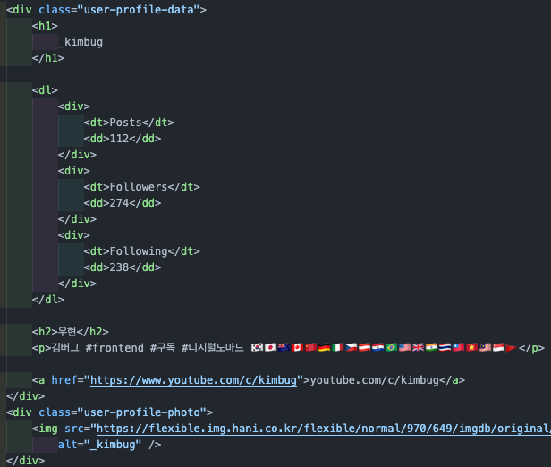{: style="display: block; margin-left: auto; margin-right: auto; width: 90%;" }

- 영수증 만들어보기
  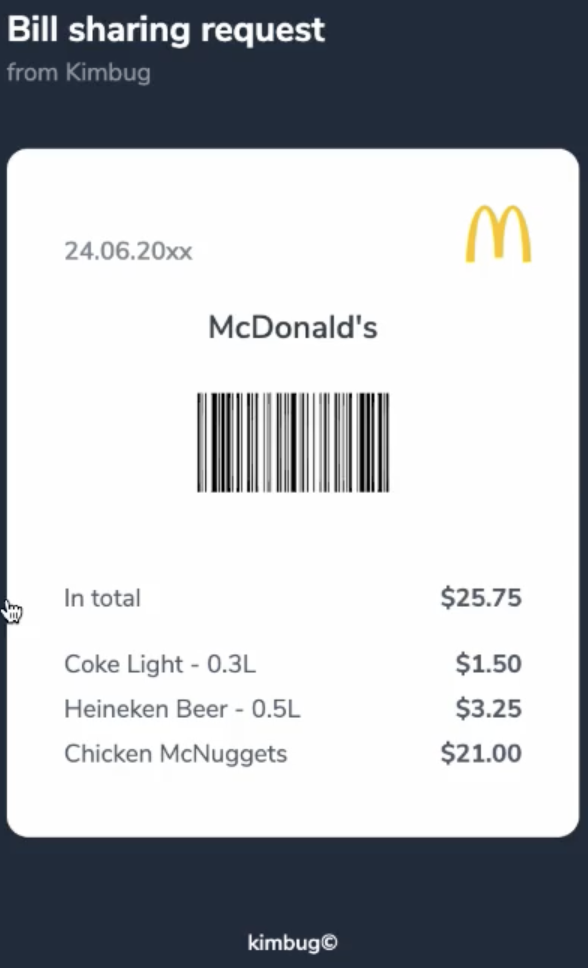{: style="display: block; margin-left: auto; margin-right: auto; width: 90%;" }

  여기선 제목을 보면 Bill sharing request와 from kimbug가 하나의 제목이나 다른 스타일링을 받고 있음을 알 수 있기 때문에,

  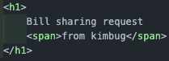{: style="display: block; margin-left: auto; margin-right: auto; width: 90%;" }

  이렇게 span 태그를 사용하고 구분해주었다.

  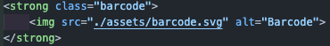{: style="display: block; margin-left: auto; margin-right: auto; width: 90%;" }

  바코드 부분같은 경우는 단순한 이미지가 아닌 중요한 이미지이기 때문에 strong 태그로 감싸서 마크업 해준다.

  상단의 맥도날드 로고 같은 경우는 style 적인 부분이기 때문에 css로 처리하고, 날짜의 경우 부가적 정보이기 때문에

  ```html
  <span aria-label="Issued on June 24th, 20xx">24.06.20xx</span>
  ```

  span 태그로 처리하지만, 갑자기 숫자가 나오면 스크린 리더로 화면을 읽는 사람은 당황할 수 있으니 aira-lable을 사용해서 더 자세한 마크업을 해주도록 한다.

  하단의 가격들은 instagram 프로필 만들어보기에서 했던 것 처럼 key, value 형태로 정보를 전달하고 있으니 definition list를 사용하기에 적절하다.

  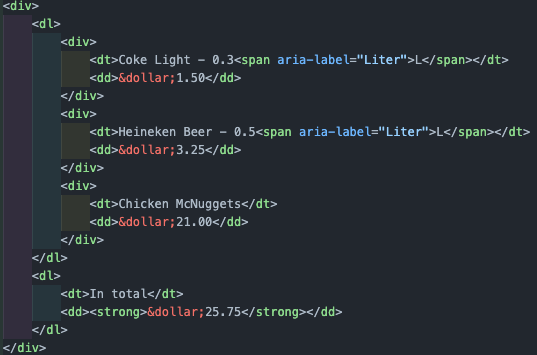{: style="display: block; margin-left: auto; margin-right: auto; width: 90%;" }

  이 때 각 가격들을 따로 묶어주고, 보면 L를 표시할 때 스크린 리더를 사용하는 사람들은 갑자기 L이 나오면 당황할 수 있기 때문에 리터의 단위임을 따로 표시해 주었다.  
  앞서 공부했듯이 달러를 표기할 때는 escape code를 사용하여 렌더중 혼동하지 않도록 해주었고, 총액의 경우 중요하기 때문에 strong 태그로 감싸줌과 동시에 이건 취향의 차이이지만, 총액은 마지막에 합산이기 때문에 아래로 옮겨주었다.

- Github dropdown 만들어보기

  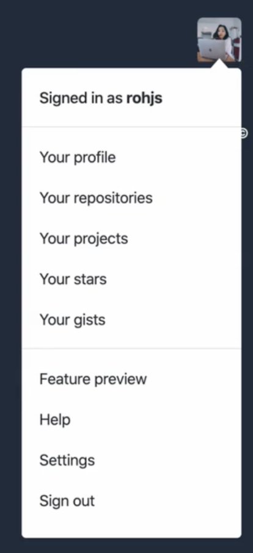{: style="display: block; margin-left: auto; margin-right: auto; width: 90%;" }

  사진에서는 명확하지 않지만, 해당 그림을 클릭을 했을 때, 드랍다운 메뉴가 나타나기 때문에, 해당 그림은 단순한 이미지가 아닌 버튼임을 생각할 수 있다.  
   또한 그림은 여기서 한 사람의 프로필을 나타내는 의미가 있기 때문에 HTML에서 이미지 태그를 사용하여 나타낸다.

  ```html
  <button type="button" aria-label="Open user menu">
    
  </button>
  ```

  또한 여기서 단순히 버튼(특정 역할이 없다면 type 속성으로 button을 주어야한다.)과 이미지만 있으면 무엇을 위한 것인지 모르기 때문에 스크린리더를 사용하는 유저도 알 수 있도록 aria-label을 붙혀준다.

  드랍다운 메뉴를 살펴보면 크게 3 덩어리로 나눌 수 있고, 또한 이런 UI 요소를 넣을 때는 해당 UI 요소가 무엇에 관한 것인지 알려주는 heading을 넣는 것을 추천한다.  
  이 때 첫 번째 덩어리인 Signed in as rohjs가 이 역할을 한다고 받아들일 수 있다.  
  이후 두 덩어리는 비슷한 요소들끼리 병렬적으로 나열되어 있음을 확인 할 수 있다.

  먼저 첫 번째 덩어리는 클릭해보면 어딜 클릭하더라도 사용자의 프로필로 이동하게 된다.  
  때문에

  ```html
  <div class="dropdown-menu">
    <h3>
      <a href="#"> Signed in as <strong>rohjs</strong> </a>
    </h3>
  </div>
  ```

  그렇기 때문에 anchor 태그로 감싸주며, 사용자의 이름은 볼드처리되어있기 때문에 강조해준다.

  다음 두 덩이를 보았을 때 비슷한 구조의 항목들이 나란히 나열되어 있다? 그럼 리스트를 사용하기에 적절하다는 것을 알 수 있고, 해당 항목들은 순서가 중요하지 않음을 알 수 있다.  
  따라서 두 개의 unordered list를 사용해야한다는 결론에 도달할 수 있다.

  각 항목들 또한 다른 곳으로 보내주는 링크이기 때문에, anchor 태그가 필요함을 알 수 있고, ul태그의 직계 자식으로는 li 태그만 올 수 있기 때문에, li 태그의 내부에 a 태그를 사용해야함을 알 수 있다.

  또한 클릭과 관련된 로직은 js가 하기 때문에 body 에 script로 추가해 주어야 하는데, 앞서 HTML 공부할 때 배웠듯이 link와 다르게 script는 로드할 때까지 계속 기다리기 때문에, body 태그의 제일 마지막에 넣어서 script 로드를 기다리며 body의 content들이 로드되지 않는 불상사를 방지하도록 한다.

- Input Group을 통해 Form 다루어 보기

  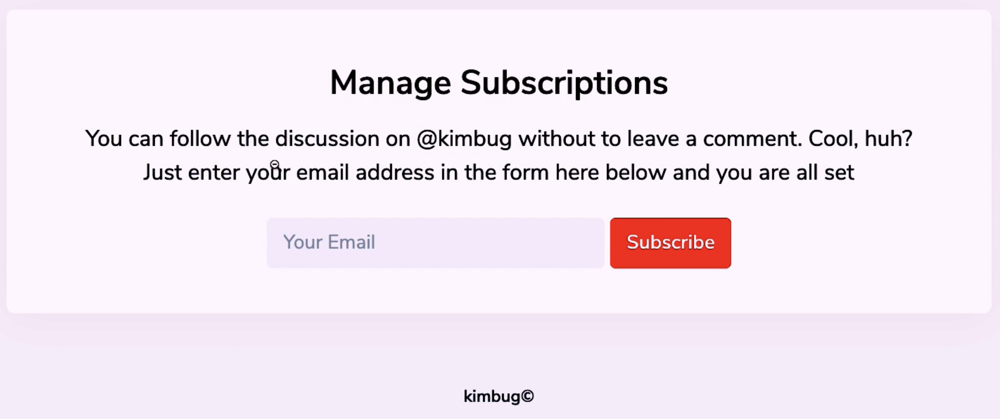{: style="display: block; margin-left: auto; margin-right: auto; width: 90%;" }

  ```html
  <form action="" method="GET" class="input-group">
    <input type="email" placeholder="Your Email" />
    <button type="submit">Subscribe</button>
  </form>
  ```

- Feed 만들어 보기
  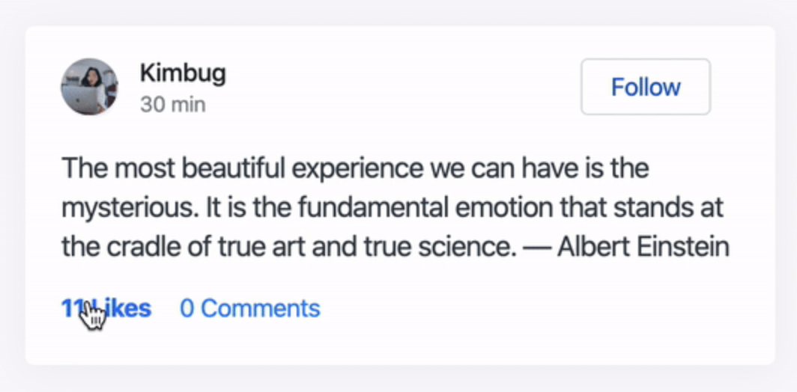{: style="display: block; margin-left: auto; margin-right: auto; width: 90%;" }

  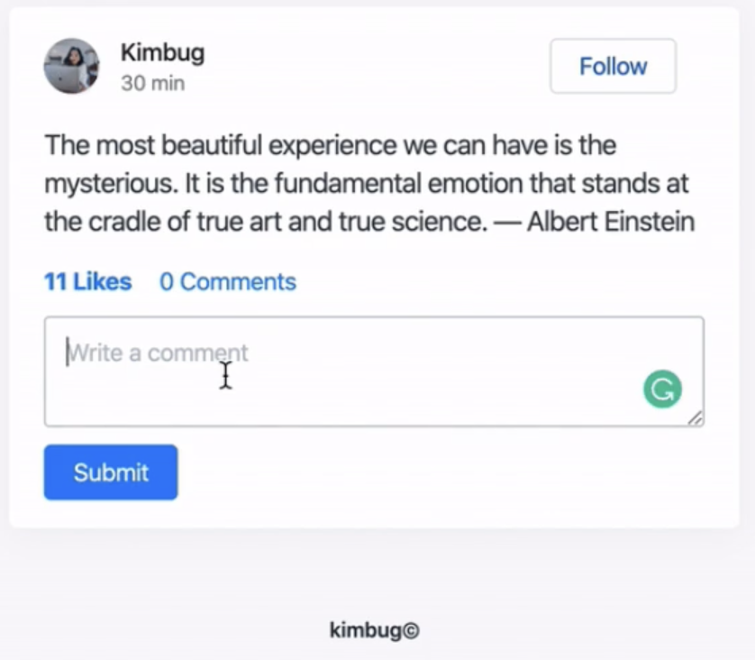{: style="display: block; margin-left: auto; margin-right: auto; width: 90%;" }

  위 처럼 열었을 때 바뀌는 화면이 있다면, 바뀌었을 때 화면을 보면서 마크업 하는 것이 좋다.

  항목 별로 쪼개면서 보면 먼저 이미지가 있다.  
  해당 이미지는 사용자의 프로필 사진으로서의 정보를 가지기 때문에 HTML에서 img 태그를 사용하여 나타내 준다.  
  또한 프로필 사진을 클릭하면 프로필로 이동할 수 있어야 할 것이다.

  ```html
  <a href="#">
    
  </a>
  ```

  그리고 사용자 명을 마크업 할 때 있어서

  - 사용자이름이니까 중요해! : strong
  - 저 피드의 전체의 제목이잖아 : h1
  - 이름과 시간의 key value 형태잖아 : dl

  이런식으로 해석하기에 따라 다양한 마크업이 가능하다.  
  이것엔 정답이 없으니 맞다고 생각하는 방법으로 하면 되겠다.  
  물론 이 논리가 뒤죽박죽이면 안되고 일관성이 있어야 하겠다.

  나는 개인적으로 두 번째 라고 동의하기 때문에 두 번째 방법으로 했다.  
  이후의 시간은 크게 중요하게 느껴지진 않기 떄문에

  ```html
  <span aria-label="Posted 30 minutes ago"> 30 min </span>
  ```

  다만 스크린 리더를 사용하는 유저에게는 30 min이 무엇인지 모를 수 있으니 aria-label을 이용하여 표기 해주는 센스 또한 필요하다.

  다음 follow 버튼은 눌렀을 때 인터랙션이 발생하므로 버튼으로 하는 것이 좋다. 다만 submit reset등의 기능이 아니기 때문에 type은 button 이 되겠다.

  likes 와 comments의 경우는 단순히 텍스트가 아니라, 유저가 클릭했을 때 뭔가의 기능을 하기 때문에 버튼임을 알 수 있다. 마찬가지로 submit reset등의 기능이 아니기 때문에 type은 button이다

  다음으로 댓글을 입력할 수 있는 text field가 존재하는데, 이는 URL에 다 못 담을 수도 있다. 그럼 POST로 보내는 것이 좋다.

  또한 여기서 input 과 text field 중 무얼 사용할지 고민된다면 input같은 경우 짧은 한줄의 입력을 받을 때 사용하기 때문에 여기선 text field 가 더 적절하게 되겠다.

- Gmail Inbox 만들어보기

  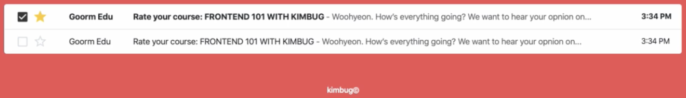{: style="display: block; margin-left: auto; margin-right: auto; width: 90%;" }

  사진을 살펴보면 병렬적인 구조가 반복되고 있으며, 각 카테고리 별 구조가 동일하게 반복되고 있기 때문에 이것은 테이블임을 알 수 있다.  
  이로서 리스트를 사용할 때와 테이블을 사용할 때의 차이는 단일 속성을 나열하느냐, 여러 속성과 항목을 가진 데이터를 체계적으로 보여주느냐의 차이임을 알 수 있다.

  해당 테이블을 마크업 함에 있어 지금은 보이지 않지만 테이블에는 항상 각 항목의 제목을 보여주는 table header가 있음을 알고 있다.  
  눈에 보이지 않는다고 마크업하지 않는 것이 아니다.

  ```html
  <table>
    <thead class="sr-only">
      <tr>
        <th scope="col">Actions</th>
        <th scope="col">Sender</th>
        <th scope="col">Title</th>
        <th scope="col">Timestamp</th>
      </tr>
    </thead>
  </table>
  ```

  테이블의 헤더임을 알려주기 위한 thead 태그로 감싸 각 열의 제목들을 정해주었다. 그렇기에 scope 속성에 col을 지정해 주었다.
  또한 눈에 보이진 않지만 screen reader은 읽을 수 있어야 하기 때문에 CSS로 처리해 주고 class 명은 sr-only로 사용하였다.

  ```html
  <tbody>
    <tr class="read">
      <td>
        <div class="inbox-actions">
          <div class="inbox-checkbox">
            <input type="checkbox" id="inbox-1" />
            <label for="inbox-1" class="sr-only">Select this email</label>
          </div>
          <button type="button" class="inbox-star">
            <span class="sr-only">Add to favorites</span>
          </button>
        </div>
      </td>
      <td>Groom Edu</td>
      <td>
        <a href="#">
          <strong class="sr-only">Read:</strong>
          <span>Rate your course:FRONTEND 101 WITH KIMBUG</span>
          <span>
            - Woohyeon. How's everything going? We want to hear your opnion
            on...</span
          >
        </a>
      </td>
      <td>3:34 PM</td>
    </tr>
    <tr class="unread">
      <td>
        <div class="inbox-actions">
          <div class="inbox-checkbox">
            <input type="checkbox" id="inbox-1" />
            <label for="inbox-1" class="sr-only">Select this email</label>
          </div>
          <button type="button" class="inbox-star">
            <span class="sr-only">Add to favorites</span>
          </button>
        </div>
      </td>
      <td>Groom Edu</td>
      <td>
        <a href="#">
          <strong class="sr-only">Unread:</strong>
          <strong>Rate your course:FRONTEND 101 WITH KIMBUG</strong>
          <span>
            - Woohyeon. How's everything going? We want to hear your opnion
            on...</span
          >
        </a>
      </td>
      <td>3:34 PM</td>
    </tr>
  </tbody>
  ```

  tbody의 첫 번째 요소로는 체크박스가 존재하는데, 메일을 하나만 선택할 수 있는 것이 아니라 중복 선택이 가능해야 하므로 input type checkbox를 사용하는 것이 적절할 것이며, 해당 체크박스가 무엇인지를 알려주는 label을 추가하였다.

  다음 별의 경우 이 메일을 favorite에 추가하는 등의 역할 일 텐데, 이는 단일 메일에 대해서 상태가 달라질 텐데 유저가 눌렀는지의 여부가 중요하므로 button으로 마크업 한다.

  별 그림 같은 경우는 style에 가깝기 때문에 CSS로 처리해주도록 한다.

  다만 그러면 이 버튼이 무얼 위한 버튼인지 알 수 없기 때문에 span 태그를 사용하여 즐겨찾기에 추가하는 버튼임을 알리고, sr-only class를 넣어 스크린 리더만 볼 수 있도록 한다. 물론 이는 앞선 checkbox의 label에도 동일하게 적용된다.

  다음 보낸이는 간단하니 넘어가고 내용을 보면 앞 부분이 강조 처리 되어있고 이후는 메일 내용의 일부임을 알 수 있다.  
  또한 클릭시 메일로 들어갈 수 있어야 함을 알 수 있다. 그렇다면 anchor가 숨어있다!

  테이블의 장점은 한 줄만 잘 만들어 놓으면, 이후는 반복된다는 점임을 느낄 수 있다!

  또한 여기서 우리는 스타일로 메일이 읽었는지 안 읽은 메일인지 알 수 있지만, 스크린 리더에서는 정보가 전달 되지 않기 때문에 strong(중요하니까) 읽었는지 안 읽었는지를 기록해주고, sr-only class로 눈에 보이지 않게 해준다.

- Music_Player 만들어보기(apple music)

  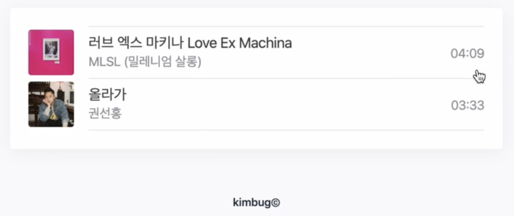{: style="display: block; margin-left: auto; margin-right: auto; width: 90%;" }

  해당 사진을 보며 최소 기능별로 또 분해를 해보면 먼저 각 요소들은 병렬적으로 반복되며, 음악 플레이어 리스트 이니 리스트로 마크업해야 겠다는, 또한 순서가 중요한 ol을 사용해야겠다 생각을 할 수 있다.

  ```html
  <ol class="music-player">
    <li class="music-play-item">
      
      <div class="music-info">
        <div class="music-info-detail">
          <h1>
            <span lang="ko">러브 엑스 마키나</span>
            Love Ex Machina
          </h1>
          <strong>MLSL (밀레니엄 살롱)</strong>
        </div>

        <span>
          <span class="sr-only">Duration</span>
          04 : 09
        </span>
      </div>
      <audio src="./assets/audios/music-1.mp3" class="music-audio"></audio>
    </li>
    <li class="music-play-item">
      
      <div class="music-info">
        <div class="music-info-detail">
          <h1 lang="ko">올라가</h1>
          <strong>권선홍</strong>
        </div>

        <span>
          <span class="sr-only">Duration</span>
          03 : 33
        </span>
      </div>
      <audio src="./assets/audios/music-2.mp3" class="music-audio"></audio>
    </li>
  </ol>
  ```

  먼저 이미지가 보이기 때문에 이미지를 넣어주고, alt값을 적어준다. 여기서 apple music 같은 경우는 언어가 모두 영어인데, 우리의 alt 값은 한글이기 때문에 lang 속성을 이용하여 확실하게 언어를 표기해준다.

  제목을 적을 때도 마찬가지로 한글이 섞여있기 때문에 span 으로 분리하여 언어를 표기해준다. 물론 이렇게 까지 할 필요는 없으나 이렇게도 가능하다는 것을 보여주는 것이다.

  가수 이름 같은 경우는 중요하다 생각할 수 있으니 strong으로 강조를 해주었고, 시간 같은 경우는 그렇게 중요하지 않아 span으로 적었으나, 스크린 리더를 사용하는 유저는 갑자기 숫자가 나오면 뭔지 모를 수 있으니 span으로 시간임을 알려주고 sr-only class를 주어 보이지 않게 한다.

  또한 뮤직 플레이어의 일환이기 때문에 이름을 누르면 노래가 재생되어야 할 것이다. 음악을 재생하기 위해서는 audio 태그를 사용해야 할 것이고, 여기선 재생을 js로 컨트롤 하기 때문에 이상 속성은 필요 없다.

- Video Player 만들어보기

  {: style="display: block; margin-left: auto; margin-right: auto; width: 90%;" }

  ```html
  <div class="video-player">
    <div class="video-container">
      <video controls>
        <source src="./assets/videos/kimbug-bjj.mov" type="video/mp4" />
        <source src="./assets/videos/kimbug-bjj.mp4" type="video/mp4" />
      </video>
    </div>
    <div class="video-player-info">
      <h1>주짓수 4주차 롤링 영상</h1>
      <p>30초 만에 압살 실화인가</p>
    </div>
  </div>
  ```

  비디오를 사용하기 위해선 video 태그를 사용해야 한다. 그리고는 앞의 music player과 다르게 브라우저가 지원하지 않는 형식에도 대비할 수 있도록 source 속성이 아닌 태그로 사용해 준다.  
  또한 video는 css를 줄 때 형식이 정해져 있다. 따라서 video-container 클래스의 div로 감싸준다.
