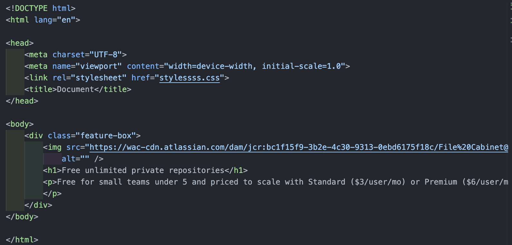
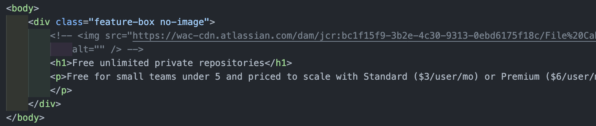
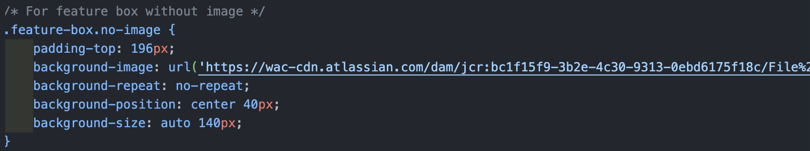
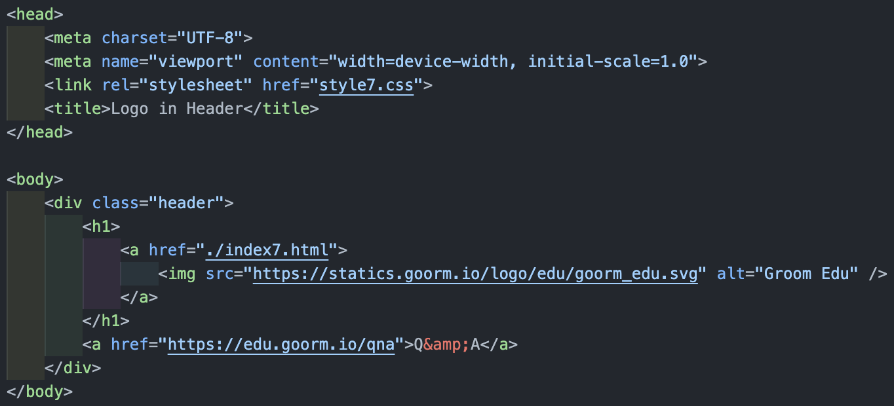
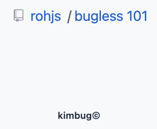
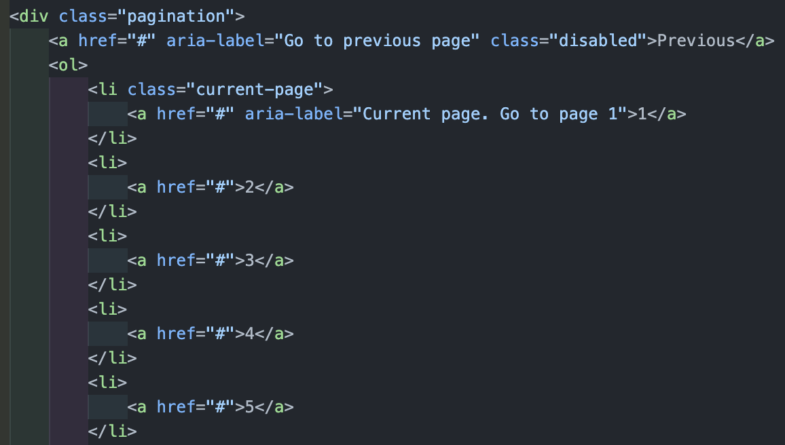

[김버그님 강의](https://edu.goorm.io/learn/lecture/20583/%EA%B9%80%EB%B2%84%EA%B7%B8%EC%9D%98-html-css%EB%8A%94-%EC%9E%AC%EB%B0%8C%EB%8B%A4)를 통해 배운 내용을 정리하려 한다.

## Mark UP

여기서의 마크업이란, 특정 웹사이트의 주요 요소들을 HTML를 사용하여 표현해 보는 것을 의미한다.

### 중점적으로 생각해 볼 것

마크업을 함에 있어서 가장 최우선으로 진행해야 할 것은 위에서 말한 주요 요소, 또는 나아가서 최소한의 단위로 요소를 자르는 것이다.

#### 실습 및 작성 팁!

- [html escape code](https://developer.mozilla.org/en-US/docs/Glossary/Character_reference) : 문서 내에서 ('<', '&' 등) 브라우저 입장에서 렌더 중 헷갈리는 문자들이 있다. 이걸 방지하기 위해 코드는 코드이고, 텍스트는 텍스트일 뿐이다 를 알려주기 위해 사용하는 것이 escape code(entity)이다.  
  외울 필요는 없고 필요할 때 찾아서 보자!

- feature box 만들어보기  
  feature box는 제품에 대해서 이런 기능이 있고 이런게 좋다 에 대한 내용을 설명하는 요소를 의미한다.

  {: style="display: block; margin-left: auto; margin-right: auto; width: 80%;" }

  여기서 짚고 갈 점은 img 태그를 사용함에 있어 src, alt는 반드시 필요한 속성이지만, 만약 이미지를 표현하기가 어렵거나 딱히 의미를 가지지 않는 경우라면 alt를 비워놓는 것이 더 좋은 마크업이다.  
  주의 할 점은 비워놓으란 것이지 적지 않는다는 것이 아니다!

  {: style="display: block; margin-left: auto; margin-right: auto; width: 80%;" }

  여기서 부터는 마크업 하는 개발자의 관점의 차이이지만, 저 폴더 이미지가 특별한 의미를 가지지 않는다고 생각할 수 있다.  
  결국 유저들에게 정보를 전달하는 것은 본문의 내용이지 이미지가 바뀌더라도 소개하는 내용에 영향을 주지 않는다는 것이다.  
  이렇게 생각한다면 저 이미지도 꾸미는 역할에 더 가깝게 된다. 그럼 CSS파일에서 이미지를 넣어 줄 수도 있다.

  {: style="display: block; margin-left: auto; margin-right: auto; width: 80%;" }

- groom edu header 만들어보기

  {: style="display: block; margin-left: auto; margin-right: auto; width: 80%;" }

  여기서 배울 수 있는 점은 이미지를 제목으로 사용하고 있을 때, 제목과 이미지를 모두 사용해야한다면 CSS로 굳이 제목을 지워주어야 하는 번거로움이 있다.  
  이럴 땐 제목 대신에 alt속성값을 제목으로 넣어주면 정보의 전달을 확실히 할 수 있다.

- Breadcrumb 과 Pagination 만들어보기

  Breaadcrumb란 링크를 타고 링크로 들어가는 앵커의 나열을 의미한다.  
  즉 보통 웹사이트의 우측 상단에서 웹사이트에서의 유저의 현재위치가 어딘지 한 눈에 보여주고, 각 패스를 클릭하여 되돌아 갈 수 있는 네이게이션 텍스트이다.

  이름의 유래는 헨젤과 그레텔에서 빵 조각을 통해 집을 찾아간 것에서 유래했다고 한다.

  Pagination은 페이지 간의 이동을 할 때(1, 2, 3), 사용하는 링크들의 집합을 의미한다.

  {: style="display: block; margin-left: auto; margin-right: auto; width: 60%;" }

  해당 Breadcrumb를 구현하는 과정에서 위에서 배웠던 내용에 대해 다시 예시를 볼 수 있다.

  그림에서 보이는 아이콘과, / 는 특별한 의미를 가지지 않는 디자인 요소이다.  
  그렇기 때문에 img 태그를 사용하거나 사이에 / 를 추가하기 보단 CSS로 처리하는 것을 택하였다.  
  다시 한 번 정보로서의 역할에 충실해야 한다는 것을 상기하면 좋다!

  {: style="display: block; margin-left: auto; margin-right: auto; width: 90%;" }

  pagination을 살펴보면 anchor 태그들이 병렬적으로 나열되어 있음을 알 수 있다.  
  이는 리스트로 바라볼 수 있으며 리스트 중에서도 순서가 있는 ordered-list로 볼 수 있는 것이다.  
  또한 ol 또는 ul 태그는 직계 자식으로 li 태그만을 가질 수 있기 때문에 li 태그 안에 a 태그를 넣어줘야 한다는 것 또한 알 수 있다.

  주어진 예시에서 previous 버튼은 비활성화 되어 있기 때문에 CSS를 사용하여 비활성화 해주고, ...을 나타낸 버튼은 disabled 속성을 사용하여 비활성화를 해주었다.

  새롭게 배운 것 중 하나는 WAI-ARIA 라는 것인데, 스크린 리더를 사용하거나 앞을 볼 수 없는 사람들에게도 정보를 제공하기 위해서 사용하는 것이다.

  만약 그냥 previous, link 1, link 2 라고 읽어버리면 아무런 도움이 되지 않는다.

  눈으로 보는 것과 읽었을 때 더 정확한 정보를 전달하기 위해 다르게 쓰고 싶을 때는 aria-label 속성을 사용하여 이름을 지정하여 준다.

  이렇게 사용하여 주면 더 정보가 정확하게 마크업 되었기 때문에 더 많은 사용자들에게 정보를 효과적으로 전달할 수 있는 것이다.

  앞을 볼 수 없는 사람들에게도 서비스를 제공할 수 있도록 하는 것이 프론트 엔드 개발자의 역할이다.
