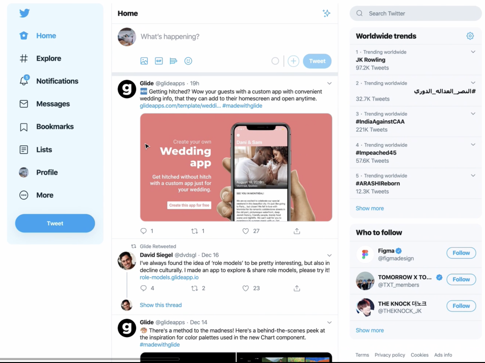
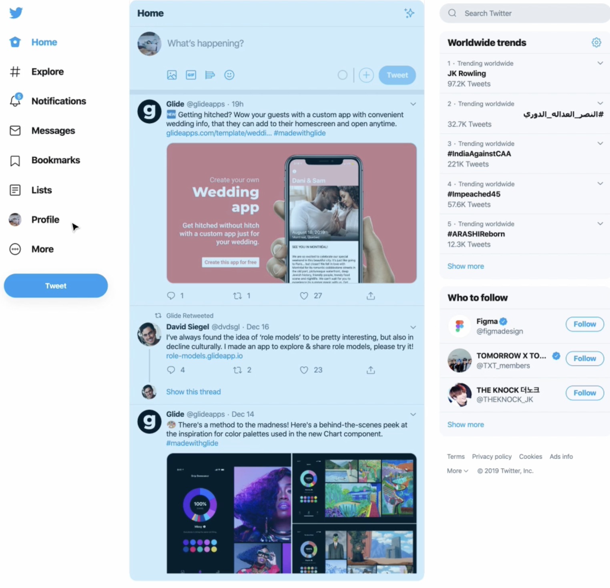
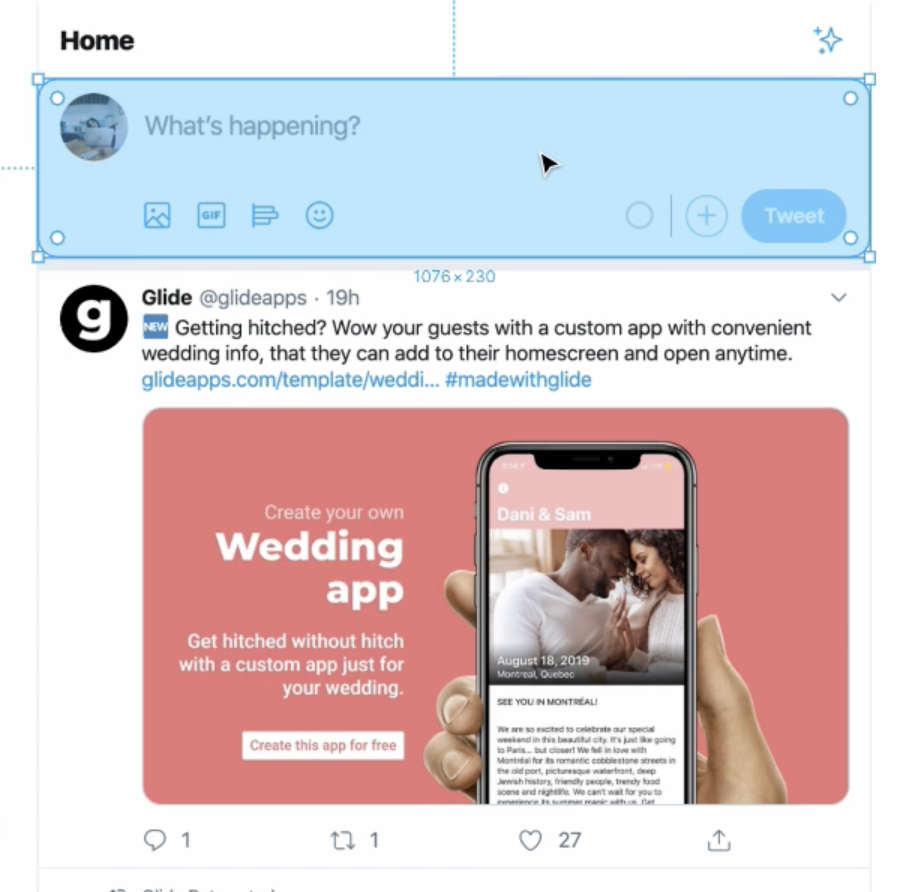
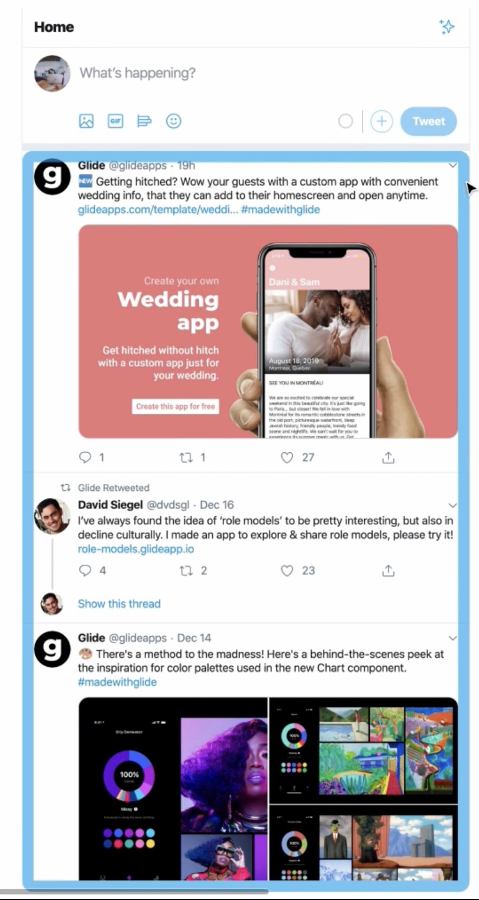
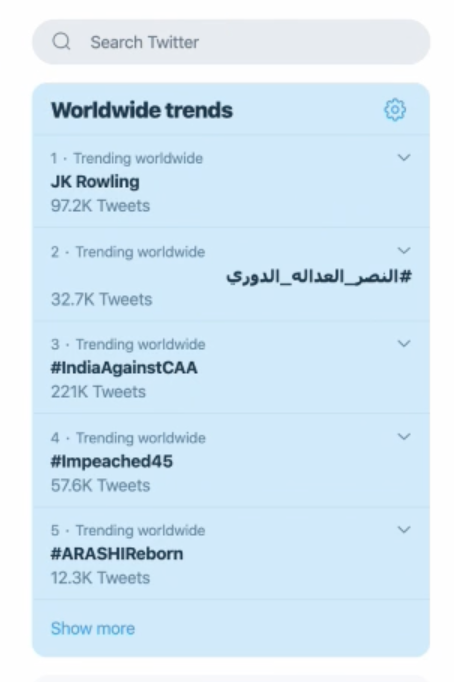
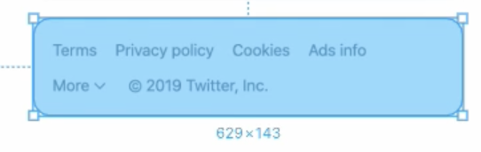

[김버그님 강의](https://edu.goorm.io/learn/lecture/20583/%EA%B9%80%EB%B2%84%EA%B7%B8%EC%9D%98-html-css%EB%8A%94-%EC%9E%AC%EB%B0%8C%EB%8B%A4)를 통해 배운 내용을 정리하려 한다.

## 구조적인 문서의 설계

앞에서는 ui 컴포넌트 하나하나를 마크업하는 것에만 집중(각 요소의 의미에 맞는 마크업)했지만, 이제는 구조적인 웹 문서를 설계한다.

### 구조적인 문서의 설계 란?

글의 구조를 쉽게 한 번에 파악이 되도록 HTML 태그를 작성하는 것을 의미한다.

예를 들어 책을 읽을 때 목차를 보면 책이 어떤 식으로 내용이 전개가 되는지 개요를 확인할 수 있다.

- 몇 단원으로 구성이 되어 있는지
- 각 단원의 제목
- 소단원과 소단원의 주제

글의 흐름 파악을 통해 내가 찾으려는 내용이 어디쯤 있겠구나를 알 수 있고, 정보의 위계질서(중요한 개념이 뭔지 그 세부적인 설명이 어디 있는지 등)에 대해서도 알 수 있다.

마찬가지로 브라우저 또한 개요가 필요하다.  
우리 글의 정보의 위계질서를 알기 쉬워야 검색 최적화에도 도움이 된다.

브라우저는 인간의 언어를 이해할 수 없기 때문에 브라우저에게 구조를 명확하게 파악할 수 있도록 해주어야한다. 이는 Sectioning Elements 를 통해 이루어진다.

#### Sectioning Elements

하나의 단원과 같다. 또한 각 단원에는 주제 즉 **제목**이 있어야한다.  
따라서 Sectioning Element 내에는 반드시 **heading 태그**를 작성해야 한다.  
혹여 눈에 표시되지 않는다고 하더라도 해당 section을 표현하는 제목은 반드시 작성한다.

- section
- article
- nav
- aside

#### 부가적인 요소

- header
- main
- footer

위 요소들을 적절히 사용하여 구조적인 문서의 설계를 하게 되는 것이다.

#### 트위터 마크업에서의 접근법

- 이전까지 마크업은 최소한의 기능/의미를 갖는 가장 작은 단위로 쪼개는 것이였다.
- 이제는 비슷한 성격을 지니거나 유사한 성격의 정보를 지니고 있는 덩어리를 큼직하게 묶는다.

물론 이는 문서를 작성하는 사람의 생각에 따라 차이는 있을 수 있다.

- 적절한 sectioning elements 정해주기

## 트위터 마크업

### 도입부(시작부)

{: style="display: block; margin-left: auto; margin-right: auto; width: 80%;" }

문서 전체에서 제목이나 헤더영역을 담당할 때 사용할 수 있는 것이 header 태그이다.

#### header 태그

div 태그와 똑같지만, section의 도입 부분을 나타낼 때 사용할 수 있다는 느낌을 살려줄 뿐이다.

해당 페이지에서는 파란색 박스 부위가 header가 필요하다고 느꼈고, 문서 전체 또는 section에서 헤더라고 느껴지면 언제든 사용하면 되는 태그이지만, 무분별한 사용은 의미를 퇴색시킬 수 있다.

#### mark up

먼저 파란 박스내부를 살펴보면 트위터 로고가 있는 것을 알 수 있다.  
해당 로고는 한 기업의 로고이기 때문에 충분히 정보로서의 가치가 있어 img 태그로 마크업을 해 준다.  
이 때 h1태그 내부에 따로 제목을 적지않고 이미지를 넣을 경우 alt 속성값이 곧 제목을 나타내게 된다.

```html
<header>
  <h1>
    <a href="#">
      
    </a>
  </h1>
</header>
```

로고 아래의 링크들을 표현하기에 가장 적절한 것은 nav태그인데, 해당 태그는 sectioning element이므로 heading태그를 필요로 한다.

그렇다면 언제 navigation 태그를 사용하면 좋을까??  
문서간의 이동을 할 수 있는 요소를 포함하는 경우에 사용한다.

```html
<nav>
  <h1>Global Navigation Menu</h1>
  <ul>
    <li>
      <a href="#">
        <span>Current page</span>
        <!-- Icon -->
        Home
      </a>
    </li>
  </ul>
</nav>
```

이런 식으로 제목을 확실히 명시해 주고, 각 요소들은 병렬적으로, 순서에 관계없이 나열되어 있으므로 unordered list를 사용하여 나타내 준다.  
또한 현재 Home 페이지에 있기 때문에, span 태그에 현재 페이지임을 추가적으로 나타내고, 추후 css로 가려준다.  
Icon 같은 경우 CSS로 처리하기위해 일단 주석으로 표현해 준다.

````html
        <li>
            <button type="button">
                <!-- Icon -->
                More
            </button>
            <!-- Dropdonw Menu -->
        </li>
    </ul>
    <button type="button">
        Tweet
    </button>
    ```
````

아래 More은 눌렀을 때 dropdown menu를 여는 것이기 때문에 anchor 태그가 아닌 button을 사용해 주고, Tweet 같은 경우 게시글 작성 모달을 열어주는 작용을 하기 때문에 button을 사용한다.

### 본문

{: style="display: block; margin-left: auto; margin-right: auto; width: 80%;" }

본문의 가장 핵심 내용을 묶어줄 때 사용하는 것이 main 태그이다.

#### main 태그

main 같은 경우는 하나의 html 문서에서 한 번만 사용할 수 있다.

또한 main 은 sectioning elements를 감싸는 역할이지 그들 내부에서 사용될 수 없다.

보통 header main footer가 삼단으로 병렬적이게 구성되어있는 것이 이상적이다.

main은 sectioning element가 아니기 때문에 꼭 heading 태그를 적어줄 필요가 없다.

#### mark up

```html
<main>
  <header>
    <h1>Home</h1>
    <button type="button" aria-label="Timeline Options">
      <!-- Icon -->
    </button>
    <div>
      <h2>Home shows you top Tweets first</h2>
      <button type="button">
        <!-- Icon -->
        <strong> See latest Tweets Instead </strong>
        <span>
          You'll be switched back Home after you've been away for a while.
        </span>
        <a href="#">
          <!-- Icon -->
          View content preferences
        </a>
      </button>
    </div>
  </header>
</main>
```

#### section 태그

이름에서 볼 수 있듯이 sectioning elements 중 하나이다.  
즉 heading 태그가 필요하다.

{: style="display: block; margin-left: auto; margin-right: auto; width: 80%;" }

논리적으로 완결성이 있는 요소를 나타낼 때 사용한다.  
해당 사진에서의 표기된 영역은 오로지 트윗을 작성하기 위한 form일 뿐 그 이상 그 이하의 역할도 하지 않는다. 때문에 브라우저에게 여긴 form작성하는 section이야 라고 알려주는 것이 div를 사용하는 것 보다 전달이 된다.

#### mark up

```html
<section>
  <h1>What's happening?</h1>

  <form action="#" method="POST">
    
    <textarea placeholder="What's happening?" maxlength="280"></textarea>
    <button type="button" aria-label="Upload files">
      <!-- Icon -->
      <!-- JavaScript -->
    </button>
    <input type="file" multiple accept="image/*, video/*" />
    <button type="button" aria-label="Search GIFs...">
      <!-- Icon -->
    </button>
    <button type="button" aria-label="Create a poll">
      <!-- Icon -->
    </button>
    <button type="button" aria-label="Choose emoji">
      <!-- Icon -->
    </button>
    <strong aria-label="0 out of 280 characters">
      <!-- JavaScript -->
    </strong>
    <button type="button" aria-label="Add another tweet">
      <!-- Icon -->
    </button>
    <button type="submit">Tweet</button>
  </form>
</section>
```

특이사항으로는 section 태그는 sectioning elem이기 때문에 heading 태그를 사용해 주어야 하며, 파일을 첨부하는 버튼은 input에 더 가깝기 때문에 input을 사용하지만, input은 CSS를 안먹기 때문에 button을 따로 만들어 꾸민 후, js로 버튼을 누르면 input이 작동할 수 있도록 해 주어야 한다.

progress bar같은 경우는 280자 제한 중에서 얼마를 사용했는지를 나타내기 때문에 텍스트와 차이가 없다고 생각하고 markup 하였다.

#### section 태그 2

{: style="display: block; margin-left: auto; margin-right: auto; width: 80%;" }

```html
<section>
  <h1>Your Timeline</h1>
  <ol>
    <li>
      <!-- Tweet -->
    </li>
    <li>
      <!-- Tweet -->
    </li>
  </ol>
</section>
```

#### article 태그

section 태그와 사용처에 대해서 헷갈릴 수 있다.  
article 태그를 사용할 때는 뉴스기사 또는 블로그 게시글 처럼 정보 콘텐츠가 콘텐츠로서 독립적으로 의미가 완성되어있을 경우 사용한다.

사실 section과 article을 굳이 사용할 때를 따지는 것은 무의미하고, 왜 사용했는지에 대한 명확한 목적성이 있으면 된다.

```html
<article>
  <h1>A Tweet from 김익명</h1>
  <header>
    <a href="#">
      
    </a>
    <h2>
      <a href="#"> 김익명 </a>
    </h2>
    <dl>
      <div>
        <dt>Username</dt>
        <dd>
          <a href="#"> @anonymouskim </a>
        </dd>
      </div>
      <div>
        <dd>Posted</dd>
        <dt>
          <a href="#"> Dec 25 </a>
        </dt>
      </div>
    </dl>
    <button type="button" aria-label="Options">
      <!-- Icon -->
    </button>
    <div>
      <button type="button">
        <!-- Icon -->
        Show less often
      </button>
      <button type="button">
        <!-- Icon -->
        Embed Tweet
      </button>
      <button type="button">
        <!-- Icon -->
        Unfollow @anonymouskim
      </button>
      <button type="button">
        <!-- Icon -->
        Mute @anonymouskim
      </button>
      <button type="button">
        <!-- Icon -->
        Block @anonymouskim
      </button>
      <button type="button">
        <!-- Icon -->
        Report Tweet
      </button>
    </div>
  </header>
  <p>
    영어를 더 잘 하고싶다. 그러나 공부를 하고 싶지는 않다. 내 삶의 모든 것이
    이런 식으로 망해왔다
  </p>
  <footer>
    <button type="button">
      <span>Tweet your reply</span>
      <strong aria-label="3 replied">3</strong>
    </button>
    <button type="button">
      <span>Retweet</span>
      <strong aria-label="3 retweeted">3</strong>
    </button>
    <div>
      <button type="button">Retweet</button>
      <button type="button">Retweet with comment</button>
    </div>
    <button type="button">
      <span>Like this tweet</span>
      <strong aria-label="100 people liked">100</strong>
    </button>
    <button type="button">
      <span>Share</span>
    </button>
    <div>
      <button type="button">Send via Direct Message</button>
      <button type="button">Add Tweet to Bookmarks</button>
      <button type="button">Copy link to Tweet</button>
    </div>
  </footer>
</article>
```

#### aside 태그

{: style="display: block; margin-left: auto; margin-right: auto; width: 80%;" }

section으로도 마크업이 가능하지만, 본문과는 달리 직접적인 연관은 없는 동떨어진 분리된 내용을 마크업하는 상황에서 사용하기 좋은 것이 aside 태그이다.  
일반적으로 사이드바, 배너광고, 위젯 등에 사용한다.

물론 sectioning element 이기에 heading 태그가 필요하다.

#### mark up

```html
<aside>
  <header>
    <h1>Worldwide trends</h1>
    <button type="button" aria-label="Options">
      <!-- Icon -->
    </button>
  </header>

  <ol>
    <li>
      <button type="button" aria-label="Options">
        <!-- Icon -->
      </button>
      <div>
        <button type="button">
          <!-- Icon -->
          This trend is spam
        </button>
      </div>

      <a href="#">
        <span> 1 ﹒ Trending worldwide </span>
        <strong lang="kr">김버그</strong>
        <span>100K Tweets</span>
      </a>
    </li>
  </ol>
  <button type="button">Show more</button>
</aside>
```

#### footer 태그

sectioning element가 아니기에 heading 태그는 필요 없다.

{: style="display: block; margin-left: auto; margin-right: auto; width: 80%;" }

sectioning elements 내에서의 하단부나, 저작권 등 표기 정보를 묶을 때 footer 태그를 사용한다.

마찬가지로 div로 사용해도 되지만, 의미를 더 주고 싶을 때 사용한다.

```html
<footer>
  <a href="#" target="_blank"> Terms </a>
  <a href="#" target="_blank"> Privacy policy </a>
  <a href="#" target="_blank"> Cookies </a>
  <a href="#" target="_blank"> Ads info </a>
  <button type="button">
    More
    <!-- Icon -->
  </button>
  <div>
    <a href="#" target="_blank"> About </a>
    <a href="#" target="_blank"> Status </a>
    <a href="#" target="_blank"> Businesses </a>
    <a href="#" target="_blank"> Developers </a>
  </div>
  <span> © 2019 Twitter, Inc. </span>
</footer>
```

### 정리

구조적인 문서의 설계란 단순하다.

- 비슷한 성격 또는 유형의 구획을 나누어 묶는다.
- 적절한 sectioning element 또는 부가적 요소를 구획에 사용한다.
- 내부를 mark up 한다.
- 합친다.
- 필요에 따른 div 추가.
