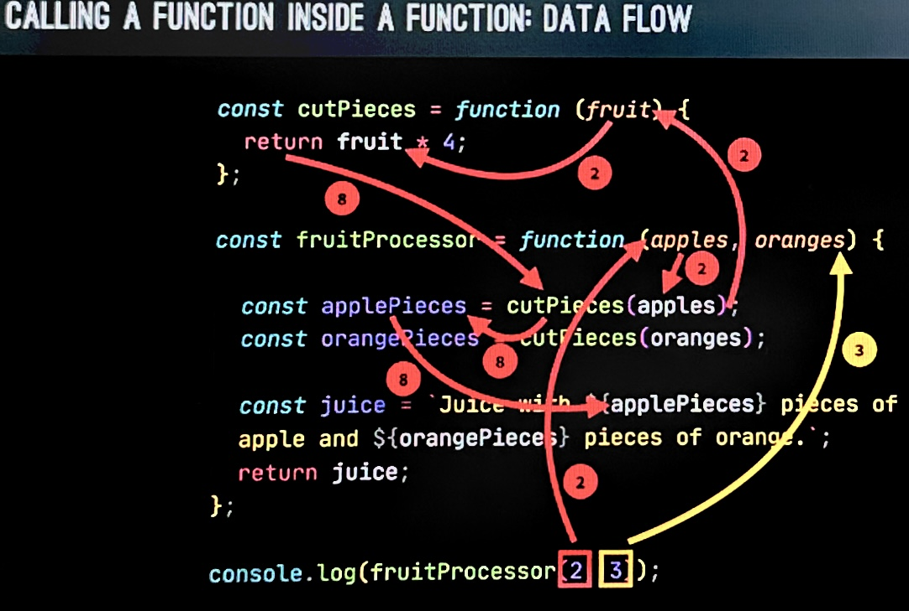
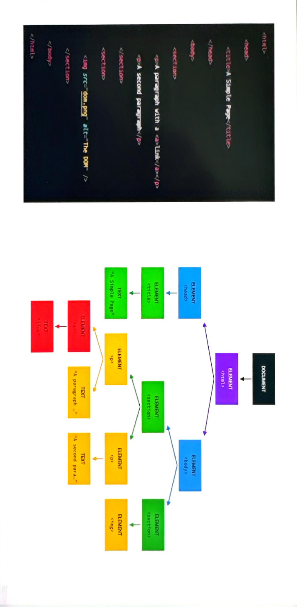

드디어 JS를 맛 볼 시간이다.

## JAVASCRIPT

### 정의

자바스크립트는

- High-level(고수준) : 저급언어(어셈블리어, 기계어)등과 다르게 사람이 이해하기 쉬운 고급 언어이다.
- Object-oriented(객체 지향) : 객체(object)를 중심으로 프로그래밍 하며, 데이터(속성)와 그 데이터를 처리하는 함수(메서드)를 묶어서 관리하여, 코드 재사용성이 높고 유지보수가 쉽다.
- Multi-paradigm(다중 패러다임) : 객체 지향 뿐만 아니라, 절차적 프로그래밍, 함수형 프로그래밍 등 여러 프로그래밍 스타일을 지원한다.

### 역할

- HTML: content를 담당한다.
- CSS : content를 보여주는 역할을 담당한다.
- JS : 동적인 상호작용을 가능하게 한다.

### 변수

값을 저장할 수 있는 상자라고 생각.

한 번의 선언으로 여러번 사용할 수 있게 된다.

그럼 하나를 바꾸면 그걸 사용하고있는 모든 곳에서 바뀌겠지?

#### 규칙

- camelCase  
   변수명이 여러 단어로 이루어져있으면 첫 번째 단어만 소문자를 쓰고 나머지 단어의 첫 글자는 대문자로 쓴다.  
  보통 js에서 변수명은 camelCase로 쓰는게 국룰이다.
- 변수명에는 숫자, 문자, \_, $ 만 사용할 수 있다.
- 숫자로 시작하는 변수명은 불가능.
- 이미 js에서 사용중인 변수명은 사용할 수 없다.
- 대문자로 시작하는 변수명은 쓰지 않는게 국룰이다.
- 전체 대문자인 변수명은 변하지 않는 상수를 위해 사용하는게 국룰이다.
- 변수의 값을 대표할 수 있는 이름을 설정하자.

#### 변수의 선언

- let : 프로그램의 실행 중 변경될 수 있는 값을 선언할 때 사용.
- const : 절대 바뀌지 않아야 할 값을 선언할 때 사용. => 초기화 되지 않은 const로 변수 선언이 불가능하다.
- var : 쓰지마라ㅏㅏ라ㅏㅏㅏ!!!!!🤬 과거에 쓰던 변수 선언 법으로 let과 거의 같게 작용하지만, 다르다. legacy 코드를 보기 위해서 알아야 하는 것이지, 쓰라는게 아니다.  
  let은 block-scoped, var은 function-scoped이다.
  > block-scoped vs function-scoped
  >
  > - block-scoped : {}로 감싸진 블록 내에서만 유효한 변수이다.
  > - function-scoped : 함수 내부에서만 유효하고, 외부에서는 접근할 수 없다. 하지만 블록 스코프를 무시하기 때문에 블록 외부 함수내에서는 어디서는 접근이 가능하다.

그렇기 때문에 변수를 선언할 때는 꼭 바뀌어야 하는 값이 아니라면, const를 사용하는 것이 이상적이다. 변수의 값을 바꾸는 건 잠재적인 버그의 원인이 될 수 있기 때문이다.  
또한 let이나 const를 사용하지 않고 그냥 변수를 정의해도 되기는 한다.  
하지만 이렇게 할 경우 자동으로 전역 객체에 속하는 전역 변수가 되고, 의도치 않게 프로그램 전역에서 접근이 가능하며, 전역 네임스페이스가 오염될 가능성이 있고, 다른 코드에서 중복, 충돌, 그냥 버그 덩어리를 만드는 지름길이다. 혼난다 진짜 🤬

### Data Type(자료형)

- object

- primitive

  - Number : floating point number(부동소수점) => 소수, 정수 모두 Number type로 표현한다.
    > 부동소수점 : 정수, 실수 구분없이 64비트로 표현하며, 매우 큰 정수나, 매우 작은 실수를 다룰 때 오차가 있을 수 있음.
  - String : 문자열의 나열 => 텍스트 ''로 감싸 주지 않으면 변수명으로 오해할 수 있음.
  - Boolean : true/false 논리 타입 => 판단을 위해 사용.
  - Undefined : 초기화 되지 않은 변수가 가지는 값 => empty value. 시스템이 설정하는 값.
  - Null : 마찬가지로 empty value. => 의도적으로 명시적으로 값이 없음을 설정할 때 사용. type of null = 'object' / type of undefined = 'undefined'
    > null이 object로 나오는건 버그로 취급되지만 legacy 문제로 수정되지 않음.
  - Symbol : 유일하고 불변한 값을 나타내는 타입.
  - BigInt : Number로 표현할 수 없는 겁나 큰 정수.

    > Dynamic typing  
    > JS는 다른언어와 다르게(ex. C) 자료형을 선언해 줄 필요가 없다. 알아서 해준다.😘  
    > 주의할 점은 변수가 type을 가지는 것이 아니다! 변수는 저장한 공간일 뿐이지, 값이 type을 가진다! 혼동하지 말 것.  
    > 이 장점은 같은 변수에 다른 타입의 값을 덮어쓸 수 있다. 이는 편하지만 디버깅을 어렵게 할 수 있다.

### Operators(연산자)

- Arithmetic Operators(산술 연산자)

  - \+ : 덧셈 연산자 => 문자열 끼리의 덧셈 또한 가능함(이어서씀).
  - \- : 뺄셈 연산자
  - \* : 곱셈 연산자
  - \/ : 나눗셈 연산자(실수 값도 나옴), C처럼 몫 연산자가 아님.
  - \% : 나머지 연산자
  - \*\* : 거급제곱 연산자

- Assignment Operators(할당 연산자) (right to left)

  - \= : 기본 할당.
  - \+= : 덧셈 할당.
  - \-= : 뺄셈 할당.
  - \*= : 곱셈 할당.
  - \/= : 나눗셈 할당.
  - \%= : 나머지 할당.
  - \++ : \+= 1.
  - \-- : \-= 1.

- Comparision Operators(비교 연산자)
  두 값을 비교하여 boolean 결과를 준다.
  - \== : 값이 같냐?
  - \=== : 값과 타입이 모두 같냐?(엄격 비교)
  - \!= : 값이 다르냐?
  - \!== : 값과 타입 모두 다르냐?(엄격 비교)
  - \< : 작냐?
  - \> : 크냐?
  - \<= : 작거나 같냐?
  - \>= : 크거나 같냐?

#### Operator Precedence(연산자 우선순위)

[MDN 연산자 우선순위 테이블](https://developer.mozilla.org/en-US/docs/Web/JavaScript/Reference/Operators/Operator_precedence)

### Template Literals

문자열에 동적으로 값을 추가하거나 여러 줄의 문자열을 처리할 때 유용하다.

```js
`${변수명}의 형태로 사용한다.`;
```

```js
console.log(
  "string with \n\
multiple \n\
lines"
);
```

이렇게 써야 하걸

```js
console.log(`string with
multiple 
lines`);
```

이렇게 쓸 수 있게 된다.

### if-else문

```js

코드 복사
let score = 85;

if (score >= 90) {
  console.log("A 학점");
} else if (score >= 80) {
  console.log("B 학점");
} else if (score >= 70) {
  console.log("C 학점");
} else {
  console.log("F 학점");
}
```

크게 다를게 없다. 변수를 내부에서 선언할 경우 해당 코드 블럭 내에서만 사용가능 하다는 것을 주의!

### Type Conversion(타입 변환) / Type Coercion(타입 강제 변환)

- Type Conversion  
  개발자가 명시적으로 다른 타입으로 변환 하는 것.
  - String()
  - Number() => 실패시 NaN 반환.
    > NaN(Not a Number)  
    > type은 아이러니하게도 number이다. 하지만 invaild number이다.
  - Boolean()
- Type Coercion  
  암묵적으로 JS가 자동으로 타입을 변환하는 것(예측하기 힘든 결과가 나올 수도 있음).
  - \+ : 보통 문자열을 연결하기 위해 사용하기 때문에 문자열과 숫자를 더하면 문자열이 될 것.
  - 이외의 산술연산 : 문자열이 숫자가 되어 계산될 것이다.

#### Truthy / Falsy values

- Falsy Values

  - 0
  - ''
  - undefined
  - null
  - NaN

- Truthy Values  
  위에 꺼 빼고 다.

### Equality Operators

두 값을 비교하여 boolean 결과를 준다.

- \== : 값이 같냐?
- \=== : 값과 타입이 모두 같냐?(엄격 비교)
- \!= : 값이 다르냐?
- \!== : 값과 타입 모두 다르냐?(엄격 비교)

위에서 정리한 내용이쥬?

엄격 비교가 아닌 경우 타입 변환이 일어나기 때문에 예상치 못한 결과가 있을 수 있어서 엄격한 비교를 쓰는것을 추천.

### Boolean Logic / Logical Operators

- AND(&&) : 둘다 true
- OR(||) : 둘중 하나 true
- NOT(!) : 반전

### Switch문

복잡한 if-else문을 대체하기 위한 것.

```js
switch (표현식) {
  case 값1:
    // 표현식이 값1과 일치할 때 실행할 코드
    break;
  case 값2:
  case 값3:
  // 표현식이 값2, 값3와 일치할 때 실행할 코드
  // break; 없으면 아래 케이스가 쭈욱 실행됨.
  default:
  // 일치하는 값이 없을 때 실행할 코드
}
```

### Statements(문) / Expressions(표현식)

- Expressions : 스스로 value를 뱉는 애. Operator또한 포함.
- Statements : value를 뱉지 않는 애.

### Ternary Operator(삼항연산자)

```js
조건 ? 참일 때의 값 : 거짓일 때의 값
```

간단한 조건부 로직에는 유용하지만, 너무 복잡한 로직은 가독성이 떨어질 수 있으니까 if-else 쓰렴.

### strict mode

```js
"use strict";
```

이거 한 줄만 추가해도 적용할 수 있는 모드로, js파일의 제일 상단에 적어주거나, 함수 또는 코드 블럭 내부에서도 사용할 수 있지만, 크게 의미는 없다고 생각한다. 각 js파일 상단에 적는게 좋을 듯?

역할은 실수로 인한 버그를 줄여준다. 특정 행위들을 막고, js는 그냥 응애 하고 터졌을 부분을 개발자 콘솔에 에러로 출력해준다.

- 암묵적인 전역 변수 선언 금지
- 중복된 매개변수 금지
- reserved word 변수명으로 사용 금지

앞으로는 default로 켰다고 가정하고 진행!

### Functions

반복적으로 사용할 수 있는 코드 덩어리 마치 변수처럼.
변수는 값을 하나 가지지만 함수는 코드 덩어리를 가지지.

```js
function logger() {
  console.log("My name is Jonas");
}

logger();
```

함수를 정의하고 호출하는 과정.

함수는 코드를 재사용 할 수 있게 해줄 뿐만 아니라, 데이터를 받고 데이터를 반환해주는 역할을 하기도 한다.

```js
function fruitProcessor(apples, oranges) {
  console.log(apples, oranges);
  const juice = `Juice with ${apples} apples and ${oranges} oranges.`;
  return juice;
}

const juicedMixture = fruitProcessor(3, 6);
console.log(juicedMixture);

#### argument vs parameter

여기서 apples, oranges는 parameter이며, 함수를 정의 할 때 함수가 받을 수 있는 입력을 미리 선언하는 변수.

함수를 호출할때 전달하는 구체적인 실제 값은 argument이다.

```

그렇기 때문에 함수를 사용하면 유지보수하기 용이한 코드를 만들 수 있다.  
같은 로직을 반복적으로 여러번 쓸 필요가 없어지기 때문이다. => Keep your code dry(don't repeat yourself)

### Function Declaration(함수 선언) VS Function Expression(함수 표현식)

```js
function calcAge1(birthYear) {
  return 2037 - birthYear;
}

const age1 = calcAge1(1997);
```

```js
const calcAge2 = function (birthYear) {
  return 2037 - birthYear;
};

const age2 = calcAge2(1997);
```

첫 번째가 선언, 두 번째가 표현식이다.  
두 차이를 알아보자.

- 함수 선언  
  함수의 이름과 함께 선언되며, js 엔진에 의해 호이스팅이 되기 때문에 선언이 코드 상 어디에서 위치하든 함수가 먼저 메모리에 로드되어 함수 선언 이전에 먼저 호출이 가능하다.

- 함수 표현식  
  익명 함수(이름이 없는 함수) 또는 가명 함수로 정의 할 수 있으며 변수에 할당(앞에서 말했듯이 expression은 value를 뱉는 애기 때문에 저장을 해줌)되기 때문에 변수의 선언 이후에만 호출이 가능하다.

js는 function은 type 이런게 아니라 value이다. 그러니까 변수에 저장이 가능하다.

그럼 각각을 언제 써야 할까?? => 취향차이다. 후자가 좀 더 맛있어 보이는게 저렇게 하면 호출 전에 무조건 선언을 해야 되기 때문에 코드가 좀더 구조적으로 완성도가 높아질 것 같다.

#### arrow function

ES6에서 추가 된 것으로 함수 표현식에 포함되는 개념으로

```js
const calcAge3 = (birthYear) => 2037 - birthYear;
```

이렇게 사용되며 {}를 줄 필요가 없고, 암묵적으로 값이 return 되어 변수에 저장된다.

간단해서 좋다!

그럼 파라미터와 코드를 늘리면 얼마나 복잡해질까?

```js
const yearsUntilRetirement = (birthYear, firstName) => {
  const age = 2037 - birthYear;
  const retirement = 65 - age;
  return `${firstName} retires in ${retirement} years`;
};
```

파라미터가 하나, 코드가 한줄이 아니라면 (), {}, return 을 생략할 수 없게 된다.

자 이제 그럼 언제 무엇을 써야 할까??

arrow function은 this 키워드를 갖지 못하기 때문에 상황에 따라 달라지게 된다.  
이건 이후에 자세히 알아보자!

#### Calling function in function

{: style="display: block; margin-left: auto; margin-right: auto; width: 80%;" }

dry 한 코드이 적절한 예시이기도 하여 반복되는 부분은 함수로 따로 빼내서 함수에서 다른 함수를 호출하게 되었다.

이러면 4조각이 아니라 8조각으로 바뀐다면 한 번만 수정하면 되니까 편하고 버그의 확률도 줄어들 것이다.

### DataStructure(자료구조)

#### Arrays

Array란 변수들을 때려박아놨다가 나중에 참조할 수 있는 통이다.

```js
// Array literal syntax
const friends = ["Michael", "Steven", "Peter"];
console.log(friends);

// using function
const years = new Array(1991, 1984, 2008, 2020);
console.log(years);
```

배열 참조는 python이랑 같으니 넘어간다.
len() 는 array.length 와 같다.

근데 const로 배열 선언했는데 왜 요소를 바꿀수 있죠??? 라고 생각한다면, 이건 primitive value에만 해당되고, array는 primitive value가 아니기 때문에 mutable하다.

하지만

```js
friends = ["Bob", "Alice"];
```

이건 불가능 하겠죠?

```js
const firstName = "Jonas";
const jonas = ["firstName", "Schmedtmann", 2037 - 1991, friends];
```

```js
const ages = [
  calcAge(years[0]),
  calcAge(years[1]),
  calcAge(years[years.length - 1])
];
```

배열 안의 요소는 value가 들어가야 하는데, expression은 value을 뱉기 때문에 js 엔진은 expression도 받아들인다. 심지어 배열도 들어간다! 함수도 들어가겠죠?

#### Array methods(built in functions)

- push

  ```js
  const numbers = ['123', '2312', '12313'];

  numbers.push('12412');`
  ```

  push function 또한 함수이기 때문에 value(array에 추가한 뒤의 길이)를 뱉는다.

  ```js
  const newLength = numbers.push("1231");
  ```

- unshift

  ```js
  numbers.unshift("1231213");
  ```

  push 와 마찬가지로 요소를 추가하는 건 맞지만, 제일 앞에 추가한다. 또한 마찬가지로 새로운 배열의 길이를 리턴한다.

- pop

  ```js
  const popped = numbers.pop();
  ```

  마지막 요소를 제거하고 반환한다.

- shift

  ```js
  const shifted = numbers.shift();
  ```

  첫 번째 요소를 제거하고 반환한다.

- indexOf

  ```js
  numbers.indexOf("123");
  ```

  특정 원소의 인덱스를 반환하며, 배열에 존재하지 않는 요소를 찾으려 하면 -1을 반환한다.

- includes(es6, 엄격 비교)

  ```js
  nunbers, includes("123");
  ```

  특정 원소가 배열에 존재하는지를 boolean으로 반환한다.

### Objects(객체)

배열에서는 요소들에게 이름을 줄 수 없다. 오직 안에서 나열되어있는 순서에 따라 참조만 가능할 뿐이다.

```js
const jonasArray = [
  "Jonas",
  "Shmedtmann",
  2037 - 1991,
  "teacher",
  ["A", "B", "C"]
];

// Object literal syntax
const jonas = {
  firstName: "Jonas",
  lastName: "Shmedtmann",
  age: 2037 - 1991,
  job: "teacher",
  friends: ["A", "B", "C"]
};
```

반면 객체는 속성값들을 가지고 각 속성 값들은 key-value의 형태를 가지며(각 속성값들의 순서는 중요하지 않음), key를 통해서 value를 참조할 수 있다.

#### 객체의 참조

- 점 표기법
  ```js
  jonas.lastName;
  ```
- 대괄호 표기법
  ```js
  jonas["lastName"];
  ```
  이렇게 참고하게 되면, operation으로 참조 값을 줄 수도 있다.
  ```js
  const nameKey = "Name";
  jonas["first" + nameKey];
  ```

그럼 언제 쓸까?
속성값을 연산을 통해 얻어야 한다면 대괄호 표기법을 써야 할 것이고, 그게 아니라면 점 표기법이 편하다!

만약 사용자 인터페이스로부터 참조할 속성을 가져온다고 해보자

```js
const interestedIn = prompt(
  "What do you want to know about Jonas? Choose between firstName, lastName, age, job and friends"
);
console.log(jonas.interestedIn);
```

이 때 콘솔에는 undefined가 찍힌다.(object에 존재하지 않는 값을 참조하려고 하면 반환되는 값이 undefined).

```js
console.log(jonas[interestedIn]);
```

이게 맞는 결과를 보여줄 것이다.

이로서 알 수 있는 가장 큰 차이점은 점 표기법은 연산을 통해 나오는 속성명이 아닌, 속성명 그 자체를 주어야 하고, 대괄호 표기법은 연산을 통해 나오는 값을 넣어줘도 된다.

#### 객체에 추가

```js
jonas.location = "Portugal";
jonas["twitter"] = "@asjfkldasj";
```

#### Object Methods

앞에서 function 또한 결국엔 value라고 했었다.  
그럼 object의 속성은 key-value 형태이니까 value로서 function을 저장할 수 있겠네??

이 때 object에 연결된 function을 method라고 부른다.

```js
const jonas = {
  firstName: "Jonas",
  lastName: "Shmedtmann",
  birthYear: 1991,
  job: "teacher",
  friends: ["A", "B", "C"],
  hasDriversLicense: true,

  calcAge: function (birthYear) {
    return 2037 - birthYear;
  }
};
```

여기서는 함수 표현식만 사용할 수 있으며, 변수가 아닌 속성값의 이름이기 떄문에 형태가 살짝 다르다.

근데 보면 이미 jonas라는 객체 안에 birthYear이라는 속성이 존재 한다. 그럼 우리가 나이를 계산할 때 굳이 외부에서 인자로 넣어줄 필요가 있을까???

이걸 위해서 js에서 제공하는 특별한 변수 **this**가 있다.

#### this

해당 함수를 호출하는 객체와 동일하다.

```js
const jonas = {
  firstName: "Jonas",
  lastName: "Shmedtmann",
  birthYear: 1991,
  job: "teacher",
  friends: ["A", "B", "C"],
  hasDriversLicense: true,

  calcAge: function () {
    return 2037 - this.birthYear;
  }
};
```

근데 이럴거면 그냥 jonas.birthYear을 하면 안돼요?? 라고 할 수 있다.

{: style="display: block; margin-left: auto; margin-right: auto; width: 80%;" }

이건 또 dry한 코드 작성을 방해하는 것이다.

만약 우리가 객체의 이름을 바꿔야 한다고 해보자. 전자의 경우 그냥 이름만 바꿔주면 된다.  
그러나 후자는 두번 바꿔주어야한다. 지금이야 간단하니 괜찮지만 복잡한 코드에서는 재앙이 될 것이다.

근데 여기서 또 생각을 해보면, 우리가 만약 해당 함수를 여러번 호출 할 일이 생긴다고 생각해보자.  
그럼 같은 결과를 내는 함수를 여러번 연산하는 비효율 적인 행위를 해야한다😡.  
그러나! this를 사용한다면,

```js
const jonas = {
  firstName: "Jonas",
  lastName: "Shmedtmann",
  birthYear: 1991,
  job: "teacher",
  friends: ["A", "B", "C"],
  hasDriversLicense: true,

  calcAge: function () {
    this.age = 2037 - this.birthYear;
    return this.age;
  }
};
```

처음 한 번만 연산하고, age 속성값만 요청하면 될 것이다.

이제 다시 생각해보면 Array 에서 push pop 등의 method들이 있었다.  
결국에는 Array 또한 Object이며, 그 중에서 좀 특별한 아이일 뿐이다.

### Iteration

### For Loop

```js
console.log("ㅇ애ㅐ애앵 1");
console.log("ㅇ애ㅐ애앵 2");
console.log("ㅇ애ㅐ애앵 3");
console.log("ㅇ애ㅐ애앵 4");
console.log("ㅇ애ㅐ애앵 5");
console.log("ㅇ애ㅐ애앵 6");
console.log("ㅇ애ㅐ애앵 7");
```

예를 들어 이게 하고싶다고 해보자.

{: style="display: block; margin-left: auto; margin-right: auto; width: 80%;" }

또 dry 한 코드로 부터 한 세 발자국 멀어졌다.

이런 반복 행위를 하지 않도록 해주는게 iteration이고 for loop 이다.

```js
for (let i = 1; i <= 7; i++) {
  console.log(`ㅇ애ㅐ애앵 ${i}`);
}
```

for은 매 iter마다 조건이 true인 동안만 iteration을 수행하다가(i 도 증가 시킴) false가 되는 순간 바로 멈춘다.

여기서 i는 일반 변수와 마찬가지이며, 해당 코드 블럭 내에서만 유효한 지역 변수이다.

#### continue vs break

continue는 만났을때 해당 iteration을 멈추고 다음 iteration을 진행한다.  
break는 만났을 떄 전체 loop를 바로 종료한다.

### while loop

```js
let i = 1;
while (i <= 10) {
  console.log(i);
  i++;
}
```

### DOM(Document Object Model)

HTML 문서를 구조화된 객체 형태로 표현하여, JS가 HTML 요소와 Style에 접근하여 조작할 수 있도록 해주는 것.
즉 텍스트를 바꾸거나, HTML 속성을 바꾸거나 CSS 스타일을 바꾸는 등의 HTML 문서와 JS사이의 징검다리라고 생각 하면 된다.

DOM은 HTML 문서가 로드되는 순간 로드되며, 트리 구조로 저장 된다.

{: style="display: block; margin-left: auto; margin-right: auto; width: 100%;" }

그림에서 볼 수 있듯이, 각 HTML 요소에 대해 노드가 존재하며, 해당 노드들을 JS에서 접근할 수 있다.

DOM tree는 최상위 노드로 js에서 접근가능한 document 객체를 가지고, 해당 객체는 querySelecor() 등의 메서드를 가진다.

우리는 js를 통해 document 객체에 접근하고 DOM으로의 entry point 처럼 사용한다.

```php
document
 └── <html>
      ├── <head>
      │    └── <title>Example</title>
      └── <body>
           ├── <h1>Hello, World!</h1>
           └── <p>This is a paragraph.</p>
```

보통 document의 하위 노드로 html태그를 가지고 head와 body는 형제 노드로 존재한다.  
그 이후로 더 깊이 들어가면서 부모 자식 관계가 생기고, text 단위까지도 내려간다.  
결국 DOM tree는 HTML 문서 자체를 나타내게 된다.

다만 주의할 점은, DOM methods와 properties는 JS의 일부가 아니다!!

그럼 어떻게 작동을 하는거야?????

이들은 WEB API의 일부이며, 이 WEB API가 JS와 소통하여 사용이 가능한 것이다.

### DOM 요소 선택 및 조작

```js
document.querySelector(".message").textContent = "Correct Number!🥰";
document.querySelector(".number").textContent = 13;
document.querySelector(".score").textContent = 20;
document.querySelector(".guess").value = 23;
```

```js
const btnsOpenModal = document.querySelectorAll(".show-modal");
```

document 객체에서 지원한느 querySelector라는 메서드를 통해서 선택자를 가지는 요소를 가져오거나 조작이 가능하다.

textContent를 통해 해당 요소의 텍스트에 접근하고, value를 통해 input 요소의 입력값에도 접근이 가능하다.

여러개의 요소가 같은 class를 가진다면 첫 번째 요소 하나만 가져와지기 때문에 여러개를 가져오려면 querySelectorAll을 사용하여 해당 요소(노드)들의 배열을 받도록한다.

### Handling Click Events

#### Event Listener

Event란 페이지에 서 발생하는 일이다. 마우스 클릭, hover 등.

Event Listener은 해당 event를 감지한다.

```js
document.querySelector(".check").addEventListener("click", function () {
  console.log(document.querySelector(".guess").value);
});
```

addEventListener함수는 인자로, event의 타입(여기선 click), eventHandler function을 받는다.

> 보통 input에서 받는 입력값의 type은 string이다.  
> 변수들은 DOM에만 존재하는게 아니라, js 코드에서도 가지고 있을 수 있도록 하는게 이상적이다.  
> 어플리케이션의 state와 관련있는 변수들은 state variable이라고 칭한다.

물론 event listener handler를 함수로 따로 선언해서 사용할 수도 있다.

```js
btnCloseModal.addEventListener("click", closeModal);
```

주의 할 점은 ()를 붙여 호출하는 방식이 아니라는것!

#### 키보드 입력 받기

- keydown : 누를 때
- keyup : 뗄 때
- keypress : 누르고 있는 동안

그럼 누가 눌렀는지 어떻게 알아!

```js
document.addEventListener("keydown", function (e) {});
```

인자로 event의 약자를 전달하면 된다.

#### js로 CSS 조작하기

- inline-style

  ```js
  document.querySelector("body").style.backgroundColor = "#60b347";
  ```

  background-color => backgroundColor  
   값은 항상 string으로 주어야 한다!

#### Class 선택

```js
modal.classList.remove("hidden");
```

여기선 선택자를 쓰지 않는다는 것에 주의!

hidden 처럼 css를 class로서 하나의 묶음으로 만들어서 사용할 수도 있다.

## Synchronous code vs Asynchronous code

### Synchronous code

보통의 코드들은 동기적으로 처리된다. 즉 각 줄마다 순차적으로 실행 된다는 것이다.  
때문에 각 줄의 코드들은 이전의 코드들의 실행이 완료되기를 기다린다.  
그럼 한 줄이 오래걸리면???  
블로킹이 발생하여 응답성이 떨어질 수 있다...

### Asynchronous code

비동기 코드는 작업이 동시에 또는 병렬로 이루어질 수 있다.  
즉 논 블로킹이라는 것이다. 대표적인 예로는 setTimeout이 있는데, background에서 타이머가 돌아가고 뒤 코드가 마저 실행이 되며, background에서 돌아가던 코드가 완료되면 callback 함수가 실행된다.

비동기 작업은 결국 프로그램의 행동을 시간에 걸쳐 조정하는 것이다. 특히 js는 싱글 쓰레드 기반이기 때문에 동시에 작업을 하는 것은 불가능 하지만 비동기 처리를 통해 병렬적으로 보이게 하는 것이다.

> callback 함수 있다고 해서 비동기가 되는게 아니다!(map도 callback을 쓰지만 동기이다.)
> img가 load되고 나서 속성을 변경하고 싶어서 eventlistener로 load를 기다렸다면 이것 또한 비동기 이다. 하지만 마찬가지로 eventlistener을 썼다고 해서 비동기가 되는 것은 아니다.

대표적으로 많이 사용하는 비동기는 ajas calls가 있겠다.

## AJAX(Asynchronous Javascript And XML)

웹 서버와 비동기적으로 통신할 수 있게 해주며, 서버로부터 데이터를 동적으로 요청이 가능하다.

물론 이름에 XML이 들어있지만 이건 예전의 이름이고, 요즘은 API들은 다 JSON 데이터 형식으로 소통한다.

### API(Application Programming Interface)

어플리케이션끼리의 소통을 위해 소프트웨어가 사용할 수 있는 또 하나의 소프트웨어조각.

- DOM API
- Geolocation API
- Own Class API : 개발자가 정의한 클래스는 하나의 API역할을 한다.
- Online API : 우리가 보통 생각하는 API.

#### XMLHttpRequest

이건 과거에 쓰던 방법이다.

```js
const request = new XMLHttpRequest();
  request.open(
    'GET',
    `https://countries-api-836d.onrender.com/countries/name/${country}`
  );
  request.send();

  request.addEventListener('load', function () {
    const [data] = JSON.parse(this.responseText);
    console.log(data);
  }
```

> callback hell  
> 비동기 작업을 처리하기 위해 콜백 함수들을 계속 사용하여 코드의 가독성이 매우 떨어지는 현상을 의미한다. 이를 해결하기 위해 등장한 개념을 다음에 알아보자.

#### Promise / Fetch API

Promise는 비동기 작업의 작업의 완료 또는 실패를 처리하는 객체이다.
즉 비동기 작업의 미래의 값을 잡아두는 것으로, 예를 들어 ajax의 response값이 있겠다. 아직은 없지만 존재 할 거란 걸 아는 값.

- 장점 : event와 callback 함수에 의존해서 비동기 response를 처리하지 않아도 된다.  
  또한 더 이상 callback을 중첩해서 상요하지 않고, promises를 체이닝하여 가독성도 좋아지고, 콜백 지옥을 탈출 할 수 있게 해준다.

#### Promise lifecycle

- pending : 아직 완료되지 않았으며, 성공/실패 할 수 있다.
- settled : 비동기 작업이 완료되었다.
  - fulfilled : 성공하여 결과값을 사용할 수 있다.
  - rejected : 에러가 발생했다.

또한 한 번 settled된 promise의 상태는 번복될 수 없다.

#### fetch 와 promise

fetch는 promise기반의 api로 반환값으로 promise를 리턴한다. 이 반환값은 then()을 이용하여 핸들해주고, response 객체에는 json() 메서드가 들어있고, 이를 통해서는 또 다른 하나의 promise를 반환한다. 물론 해당 promise도 then을 통해 핸들해주어야 한다.

```js
const getCountryData = function (country) {
  fetch(`https://countries-api-836d.onrender.com/countries/name/${country}`)
    .then(function (response) {
      return response.json();
    })
    .then(function (data) {
      renderCountry(data[0]);
    });
};
```

#### error handling

then은 promise가 성공일 때만 호출되고, catch는 실패했을 때만 호출되고, finally는 언제나 호출된다.

#### async await

```js
const whereAmI = async function (country) {
  await fetch(
    `https://countries-api-836d.onrender.com/countries/name/${country}`
  );
};
```

함수 앞에 async를 붙히면 그 함수는 항상 promise를 반환하게 되는데 함수 내부에서 비동기 작업을 할 수 있게 해준다.
즉 async 함수 내부의 await 키워드는 비동기 작업의 완료를 기다린 후 결과를 반환한다.

근데 그럼 블로킹아닌가요?? 라고 할 수있겠지만, async 함수는 background에서 비동기적으로 돌아가고 있기 때문에 멈춰도 문제가 없다.

이렇게 비동기 작업을 가독성이 좋게 동기적으로 보여주는 것이 async await의 장점이다.  
그렇기 때문에 then의 체인 방식보다 코드가 훨씬 읽기 쉬워진다.

```js
const whereAmI = async function (country) {
  //   fetch(
  //     `https://countries-api-836d.onrender.com/countries/name/${country}`
  //   ).then(res => console.log(res));

  const res = await fetch(
    `https://countries-api-836d.onrender.com/countries/name/${country}`
  );
  console.log(res);
};
```

주석과 새로 작성한 코드가 완전히 같은 역할을 하고 있음을 알 수 있지만 새로 쓴 코드가 훨씬 가독성이 좋고 간결하다.

하지만 async/await는 syntatic sugar 일 뿐이기 때문에 보기에 더 편한 것이지 내부적으로는 promise 기반의 then() 체인과 같이 처리되고 있다.

코드를 살펴보면 await 함수의 결과는 promise의 리턴값과 같기 때문에 바로 변수에 할당해 주는 모습이다.

#### try catch error handling
