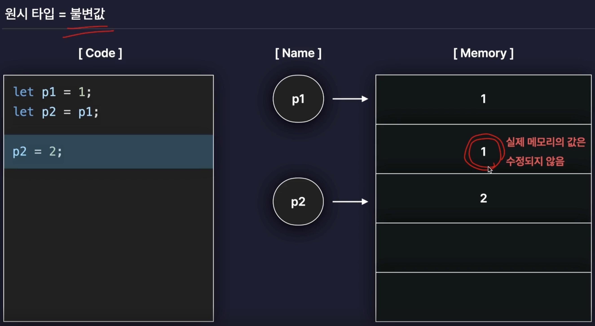
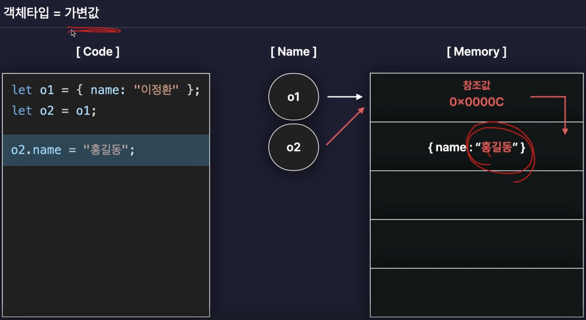
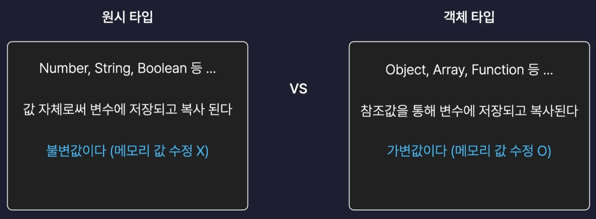
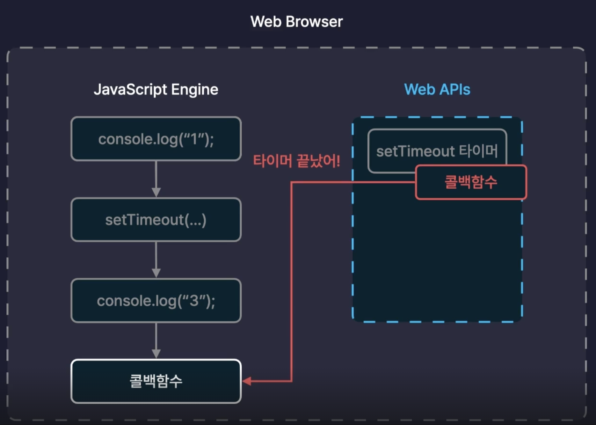
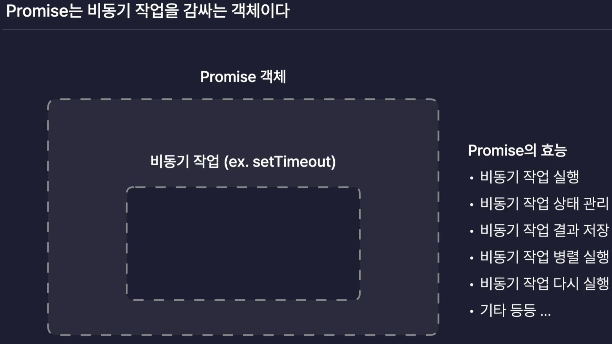

## 웹을 다루는 언어

### HTML의 역할

- 요소들의 내용, 배치, 모양을 정하기 위해 사용.
- 색상, 디자인 수정 불가.

### CSS의 역할

- 요소들의 색상, 크기 등 스타일 설정 가능

### JS의 역할

- 웹 내부에서 발생하는 다양한 기능을 만들 수 있는 언어.
- 웹을 움직이는 '근육'이라는 표현.

## JavaScript의 실행

- JavaScript 엔진을 통해서 실행 되며, 해당 엔진은 우리가 주로 사용하는 웹 브라우저에 기본 탑재 되어 있기 때문에 간단한 js 코드를 실행 해볼 수 있다(console 찍고 연산하고 변수 다루고 해봤잖아?)

### 변수 상수

값을 저장하는 박스/저장소

- 변수의 선언

  초기화 하지 않으면 undefined.
  계속 값을 바꿔가면서 사용가능.

  ```js
  let age;
  ```

- 변수의 초기화

  ```js
  age = 27;
  ```

- 상수의 선언과 초기화

  상수는 변수와 다르게 변경할 수 없는 값이다.  
  때문에 선언과 동시에 초기화 하고 변경할 수 없다.

  ```js
  const birth = "19971024";
  ```

- 변수(상수) 네이밍 규칙

  - '$', '\_'를 제외하고는 변수명에 사용할 수 없다.
  - 숫자로 시작할 수 없다.
  - 예약어를 사용할 수 없다.
    > js에서 이미 특정 용도로 사용하고 있는 이름.

- 변수(상수) 명명 가이드

  이름에 의미를 담자! 누가봐도 이해할 수 있도록.

## 자료형(type)

값들을 포함하는 집합(고양이 , 강아지 => 동물)

- 원시 타입
  기본형 타입.  
  프로그래밍에 있어 기본적인 값들의 타입.

### 원시타입(Primitive Type)

- Number Type  
  \+, \-, \*, \/, \% 연산을 모두 지원한다.  
  그 중에서도 \%는 모듈러 라고 부른다.

  - 정수
  - 실수
  - Infinity
  - -Infinity
  - NaN(Not A Number) => 연산 실패 시 값. 즉 프로그램이 종료되어 버리지 않아서 안전함.

- String Type
  "", '', `` 로 감싸주지 않으면 변수명으로 생각한다.

  - \+ 연산을 지원한다.
  - "string"
  - 템틀릿 리터럴 문법 => `${변수} 입니다.`

- Boolean Type
  현재의 상태를 의미하는데 자주 사용

  - true
  - false

- Null Type

  - 변수에 아무런 값도 담기지 않음을 명시하기 위한 타입이다.
  - 프로그래머가 직접 명시해주는 값.
  - 다만 버그로 인해 typeof null은 object이다.

- Undefined Type
  - 변수를 선언하고 초기화 하지 않으면 자동으로 undefined
  - 묵시적으로 자동으로 할다 되는 갑사.

## JS의 형변환(Type Casting, C 하면서 많이 봤죠~?)

어떤 값의 타입을 다른 타입으로 변경하는 것이다.

- 묵시적 형변환  
  자바스크립트 엔진이 알아서 하는 것(프로그래머가 예상치 못하게 발생할 수 있음).
  - \+  
    number + string => string
  - \-, \*, \/, \%  
    `number ${연산자} string` => number
- 암시적 형변환  
  프로그래머가 내장함수 등을 이용해서 직접 형 변환한다.
  - Number()
    '10개'는 숫자와 문자가 공존해서 이걸로 안됨.  
    parseInt를 사용해서 숫자(정수)만 가져올 수 있음.  
    parseFloat (실수).
    이 또한 숫자가 앞에 있어야 가능.
  - String()

## 연산자

### 대입 연산자

변수에 값을 저장할 때 사용하는 연산자.

```js
let num = 1;
```

### 산술 연산자

- \+ \-, {\*, \/, \%} 괄호안이 우선순위가 더 높다.

### 복합 대입 연산자

산술 + 대입

- \+=, \-=, \*=, \/=, \%=

### 증감 연산자

1씩 증감하는 연산자

- \++, \--

#### 전위 연산 / 후위 연산

```js
let num = 10;
console.log(num++); // 10
console.log(++num); // 11
```

즉 후위 연산자는 해당 줄이 끝나고 나서 변동된다.

### 논리 연산자

- ||
  둘 중 하나만 참이여도 참.  
  이건 앞에거가 거짓이면 뒤에께 나온다고도 생각 할 수 있다는 점.
- &&
  둘 다 참이여야 참.
- !
  뒤집기

### 비교 연산자

- ===(엄격)
- !==(엄격)  
  값 뿐만 아니라 Type도 같아야 함.
- ==
- !=  
  값만 같아도 됨.
- \>, \<, \<=, \>=

### null 병합 연산자

- ??  
  두 값 중 null 또는 undefined가 아닌 값(''도 null과 undefined가 아님!)을 찾는 연산자.  
  둘 다 값이 참이면 앞에꺼가 나온다.
- type of  
  값의 타입을 문자열로 반환한다.
- 삼항연산자  
  (조건) ? (참일때 값) : (거짓일 때 값)

## 조건문(Conditional Statement)

특정 조건을 만족했을 떄에만 실행되는 코드

- if
- switch

## 반복문(Loop, Iteration)

동작을 반복적으로 수행할 수 있도록 만드는 문법

## 함수(function)

중복으로 작성된, 유사한 기능을 하는 코드를 묶어서 간결하게 사용하고, 수정 용이하게 만들어준다.

### 함수 선언식

```js
function example() {
  //어쩌구~~~~
}
```

### 호이스팅

선언 전에 호출이 가능하다.

### 함수 표현식

#### 함수도 값이다

변수에 함수 자체를 담을 수 있다.

```js
let varB = function () {
  // 어쩌구~~
};
```

변수에 값으로 담기 떄문에 굳이 함수의 이름이 필요하지 않다(익명함수).

=> 호이스팅이 되지 않는다!!

### 화살표 함수

빠르고 간결한 함수

```js
let varB = () => {
  // 어쩌구~~~
};
```

```js
let varB = () => // 어쩌구;
```

### Callback Function

자신이 아닌 다른 함수에 인수로서 전달된 함수이다.

```js
function main(value) {
  value();
  // ~~
}

function sub() {
  // ~~
}

main(sub);

main(function () {
  // ~~~
});

main(() => {
  // ~~~
});
```

여기서 sub가 콜백 함수인 것이다.

## Scpoe(범위)

변수나 함수에 접근하거나 호출할 수 있는 범위이다.

### 전역 스코프

전체 영역에서 접근이 가능하다.

### 지역 스코프

특정 영역에서만 접근이 가능하다.

코드 블럭 내에서만 접근이 가능하다.

### Object Type(객체 타입)

원시 타입이 아닌 자료형  
여러가지 값을 동시에 저장할 수 있는 자료형

=> 현실세계에 존재하는 사물이나 개념을 표현하기 용이하다.

### 객체의 생성

- 객체 생성자 사용

  ```js
  let obj = new Object();
  ```

- {} 리터럴 방법
  이게 더 간단하니까 이걸 많이 씀.
  ```js
  let obj = {};
  ```

#### 객체의 Property(속성)

key : value의 형태를 가진다.  
value의 값은 string, number, function, object 뭐든 자유롭게 올 수 있다.  
key 는 string, number / 띄어쓰기가 있는 key값을 제외하고는 ''로 감쌀 필요는 없다.

```js
let person = {
  name: "정재욱",
  age: 27,
  hobby: "피아노"
};
```

#### Property에 접근

- 점 표기법

  ```js
  let name = person.name;
  ```

- 괄호 표기법

  ```js
  let name = person["name"];
  ```

#### Property 추가(수정)

- 점 표기법

  ```js
  person.job = "fe developer";
  ```

- 괄호 표기법

  ```js
  person["job"] = "fe developer";
  ```

#### Property 삭제

```js
delete person.job;
```

```js
delete person["job"];
```

#### Property 존재 확인

boolean 결과

```js
let result = "name" in person;
```

#### 상수 객체

```js
const person = {
  name: "정재욱",
  age: 28
};
```

이런식으로 상수에 객체를 저장하는 것을 의미하며, 마찬가지로 상수 person에 다른 객체를 할당하거나, 다른 값을 저장하려 하는 것은 불가능 하다.

하지만, 객체의 내부 property를 수정하는 것은 얼마든지 가능하다는 것에 유의할 것.

#### 메서드

값이 함수인 프로퍼티를 부르는 말.

```js
const person = {
  name: "정재욱"
  sayHi: function () {
    console.log("HI");
  },
};
```

```js
const person = {
  name: "정재욱",
  // 메서드 선언
  sayHi() {
    console.log("HI");
  }
};
```

person.sayHi();  
person['sayHi']

이렇게 호출이 가능하고, 메서드 선언이라는 형태로도 함수를 선언할 수 있다.

따라서 함수가 아닌 property들이 객체의 정보를 가진다면, 함수는 메서드로서 객체의 동작을 정의한다고 생각할 수 있겠다.

### Array(배열)

배열은 여러개의 값을 순차적으로 담을 수 있는 자료형이다.

#### 배열의 생성

- 배열 생성자

  ```js
  let arr = new Array();
  ```

- 배열 literal(대부분 사용)

  ```js
  let arr = [];
  ```

#### 배열 요소 접근

순서가 있기 때문에 index가 존재.

나머지는 알죠?

```js
arr[0] = "123";
```

이런식으로 수정도 가능!

### Truthy Falsy

참스럽고 거짓스럽다는 직관적으로 의미를 느낄 수 있는데,

- Falsy

  - undefined
  - null
  - 0
  - \- 0
  - NaN
  - ""
  - 0n(big integer)

- Truthy
  - 위 falsy 값을 제외한 모든 값.
  - 빈 배열, 빈 객체도 truthy 하다는 것에 주의.

### 단락 평가(short-circuit evaluation)

false && (무슨 값이던), true || (무슨 값이던) 두 경우 모두 앞 부분에서 결론이 나고, 뒤에는 접근조차 하지 않는다.  
이를 단락 평가라고 하며, 이를 사용하면 조건문 없이도 특정 함수가 실행되지 않게 한다던지 등의 처리가 가능하다.

### 구조 분해 할당

#### 배열

```js
let arr = [1, 2, 3];

let one = arr[0];
let two = arr[1];
let three = arr[2];
```

이거 너무 번거롭잖아!

```js
let [one, two, three, four = 4] = arr;
```

이렇게 구조분해 할당하고, 더 적게 적거나 많게 적어도 문제가 없으며, 초기값을 지정해 줄 수도 있다.

#### 객체

```js
let { name, age, job } = person;
```

#### 객체의 구조 분해 할당을 이용하여 함수의 매개변수를 받는 법.

```js
const func = ({ name, age, hobby, extra }) => {
  // ~~~
};

func(person);
```

### spread 연산자

```js
let arr = [1, 2, 3];
// [4, 1, 2, 3, 5, 6] 만들고 싶다면?
let arr2 = [4, ...arr1, 5, 6];
```

물론 객체에도 사용이 가능하며, 말그대로 펼쳐놓다의 역할이다.
함수에 인자로 전달할때도 마찬가지로 할 수 있겠죠?

### Rest 매개변수

나머지 매개변수 라는 뜻을 가지겠죠?

```js
function func(one, two, ...rest) {
  // one = 1
  // two = 2
  // rest = [3, 4, 5, ...]
}

func(...arr);
```

매개 변수 자리에서 사용했기 때문에 spread연산사가 아니라는 것, 주의 할 점은 rest뒤에 추가적인 매개변수는 존재할 수 없다(나머지를 다 넣는 거니까).

### 원시타입 VS 객체타입

값이 저장되거나 복사되는 과정이 다르다!

원시타입은 값 자체로서 변수에 저장이 되지만, 객체 타입은 참조값을 통해서 변수에 저장되고, 복사된다.

{: style="display: block; margin-left: auto; margin-right: auto; width: 80%;" }

{: style="display: block; margin-left: auto; margin-right: auto; width: 80%;" }

{: style="display: block; margin-left: auto; margin-right: auto; width: 80%;" }

간단하게 객체 타입은 C에서의 포인터의 개념이라고 생각하면 되겠네

그렇기 때문에 객체를 복사할 때는

```js
let o1 = { name: "정재욱" };
let o2 = { ...o1 };
```

이렇게 적어야 할 것이다.

이것이 얕은 복사와, 깊은 복사의 차이이며 깊은 복사가 아니면 원본 객체가 수정될 수 있어 위험하다.

또한 객체간의 비교 연산은 참조값을 기준으로 이루어지기 때문에

```js
let o1 = {name: '정재욱'},
let o2 = o1
let o3 = {...o1}
// 얕은 비교
o1 === o2,
o1 === o3
```

위 두 비교연산에서 첫 째는 참이지만, 둘 째는 거짓이 된다.

그렇기 때문에 객체의 내부 값을 비교하고 싶다면,

```js
// 깊은 비교
JSON.strigify(o1) === JSON.stringity(o3);
```

이렇게 객체를 문자열로 변환해서 비교해야 한다.

그래서 궁금해서 해봤는데

```js
console.log(o1 == o3);
```

그럼 이건 어떻게 될까? 를 생각해봤는데 당연한 결과였다.

type은 둘 다 object로 같을 것이고, 참조 값이 다르니 당연히 false가 나오겠다.

배열과, 함수도 결국 객체이다.

### 배열의 순회

배열도 결국 객체이니, property, method를 가질 수 있는데, length는 모든 배열이 가지는 property가 되겠다.

- index로 순회

  ```js
  for (let i = 0; i < arr.length; i++) {
    // 어쩌구
  }
  ```

- for of 반복문(배열은 순회하기 만을 위해 만든 반복문)

  ```js
  for (let item of arr) {
    // 어쩌구
  }
  ```

### 객체의 순회

- object.keys 사용

  객체에서 key값들만 뽑아서 새로운 배열로 반환.

  ```js
  let keys = Object.keys(person);

  for (let keys of keys) {
    // 어쩌구
  }
  ```

- object.values 사용
  객체에서 value만 뽑아서 새로운 배열로 반환.

  ```js
  let values = Object.values(person);
  ```

- for in (객체만을 위한 특수한 반복문)
  ```js
  for (let key in person) {
    // 어쩌구
  }
  ```

### 배열 메서드

- push
  배열의 맨 뒤에 새로운 요소를 추가하고 새로운 배열의 길이를 반환하는 메서드
- pop
  배열의 맨 뒤에 요소를 하나 삭제하고 반환하는 메서드
- shift
  배열의 맨 앞에 요소를 하나 삭제하고 반환하는 메서드
- unshift
  배열의 맨 앞에 새로운 요소를 추가하는 메서드

그럼 push pop에 비해서 shift와 unshift는 당연히 느리겠죠?

(O(1) vs O(n))

- slice(파이썬에서 하던거랑 비슷한듯)  
  배열의 특정 범위를 잘라서 새로운 배열로 반환.  
  이때 원본 배열의 값은 변경되지 않는다!!

- concat(이어붙히기)  
  기존의 배열에 두번째 배열을 이어붙혀서 새로운 배열을 반환

#### 배열의 순회와 탐색

- forEach  
  모든 요소를 순회하면서 각각의 요소에 특정 동작을 수행하는 메서드

  ```js
  arr.forEach(function (item, idx, arr) {
    console.log((idx, item * 2));
  });
  ```

- includes  
  배열에 특정 요소가 있는지 확인하는 메서드
- indexOf  
  특정 요소의 인덱스를 반환하는 메서드  
  만약 찾으려는 요소가 여러개라면 제일 앞, 없다면 -1을 반환한다.
- findIndex  
  모든 요소를 순회하면서 콜백 함수를 만족하는 요소의 인덱스를 반환한다.

indexOf 는 원시타입이 아닌 객체 타입의 경우 못찾는다.  
왜냐하면, indexOf는 엄격한 비교를 통해 동작하기 때문에 객체 타입의 프로퍼티를 이용해서 비교가 불가능하다.(타입은 object로 같겠지만 참조 값이 다르겠죠?)

그래서 findIndex를 통해서 객체의 프로퍼티를 비교하는 콜백함수를 넣을 수 있으니까 찾아 낼 수 있는 것이다.

- find  
  모든 요소를 순회하면서 콜백함수를 만족하는 요소를 찾는데 요소를 그대로 반환한다.  
  그니까 findIndex와 같은데 index가 아닌 요소를 반환한다.

#### 배열의 변형

- filter  
  기존 배열에서 조건을 만족하는 요소들만 필터링하여 새로운 배열로 반환한다.

- map  
  배열의 모든 요소를 순회하면서, 각각 콜백함수를 실행하고 그 결과값들을 모아서 새로운 배열로 반환.

- sort  
  배열을 사전순으로 정렬하는 메서드, 하지만 문자열이 아닌, 숫자로만 되어있다면 정렬이 제대로 되지 않는다.

- toSorted  
  sort는 원본 배열 자체를 정렬하지만, 얘는 새로운 정렬된 배열을 반환한다.

- join

배열의 모든 요소를 하나의 문자열로 함쳐서 반환하는 메서드.

### Date 객체

#### Date 객체의 생성

- 생성자

  ```js
  // 비었으면 현재시간
  // 특정 날짜르 넣거나 "1997-01-27" || "1997.01.27" || 1997/01/27:10:10:10"
  let date = new Date();
  ```

- 타임 스탬프
  특정 시간이 1970.01.01 00시 00분 00초 로부터 몇 ms가 지났는지를 의미하는 숫자값.

  > UTC(1970.01.01 00시 00분 00초) || 협정시  
  > 전 세계에서 표준으로 사용하는 시간이 시작되는 시점.

  ```js
  date.getTime();
  //이렇게 가져올 수 있고, 위의 new Date()에 인자로 전달하여 해당 시간을 얻을 수도 있다.
  ```

- 시간 요소를 추출하는 방법

  ```js
  let year = date.getFullYear();
  let month = date.getMonth();
  let date = date.getDate();
  let hour = date.getHours();
  let minute = date.getMinutes();
  let seconds = date.getSeconds();
  ```

  주의 할 점은 js의 month는 0부터 시작하기 때문에 항상 +1을 해서 사용해야 혼동을 방지할 수 있다.

- 시간을 수정하는 법

  ```js
  date.setFullYear(2023);
  date.setMonth(2);
  // 이건 3월을 수정하겠죠?
  date.setDate(20);
  date.setHours(23);
  date.setMinutes(59);
  date.setSeconds(59);
  ```

- 시간을 여러 포맷으로 출력하기

  ```js
  date.toDateString(); // Thu Mar 30 2023
  date.toLocaleString(); // 2023. 3. 30. 오후 11:59:59
  ```

## 동기와 비동기

### 동기

여러개의 작업을 순서대로 한 번에 하나씩 처리하는 방식.  
JS는 기본적으로 동기적으로 코드를 실행한다.

- 장점  
  실행 흐름을 파악하고 이해하기 좋다.

- 단점  
  하나의 작업이 오래걸릴 경우 이 작업이 해소될 때까지 다음 작업을 수행할 수 없다.  
  그럼 전체 프로그램의 성능을 악화시키겠죠?

이를 해결하기 위해서 Java, C#등의 언어는 멀티 쓰레딩을 이용한다.  
하지만 JS는 싱글 쓰레드 언어이다.

### 비동기

여러개의 작업을 순서대로 처리하지 않는다. 즉 앞선 작업을 기다리지 않고 다음 작업을 동시에 실행한다.

만약 각각의 작업의 결과값을 이용해서 다른 작업을 해야 한다면? callback 함수를 통해 작업을 수행 할 수 있다.

근데 싱글 쓰레드라면서 어떻게 작업이 저렇게 병렬적으로 이루어지는 거지???????

날..속인거니..?
{: style="display: block; margin-left: auto; margin-right: auto; width: 70%;" }

{: style="display: block; margin-left: auto; margin-right: auto; width: 80%;" }

그림에서 보듯이, 비동기적인 작업은 JS엔진이 아니라 Web APIs가 처리하기 때문에 병렬적인 작업이 가능한 것이다!!

#### 콜백함수

콜백 헬이 발생하게 될 것이다. 가독성 그냥 박살났네!

```js
doSomething(function (result) {
  doSomethingElse(result, function (newResult) {
    doThirdThing(newResult, function (finalResult) {
      console.log(finalResult);
    });
  });
});
```

#### Promise

{: style="display: block; margin-left: auto; margin-right: auto; width: 80%;" }

- Promise의 3가지 상태

  - 대기(Pending) : 아직 작업이 완료되지 않은 상태.
  - 성공(Fulfilled) : 비동기 작업이 성공적으로 이루어진 상태. => resolve
  - 실패(Rejected) : 비동기 작업이 실패한 상태. => reject

  ```js
  const myPromise = new Promise((resolve, reject) => {
    // 이 익명 함수가 바로 executor입니다.
    setTimeout(() => {
      let success = true;

      if (success) {
        resolve("작업이 성공했습니다!"); // 성공 시 resolve 호출
      } else {
        reject("작업이 실패했습니다."); // 실패 시 reject 호출
      }
    }, 2000);
  });

  myPromise.then((value) => {
    console.log(value);
  });

  myPromise.catch((error) => {
    console.log(error);
  });

  myPromise
    .then((value) => {
      console.log(value);
    })
    .catch((error) => {
      console.log(error);
    });
  ```

executor는 promise가 생성될 떄 자동으로 실행되어 비동기 작업을 실행하는 함수이다. 저기선 promise에게 전달된 익명함수가 되겠다.

executor는 resolve 와 reject 두 함수를 인자로 받는데, resolve와 reject를 내부에서 호출하면 각각 fulfilled와 rejected state를 만들고, 각 함수의 인자로 결과를 넣을 수 있다.

then을 사용하게 되면, resolve 되었을때, 해당 인자값을 전달하여 내부의 함수를 실행할 수 있게 된다.

catch는 reject되었을 때의 then 버전이라고 생각하면 된다.

이 떄 then과 catch모두 처음 promise 객체를 반환하기 때문에 따로 쓰는게 아니라 연결해서 쓰는 것도 가능하다.(체이닝)

```js
function add10(num) {
  const promise = new Promise((resolve, reject) => {
    setTimeout(() => {
      if (typeof num == "number") {
        resolve(num + 10);
      } else {
        reject("숫자가 아니여");
      }
    }, 2000);
  });
  return promise;
}

const p = add10(0);
p.then((result) => {
  console.log(result);
  const newP = add10(result);
  newP.then((result) => {
    console.log(result);
  });
});

const p = add10(0);
p.then((result) => {
  console.log(result);
  const newP = add10(result);
  return newP;
}).then((result) => {
  console.log(result);
});
```

이런식으로 promise 비동기 작업의 결과를 다른 비동기 작업에 전달할 수 있는데, 이렇게 되면 앞선 callback hell의 반복이 되게 된다.

이를 위해 제공하는 것이 then 메서드 안에서 반환하게 되는 새로운 promise 객체는 then 메서드의 결과값이 된다는 것이다.  
즉 then은 언제나 promise를 반환하게 되는데 만약 첫 번째 then에서 값을 반환하게 되면 그것은 반환하는 promise의 fulfilled의 결과 값으로 다음 then이 받을 수 있다는 거고, 새로운 promise를 반환하게 되면, resolve, reject되는 여부에 따라 다음 then이 result를 받거나 catch 에서 error을 받게 된다는 것이다.

#### async await

async는 함수 앞에 붙히는 그 함수를 비동기로 만들어주는 키워드, 함수가 프로미스를 반환하도록 변환해주는 키워드

```js
async function getData() {
  return {
    name: "giujae",
    id: "giujae"
  };
}
```

이렇게 async라는 키워드를 통해서 getData() 함수는 객체를 반환하는 함수에서 해당 객체를 결과값으로 갖는 새로운 Promise를 반환하는 비동기 함수가 되는 것이다.  
애초에 Promise를 반환하는 함수였다면 별 다른 영향이 없다.

await은 async 함수 내부에서만 사용이 가능한 키워드로, 비동기 함수가 다 처리되기를 기다리는 역할이다.  
따라서 await가 반환하는 값은 비동기 함수가 반환한 promise의 결과값이 되겠다.

이 의의는 비동기 작업을 마치 동기작업인 것 처럼 코드의 가독성이 올라갈 수 있다는 것이다.

출처 : [인프런 - 한 입 크기로 잘라먹는 리액트](https://www.inflearn.com/course/lecture?courseSlug=%ED%95%9C%EC%9E%85-%EB%A6%AC%EC%95%A1%ED%8A%B8&unitId=210869&tab=curriculum&subtitleLanguage=ko)
