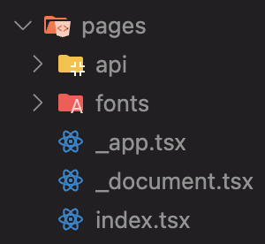

이번에 새로운 프로젝트를 진행하면서 SSR과 SEO의 필요성을 느껴서 Next.js를 공부하게 되었다.

## Next.js 란?

React.js의 전용인 웹 개발 프레임워크 이다.

당연히 알겠지만, React는 라이브러리, Next는 프레임워크이다.

이는 제어권이 누구에게 있냐의 차이이다. React는 제어권이 개발자에게 있으며, 필요한 기능만 유연하게 가져와 사용이 가능하다.  
하지만 Next는 프레임워크(시스템)이 제어권을 가지고 있으며, 정해진 규칙과 구조가 존재하는 대신 개발자는 좀 더 편하게 사용할 수 있는 것이다.

대표적으로 라우팅 같은 경우 React는 react-router, tanstack-router 등의 선택지를 가지고 개발자가 자유롭게 할 수 있지만, Next는 기본적으로 제공하는 page router, app router등을 사용해야 하는 것이다.

그럼 자유도가 더 높은 React를 놔두고 왜 Next를 쓸까??

프로그래밍에서 자유도는 무조건 적으로 좋은 것을 의미하지 않는다. 자유도가 높은 만큼 기본적으로 제공하는 기능이 없는 것이다.

### Next.js의 사전 렌더링

사전 렌더링이란 기존의 React의 CSR에서 벗어나, 브라우저의 요청에 사전에 렌더링 된 HTML을 응답하는 방식으로 CSR의 단점을 효율적으로 해결하는 기술이다.

#### React

{: style="display: block; margin-left: auto; margin-right: auto; width: 80%;" }

- 장점

  기존의 React가 차용한 CSR은 초기 접속 이후에 일어나는 페이지 이동들이 매우 빠르고 쾌적하다.

  초기에 전달받은 JS Bundle에는 웹 페이지 전체 컴포넌트들에 대한 코드들이 들어있고(물론 동적 import를 통해서 스플리팅이 가능하지만 별도 설정이 필요함), 이후 유저에게서 브라우저로 페이지 이동 요청이 들어오면 가지고있던 React 앱을 실행해서 해당 요청에 맞는 화면을 렌더링 해주면 되기 때문에 빠르고 쾌적하다고 하는 것이다.

- 단점  
  위에서 말했듯이, 초기 접속 시 실제 화면이 렌더되기까지 빈 index.html 받아오기, JS Bundle 받아오기, 받아온 React app 실행하기, 컨텐츠 렌더링 하기 까지 브라우저가 많은 일을 하기 때문에 오래 걸린다.  
  이렇게 요청 ~ 컨텐트 렌더링 까지 걸리는 시간을 FCP(First Contentful Paint)라고 하며, 이게 ms 단위로 증가함에 따라 사용자 이탈률이 가파르게 증가하는 중요한 지표이다.  
  CSR은 이 FCP가 길 수 밖에 없기 때문에 단점이 되는 것이다.

#### Next

{: style="display: block; margin-left: auto; margin-right: auto; width: 80%;" }

사전 렌더링을 통해 기존의 느린 FCP를 해결하였다.

서버에서 요청 받은 페이지의 모든 컴포넌트를 렌더링 하여 전해주기 때문에 유저가 실제 렌더된 화면을 보기까지의 FCP가 줄어들게 된다.

> 렌더링  
> - 브라우저의 렌더링  
>   HTML, CSS, JS를 파싱해서 실행한 결과물로 화면을 그리는 과정
>
> - 서버사이드의 렌더링  
>   HTML 파일의 내용이 비어있지 않은 것

하지만 이때의 화면은 JS가 없기 때문에 상호작용은 불가능한 상태이다.  
이후 서버에서 필요한 JS Bundle을 제공받아 각 요소에 매칭시키는데 이 과정을 수화(Hydration) 라고 한다.

이 과정을 통해 상호작용이 가능한 페이지가 완성되며 이때까지의 시간을 TTI(Time To Interactive)라고 한다.

{: style="display: block; margin-left: auto; margin-right: auto; width: 80%;" }

이렇게 앞서 사전 렌더링을 통해 빠른 FCP를 달성하고, 이후에 페이지 이동이 발생할 경우 기존 React의 CSR 방식을 사용하여 빠르고 쾌적한 페이지 이동을 가능케 하여 장점만 챙겨 두 마리의 토끼를 다 잡은 것이다.  

이 때 이해가 안 갓던 부분이 그럼 처음에 서버에서 HTML 파일을 렌더해 줄때 모든 페이지에 대해서 렌더를 해주는 건가??  
그럼 수화 전 전달받는 JS Bundle은 전체 코드인가 필요한 부분인가??  
그럼 서버에는 JS 런타임 환경이 있어야 하는 거 아닌가?  
라는 의문이였다.  

이에 대해 정리 해보았다.  
먼저 처음 서버에서 렌더 해 주는 HTML 페이지는 요청 받은 페이지에 대한 모든 컴포넌트 이다.  
이후 수화를 위해 받는 JS Bundle은 해당 페이지에 필요한 부분만을 받는다.  
이후 페이지 이동이 발생할 때는 브라우저에서 페이지를 렌더하지만, 프리 패치된 부분을 벗어나게 되면 서버에서 필요한 페이지의 JS Bundle을 따로 받아 실행하여 렌더링 한다.  
서버는 JS 런타임이 필요한게 맞다 그래서 대표적으로 Node.js를 사용한다.

이로써 어느정도 Next의 렌더링에 대한 개요를 이해할 수 있었다.

### Next.js의 Router

#### Page Router, App Router

Page Router은 기존의 라우터, App Router은 Next13 이후로 제공되는 새로운 버전이다.  

그러니 기존의 Page Router 부터 알아보자!

### Page Router

기존에 사용되고 있던 안정적인 라우터로, React Router 처럼 페이지를 분할하고 분할 된 페이지 사이의 이동을 처리하는 라우팅을 담당하는 기능이다.

{: style="display: block; margin-left: auto; margin-right: auto; width: 80%;" }

{: style="display: block; margin-left: auto; margin-right: auto; width: 80%;" }

이렇게 pages 폴더 하위의 파일명을 기준으로 자동으로 페이지 라우팅이 제공되며, 파일 이름 뿐만 아니라 폴더 이름을 기준으로도 할 수 있다.

{: style="display: block; margin-left: auto; margin-right: auto; width: 80%;" }

동적 경로를 위해선 \[]를 사용하면 된다.

{: style="display: block; margin-left: auto; margin-right: auto; width: 80%;" }

실제로 next 프로젝트를 만들어보면 기본적으로 pages 폴더 아래 index.tsx가 있고 그 외에 _app.tsx, _document.tsx가 존재한다.  

index.tsx는 기본경로를 가진다는 건 알겠는데 그럼 다른 두 개는 뭐지??

- _app.tsx

  React에서 App 컴포넌트가 다른 모든 컴포넌트들의 부모 컴포넌트 역할을 하듯, 이 컴포넌트는 모든 page 컴포넌트의 부모 컴포넌트 이다.

  {: style="display: block; margin-left: auto; margin-right: auto; width: 80%;" }

  코드를 살펴보면, Component와 pageProps라는 두 개의 props을 받고 있는데, 각각 Component는 page 역할을 할 컴포넌트이고, pageProps는 page 컴포넌트들에게 전달될 props들을 객체로 보관한 것이다.

  다음 줄에서 스프레드 연산자를 통해 전달하고 있는 것을 볼 수 있다.

  때문에 모든 페이지에 공통으로 사용되는 예를 들어 헤더 컴포넌트를 추가하고 싶거나, 레이아웃을 작성하는 등의 작업이 가능하다.

- _document.tsx

  {: style="display: block; margin-left: auto; margin-right: auto; width: 80%;" }

  코드를 보면 알 수 있듯이, 모든 페이지에 공통으로 적용되는 HTML 태그를 작성하는 곳이다. 기존 React에서의 index.tsx라고 생각하면 편하다.

  예를 들면 meta 태그, 폰트, 스크립트 등을 추가할 수 있겠다.

#### useRouter

  {: style="display: block; margin-left: auto; margin-right: auto; width: 80%;" }

  기본적인 라우팅에 대해선 위에서 알아보았고, 쿼리스트링을 가져올 수 있게 하는 useRouter에 대해 알아보자.

  처음 import 할 때 next/router 과 next/navigator 두 가지가 있는데 후자는 App Router에서 사용하는 것이기 때문에 주의해야 한다.