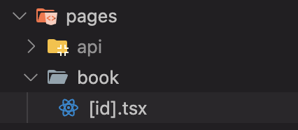

이번에 새로운 프로젝트를 진행하면서 SEO의 필요성을 느껴서 Next.js를 공부하게 되었다.

## Next.js 란?

React.js의 전용인 웹 개발 프레임워크 이다.

당연히 알겠지만, React는 라이브러리, Next는 프레임워크이다.

이는 제어권이 누구에게 있냐의 차이이다. React는 제어권이 개발자에게 있으며, 필요한 기능만 유연하게 가져와 사용이 가능하다.  
하지만 Next는 프레임워크(시스템)이 제어권을 가지고 있으며, 정해진 규칙과 구조가 존재하는 대신 개발자는 좀 더 편하게 사용할 수 있는 것이다.

대표적으로 라우팅 같은 경우 React는 react-router, tanstack-router 등의 선택지를 가지고 개발자가 자유롭게 할 수 있지만, Next는 기본적으로 제공하는 page router, app router등을 사용해야 하는 것이다.

그럼 자유도가 더 높은 React를 놔두고 왜 Next를 쓸까??

프로그래밍에서 자유도는 무조건 적으로 좋은 것을 의미하지 않는다. 자유도가 높은 만큼 기본적으로 제공하는 기능이 없는 것이다.

### Next.js의 사전 렌더링

사전 렌더링이란 기존의 React의 CSR에서 벗어나, 브라우저의 요청에 사전에 렌더링 된 HTML을 응답하는 방식으로 CSR의 단점을 효율적으로 해결하는 기술이다.

#### React

{: style="display: block; margin-left: auto; margin-right: auto; width: 80%;" }

- 장점

  기존의 React가 차용한 CSR은 초기 접속 이후에 일어나는 페이지 이동들이 매우 빠르고 쾌적하다.

  초기에 전달받은 JS Bundle에는 웹 페이지 전체 컴포넌트들에 대한 코드들이 들어있고(물론 동적 import를 통해서 스플리팅이 가능하지만 별도 설정이 필요함), 이후 유저에게서 브라우저로 페이지 이동 요청이 들어오면 가지고있던 React 앱을 실행해서 해당 요청에 맞는 화면을 렌더링 해주면 되기 때문에 빠르고 쾌적하다고 하는 것이다.

- 단점  
  위에서 말했듯이, 초기 접속 시 실제 화면이 렌더되기까지 빈 index.html 받아오기, JS Bundle 받아오기, 받아온 React app 실행하기, 컨텐츠 렌더링 하기 까지 브라우저가 많은 일을 하기 때문에 오래 걸린다.  
  이렇게 요청 ~ 컨텐트 렌더링 까지 걸리는 시간을 FCP(First Contentful Paint)라고 하며, 이게 ms 단위로 증가함에 따라 사용자 이탈률이 가파르게 증가하는 중요한 지표이다.  
  CSR은 이 FCP가 길 수 밖에 없기 때문에 단점이 되는 것이다.

#### Next

{: style="display: block; margin-left: auto; margin-right: auto; width: 80%;" }

사전 렌더링을 통해 기존의 느린 FCP를 해결하였다.

서버에서 요청 받은 페이지의 모든 컴포넌트를 렌더링 하여 전해주기 때문에 유저가 실제 렌더된 화면을 보기까지의 FCP가 줄어들게 된다.

> 렌더링  
> - 브라우저의 렌더링  
>   HTML, CSS, JS를 파싱해서 실행한 결과물로 화면을 그리는 과정
>
> - 서버사이드의 렌더링  
>   HTML 파일의 내용이 비어있지 않은 것

하지만 이때의 화면은 JS가 없기 때문에 상호작용은 불가능한 상태이다.  
이후 서버에서 필요한 JS Bundle을 제공받아 각 요소에 매칭시키는데 이 과정을 수화(Hydration) 라고 한다.

이 과정을 통해 상호작용이 가능한 페이지가 완성되며 이때까지의 시간을 TTI(Time To Interactive)라고 한다.

{: style="display: block; margin-left: auto; margin-right: auto; width: 80%;" }

이렇게 앞서 사전 렌더링을 통해 빠른 FCP를 달성하고, 이후에 페이지 이동이 발생할 경우 기존 React의 CSR 방식을 사용하여 빠르고 쾌적한 페이지 이동을 가능케 하여 장점만 챙겨 두 마리의 토끼를 다 잡은 것이다.  

이 때 이해가 안 갓던 부분이 그럼 처음에 서버에서 HTML 파일을 렌더해 줄때 모든 페이지에 대해서 렌더를 해주는 건가??  
그럼 수화 전 전달받는 JS Bundle은 전체 코드인가 필요한 부분인가??  
그럼 서버에는 JS 런타임 환경이 있어야 하는 거 아닌가?  
라는 의문이였다.  

이에 대해 정리 해보았다.  
먼저 처음 서버에서 렌더 해 주는 HTML 페이지는 요청 받은 페이지에 대한 모든 컴포넌트 이다.  
이후 수화를 위해 받는 JS Bundle은 해당 페이지에 필요한 부분만을 받는다.  
이후 페이지 이동이 발생할 때는 브라우저에서 페이지를 렌더하지만, 프리 패치된 부분을 벗어나게 되면 서버에서 필요한 페이지의 JS Bundle을 따로 받아 실행하여 렌더링 한다.  
서버는 JS 런타임이 필요한게 맞다 그래서 대표적으로 Node.js를 사용한다.

이로써 어느정도 Next의 렌더링에 대한 개요를 이해할 수 있었다.

### Next.js의 Router

#### Page Router, App Router

Page Router은 기존의 라우터, App Router은 Next13 이후로 제공되는 새로운 버전이다.  

그러니 기존의 Page Router 부터 알아보자!

### Page Router

기존에 사용되고 있던 안정적인 라우터로, React Router 처럼 페이지를 분할하고 분할 된 페이지 사이의 이동을 처리하는 라우팅을 담당하는 기능이다.

{: style="display: block; margin-left: auto; margin-right: auto; width: 80%;" }

{: style="display: block; margin-left: auto; margin-right: auto; width: 80%;" }

이렇게 pages 폴더 하위의 파일명을 기준으로 자동으로 페이지 라우팅이 제공되며, 파일 이름 뿐만 아니라 폴더 이름을 기준으로도 할 수 있다.

{: style="display: block; margin-left: auto; margin-right: auto; width: 80%;" }

동적 경로를 위해선 \[]를 사용하면 된다.

{: style="display: block; margin-left: auto; margin-right: auto; width: 80%;" }

실제로 next 프로젝트를 만들어보면 기본적으로 pages 폴더 아래 index.tsx가 있고 그 외에 _app.tsx, _document.tsx가 존재한다.  

index.tsx는 기본경로를 가진다는 건 알겠는데 그럼 다른 두 개는 뭐지??

- _app.tsx

  React에서 App 컴포넌트가 다른 모든 컴포넌트들의 부모 컴포넌트 역할을 하듯, 이 컴포넌트는 모든 page 컴포넌트의 부모 컴포넌트 이다.

  {: style="display: block; margin-left: auto; margin-right: auto; width: 80%;" }

  코드를 살펴보면, Component와 pageProps라는 두 개의 props을 받고 있는데, 각각 Component는 page 역할을 할 컴포넌트이고, pageProps는 page 컴포넌트들에게 전달될 props들을 객체로 보관한 것이다.

  다음 줄에서 스프레드 연산자를 통해 전달하고 있는 것을 볼 수 있다.

  때문에 모든 페이지에 공통으로 사용되는 예를 들어 헤더 컴포넌트를 추가하고 싶거나, 레이아웃을 작성하는 등의 작업이 가능하다.

- _document.tsx

  {: style="display: block; margin-left: auto; margin-right: auto; width: 80%;" }

  코드를 보면 알 수 있듯이, 모든 페이지에 공통으로 적용되는 HTML 태그를 작성하는 곳이다. 기존 React에서의 index.tsx라고 생각하면 편하다.

  예를 들면 meta 태그, 폰트, 스크립트 등을 추가할 수 있겠다.

#### useRouter

  {: style="display: block; margin-left: auto; margin-right: auto; width: 80%;" }

  기본적인 라우팅에 대해선 위에서 알아보았고, 쿼리스트링을 가져올 수 있게 하는 useRouter에 대해 알아보자.

  처음 import 할 때 next/router 과 next/navigator 두 가지가 있는데 후자는 App Router에서 사용하는 것이기 때문에 주의해야 한다.

  ```js
  const router = useRouter();
  const {q} = router.query;
  ```

  이렇게 router 객체를 선언해서 사용이 가능한데, 콘솔을 찍어보면 내부에 back, push 등 페이지 이동을 위한 메서드가 존재하고, query 속성의 q 필드로 입력한 쿼리 값이 들어오는 것을 확인할 수 있다.

  이때 콘솔이 두 번 출력되는 현상이 있는데, 이는 쿼리스트링을 읽어오는 과정에서 next가 컴포넌트를 한 번더 렌더하기 때문에 발생하는 현상이다.

  이 쿼리스트링은 페이지의 경로에는 영향을 주지 않기 때문에 별도의 pages 폴더 하위 설정은 필요없지만 저렇게 쿼리를 가져와서 사용하는 것이다.

#### 동적 경로

URL PARAMETER을 갖는 페이지를 만들 때에는 

  {: style="display: block; margin-left: auto; margin-right: auto; width: 80%;" }

  이렇게 \[id]를 사용하여 URL PARAMETER을 사용하는 동적 페이지를 생성한다.

  그럼 next는 아 이 페이지는 /book/{id} 의 동적 경로에 대응하는 파일이구나 해서 id값으로 1이던 100이 들어오던 해당 컴포넌트를 페이지로 제공하게 된다.

  물론 당연하지만, 파라미터 이름은 id 외에도 필요한 이름으로 작성하면 된다.

  사용방법은 앞선 쿼리스트링와 같은 방법이며, router 객체의 query 속성에 id 라는 값으로 저장이 된다.

#### Catch All Segment

그럼 이제 저렇게 하나의 파라미터를 받는 방법은 알았는데, /book/{id}/{id}/{id} 이런식으로 여러개의 파라미터가 오는 경우는 어떻게 해야 할까?

\[id].tsx 라고 적었던 파일명을 \[...id].tsx로 사용하면 여러개의 파라미터에도 대응을 하겠다 라는 뜻이 된다. 그리고 이를 catch all segment라고 부른다.

이렇게 받아온 파라미터들은 query 속성의 id 필드에 배열로 저장된다.

#### Optional Catch All Segment

위의 방법은 book 뒤에 뭔가 파라미터가 와야 하기 때문에 index 페이지에는 대응하짐 못한다.  
따라서 해당 파일을 더 범용적으로 사용하기 위해서는 \[[...id]].tsx 라고 파일명을 작성하면 된다.

#### 404 페이지

존재하지 않는 경로로 접근하였을 경우에는 간단하게 pages 폴더 하위에 404.tsx파일을 만들어주면 된다.

#### Navigating

- Link

  보통 페이지를 이동시킬때 사용하는 anchor 태그는 CSR방식이 아닌 매 요청마다 서버에게 다시 페이지를 요청하는 방식이기 때문에 비교적 느린 방식이다.

  next에서는 Link 컴포넌트를 제공한다.

  사용하는 방법은 a 태그와 같다

  ```js
  <Link href={'/'}>index</Link>
  ```

- Programmatic Navigation

  사용자가 링크를 클릭한 것이 아닌 특정 로직을 통해 함수 내부에서 페이지를 이동시키는 경우엔 예를 들어 버튼 클릭이라면

  ```js
    const router = useRouter();

    const onClickButton = () => {
        router.push('/');
    };
  ```

  이렇게 router 객체를 가져와 내부의 push 메서드를 사용하면 된다.  
  push 외에도 뒤로가기를 방지하고 이동하는 replace 메서드와, 뒤로가기인 back 메서드도 있다.


#### Prefetching

  앞서 react와 next의 차이에 대해 설명하던 중 next는 초기 접속 시 해당 페이지에 필요한 JS Bundle을 받아 수화를 거치고 이후의 페이지 이동은 react 처럼 CSR로 처리된다고 했었다.  

  그렇다면 페이지를 이동할 떄 마다 해당 페이지의 JS Bundle을 받아온다면 수화에 걸리는 시간은 줄겠지만(Bundle 크기가 작으니까), 오히려 페이지 이동 자체가 느리고 비효율적이게 된다.

  이를 해결하기 위해 등장한 것이 prefetching 이다.

  프리페칭이랑 현재 페이지에서 링크, 버튼 등을 통해 이동 가능성이 있는 모든 페이지의 JS 코드를 미리 불러오는 것이다.

  {: style="display: block; margin-left: auto; margin-right: auto; width: 80%;" }

  그래서 실질적으로 렌더 과정은 위 그림과 같은 흐름으로 진행된다.

  따라서 전체적으로 정리를 해보자면, next는 사전 렌더링을 통해 서버에서 요청한 초기 페이지의 html을 받아 온 후, 해당 페이지에 필요한 JS Bundle을 받아온다.  
  이후 유휴 상태일 때, 초기 페이지와 연결된 모든 페이지에 대한 JS 코드를 미리 캐싱 해놓고, 이동 요청에 대응하게 된다.  
  이 때 요청받은 페이지가 prefetching 된 영역에서 벗어날 경우 새로 JS Bundle을 받아와서 화면을 그려주게 된다.

  이를 통해 Hydration을 빠르게 진행하고, 초기 페이지 접속 이후의 페이지 이동 또한 빠르게 처리할 수 있도록 하는 것이다.

  이 현상이 발생하는 이유는 next에서 우리가 작성한 모든 컴포넌트들/코드들을 페이지 별로 스플리팅 해 두기 때문이다.  
  만약에 초기 접속 시 모든 JS Bundle을 한 번에 전달하게 되면, 용량이 너무 크니 Hydration 까지의 시간이 너무 오래 걸리게 된다.  
  그럼 상호작용이 불가능한 화면을 클릭하면서 어 이거 왜 안돼 광클 우다다다ㅏㅏㅏ다ㅏㅏ 하게 되는 현상이 생길 텐데 이건 유저경험에 매우 안 좋은 영향을 끼칠 것이다.

  개발자 도구를 통해서 네트워크 탭을 보면 prefetching이 되고 있는 것을 확인할 수 있다(개발 모드에서는 안되니까 빌드해서 프로덕션으로 봐야 함).  
  이때 Link로 된 페이지들은 모두 prefetching이 되지만, button 에서 programmatic 하게 이동하는 페이지는 추가로 js 번들을 받아오는 것을 확안할 수 있다.  

  이런 페이지들도 사전렌더링하고 싶다면, router 객체의 메서드를 활용하면 된다.

  ```js
  useEffect(() => {
    router.prefetch('/원하는 페이지 경로')
  }, [])
  ```

  만약 Link 컴포넌트의 prefetching을 비활성화 하고 싶다면(이 페이지는 잘 안갈 것 같은데) prefetch 라는 속성 값을 false를 주면 된다.

#### API Routes

Next에서 API를 구축할 수 있도록 해 주는 기능으로, 마치 백엔드 처럼 DB의 데이터를 브라우저의 요청에 따라 제공한다던가, 외부 서드 파티의 데이터를 제공할 수 있도록 해주는 것이다.

기본적으로 프로젝트를 생성하면 api라는 폴더가 생기는데, 그 하위에 파일을 작성하면 /api/파일명 으로 api 경로가 만들어진다.

```js
import type { NextApiRequest, NextApiResponse } from 'next';

export default function handler(req: NextApiRequest, res: NextApiResponse) {
    const date = new Date();
    res.json({ time: date.toLocaleString() });
}
```

#### CSS Module

Next에서 css를 사용할 때는 react에서와 마찬가지로 css 파일을 해당 컴포넌트에서 import 하게 되면 에러가 발생한다.  
이는 next에서 app 컴포넌트를 제외 한 곳에서 import로 css 파일을 가져오는 것을 막고 있기 때문이다.  
이걸 막는 이유는 예를 들어 index에서 h1 태그를 red, search에서 h1 태그를 blue로 설정한다면, index 페이지를 방문 한 이후, search를 방문하면 red, blue가 충돌하는 이런 상황이 발생할 수 있기 때문이다.

이때 등장하는게 CSS Module 이다. 이는 기존의 css 파일을 모듈처럼 사용할 수 있도록 해주는 것으로, 앞서 사용했던 h1 처럼 클래스 명이 겹쳐서 발생하는 일이 없도록 자동으로 클래스 명을 파일마다 유니크한 이름으로 바꿔준다.

사용하기 위해서는 파일명을 index.module.css로 바꿔주면 된다.  
```js
import style from './index.module.css'

<h1 className={style.h1}>index<h1>
```

#### Global Layout

전역에 사용될 layout 같은경우는 app 컴포넌트에 작성하면 되며, 일반적으로 별도의 컴포넌트로 분리하여 페이지들을 자식 props로 전달한다.

```js
<GlobalLayout>{<Component {...pageProps} />}</GlobalLayout>
```

#### 선택적 Layout

특정 페이지에서만 보여야 할 레이아웃을 적용하기 위해서는 각 페이지에 해당 레이아웃을 적용하는 메서드를 추가하면 된다.  

js에서 기본적으로 함수 또한 객체이기 때문에 당연히 메서드를 추가할 수 있다.

```js
Home.getLayout = (page: ReactNode) => {
    return <SearchableLayout>{page}</SearchableLayout>;
};
```

```js
const getLayout = Component.getLayout ?? ((page: ReactNode) => page);
```

그 후 app 컴포넌트에서 해당 메서드를 각 컴포넌트에서 가져와 사용하여

```js
<GlobalLayout>{getLayout(<Component {...pageProps} />)}</GlobalLayout>
```

이렇게 리턴하게 된다.

해당 메서드가 추가되지 않은 페이지의 경우 undefined이기 때문에 에러가 발생하는데 이 예외 처리를 위해 ?? 연산자를 통하여 없을 경우 해당 페이지를 그대로 리턴하게 해준다.

#### Data Fetching

  react의 경우 백엔드 api로 부터 데이터를 받아올 때, 컨텐츠의 렌더링 이후 api 요청 까지 기다려야 한다. 

 {: style="display: block; margin-left: auto; margin-right: auto; width: 80%;" }

 반면 next의 경우에는 사전렌더링 과정에서 data fetching 까지 수행해서 줄 수 있기 때문에 추가적인 로딩 없이 데이터가 들어간 화면을 한 번에 보여줄 수 있다.
 
 {: style="display: block; margin-left: auto; margin-right: auto; width: 80%;" }

 근데 이 때 드는 의문은 아~니 그럼 api 요청 데이터가 매우 크다거나, 벡엔드 서버 상태가 안좋아서 오래 걸리면 유저는 아예 화면을 보지도 못하고 기다려야 하는거 아니냐 그럼 차라리 로딩바라도 보이는 react의 방식이 더 나은 거 아니냐 라고 할 수 있다.  

 그렇기 때문에 이런 경우에는 next에서 빌드 타임에도 사전렌더링이 가능하도록 기능을 제공하고 있다.

 다음은 next의 세 가지 사전 렌더링 방식이다.

 - SSR(서버사이드렌더링)  
  가장 기본적인 사전 렌더링 방식  
  요청이 들어올 때 마다 사전 렌더링을 함(매번 새로운 데이터로 최신상태를 유지할 수 있음)
  데이터 요청이 늦어지면 모든 게 늦어짐

- SSG(정적 사이트 생성)  
  빌드 타임에 미리 페이지를 사전 렌더링
  아무리 오래걸리는 작업이 있다고 하더라도 사용자 경험에는 아무런 영향이 없음
  매번 똑같은 페이지만 응답하기 때문에 최신 데이터 반영은 어려움

- ISG(증분 정적 재생성)  

#### SSR

원하는 페이지에서 컴포넌트 위에

```js
export const getServerSideProps = () => {
  const data = 'hello';

  return {
    props: {
      data,
    }
  }
}
```

이렇게 써주는 것으로 SSR을 적용할 수 있다.  
해당 함수의 역할은 컴포넌트 보다 먼저 실행되어서, 컴포넌트에 필요한 데이터를 불러오는 함수로 return 시에는 반드시 props 객체 하나를 전달해 주어야만 컴포넌트에서 데이터를 읽을 수 있음에 주의해야 한다.

 {: style="display: block; margin-left: auto; margin-right: auto; width: 80%;" }

 그래서 이렇게 코드를 짜게 되면, Home 컴포넌트는 서버에서 사전렌더링을 할 때 한 번, 브라우저에서 hydration을 할 떄 총 2번 실행이 되기 떄문에

 {: style="display: block; margin-left: auto; margin-right: auto; width: 80%;" }

 {: style="display: block; margin-left: auto; margin-right: auto; width: 80%;" }

 이렇게 두 번 각각 출력이 되게 된다.
 
 그렇기 때문에 컴포넌트 내부에 window.location 등의 브라우저에서만 사용가능한 객체에 접근을 하게 되면, undefined의 location 이 되버리니 에러가 발생한다.  

 이를 파훼하기 위한 가장 쉬운 방법은 해당 로직을 useEffect 내부에 작성하는것이다(컴포넌트의 마운트 이후 실행이니까)

 이렇게 SSR로 받은 데이터의 타입은 InferGetServerSidePropsType<typeof getServerSideProps>를 통해 자동 추론이 가능하다.

 다음은 아래 세 가지 코드를 통해 SSR 사용방법을 알아보자.

 ```js
export const getServerSideProps = async () => {
    const [allBooks, recoBooks] = await Promise.all([fetchBooks(), fetchRandomBooks()]);

    return {
        props: { allBooks, recoBooks },
    };
};
```

첫 번째 사용은 간단하다. 서버로부터 데이터를 받아오는 함수를 만들어서 호출을 하되, Promise.all을 통해 전달한 모든 비동기 함수를 병렬적으로 수행할 수 있도록 한 것이다.

```js
Home({ allBooks, recoBooks }: InferGetServerSidePropsType<typeof getServerSideProps>
```

사용할 때에는 SSR로 받은 Props의 타입 추론을 저렇게 자동으로 제공한다.

```js
export const getServerSideProps = async (context: GetServerSidePropsContext) => {
    const id = context.params!.id;

    const book = await fetchOneBook(Number(id));

    return {
        props: { book },
    };
};
```

두 번째의 경우는 api로 url parameter의 id 값을 전달 해 주어야 했는데, 이는 context 객체 안에서 찾을 수 있다.

```js
export const getServerSideProps = async (context: GetServerSidePropsContext) => {
    const q = context.query.q;

    const books = await fetchBooks(q as string);

    return {
        props: { books },
    };
};
```

세 번째 경우는 api로 query 값을 전달해 주어야 했는데 이 또한 마찬가지로 context 객체 내부에서 찾았음을 볼 수 있다.

이 둘 또한 첫 번째와 마찬가지로 SSR로 받은 props의 타입은 자동 추론을 사용한다.

#### SSG

정적 페이지 생성을 위해서는 간단하다.  
앞서 SSR을 위해 사용한 getServerSideProps 를 getStaticProps로 바꿔주고, 그에 맞는 타입 추론 InferGetStaticPropsType:getStaticProps 를 사용하면 된다.  

근데 막상 실행 해보면 매 요청 마다 새롭게 사전렌더링을 하는 것을 알 수 있는데, 이는 개발자들의 편의를 위해 개발 모드에서는 사전 렌더링 방식과 무관하게 매번 새로 하게 된다.

따라서 build 후 production 모드에서 살펴보면 차이를 알 수 있는데 먼저  

 {: style="display: block; margin-left: auto; margin-right: auto; width: 80%;" }

 빌드 과정에서의 로그를 살펴보면 흰 동그라미, 검은 동그라미, f를 볼 수 있는데 아래에 표기되어 있듯 검은 동그라미는 기본 설정(next는 기본적으로 SSG를 적용한다)으로 된 SSG, 흰 동그라미는 getStaticProps로 설정 된 SSG, f는 동적으로 받아오는 SSR을 의미한다.

 문제는 검색 페이지와 같이 query 값이 필요한 경우이다.  
 빌드 타임에 사전 렌더링을 하는 SSG 방식에서는 query 값을 그때 알 수 있는 방법이 없다.  
 때문에 data fetching 로직을 클라이언트에서 처리하여 넣어주는 방식을 사용할 수 있다.  

 이렇게 한다면 SSR의 경우 API 결과가 없으면 사용자는 아예 화면을 볼 수 없는 반면, Search 페이지 자체는 SSG로 설정하고 검색 결과만 따로 클라이언트에서 불러오도록 설정하면, 우선 Search 페이지의 레이아웃과 로딩바 정도는 보여줄 수 있기 때문에 훨씬 나은 유저 경험에 기여 할 수 있다.

동적 경로를 가지는 페이지의 경우에는 또 다른 문제점이 생긴다.  
동적 경로를 가진다는 것은 /book/1 /book/2 등등 뒤의 url parameter에 따라 다른 페이지 들이 생길 수 있다는 것인데, 그럼 사전 렌더링을 할 떄 어떠한 경로가 존재할 수 있는지를 설정 해 주어야 사전 렌더링이 가능해진다.
 
 {: style="display: block; margin-left: auto; margin-right: auto; width: 80%;" }

 이런식으로 경로를 알려 줄 수 있으며, 경로는 무조건 문자열이여야만 한다.

 fallback의 경우는 세 가지 방법이 있는데,

 1. false : 미리 알려준 경로 외에는 싹다 없는 경로 즉 404페이지로 보낸다.
 2. blocking : 존재하지 않는 경로로 요청을 했을 경우에는 SSR 처럼 사전렌더링하여 브라우저에게 반환해준다. 이렇게 생성 된 페이지는 미리 빌드타임에 생성한 것 처럼 저장된다.  
 하지만 오래 걸리는 작업이라면, 또 응답이 올 떄까지 화면을 보여줄 수 없기 때문에 다음의 방법이 존재한다.
 3. true: 존재하지 않는 페이지의 요청을 받았을 때는, props없이 일단 페이지를 반환한다(데이터가 없는 페이지) 그 다음 props만 따로 계산하여 후속으로 보내준다(이 때 로딩을 보여주면 되겠지?). 

  이 때, fallback 상태 일때 그냥 문제가 발생했다는 문구를 보여줘 버리면 로딩중이 아니라 안되는 거구나? 라고 오해할 수 있기 때문에

  ```js
    if (router.isFallback) return '로딩중';
    if (!book) return '문제가 발생했습니다.';
  ```

  이렇게 isFallback 값을 사용하면 좋다.

  아니면 getStaticProps 함수 내에서

  ```js
  if (!book) {
        return {
            notFound: true,
        };
    }
  ```

  이렇게 설정해 주면 자동으로 404 페이지로 보내진다.

#### ISR

SSG 방식으로 생성된 정적 페이지를 일정 시간을 주기로 다시 생성하는 기술이다.  
기존의 SSG는 빌드타임에 정적으로 생성된 페이지가 다시 생성되지 않기 때문에 최신 데이터를 반영하기 어려웠지만, ISR은 유통기한을 정하고, 그 이후 페이지는 새로운 페이지를 생성하여 제공하도록 할 수 있다.
 
 {: style="display: block; margin-left: auto; margin-right: auto; width: 80%;" }

 그렇다고 정한 시간(사진에서는 60초)이후에 칼같이 바뀌는 것이 아니라, 해당 시간이 지난 후 새로 생성을 시작하고, 생성이 완료된 기점으로 부터 새로운 페이지를 반환한다.

 떄문에 매우 빠른 응답속도를 가지는 SSG의 방식과 최신 데이터를 반영하기 유리한 SSR의 방식을 합한 방식이라고 볼 수 있다.

 {: style="display: block; margin-left: auto; margin-right: auto; width: 80%;" }

  {: style="display: block; margin-left: auto; margin-right: auto; width: 80%;" }

 적용하는 방법은 간단하게 앞서 SSG로 작성한 함수에 props 밑에 revalidate라는 속성을 추가하고, s단위 시간을 추가하면 된다.  
 그럼 빌드 시 해당 시간과 함께 ISR이 적용되었음이 나타나고, 3초에 한 번씩 새로운 페이지가 제공되게 된다.

#### On-Demand ISR

만약 페이지가 일정 주기마다 업데이트 되는거라면 위 방식으로 충분하지만, 만약 시간에 관계없이 사용자의 행동에 따라 데이터가 업데이트 되는 페이지라면 다소 문제점이 있을 수 있다(ex 게시글 수정, 삭제 등).  

사용자가 게시글을 작성하는 시점이 업데이트 이전 시점이라던가, 그렇지 않더라 하더라도 불필요한 페이지 재 생성이 계속 발생하게 된다던가 등의 문제.

그렇다고 해서 SSR로 처리를 하게 되면, 동접자가 많을 경우 서버 부하가 급증하기 때문에 되도록이면 정적인 페이지를 사용하는 게 좋다.

그래서 요청을 기반으로 페이지로 업데이트 하는 On-Demand ISR 이 존재한다.

  {: style="display: block; margin-left: auto; margin-right: auto; width: 80%;" }

  적용하는 방법으로는 revalidate 요청을 보내는 API를 하나 뚫어줌으로서 페이지의 재생성을 트리거 할 수 있다.  
  위의 코드 같은 경우는 index 페이지를 대상으로 재생성이 성공하면, revalidate: true로 응답이 오고, 실패할 경우 500 에러를 반환하도록 되어있다.

#### SEO 설정하기

- 메타 태그 설정하기  
  next는 react와 다르게 각 페이지 별로 메타 태그를 설정 할 수 있다.

  {: style="display: block; margin-left: auto; margin-right: auto; width: 80%;" }

  그러기 위해서는 먼저 Head를 임포트 해 오고, 리턴문 내부에 title과 sns공유를 했을 때 보여줄 opengraph 메타 태그 등을 설정해 줄 수 있다.

  {: style="display: block; margin-left: auto; margin-right: auto; width: 80%;" }

  만약 해당 페이지가 동적 경로를 사용하는 페이지라면, 이런식으로 각 페이지의 변동되는 데이터에 대응할 수 있다.

  여기서 주의할 점이 만약 SSG로 해당 페이지가 구현되어 있고, fallback 옵션을 통해서 isFallback일 때, 로딩중 등의 글이나 ui를 반환하고 있다면 meta 태그가 설정 된 내용은 처음에 fallback에 포함되어있지 않을 것이다.  

  {: style="display: block; margin-left: auto; margin-right: auto; width: 80%;" }

  그럴 땐 기본적으로 보여줄 수 있는 내용을 보여주는 것으로 보완할 수 있다.

#### 페이지 라우터의 단점

- 페이지별 레이아웃 설정이 번거롭다.  
  앞서 페이지별 레이아웃을 설정할 때 각각의 컴포넌트에 따로 다 설정을 해 주어야 했는데 이는 번거롭고 중복 코드이 증가를 초래한다.
- 데이터 페칭이 페이지 컴포넌트에 집중된다.  
  서버로 부터 받아온 데이터를 props로 해당 컴포넌트에 전달하기 때문에, 만약 하위 컴포넌트가 복잡하게 존재한다면 props drilling이 발생하게 된다(물론 상태관리 라이브러리로 해결이 가능하긴하다).
- 불필요한 컴포넌트들도 JS Bundle에 포함된다.  
  Hydration을 위한 Bundle을 제공할 때 불필요한 컴포넌트(상호작용할 필요가 없어서 하이드레이션이 필요하지 않은 컴포넌트들이 bundle로 전달되어 다시 한 번 또 실행 될 필요가 없다는 뜻)들도 함께 전달되기 때문이다.

### App Router

next 13 부터 추가 된 것으로 

- 데이터 페칭 방식 변경
- 레이아웃 설정 방식 변경 
- 페이지 라우팅 설정 방식 변경
- react18 에서 추가 된 react server component와 streaming 기능 사용 가능

#### App Router에서의 라우팅

{: style="display: block; margin-left: auto; margin-right: auto; width: 80%;" }

{: style="display: block; margin-left: auto; margin-right: auto; width: 80%;" }

이전 페이지 라우터와는 다르게 원하는 경로의 이름의 폴더 하위에 page 컴포넌트를 생성하는 방식으로 약간 다르다.

#### Query, Parameter

App Router에서 query 값이나 url parameter 값을 가져오려면 page router에서 사용한 useRouter과 달리 props로 전달이 된다.  

{: style="display: block; margin-left: auto; margin-right: auto; width: 80%;" }

props를 콘솔에 찍어보면 searchParams와 params가 Promise 객체로 저장이 되어있다.

이를 사용하기 위해서는  
```js
const page = async ({ searchParams }: { searchParams: Promise<{ q: string }> }) => {
    const { q } = await searchParams;
    return <div>Search 페이지 : {q}</div>;
};

export default page;
```
이런식으로 사용이 가능하다.

여기서 의문이 이런 함수형 컴포넌트에 어떻게 async를 사용할 수 있느냐 인데, 이는 react server component이기 때문에 가능한 것이다.  
이는 사전렌더링을 위해서 서버에서 실행이 되기 때문에 비동기적으로 실행되어도 문제가 없다.

이 방법은 서버에서 쿼리를 받아오기 위한 방법이고, 클라이언트 컴포넌트에서 params를 받아올 때는 Page Router와 달리 useSearchParams를 통해서 받아 올 수 있다(router 객체에는 params 가 없다).

#### 동적 경로

App Router에서는 해당 경로의 폴더를 만들고 그 하위에 page 파일을 렌더하도록 하기 때문에 book 폴더 하위에 \[id] 폴더를 만들고, 그 하위에 page 파일을 만드는 방식으로 작동한다.  

물론 복수의 url parameter을 받고 싶다면 \[...id]를 사용하면 되지만 이 경우 파라미터가 없는 경우를 대응할 수 없기 때문에 \[\[...id]]로 사용해 주어야 한다.

#### App Router의 레이아웃 설정

{: style="display: block; margin-left: auto; margin-right: auto; width: 80%;" }

App Router에서는 page 이름의 파일이 해당 경로의 페이지가 되듯, layout이름의 파일이 해당 경로의 레이아웃이 된다.  
또한 layout 설정은 해당 경로로 시작되는 하위 페이지에 모두 적용이 되며, 그 하위에 다른 layout이 있다면 중첩 적용이 된다.

layout 컴포넌트의 구조를 살펴보면 기존적으로 children이라는 props로 현재의 페이지 컴포넌트를 전달 받는다.  
그리고 전달 받은 페이지 컴포넌트를 어디에 위치시킬지를 명시해 주어야 한다.  

#### Route Group

위에서 보여준 레이아웃은 같은 경로아래에 있는 페이지들에게 적용되는 것이고, 만약 다른 경로를 가지는 페이지들에게 같은 레이아웃을 공유하려면 Route Group이라는 방법을 App Router에서 사용한다.

Route Group의 생성은 간단하게 폴더 이름을 \()로 감싸주면 된다.  
또한 레이아웃이기 때문에 경로에는 영향을 미치지 않으므로, 다른 폴더들이나 페이지 파일을 넣더라도 경로는 변하지 않으나, 해당 폴더 하위에 있는 요소들은 그 안의 레이아웃을 따르게 된다.

#### React Server Component

React18 부터 추가 된, 브라우저에서는 실행되지 않고 서버 측에서만 실행되는 컴포넌트를 의미한다.

기존의 페이지 라우터 방식에서의 문제점은 앞서 잠깐 언급했지만, 사전 렌더링 이후 Hydration이 진행 될 때, 서버에서 한 번, 클라이언트에서 한 번 모든 컴포넌트들이 총 두 번 실행이 된다.  
이 경우 굳이 JS가 없는(hook이나 이벤트핸들러가 없는 상호작용이 없는) 정적인 컴포넌트들도 사전렌더링 때 한 번이면 충분한데 브라우저에서 또 실행 될 필요가 없음에도 한 번에 통으로 전달해서 Bundle이 무거워지고, Hydration까지의 시간이 늘어나 TTI까지 느려지게 된다.

이 문제를 해결하기 위해서는 서버에서만 실행되면 되는 것과, 클라이언트에서도 실행되어야 하는 것을 구분할 수 있을 필요가 있었다.  

그렇게 등장한 것이 Server Component 와 Client Component이다. 물론 여기서 Client Component는 기존의 컴포넌트들, Server Component가 아닌 컴포넌트들을 의미한다.  

결과적으로 서버 사전렌더링 때는 일단 HTML 페이지를 생성하기 위해 두 측 모두 실행이 되지만, Hydrationi을 위한 JS Bundle에는 클라이언트 컴포넌트만 전달 되어 브라우저에서 실행되게 된다.

그래서 넥스트 공식 문서에서는 대부분의 페이지를 서버 컴포넌트로 구성하고 꼭 필요한 것만 클라이언트 컴포넌트로 구성할 것을 권장한다.

next App Router에서는 기본적으로 컴포넌트는 서버 컴포넌트로 되어 있다.  
그래서 Home 컴포넌트를 예시로 보자면, secret 키 같은 민감한 정보를 적더라도 애초에 브라우저로 전달이 되지 않기 때문에 보안 상의 문제도 없고, 데이터 페칭 같은 경우도 Page Router에서 처럼 getServerSideProps 같은 역할을 컴포넌트 내부에서 처리할 수도 있다.  
대신에 useEffect같은 브라우저에서 실행 가능한 기능은 사용할 수 없다.

클라이언트 컴포넌트로 사용하기 위해서는 상단에 use client 라는 지시자를 선언해 주면 된다.

분류하는 기준으로는 상호작용이 필요하다? 클라이언트 컴포넌트. 아니가? 서버 컴포넌트로 만들면 된다(Link 같은 경우는 HTML의 기능임에 주의 눌러서 이동한다고 해서 JS가 아니다).

또한 특정 요소가 상호작용이 필요하다면 해당 컴포넌트 전체를 클라이언트 컴포넌트로 만드는게 아닌, 해당 요소만 분리하여 배치하는 것이 이상적이다(클라이언트 컴포넌트는 최소화).

#### React Server Component의 주의사항

- 서버 컴포넌트에서는 브라우저에서 실행 될 코드가 포함되면 안된다.
- 클라이언트 컴포넌트는 클라이언트에서만 실행되지 않는다(사전렌더링(서버) 1회, 하이드레이션(클라이언트) 2회).
- 클라이언트 컴포넌트에서 서버 컴포넌트를 import 할 수 없다.
  실수로 import 할 수도 있지만 이렇게 할 때마다 런타임 에러가 발생하면 개발하기 어렵게 때문에 next에서는 서버 컴포넌트를 클라이언트 컴포넌트로 바꿔버린다.  
  클라이언트 컴포넌트가 많아질 수록 JS Bundle의 용량이 늘어나기 때문에, 만약 클라이언트 컴포넌트에서 서버 컴포넌트를 사용하는 거싱 불가피 하다면, 직접적으로 import하는 것이 아닌, clildren으로서 props로 전달 받아 사용할 수 있다(next는 children으로 전달받은 컴포넌트는 클라이언트 컴포넌트로 변경하지 않음).
- 서버 컴포넌트에서 클라이언트 컴포넌트에게 직렬화 되지 않는 props는 전달 불가하다.
  직렬과(Serialization)은 객체, 배열, 클래스 등의 복잡한 구조의 데이터를 네트워크 상으로 전송하기 위해 아주 단순한 형태(문자열, Byte)로 변환하는 것을 의미한다.  
  ```js
  const person = {
    name: '기우제',
    age: '28',
  };
  ```
  를
  ```js
  {'name':'기우제','age':28}
  ```
  이렇게 바꾸는 것 처럼 말이다.

  근데 js의 함수는 직렬화가 불가능 하다(함수는 단순한 값이 아닌, 코드 블럭을 포함하고 있는 특수한 형태이며, closure, lexical scope등의 다양한 환경에 의존되어 있는데 이걸 다 문자열, byte로 바꿀 수 없음)

  즉 서버 컴포넌트와 클라이언트 컴포넌트는 props로 함수를 전달 할 수 없다는 것이다.

  이는 서버에서 사전 렌더링 과정을 알면 이해할 수 있다.

  {: style="display: block; margin-left: auto; margin-right: auto; width: 80%;" }

  {: style="display: block; margin-left: auto; margin-right: auto; width: 80%;" }

  사전 렌더링이 발생할 때 서버에서 클라이언트 컴포넌트와 서버 컴포넌트를 둘 다 실행하지만, 사실 한 번에 실행하는 것이 아닌 따로 실행한다.  

  먼저 서버 컴포넌트들만 따로 실행을 하고 이게 바로 HTML 페이지가 되는 것이 아니라, RSC Payload라는 json과 비슷한 형태의 문자열이 된다.

  RSC Payload란 React Server Component를 직렬화 한 결과로 

  - 서버 컴포넌트의 렌더링 결과
  - 연결된 클라이언트 컴포넌트의 위치
  - 클라이언트 컴포넌트에게 전달하는 Props 값

  의 정보를 포함하고 있다.

  이후 클라이언트 컴포넌트가 마저 실행 되고, HTML 페이지가 생성되게 된다.

  이 때 만약 서버 컴포넌트에서 클라이언트 컴포넌트에게 Props로 함수를 전달하고 있었다면 이 함수 또한 직렬화를 시도하게 될 것이고, 앞서 함수는 직렬화가 불가능하다고 알고있기에, 런타임 에러가 발생하게 된다.

  따라서 결론적으로 서버 컴포넌트에서 클라이언트 컴포넌트로 함수와 같이 직렬화가 불가능한 Props를 전달하면 안된다.

  추가적으로 서버에서 서버로는 어떠한 Props든 전달이 가능하다. 이는 같은 환경에서 실행이 되기 때문에 직렬화를 하지 않고 그대로 전달하기 때문이다.

#### Co-location

App Router의 경우 page, layout 등의 이름이 아닌 파일은 일반적인 js, ts 파일로 취급하기 때문에 컴포넌트 파일을 app폴더 하위에 그냥 둘 수 있다.  
그렇기 때문에 page와 관련있는 컴포넌트들을 모아둘 수 있다는 장점이 있다. 

#### Navigating

  {: style="display: block; margin-left: auto; margin-right: auto; width: 80%;" }

  초기 접속 요청 이후 모든 페이지 이동은 CSR로 처리하게 되는데 브라우저가 현재 이동할 페이지에 대한 정보를 얻을 때 Page Router에서와 다르게 Prefetching 시 App Router에서는 JS Bundle로 클라이언트 컴포넌트만 전달하기 때문에 서버 컴포넌트에 대한 정보는 누락 되기 때문에 정상적으로 페이지를 이동시킬 수가 없다.  
  그렇기 때문에 서버 컴포넌트를 실행 한 결과인 RSC Payload를 함께 제공하고 JS Bundle을 실행하고, 제공받은 RSC Payload와 합쳐서 페이지를 교체한다.

  {: style="display: block; margin-left: auto; margin-right: auto; width: 80%;" }

  실제로 콘솔에서 보면 rsc payload와 js bundle이 불러와짐을 알 수 있다. 이 때, 서버사이드 컴포넌트만 존재한다면, RSC Payload 만 오는 것 또한 확인할 수 있다.

#### Programmatic Navigating

Page Router과 마찬가지로 router 객체를 받아와서 사용하는 것은 같지만, 이 때 useRouter()은 next/router가 아닌 next/navigation에서 가져와야 한다.

#### AppRouter의 Prefetching

  {: style="display: block; margin-left: auto; margin-right: auto; width: 80%;" }

  build를 해보면 AppRouter에서는 PageRouter의 SSG와 같은 포지션의 Static 페이지, 동적으로 바뀌는 Dynamic Page가 존재하는데, 기본적으로 모든 페이지는 Static 페이지 이나, query string을 가져온다거나 url parameter을 가져와야 하는 경우에는 Dynamic 페이지가 된다.

  이 두 가지 페이지는 prefetching의 과정이 달라지게 되는데,  
  Static한 경우에는 JS Bundle과 RSC Payload를 함께 받아오지만, Dynamic은 향후 변동이 있을 수 있기 때문에 RSC Payload만 받아왔다가 실제 이동이 발생할 때 JS Bundle을 받아온다.