드디어 고대하던 React를 정리한다.

## React란?

Facebook(Meta)이 개발한 오픈소스 JS 라이브러리이며, 대규모 웹 서비스의 UI를 더 편하게 개발하기 위해서 만들어졌다.

### React는 왜 선택되었을까?

React를 현재 시장의 선두주자로 만든 기술적인 특징을 알아보자.

- 컴포넌트 기반의 UI
- 화면 업데이트 구현이 쉬움
- 화면 업데이트가 빠르게 처리됨

#### 컴포넌트 기반의 UI

컴포넌트란 구성요소라는 뜻으로, 화면을 구성하는 요소, UI를 구성하는 요소를 나타낸다.

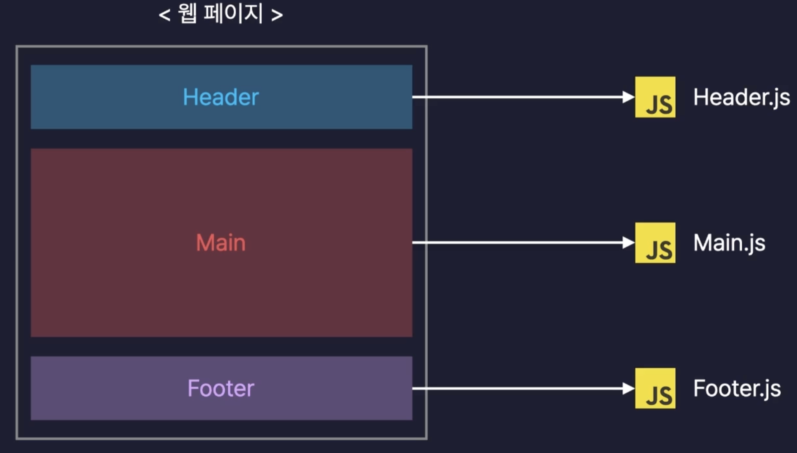{: style="display: block; margin-left: auto; margin-right: auto; width: 80%;" }

이런식으로 페이지의 요소들을 컴포넌트라는 단위로 모듈화 하여 개발하기 때문에 여러 페이지에서 공통으로 사용하는 요소를 만들 때 컴포넌트를 분리해서 만들고 여러 페이지에서 불러와서 사용하면 되는 것이다.

이게 왜 장점이냐면, 원래 다른 두 페이지를 만들 때 예를 들어 Header라는 요소는 겹치는 부분이 매우 많지만, 이걸 딱히 모듈화 할 방법이 없기 때문에, 각각 마크업 하여 중복되는 코드가 많아질 것이다.

이게 한 두페이지에는 상관이 없겠으나, 수많은 페이지가 존재하는 하나의 서비스에서 해당 부분에 수정이 발생하면 그 많은 부분들을 일일이 다 수정해야하는 말도 안되는 문제점이 생기게 된다.  
이걸 고려했을 때, 각 요소들은 컴포넌트로 모듈화 하여 레고 조립하듯이 페이지를 구성하는 것은 너무나도 큰 이점이다.

#### 화면 업데이트 구현이 쉽다

여기서 업데이트란, 사용자의 행동(클릭, 드래그, 스크롤, 호버 등등)에 따라 웹 페이지가 스스로 모습을 바꿔 상호작용하는 것을 의미한다.  
해당 업데이트를 구현하기 쉬운 이유는 React는 선언형 프로그래밍 방식으로 동작하기 때문이다.

여기서 선언형 프로그래밍이란, 과정을 생략하고 목적만 간결하게 명시하는 방법으로, 프로그램의 결과나 상태를 설명하지만 이를 어떻게 얻을지 세부적인 절차는 생각하지 않는다.

이와 상충되는 방식은 명령형 프로그래밍이 있다.  
목적을 이루기 위한 모든 일련의 과정을 설명하는 방식으로, 순차적인 명령을 통해 원하는 목표에 도달한다.

때문에 선언형 프로그래밍은 필연적으로 코드가 명시적이고 간결하여 이해하기 쉽게 될 것이다.

이게 가능한 이유는 React의 페이지는 컴포넌트들로 이루어져있고, 각 컴포넌트들은 자신의 상태를 나타내는 State라는 변수를 가진다.

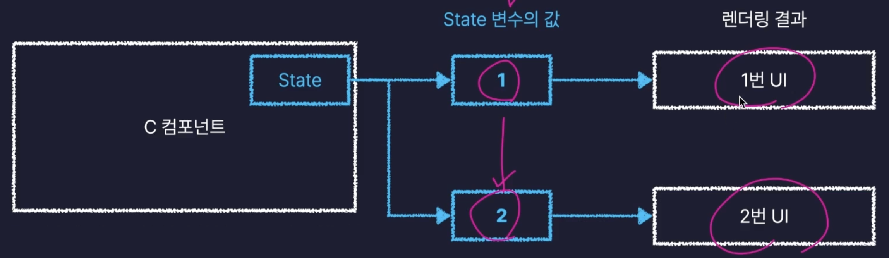{: style="display: block; margin-left: auto; margin-right: auto; width: 80%;" }

이렇게 각 컴포넌트의 state 변수에 값에 따라서 렌더링할 결과를 바꿀 수 있게 되는 것이다.

따라서 업데이트를 위한 복잡한 동작을 정의할 필요 없이, 특정 변수의 값을 바꾸는 것만으로 화면을 업데이트 시킬 수 있기에 쉽다는 것이다.

#### 화면 업데이트가 빠르다.

React는 화면 업데이트를 쉽게 구현할 수 있으면서, 동시에 빠르게도 처리할 수 있다.

이게 어떻게 가능할까???

이걸 이해하기 위해서는 브라우저의 동작에 대해 이해해야 한다.

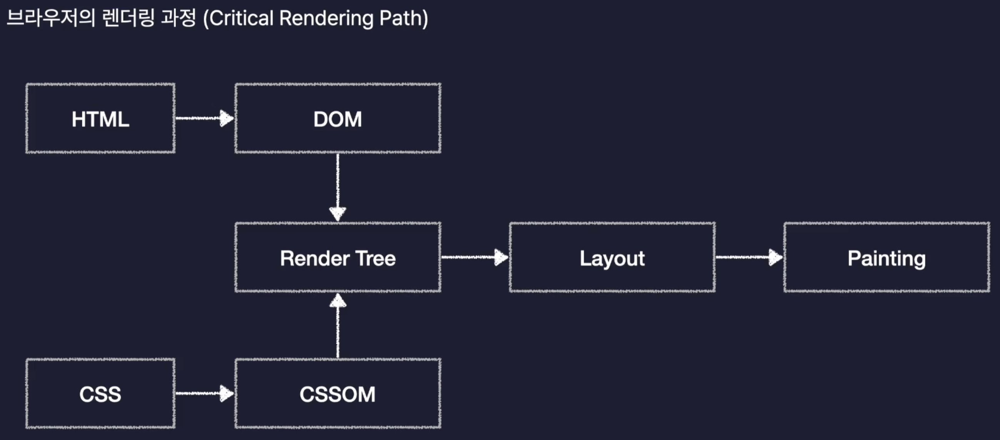{: style="display: block; margin-left: auto; margin-right: auto; width: 80%;" }

브라우저는 우리가 HTML과 CSS로 작성한 웹 페이지를 일련의 과정을 통해 렌더링 해주게 되는데 이 과정을 Critical Rendering Path라고 한다.

먼저 우리의 HTML과 CSS를 각각 DOM과, CSSOM으로 변환한다.

{: style="display: block; margin-left: auto; margin-right: auto; width: 80%;" }

DOM은 HTML을 브라우저가 이해하기 쉽게 변환한 것으로 트리구조의 오브젝트 모델로 변경했다 하여 Document Object Model이라고 부른다.

CSSOM 또한 마찬가지로 브라우저가 이해하기 쉬운 형태로 변환 것으로 CSS Object Model이라고 부른다.

다음 위에서 변환한 DOM과 CSSOM을 이용하여 Render Tree를 만들게 된다.  
이는 웹페이지의 설계도, 청사진의 역할을 하게 된다.

앞서 변환한 DOM에는 요소들의 위치, 배치, 모양에 대한 모든 정보가 담겨있을 것이고, CSSOMd에는 요소들의 스타일과 관련한 모든 정보가 들어있으니, 그 둘을 합친 Render Tree에는 화면에 렌더되어야 하는 요소들의 모든 정보가 들어있게 되는 것이다.

다음으로 Layout 작업을 통해, 웹 페이지라는 공간에 Render Tree 에 들은 요소들의 배치를 잡는 작업을 하게된다.

다음으로 Painting을 통해 실제로 화면에 요소를 그려내게 되는 것이다.

그럼 업데이트는 어떻게 발생하는 것일까??

JS가 DOM을 수정하게 되면 업데이트가 발생하여

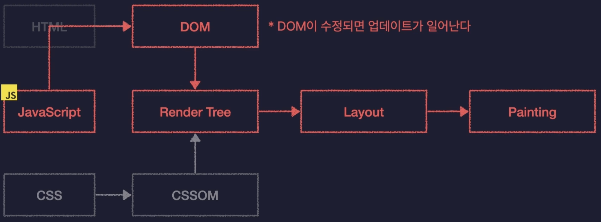{: style="display: block; margin-left: auto; margin-right: auto; width: 80%;" }

Critical Rendering Path의 과정을 다시 진행하게 되어, Render Tree를 다시 생성하고, Layout을 다시잡고 Painting을 다시하게 된다.

이 떄, Layout을 다시 잡는 것을 Reflow라고 하고, Painting을 다시 하는 것을 Repaint라고 한다.

이 두 과정은 오래 걸리는 과정이기 때문에, 자주 실행되면 성능 저하의 요인이 된다.

즉 DOM의 수정을 최소화 하는 방향으로 코드를 짜야 할 것이다.

{: style="display: block; margin-left: auto; margin-right: auto; width: 80%;" }

다양한 업데이트들이 매번 DOM을 수정하게 하는 것이 아닌, 모아서 수정을 해야 한다는 것이다.

하지만 이건 이상에 대한 얘기 이고, 실제 대규모 서비스에서는 이 과정이 매우 어려울 것이다.

그런데 React에서는 Virtual DOM을 통해서 우리가 이걸 신경쓰지 않아도 알아서 자동으로 해준다!!!!🥹🥹🥹🥹

Virtual DOM이란 간단하게 실제 DOM 객체를 복사해서 만든 객체라고 생각을 하면 쉽고, 이 가상 DOM에 동시에 발생한 update들을 반영을 해서 다 ~ 모든 다음에 실제 DOM에 수정을 하게 되니, 여러번의 수정이 있더라도 DOM은 한 번만 수정되는 것이 가능한 것이다.

### React의 사용!

React도 결국 JS의 라이브러리이기 때문에

- Node.js 패키지 생성
- React 라이브러리 설치
- 기타 도구 설치 및 설정

의 일련의 과정을 통해 사용할 수 있으나, 마지막 요소가 너무 복잡하고 까다롭다.

이걸 해결해 주기 위한 프론트엔드 개발 툴로 Vite라는게 존재한다.
기본 설정이 완료된 React App을 생성해 주는 역할이다.

이는 React 공식 문서에서도 권장되고 있으니 믿고 쓰자😃

```js
npm create vite@latest
```

를 통해서 최신 버전의 vite를 이용하여 React App을 만들며, 프로젝트 명, 프레임워크, 언어 선택 등이 가능하다.

```js
{
  "name": "section04",
  "private": true,
  "version": "0.0.0",
  "type": "module",
  "scripts": {
    "dev": "vite",
    "build": "vite build",
    "lint": "eslint .",
    "preview": "vite preview"
  },
  "dependencies": {
    "react": "^18.3.1",
    "react-dom": "^18.3.1"
  },
  "devDependencies": {
    "@eslint/js": "^9.11.1",
    "@types/react": "^18.3.10",
    "@types/react-dom": "^18.3.0",
    "@vitejs/plugin-react": "^4.3.2",
    "eslint": "^9.11.1",
    "eslint-plugin-react": "^7.37.0",
    "eslint-plugin-react-hooks": "^5.1.0-rc.0",
    "eslint-plugin-react-refresh": "^0.4.12",
    "globals": "^15.9.0",
    "vite": "^5.4.8"
  }
}
```

완료가 되면, 미리 설정된 React App이 만들어 짐을 알 수 있고, Node.js의 패키지 이기 때문에 package.json이 만들어진다.

살펴보면, module system으로는 ES module system을 사용하고 있고, dependencies안에 devDependencies는 개발 할 때만 사용할 라이브러리가 선언 된 곳으로 배포할 때 요 부분은 포함 되지 않는다.

근데 우리 프로젝트에는 node_modules와 package-lock.json이 없는 것을 볼 수 있는데 아직 설치가 안된 것이다!

이제 폴더 구조를 살펴보자

public 폴더는 이미지 파일이나, 폰트, 동영상 등 코드가 아닌 정적인 파일을 저장하는 폴더라고 보면 된다.

src 폴더는 우리가 작성할 코드를 보관하는 폴더이다.  
내부에도 assets라는 폴더가 있는데 여기도 이미지 등의 정적 파일을 보관한다.

eslinttrc.cjs 파일도 있는데, eslint라는 도구의 설정 파일로 개발자들 사이의 코드 스타일을 통일하는데 도움을 주는 도구이다.

index.html은 React App의 기본 틀 역할을 하는 파일이다.

이제 React App을 실행 시켜 볼 건데 scripts 속성의 값을 보면 dev, build, lint, preview가 있는데 dev가 바로 개발용으로 실행할 수 있는 방법이다. 따라서 npm run dev를 하면 되겠죠??

### React의 구동원리

#### 어떻게 실행중인 서버에 접속했을까?

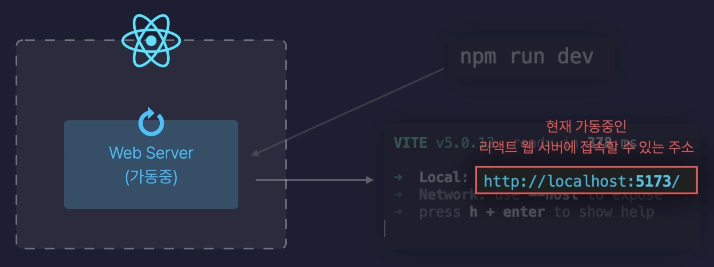{: style="display: block; margin-left: auto; margin-right: auto; width: 80%;" }

우리의 React App의 내부에는 Web Server가 있었고, npm run dev를 통해 이를 실행 시킬 수 있었으며, localhost:5173은 이 서버에 접속할 수 있는 주소였다.

해당 주소를 살펴보면, 먼저 localhost는 내 컴퓨터를 의미하며, 뒤의 숫자는 port nuber을 의미한다.  
이 포트번호는 해당 컴퓨터에 여러 서버가 돌아가고 있다면, localhost로만 주소를 보내면 어떤 서버로 접속해야 할 지 알 수가 없다.  
이걸 구분하기 위해서 모든 프로그램이 실행 될 때마다 자동으로 고유한 포트 번호를 붙여준다.

물론, 당연히 localhost는 자기 자신을 가리키는 주소이니, 컴퓨터 마다 다를 것이고, 다른 컴퓨터에서는 접속할 수 없겠죠?

#### 화면에 요소를 렌더하는 원리

처음 접속을 하면, React App은 index.html을 우리의 브라우저에게 보내주게 된다.

index.html을 보면 div 내부가 비어있음을 알 수 있는데 그럼 어떻게 우리 브라우저에 저 요소들이 보이는 걸까?

이건 script로 불러와지고 있는 main.jsx에 의해 동적으로 추가 된다.

```js
// main.jsx
import { StrictMode } from "react";
import { createRoot } from "react-dom/client";
import App from "./App.jsx";
import "./index.css";

createRoot(document.getElementById("root")).render(
  <StrictMode>
    <App />
  </StrictMode>
);
```

해당 파일을 살펴보면, createRoot를 통해 인자로 받은 HTML 요소를 React의 root로 만들어 주고 있다. 이 때 HTML 요소는 index.html의 root를 id로 가지는 div가 전달 되었음을 알 수 있다.

render()을 통해 App 컴포넌트를 렌더링 하고 있다.

```jsx
// App.jsx
import { useState } from "react";
import reactLogo from "./assets/react.svg";
import viteLogo from "/vite.svg";
import "./App.css";

function App() {
  const [count, setCount] = useState(0);

  return (
    <>
      <div>
        <a href="https://vitejs.dev" target="_blank">
          
        </a>
        <a href="https://react.dev" target="_blank">
          
        </a>
      </div>
      <h1>Vite + React</h1>
      <div className="card">
        <button onClick={() => setCount((count) => count + 1)}>
          count is {count}
        </button>
        <p>
          Edit <code>src/App.jsx</code> and save to test HMR
        </p>
      </div>
      <p className="read-the-docs">
        Click on the Vite and React logos to learn more
      </p>
    </>
  );
}

export default App;
```

해당 요소를 살펴보면, App() 이라는 함수가 HTML 태그들을 리턴하고 있는 걸 알 수 있는데, react에서는 HTML 태그를 리턴하는 함수를 컴포넌트라고 부르며, 이 함수는 App 컴포넌트라고 부를 수 있게 된다.

### 컴포넌트의 이름

첫글자를 꼭 대문자로 해야 한다!

특정 컴포넌트를 리턴문 안에 포함하는 컴포넌트를 부모 컴포넌트라고 하며, 특정 컴포넌트를 자식 컴포넌트라고 한다.

모든 컴포넌트는 화면에 렌더 되기 위해 App 컴포넌트를 최상위로 가지는 계층 구조를 가지게 되고, 때문에 이를 조상 컴포넌트라고 하며, 뿌리 역할이라 하여 Root 컴포넌트라고도 한다.

이 Root 컴포넌트는 main.jsx에서 render 되는 컴포넌트이기 때문에 물론 바꿀 수 있지만, 관례로 App.jsx를 사용한다.

### jsx 문법

위에서 HTML 요소를 리턴하는 JS 함수를 컴포넌트라고 말했었는데, 사실 JS에서는 그런 사용을 허용하지 않는다.  
JSX(JS Extensions)는 이런 문법을 허용해 주기 때문에 사용이 가능한 것이다.  
단순히 저 뿐만 아니라, 동적으로 변수의 값을 HTML로 렌더링 할 수도 있다.

#### 주의사항

- {} 내부에는 JS 표현식만 넣을 수 있다. 즉 스스로 값을 뱉는 아이를 의미한다.

- 숫자, 문자열, 배열 값만 렌더링이 가능하다.

- 모든 태그는 닫혀있어야 한다.

- 최상위 태그는 반드시 하나여야한다.  
  마땅한 태그가 없다면 <></> 빈 태그로만 감싸줘도 된다.

HTML 태그에 class를 줄 때 jsx는 js와 HTML을 함께 쓰고 있기 때문에 js의 예약어인 class를 사용할 수 없어서 className을 사용하며, camelCase를 사용함을 기억하자.

### Props란?

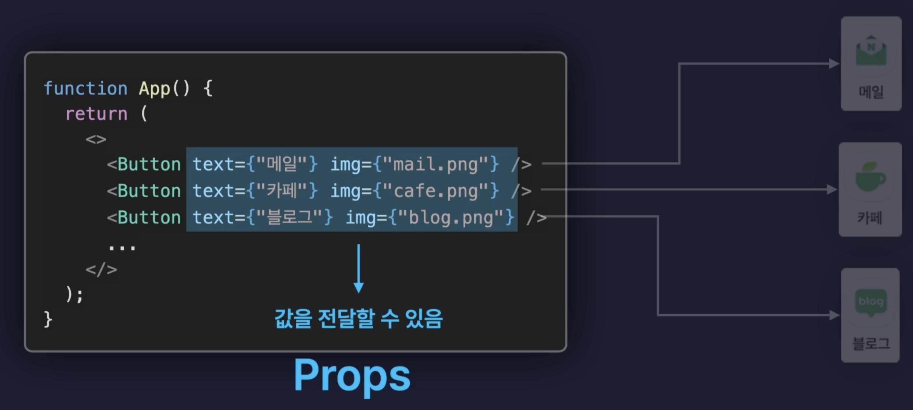{: style="display: block; margin-left: auto; margin-right: auto; width: 80%;" }

이런식으로 반복적인 요소를 컴포넌트로 분리하여 함수에 인자를 전달하듯 바뀌는 내용을 전달하여 다르게 표시할 수 있도록 하는 전달 값을 props라고 한다.

만약 버튼 중 하나의 요소에만 color 속성을 props로 전달해 주게 되면, 다른 버튼들은 해당 속성을 받지 못한 채로 참조하게 된다.

이 때 발생할 수 있는 치명적 에러를 방지하기 위해 ,

```jsx
Button.defaultProps = {
  color: "black"
};
```

이런식으로 받지 않았을 때의 기본값을 설정해줘서 방지가 가능하다.

또한 컴포넌트도 props로 전달할 수 있다.

```jsx
<Button>
  <Header />
</Button>
```

props는 부모에서 자식으로 전달만 가능하지, 자식에서 부모로 역류하는 것은 불가능하다.

### Event Handling

이벤트가 발생했을 때, 그것을 처리하는 것.  
즉 웹에서 발생하는 사용자의 행동을 처리해주는 것!

예를 들어 버튼을 클릭했을 때, 콘솔을 찍고싶다?

```jsx
...

<button onClick={() => {
    console.log('클릭!')
}}>클릭!</button>

...
```

이렇게 익명함수로 넣어주거나

```jsx
...

const onClickButtonHandler = () => {
    console.log('클릭!');
}

<button onClick={onClickButtonHandler}>클릭!<button>

...
```

이런식으로 전달할 수도 있다.

해당 함수를 이벤트 핸들러 라고 한다.

#### 이벤트 객체

리액트에서 발생하는 모든 이벤트는 이벤트 핸들러 함수에 매개변수로 이벤트 객체를 제공한다.

```jsx
...

const onClickButtonHandler = (e) => {
    console.log(e);
}

<button onClick={onClickButtonHandler}>클릭!<button>

...
```

이렇게 하면 콘솔에는 SyntheticBaseEvent 객체가 찍힌다.

이 합성 이벤트 객체란, 모든 브라우저의 이벤트 객체를 하나로 통일한 형태를 의미한다.

브라우저 별 스펙이 달라서 발생할 수 있는 Cross Browsing Issue를 해결하기 위해서 합성 이벤트 객체가 사용되는 것이다.

### State

컴포넌트의 현재 상태를 보관하는 변수

따라서 State의 값에 따라 렌더링 되는 UI가 결정된다.  
만약 State의 값이 변하게 되면, 변동을 감지하고 해당 컴포넌트를 새로 렌더링하여 변동이 반영될 수 있도록 한다.  
이를 리렌더링이라고 부른다.

React에서 기본적으로 제공하는 useState가 있는데, 이는 상태값, 상태값을 변화시킬 수 있는 함수로 구성되고, useState(초기값)으로 상태값은 초기화 된다.

여기서 state의 변동을 감지해 컴포넌트가 리렌더 된다는 말은 결국 컴포넌트 역할을 하고 있는 함수를 다시 호출하고 새롭게 반환된 값을 화면에 렌더링 한다는 의미이다.

근데 왜 그냥 js 변수하나 만들어서 안하고 state를 써요??  
당연히 변수는 바뀌겠지만, 컴포넌트가 리렌더 되지 않겠죠?

#### Props로 State 받기

자식 컴포넌트들은 부모로 부터 받는 props의 값이 바뀌게 되면 리렌더링이 된다!

따라서 이제 리액트의 컴포넌트가 리렌더링 되는 상황을 정리해 볼 수 있다.

- State가 변동되는 경우
- Props가 변동되는 경우
- 부모 컴포넌트가 리렌더링 되는 경우

3번의 경우 부모의 리렌더로 인해 쓸데없는 리렌더가 발생할 수 있고 이건 리소스 낭비이기 때문에, 두 개의 state가 서로 관련이 없다면 다른 컴포넌트로 분리해 주는 것이 이상적이다.

### useRef

#### useState와의 차이

- useRef
  - Reference 객체를 생성
  - 컴포넌트 내부의 변수로 활용가능
  - 어떤 경우에도 리렌더링을 유발하지 않음!
- useState
  - State를 생성
  - 컴포넌트 내부의 변수로 활용가능
  - 값이 변경되면 리렌더링함!

#### 역할

특정 DOM 요소에 접근하여 조작이 가능하다.

#### Ref의 사용

useRef를 통해 생성 후 콘솔을 찍어보면 매우 단순한, current 속성하나만을 갖는 객체가 찍힌다.  
우리는 이 current의 값을 특정 값으로 초기화 할 수도 있고, 사용도 객체를 사용하듯 ref.current 이런식으로 사용할 수 있다.

예를들면 특정 input이 몇 번 수정되었나를 추적하기 위해서 사용할 수도 있다.  
근데 그럼 위에 js 변수로 count를 두고 onChange에서 바꾸면 되지 않나? 라고 할 수 있지만, ref의 사용은 컴포넌트를 리렌더하지 않기때문에 상관없지? 라고 할 수 있는데, onChange 내부에서 state값의 변동이 생기게 되면, 컴포넌트가 리렌더 되면서 ref를 초기화 하는 로직도 다시 수행하게 된다.

그럼 변수를 컴포넌트 외부에서 선언하면 되잖아??  
물론 가능하다. 하지만 이럴경우 컴포넌트를 여러군데에서 사용하고 있을 경우 변수 값이 공유가 되는 문제가 생긴다.
이건 왜그럴까??

다른 컴포넌트에서 해당 컴포넌트를 사용할 때, 컴포넌트의 렌더링은 HTML 요소를 리턴하는 함수의 호출과 같기 때문에, 외부의 변수는 다시 렌더링 되지 않겠죠?

### React Hooks

클래스 컴포넌트에서만 사용하던 기능을 함수 컴포넌트에서도 사용할 수 있도록 해주는 것이다.

#### React Hooks의 등장 배경

2017년 이전에는 Class 컴포넌트를 사용하여, state, ref 등의 react의 모든 기능을 이용할 수 있었지만, Function 컴포넌트를 사용하면 UI 렌더링 만이 가능했었다.  
근데 Class 문법이 너무 복잡해서 함수형 컴포넌트를 사용하면서 저 기능들을 모두 사용할 수 있기를 바랬다.

때문에 개발자들은 이 필요에 대응하여 React Hooks를 등장시켜 클래스 컴포넌트의 기능을 낚아채(Hook) 함수형 컴포넌트에서도 사용이 가능하게 하였다.  
그러다 보니 자연스럽에 특수한 경우가 아니라면 클래스 컴포넌트는 사용하지 않고 함수형 컴포넌트를 hook과 함께 사용하게 되었다.

이제 꺠달았겠지만, 앞에서 사용하던 useState, useRef는 모두 React Hook이였으며, 훅의 이름은 use로 시작한다는 것을 알 수 있다.

이 외에도 useEffect, useReducer 등 대략 20 개 정도의 훅이 더 존재한다.

이 훅들은 함수형 컴포넌트, 커스텀 훅 내부에서만 호출이 가능하며, 조건문/반복문 내부에서는 호출이 불가하다는 특징이 있다.  
이는 조건문이나 반복문에서 훅을 호출하게 되면 서로다른 훅이 호출 순서가 엉망이 되어 오류의 원인이 될 수 있기 때문이다. 자세한건 뒤에서 알아 볼 것이다.

또한 중요한 기능 중 하나로, custom hook을 제작할 수 있다.

#### Custom Hook

특정 컴포넌트의 내부에 로직이 반복적으로 자꾸 사용된다고 해보자.  
매번 이걸 다 적고 있기엔 비효율적이고 코드 양만 늘어난다.  
이걸 어떻게 따로 좀 빼서 쓸 순 없을까?

그래서 이 로직을 따로 쏙 빼서 함수로 만들었더니, 리액트 컴포넌트가 아닌 일반적인 js 함수에서 이 로직에서 사용하고 있던 react hook을 호출하게 되니 사용 규칙에 어긋나게 된다.  
이럴때 함수의 이름에 use만 앞에 붙혀 주면 react는 아 커스텀 훅이구나? 하고 음음 좋아 라고 하게된다.

정리하자면, 컴포넌트마다 반복적으로 사용되는 로직이 있고, 이 로직이 react hook을 사용하고 있다면, 커스텀 훅을 만들어서 분리해 줄 수 있다.

물론 커스텀 훅은 여러 번 반복해서 사용가능하다.

또한 이런 커스텀 훅은 컴포넌트 내부에 같이 두는게 아니라, src/hooks/use어쩌구.jsx로 이렇게 따로 두는게 일반적이다.

#### 지금에서 보이는 개념

- state lifting  
  여러 컴포넌트에서 하나의 state를 관리하게 되면 해당 state는 그 컴포넌트들의 공통 부모에 선언되어야 한다.
- 단방향 데이터 흐름  
  부모에서 자식 방향으로 위에서 아래로만 데이터가 흐른다.

### React의 Lifecycle

탄생 ~ 죽음 까지의 과정

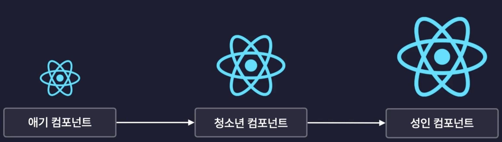{: style="display: block; margin-left: auto; margin-right: auto; width: 80%;" }

{: style="display: block; margin-left: auto; margin-right: auto; width: 80%;" }

당연히 이건 아닐 거고..

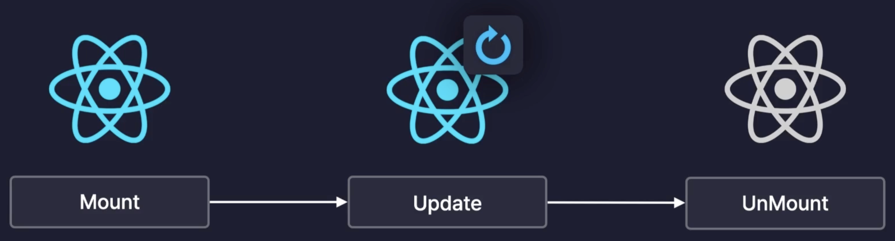{: style="display: block; margin-left: auto; margin-right: auto; width: 80%;" }

이렇게 3가지로 나뉘는 life cycle을 갖는다.

- Mount(탄생)
  - 컴포넌트가 처음 만들어지는 순간 = 화면에 처음 렌더링 되는 순간.
  - 컴포넌트가 마운트 되었다 = 컴포넌트가 화면에 처음 렌더링 되었다!
  - 서버에서 데이터를 불러오는 작업을 시킬 수도?
- Update(변화)
  - 컴포넌트가 다시 렌더링 되는 순간 = 리렌더링
  - 컴포넌트가 업데이트 되었다 = 컴포넌트가 리렌더링 되었다!
  - 어떤 값이 변경되었는지 콘솔에 출력 할 수도?
- UnMount(죽음)

  - 컴포넌트가 화면에서 사라지는 순간 = 렌더링에서 제외되는 순간
  - 컴포넌트가 언마운트 되었다 = 컴포넌트가 화면에서 사라졌다!
  - 컴포넌트가 사용하던 메모리를 정리 할 수도?

- 라이프 사이클 제어  
  이런식으로 라이플 사이클에 따라 다른 작업을 시키는 것.
  useEffect hook을 사용하면 손쉽게 구현 가능!

### useEffect

리액트 컴포넌트의 side effect를 제어하는 React Hook 이다.

이게 뭔소리고??? => side effect 즉 부작용은 리액트에서는 부수적인 효과, 파생되는 효과 등으로 A를 했더니 B가 "나야 B."하고 따라오는거라고 생각하면 될듯.

정리하면 컴포넌트의 동작에 따라 파생되는 효과를 의미.

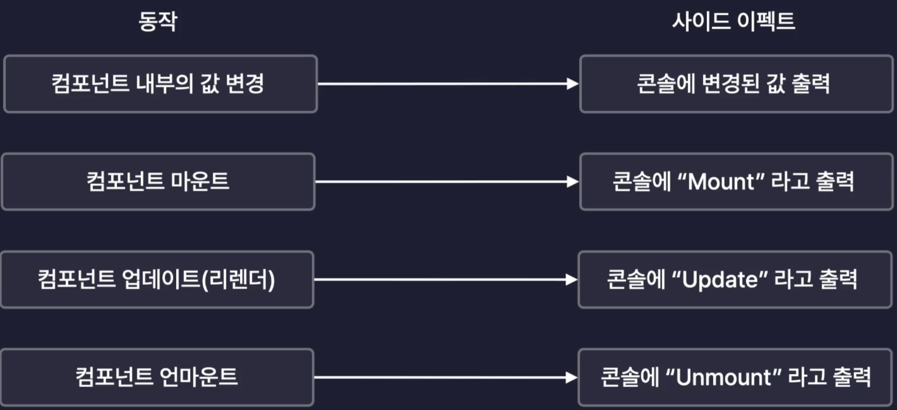{: style="display: block; margin-left: auto; margin-right: auto; width: 80%;" }

결국 라이프 사이클 제어 또한 사이드 이펙트 인 것이다.

useEffect를 통해서 컴포넌트의 특정 값이 변경되었을 때 특정 코드를 실행시키거나, 라이프 사이클 제어가 가능한 것이다.

#### useEffect의 사용

```jsx
useEffect(() => {}, []);
```

- dependancy array(deps)  
  배열 속 값이 변하게 되면, 사이드 이펙트로서 콜백 함수를 실행하게 된다.
  물론 값은 복수 추가 가능하다.

주의 할 점은 우리가 useState를 사용 할 때의 set~ 함수는 비동기로 작동하기 때문에 변경된 state를 바로 사용하여 사이드 이펙트에 해당하는 작업을 하고 싶다면, useEffect를 사용해야 한다.

- mount(탄생)  
  최초 마운트 시 1회  
  의존성 배열을 비워놓는다.

- update(변화, 리렌더링)  
  컴포넌트가 리렌더링 될 때마다.  
  의존성 배열을 생략한다.

  만약 처음 마운트 될 때는 제외하고 진짜 리렌더링 될때만 작동하고 싶다면, useRef를 이용해서 isMount를 false로 초기화 해주고, 처음에 조건문에서 false일 경우 isMount.current를 true로 바꿔주며 바로 return 시키는 로직을 추가하면 되겠죠?

- unmount(죽음)
  useEffect의 콜백함수안에서 return으로 함수를 반환하면 이 함수를 cleanup, 정리함수라고 한다.  
  useEffect가 끝날 때, 실행되므로, 의존성 배열을 빈 배열로 주면 , unmount될 때 return 함수를 실행하게 된다.  
  또한 의존성 배열에 있는 값이 변경되었을 때도 정리함수가 실행되고 콜백함수가 실행된다.

따라서 정리를 해보면, state가 새로 나타날 때 useEffect가 실행이 되고, cleanup 함수는 state가 사라질 때 실행이 된다.

### useReducer

컴포넌트 내부에 새로운 State를 생성하는 React Hook으로 모든 useState는 useReducer로 대체 가능하다.

중요한 점은 상태 관리 코드를 컴포넌트 외부로 분리할 수 있다는 점이다!

기존에는 컴포넌트 외부에서 내부의 state를 접근할 수 없다보니 상태관리 코드들이 해당 컴포넌트 안에 모두 존재해야 하고, UI를 렌더링 한다는 react 컴포넌트의 목적에서 벗어나 상태관리 코드들이 훨씬 길고 복잡해진다.  
따라서 가독성이 떨어지고 유지보수가 어려워진다.

useReducer를 사용하면 해당 로직을 컴포넌트 외부의 함수로 분리할 수 있게 되는 것이다.

```jsx
const [state, dispatch] = useReducer();
```

이렇게 사용하는 형태이며, dispatch같은 경우는 상태 변화가 있어야 한다는 사실을 알리는 함수이다.  
그럼 reducer가 상태변화를 실제로 처리하게 될 함수를 호출하게 된다.

따라서 reducer는 첫 번째 인자로 실제 상태변화를 처리할 함수, 두 번쨰 인자로 state의 초기값을 받는다.

button등의 이벤트 핸들러를 통해 dispatch를 호출하게 되는데 이때 인자로 보통 객체의 형태로 상태가 어떻게 변화하길 바라는지를 적는다.  
예를 들어 버튼 클릭 시마다 카운터가 증가하길 바라면,

```jsx
dispatch({
  type: "INCREASE",
  data: 1
});
```

이런 식이다.  
이 객체를 action 객체라고 부른다.

그럼 reducer는 요청을 처리하기 위해서 실제 상태를 변화시킬 함수에게 state, action을 전달하고 호출한다.

### 최적화

컴포넌트 내부의 불필요한 연산방지, 컴포넌트 내부의 필요한 함수 재생성 방지, 컴포넌트의 불필요한 리렌더링 방지 등이 있다.

#### useMemo

메모이제이션 기법을 기반으로 불 필요한 연산을 최적화 하는 리액트 훅이다.

> Memoization : 기억해두기, 메모해두기

반복적으로 수행되는 동일한 연산을 매번 새로하는게 아니라, 결과값을 저장해 놓았다가 사용하는 것.

인자로 콜백함수와 의존성 배열을 갖는다(useEffect 처럼) 다만, useMemo는 해당 콜백 함수가 return 하는 값을 반환해준다.

#### React.memo

컴포넌트를 인수로 받아, 최적화된 컴포넌트로 만들어 반환하는 내장함수. 반환된 컴포넌트는 props를 기준으로 메모이제이션 된다.  
따라서 부모가 리렌더링 되더라도, props가 바뀌지 않으면 리렌더링 되지 않는다.

근데 여기서 문제는 props로 객체 타입을 전달할 때, 보통 함수를 전달할때(함수도 객체다) 객체는 주소값을 기준으로 저장되고 비교되기 때문에  
props의 변동을 기준으로 리렌더링 여부를 결정하는 memo 입장에서는 부모 컴포넌트가 리렌더링 될 때마다 다시 생성된 같은 함수라도 매번 새로운 객체로 생각하게 된다(얕은 비교).

이걸 해결하기 위한 방법이 두 가지가 있는데

- useCallback
- Memo함수의 두 번째 인자로 콜백 함수를 전달하여 스스로 판단하는게 아니라 커스텀 하기.  
  콜백 함수에서 prevProps와 nextProps를 비교하여 true를 반환하면 리렌더링을 하지 않고, false를 반환하면 변했다는 것으로 리렌더링을 한다.

이렇게 컴포넌트를 받아와서 기능이 추가된 새로운 컴포넌트를 반환해주는 메서드를 고차 컴포넌트 라고 한다(Higher Order Component)

#### useCallback

불필요한 함수의 재생성을 방지하기

위의 memo 방식에서는 일일이 어떤 prop이 변동됬는지 안됬는지를 콜백 함수를 통해서 지정을 해주고 어쩌구 저쩌구 너무 귀찮다.  
이것 보단 애초에 함수들이 재생성되지 않도록 하는게 더 편하지 않을까??

```jsx
const func = useCallback(() => {}, []);
```

useCallback 또한 콜백 함수와 의존성 배열을 인자로 받고, 콜백함수를 그대로 생성해서 반환한다.

#### 최적화 시기

그렇다면 언제 최적화를 해야 할까?  
프로젝트의 막바지에 기능구현이 끝나고 최적화를 해야한다(기능 구현이 미완성일 때 최적화를 하면 기능을 수정하거나 추가하는 과정에서 최적화가 꼬일 수도 있잖아?).

또한 모든 것에 최적화를 하는 것이 아니라, 진짜 필요한 함수나 연산에 최적화를 하자.

### Context

컴포넌트 간의 데이터를 전달하는 또 다른 방법으로, 기존의 props가 가지고 있던 단점을 해결할 수 있다.

#### Props Drilling

props는 부모에서 잣기으로만 데이터를 전달할 수 있기 때문에, 부모에서 자식에서 자식에서 자식으로 보내고 타고타고타고 가야한다.

#### Context는 그럼 뭐가 다를까?

context는 데이터를 보관하는 객체로서 타고타고타고 데이터를 주는게 아니라, 부모에서 context에게 데이터를 저장하고, 필요한 하위 컴포넌트에서 가져다 쓰는 개념이다.

#### Context의 사용

Context는 데이터를 전달해 주는 역할이기 때문에 컴포넌트가 렌더 될때마다 다시 만들어질 필요가 없다.  
따라서 컴포넌트의 외부에(reducer처럼) 선언한다.

Context를 살펴보면, 내부에 다양한 속성이 있지만 그 중에서도 Provider 속성이 있다.  
이는 context가 공급할 데이터를 설정하거나, context의 데이터를 공급받을 컴포넌트를 설정하기 위해 사용하는데, 이는 사실 컴포넌트이다.

그래서 <000Context.Provider></000Context.Provider> 이렇게 감싸주게 되면 이 아래의 모든 컴포넌트는 context의 데이터를 공급받을 수 있고, 감싸준 provider 컴포넌트에 value 속성으로 전달할 데이터를 설정할 수 있다.

### Page Routing

페이지 라우팅이란, 경로에 따라 알맞은 페이지를 렌더링 하는 과정을 의미한다.  
더 자세하게는 사용자가 특정 페이지에 접속을 하고 싶어 브라우저를 통해 서버에게 특정 경로로 요청을 보내면, 서버는 해당 페이지를 브라우저에게 반환하고 브라우저는 반환된 페이지를 렌더링 하는 과정을 의미한다.

#### Page Routing의 원리

전통적인 웹 서비스들은 웹 서버가 사용자에게 제공해 주어야 하는 모든 페이지들의 html 파일을 가지고 있다.  
이 때 브라우저에서 특정 주소를 갖는 페이지를 요청하면 해당 페이지를 찾아서 브라우저에게 주게되고, 브라우저는 이를 렌더링 하게 된다.

이런 방식을 Multi Page Application(MPA)라고 하면, 애초에 서버가 여러개의 페이지를 가지고 있는 것으로 많은 곳에서 사용중이다.

또한 서버에서 이미 완성된 HTML파일을 가지고 있다가 브라우저에게 주어서 렌더링 하게 되는 것을 SSR(Sever Side Rendering)이라고 한다.

이 때 주의 할 점은 SSR과 MPA가 같은 뜻이 아니고, 웹 서버에서 미리 모든 HTML 파일을 가지고 있다가 주는 것을 MPA라고 하고, 그런 MPA 방식에서 브라우저가 특정 경로로 서버에 요청을 했을 때, 이미 완성된 페이지를 서버에서 브라우저로 전달해주어 렌더링 하는 방식을 SSR이라고 한다.

허나 이 방식은 쾌적하고 빠른 페이지 이동을 제공하기에 부적합(유저가 A페이지에 있다가 B페이지로 이동을 할 때, 서버로 새로운 페이지의 주소를 요청을 하고, 서버에서 해당 페이지를 찾거나 만들어서 반환을 해주는데, 그럼 기존에있던 페이지를 지우고 새로 받은 페이지를 렌더링하는 과정에서 깜빡이는 현상이 발생하는데 이는 유저 경험에 굉장히 부정적이다) 하기 때문에 React에서는 이를 사용하지 않는다.  
이렇게 MPA 방식은 기존의 페이지에서 겹치는 부분이 있더라도 다 지우고 새로 렌더링을 하기 때문에 비효율적이고 매끄럽지 않은 이동을 한다.

또한 모든 유저가 페이지를 이동할 때마다 서버에 새로운 페이지를 요청하기 때문에 동접자가 많을 경우 서버가 겪는 부하가 심하게 된다(접속 대기열, 터짐).

### SPA(Single Page Application)

React에서 채택한 방식으로 페이지 이동이 매끄럽고 다수의 사용자가 접속해도 크게 상관이 없다.

이름에서 유추할 수 있듯이 React의 웹서버는 페이지를 하나만 가지고있다. 거기다가 우리가 만든 컴포넌트들, 기타기능들을 가진 js파일도 가지고 있다.

여기에 사용자가 접속을 요청을 하면 요청에 관계없이 index.html 을 반환하게 된다.

그럼 index.html을 받았으니 브라우저는 아무것도 렌더링이 안된다. 여기에다가 후속으로 우리의 모든 컴포넌트 파일이나 기능이 작성된 JS파일을 하나로 묶어서(bundling) 만들어진 Bundle JS File을 브라우저에 전달해 주고,  
이런 Bundling은 우리가 React App 생성에 사용했던 Vite가 담당하게 된다.

브라우저는 이 Bundle file을 직접 실행하고, main.jsx가 브라우저에서 가장 먼저 실행이 되며, 여기있던 render메서드가 호출이 되며 App.jsx 컴포넌트를 렌더하게 된다.

그렇게 우리가 작성한 모든 컴포넌트들이 렌더가 되게 되고, 브라우저에서 직접 JS파일을 실행해서 렌더링하는 방식을 CSR이라고 한다.  
이 Bundle File은 우리가 작성한 모든 React 컴포넌트들이 하나의 File로 묶인 JS 파일이기 때문에 이를 React App이라고 부른다.

그래서 React의 웹 서버는 브라우저의 요청에 따라 Bundling 된 React App을 전달해 줄 뿐이다.

그럼 이게 MPA의 단점을 어떻게 해결했나?  
브라우저에서 새로운 링크로 이동하게 되면, 기존의 서버에게 요청하는 방식이 아닌, 아까 Bundling 되어 받았던 React App에서 필요한 컴포넌트들로 화면을 교체한다.

React App에는 모든 페이지와 컴포넌트들에 대한 정보가 들어있기 때문에 서버로 별도의 요청을 보내지 않고도 페이지를 구성할 수 있는 것이다.

따라서 React App은 페이지들이 모두 컴포넌트들로 구성이 되어있기 때문에, 페이지 이동이 발생하면, 변경이 필요한 컴포넌트만 교체한다.

### React-router-dom

가장 많이 쓰여지고 있는 라이브러리 중 하나이다.

사용을 할때는, main.jsx에서 BrowserRouter로 App.jsx를 부모 컴포넌트로서 감싸주어야 하고, 이는 브라우저의 현재 주소를 저장하고 감지하는 역할을 한다  
따라서 이렇게 감싸주게 되면 React App의 모든 컴포넌트들이 현재 브라우저의 주소를 가져와 쓸 수도 있고, 주소의 변화를 감지할 수 있게 된다.

#### 사용

```jsx
<Routes>
  <Route path="/" element={<Home />} />
  <Route path="/new" element={<New />} />
  <Route path="/diary" element={<Diary />} />
  <Route path="*" element={<Notfound />} />
</Routes>
```

이런식으로 구조를 짜게 되며, switch 문 처럼 위에서부터 아래로 해당하는 경로에 맞는 컴포넌트를 페이지로 보여주게 되고, 정의되지 않은 경로로 접속 했을 때는 와일드카드를 경로로 주어 에러 페이지를 보여주게 하면 된다.

주의할 점은 이렇게 Routes 하위로는 Route태그만 올 수 있으면, Routes 밖에 선언된 요소는 경로에 상관없이 모든 페이지에서 렌더된다.

#### Route간의 이동

- Link(react-router-dom의 컴포넌트)  
  HTML의 anchor 태그의 역할이다.  
  이때, a 태그를 사용했을 때는 서버에 요청을 보내서 페이지를 새로 렌더하기 때문에 이동할 때마다 화면이 깜빡이는 것을 확인할 수 있고, Link를 사용하면 컴포넌트만 바꿔끼는 방식으로 쾌적한 이동을 보여주는 것을 알 수 있다.  
  따라서 React App 내부에서 링크를 만들어 이동할 때는 Link를 사용할 수 있도록 하자.

- Button
  useNavigate를 사용한다. 이는 react-router-dom에서 지원하는 커스텀 훅으로, 페이지를 이동시키는 navigate 함수를 반환해준다.  
  해당 함수에 경로를 이벤트 핸들러로 인자로 전달해주어서 이동이 가능하다.

따라서 정리하자면, 링크가 필요할때는 link 컴포넌트를 이용하고, 이벤트 핸들러 안에서 특정 조건에 따라 이동시킬때는 useNavigate를 쓰면 된다!

#### 동적 경로(Dynamic Segments)

동적인 데이터를 포함하고 있는 경로로, ~/product/1, ~/product/2 이런식의 예시를 보면 딱 알겠죠?

- URL Parameter : /뒤에 아이템의 id를 명시하는 ~/product/1 같은 경로  
  아이템의 id 등 변경되지 않는 값을 주소로 명시하기 위해 사용.
- Query String : ?뒤에 변수명과 값을 명시하는 ~/search?q=검색어 같은 경로  
  검색어 등의 자주 변경되는 값을 주소로 명시하기 위해 사용.

#### 사용

```jsx
<Routes>
  <Route path="/" element={<Home />} />
  <Route path="/new" element={<New />} />
  <Route path="/diary/:id" element={<Diary />} />
  <Route path="*" element={<Notfound />} />
</Routes>
```

동적 경로를 쓰기 위해선 Route를 설정할 때 :뭔가 이런식으로 나 동적 경로 쓸거예요~ 라고 알려주어야 한다.

또한 대상 컴포넌트에서 (여기선 Diary)에서 useParams 을 가져와서, 현재 브라우저에 명시한 url param을 가져올 수 있게 해주는 커스텀 훅이다.
이때 params 객체를 콘솔을 찍어보게 되면, {id:000} 으로 찍힌다. 그럼 어떻게 써야할 지 알겠죠?

query string을 사용하는 경우에는, useSearchParams라는 커스텀 훅을 이용하며, useState를 사용하듯이

```jsx
const [params, setParams] = useSearchParams();
```

이렇게 써서 params.get('value') 이런식으로 가져오고 setParams함수를 통해 수정 가능하다는 것만 짚고 넘어가자.

### 프로젝트에서 이미지 저장

- public 폴더 하위  
  링크로 가져오게 된다.
- asset 폴더 하위  
  import 해서 사용하게 된다.

두 차이점은 vite에서 제공하는 이미 최적화를 후자만이 받게 된다.

이때의 이미지 최적화란, 빌드하고 배포를 해보면, public에서 가져온 이미지는 일반적인 주소로 가져오게 되고, assets에서 가져온 이미지는 data uri 포맷으로 가져오게 된다.

두 차이점은 전자는 새로고침할 때마다 이미지를 새로 불러오게 되고, 후자는 브라우저에 이미지가 문자열로 메모리에 캐싱이 되기 때문에 새로고침을 하더라도 다시 불러오지 않게 최적화가 된다.

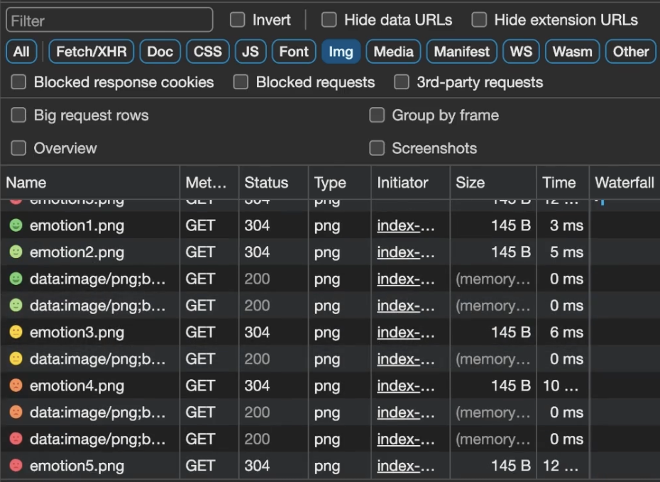{: style="display: block; margin-left: auto; margin-right: auto; width: 80%;" }

다르죠???

근데!!! 만약 불러와야 하는 이미지가 겁나게 많을경우 이걸 다 브라우저 메모리에 캐싱하면 안되겠죠???? 그럼 public 폴더에 저장해야겠다.

### web Storage

웹 브라우저에 기본적으로 내장되어있는 DB, 자바스크립트 내장함수 만으로 접근이 가능하다.

- Session storage  
  브라우저 탭 별로 데이터 보관
  탭이 종료되기 전까지 데이터 유지(새로고침해도 ㄱㅊ)
- Local storage  
  사이트 주소별로 데이터 보관
  사용자가 직접 삭제하기 전까지 보관

이런 웹 스토리지는 모든 값을 문자열로 저장을 하기 떄문에, 객체를 저장하려면, JSON.stringify를 사용해서 문자열화 해서 저장해야 한다.
사용할 때는 JSON.parse! 다만 로컬 스토리지에서 가져온 값이 존재하는 걸 확인하고 넣어줄 것!

### 실습 진행 중 알게 된 점

#### 호이스팅

JS를 공부할 때 함수 표현식은 함수가 할당된 변수 자체는 호이스팅 되어 undefined로 초기화 되지만, 함수 자체가 호이스팅이 되는게 아니기 때문에 선언부 보다 호출부가 먼저 올 수 없다고 했었는데

```jsx
import React, { useRef, useState } from "react";
import "./Editor.css";

const Editor = ({ onCreate }) => {
  const [input, setInput] = useState("");
  const contentRef = useRef();

  const onInput = (e) => {
    setInput(e.target.value);
  };

  const onKeydown = (e) => {
    if (e.keyCode === 13) {
      onSubmit();
    }
  };

  const onSubmit = () => {
    if (!input) {
      contentRef.current.focus();
      return;
    }

    onCreate(input);
    setInput("");
  };

  return (
    <div className="Editor">
      <input
        ref={contentRef}
        value={input}
        onKeyDown={onKeydown}
        onChange={onInput}
        type="text"
        placeholder="새로운 Todo..."
      />
      <button onClick={onSubmit}>추가</button>
    </div>
  );
};

export default Editor;
```

이렇게 코드를 작성했을 때, onKeyDown에서 onSubmit을 호출해도 왜 문제가 없지????? 라는 의문이 들었었는데,

두 가지를 간과했다.

먼저, onKeyDown이 먼저 선언되었다고 해서 먼저 호출되지는 않는다.

```jsx
onSubmit();
// const onKeydown = (e) => {
//     if (e.keyCode === 13) {
//         onSubmit();
//     }
// };

const onSubmit = () => {
  if (!input) {
    contentRef.current.focus();
    return;
  }

  onCreate(input);
  setInput("");
};
```

이렇게 수정해보니 터진다!

두 번째로는 해당 코드에서는 Editor이라는 컴포넌트 내부에서 두 함수가 선언 되었는데, JS코드는 실행되기 전에 스코프 내부의 변수와 함수선언을 먼저 처리하기 때문에,  
함수가 선언 된 순서는 실행 시점에서 중요하지 않다.  
즉 함수 호출 시점에는 컴포넌트 내부에 이미 선언된 상태이기 때문에 함수들이 컴포넌트 내에서 서로 참조가 가능하다.

#### useContext와 최적화

이전에 useCallback 과 memo를 통해서 해놓은 최적화 작업이 props가 아닌 useContext를 사용하니 풀렸다.

이건 이론적인 구조를 곰곰히 생각해보면 된다.

기존의 props를 통해서 데이터를 전달받던 방식에서 Context.Provider를 통해서 데이터를 받는 방식으로 변경 했다.  
그런데 Context.Provider도 엄연한 React 컴포넌트이며, 부모로 부터 value 속성으로 받고있는 객체가 바뀌게 되면, 즉 props가 바뀌게 되면  
당연히 리렌더링이 발생하게 된다.

```jsx
import "./App.css";
import Header from "./components/Header";
import Editor from "./components/Editor";
import List from "./components/List";
import {
  createContext,
  useCallback,
  useReducer,
  useRef,
  useState
} from "react";

const mockData = [
  {
    id: 0,
    isDone: false,
    content: "React 겅부하기",
    date: new Date().getTime()
  },
  {
    id: 1,
    isDone: false,
    content: "React 때려치워",
    date: new Date().getTime()
  },
  {
    id: 2,
    isDone: false,
    content: "React 다시할까",
    date: new Date().getTime()
  }
];

function reducer(state, action) {
  switch (action.type) {
    case "CREATE":
      return [...state, action.data];
    case "UPDATE":
      return state.map((item) =>
        item.id === action.data ? { ...item, isDone: !item.isDone } : item
      );
    case "DELETE":
      return state.filter((item) => item.id !== action.data);
    default:
      return state;
  }
}

export const TodoContext = createContext();

function App() {
  const [todos, dispatch] = useReducer(reducer, mockData);
  const idRef = useRef(3);

  const onCreate = useCallback((content) => {
    dispatch({
      type: "CREATE",
      data: {
        id: idRef.current++,
        isDone: false,
        content: content,
        date: new Date().getTime()
      }
    });
  }, []);

  const onUpdate = useCallback((targetId) => {
    dispatch({
      type: "UPDATE",
      data: targetId
    });
  }, []);

  const onDelete = useCallback((targetId) => {
    dispatch({
      type: "DELETE",
      data: targetId
    });
  }, []);

  return (
    <div className="App">
      <Header />
      <TodoContext.Provider value={{ todos, onCreate, onUpdate, onDelete }}>
        <Editor />
        <List />
      </TodoContext.Provider>
    </div>
  );
}

export default App;
```

위의 상황에서 본다면, 핸들러 함수들은 useCallback을 이용해서 메모이제이션이 되어있다.  
todos 객체는 변경사항이 생길 것이고, 새로운 객체가 될 것이며, 이에 value로 전달하던 객체또한 새로운 객체가 될 것이다.  
때문에 리렌더링이 발생할 것이고, 이제 자식컴포넌트인 Editor, List, TodoItem 또한 리렌더링 되는 것이다.

즉 useContext로 구독한 값이 변하게 되면(value 객체가 새로생김 등) useContext로 값을 가져오는 모든 컴포넌트는 props가 변한 것 처럼 리렌더링 된다.
Memo는 props의 변경에 대한 최적화만 제공하기 때문에 이를 막을 수 없다.

이건 Context를 두 가지로 나누어서 해결할 수 있다.

- 변경될 수 있는 값(State : todos) => StateContext
- 변경되지 않는 값(onCreate, onUpdate, onDelete 등) => dispatchContext

이러면 바뀌는 값만 리렌더링 되고, 아닌건 안되겠죠?

#### useNavigate

```jsx
import { useParams, useNavigate } from "react-router-dom";
import Header from "../components/Header";
import Button from "../components/Button";
import Editor from "../components/Editor";
import { useContext } from "react";
import { DiaryDispatchContext, DiaryStateContext } from "../App";

const Edit = () => {
  const params = useParams();
  const nav = useNavigate();
  const { onDelete } = useContext(DiaryDispatchContext);
  const data = useContext(DiaryStateContext);

  const getCurrentDiaryItem = () => {
    const currendDiaryItem = data.find(
      (item) => String(item.id) === String(params.id)
    );
    if (!currendDiaryItem) {
      window.alert("그딴 건 없다");
      nav("/", { replace: true });
    }
    return currendDiaryItem;
  };

  const onClickDelete = () => {
    if (window.confirm("일기를 정말 삭제할거임? 낙장불입임")) {
      onDelete(params.id);
      nav("/", { replace: true });
    }
  };

  const currentDiaryItem = getCurrentDiaryItem();

  return (
    <div>
      <Header
        title={"일기수정하기"}
        leftChild={<Button onClick={() => nav(-1)} text={"< 뒤로가기"} />}
        rightChild={
          <Button onClick={onClickDelete} text={"삭제하기"} type={"NEGATIVE"} />
        }
      />
      <Editor />
    </div>
  );
};

export default Edit;
```

해당 코드에서 현재 일기의 정보가 존재하지 않으면, 존재하지 않는 번호의 일기에 접근한다면 경고창을 띄우고 nav로 홈으로 이동시킨 뒤 뒤로가기를 막으려고 했다.  
그러나 동작하지 않았다. 콘솔에는 useEffect 안에서 nav를 사용하라고 되어있었는데 이유를 살펴보자.

현재 nav가 호출 되는 시점에는 컴포넌트가 화면에 아직 렌더되지 않은, 마운트 되지 않은 시점이다.  
이 시점에서는 navigate가 작동할 수 없다. 왜냐???

useNavigate는 BrowserRouter에서 제공하는 기능이다. 근데 이 컴포넌트가 렌더되지도 않았는데 쓰려고 하면 안되겠죠?  
그래서 너가 만약 처음 렌더될 때 호출하고 싶은거라면, useEffect를 통해서 마운트가 되고나서 실행을 시켜라~ 라는 경고창이였다.

### 상태관리 라이브러리

#### 상태란?

프론트 개발자의 입장에서 state란 페이지가 로드되거나 렌더링 된 이후 사용자가 수행한 모든 동작의 결과이다.

#### 상태 관리란?

사용자의 action => state의 변화 => View의 렌더 => 이걸보고 또 action의 순환을 관리하는 것이다.

#### 왜 쓸까?

context API 만으로도 props drilling 문제를 해결할 수 있지만, 이는 간단한 상태 공유의 경우이고 규모가 크거나 복잡한 서비스의 경우 여러개의 context를 사용하며 코드가 복잡해지고, 상태 업데이트에 따른 성능저하가 발생할 수 있다.  
또한 상위 컴포넌트에서 하위 컴포넌트로 전달될 때, 하위 컴포넌트가 모두 리렌더링 되는 문제를 수동으로 해결해 주어야 하는데, 상태관리 라이브러리들은 이를 위한 다양한 최적화 방법을 제공한다. 거기다 어플리케이션 규모가 커지더라도 체계적으로 상태를 관리할 수 있는 확장성 또한 유리하기 때문에, 사용하는 것이다.

- redux
- zustand

이번에 나만무 프로젝트를 진행하기 위해 고려했던 대표적인 react 상태관리 라이브러리 들인데, 각각의 특성에 대해 정리 해보았다.

먼저 Redux는 정말 강력하고, 유연한 상태관리 도구이지만 상태, 액션, 리듀서와 같은 개념에 대한 이해가 필요하고 러닝 커브가 높은 편이다.  
반면 zustand는 초기화, 상태 업데이트 , 구독의 작업이 간단하고 직관적이다.

또한 Redux는 상대적으로 큰 라이브러리이기 때문에 번들 크기가 크고, zustand는 redux에 비해 작고 경량화 된 라이브러리 이다.

Redux는 불변성의 유지가 중요하다. 이는 불필요한 객체 복사를 유발할 수 있으며, 상태 업데이트를 복잡하게 만든다.  
Zustand는 내부적으로 Immer와 함께 사용하여 불변성을 유지하여 개발자가 명시적으로 유지 할 필요가 없다.

전체적으로 보아 Redux가 부정적으로 보이게 쓰긴 했는데, 특성이 다른 것 이다.  
Redux는 대규모 어플리케이션에서 엄격한 규칙과 상태관리에 유리한 라이브러리이고, zustand는 적은 보일러 코드로 간단하고 가벼우며 소, 중규모의 어플리케이션에 유리한 것이다.

그리 볼륨이 거대하지 않는 서비스에 시간이 매우 촉박한 지금 상황을 미루어 보아 zustand가 알맞은 선택이라 생각하고 공부하였다.

#### Zustand

zustand는 리액트 훅을 이용하여 상태를 가져오고 업데이트 한다.  
그렇게 zustand에서 제공하는 useStore 훅을 이용하여 create에서 state 의 값을 설정할 수 잇는 set 함수를 받아서 사용한다.

이래서 컴포넌트에 종속적인 state가 아닌 전역에서 일관성있는 state를 가질 수 있음으로 scalable한 프로젝트를 유지할 수 있는 것이다.

또한 놀라운 것은 비동기에 있다.  
대표적으로 api로 부터 데이터를 받아올 때 다른 추가적인 middleware을 쓰지 않더라도 그냥 받아와서 데이터가 도착한 순간 set을 해주면 그냥 받아버린다. 너무 편하다.

거기다가 store 훅을 컴포넌트 외부에서도 사용할 수 있다.  
getState()를 통해서 다른 set함수를 거치지 않고 직접적으로 state를 변경할 수가 있다.

#### 신경써야 할 점

state를 가져오던 안의 함수를 가져오던 구체적으로 집어서 가져와야 한다.

```jsx
const { count } = useCounterStore((state) => state);
```

```jsx
const count = useCounterStore((state) => state.count);
```

두 선언문은 모두 같은 state를 가져오지만 매우 다른 성능을 가질 수 있다.  
전자는 컴포넌트가 모든 state를 볼 수 있게 하기 때문에 다른 그 어떤게 바뀌더라도 리렌더 하게 될 것이다.

또한 store은 기능별로 나눈다. 하나의 파일안에 모두 쓸 필요가 없다.  
이렇게 모듈화 하여 구체적으로 찾아서 사용할 수 있고, 이는 생산성 향상에 도움이 될 것이다.

### react query

리액트 쿼리는 서버에서 가져온 데이터를 클라이언트에서 사용하기 쉽게 도와준다.

만든 이유는 기존의 다른 상태관리 라이브러리들은 비동기 서버 state를 관리하는데 적합하지 않다며, 이에 특화된 라이브러리로서 등장했다고 한다.

서버는 클라이언트에게 DB의 정보를 전달해 주고 이를 api를 통해서 주게 된다.  
이때 가져오는 데이터는 서버의 state이며, state는 external state(서버 state) / internal state(클라이언트 state)로 생각할 수 있다.

클라이언트 state는 클라이언트에서 발생한 상태로 UI 상호작용이나 유저의 입력 같은 임시 데이터가 되겠다.  
이들은 일반적으로 동기적으로 처리하며 클라이언트에서 직접 처리한다. 위에서 살펴본 zustand redux등이 이를 관리하는데 유리한 라이브러리가 되겠다.

서버 state는 서버에서 가져오는 데이터로 서버와의 통신을 통해 처리하며 비동기 적으로 처리한다.
가져오고 수정하는데, 비동기 API가 필요하며, 소유권이 공유되기 때문에 다른 사용자가 변경할 수 있으며, 이에 out of date인 상태가 될 수 있다. 이를 관리하는데 도움을 주는 것이 바로 react query이다.

#### 장점

react query는 hook 기반의 로직으로 해당 훅을 사용하는 컴포넌트에서 상태 값의 변경을 간편하게 파악하여 리렌더링을 유발해준다.

실시간성이 중요한 서비스의 경우 polling을 통해 클라이언트가 주기적으로 데이터를 받아오거나, 웹소켓을 통해 서버의 상태값이 변경되었을 때 서버에게 통지받아야 하며, 한 곳에서 사용한 데이터를 다른 곳에서 재사용하기 위해서는 해당 데이터가 존재하는지 검사하고 있다면 재호출을 하지 않아야 하며, 데이터의 유효성을 검증할 수 있어야 한다.

이는 리엑트 쿼리가 stale-while-revalidate 캐싱 메커니즘을 사용하기 때문에 가능한 것이다.

캐싱 된 데이터를 사용자에게 제공하면서, 비동기적으로 콘텐츠를 서버에서 revalidate하여 빈틈없는 유저 경험을 가능하게 한다.

이걸 리엑트 쿼리가 다~ 해준다!!!!!!

- 몇 초 이후에는 데이터가 유효하지 않은 것으로 간주하고 데이터를 다시 불러온다.
- 데이터에 변경점이 있는 경우에만 리렌더링을 유발한다.
- 유저가 탭을 이동했다가 다시 오면 데이터를 다시 불러온다.
- 데이터를 다시 호출할 때 응답이 오기 전까지는 이전의 데이터를 보여주며, 필요에 따라 로딩바와 같은 유저 경험의 빈틈을 채우기 위한 loading state를 기본적으로 제공한다.

ajax를 쓸때는 하나하나 다 작성해 줘야 했던 것을 react query를 사용하면 딸-깍 이 되는 거니까..말이 안되는 편리함이다.

{: style="display: block; margin-left: auto; margin-right: auto; width: 80%;" }

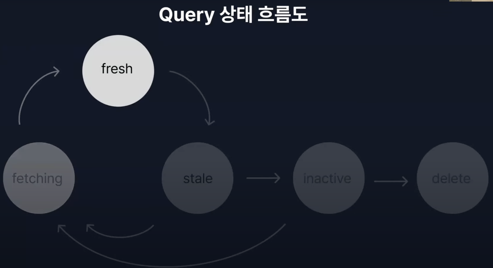{: style="display: block; margin-left: auto; margin-right: auto; width: 80%;" }

이렇게 상태 흐름도를 살펴보면, 데이터를 가져와서 응애 데이터가 시간이 지나 stale 데이터가 되고, 필요에 따라 다시 가져와서 회춘하게 된다. 허나 만약 사용되지 않는 데이터라면 inactive 상태가 되어 gc의 대상이 되고, 캐시에서 삭제되게 된다.

#### 사용법

- QueryClient  
  모든 쿼리에 대한 상태 및 캐시를 가지고 있는 클래스로, react query를 사용하기 위해 필수적이다.

  ```jsx
  const queryClient = new QueryClient();

  function App() {
    return (
      <QueryClientProvider client={queryClient}>
        <컴포넌트 />
      </QueryClientProvider>
    );
  }
  ```

  이렇게 사용하고자 하는 컴포넌트를 감싸주게 되면, 쿼리 클라이언트에 접근할 수 있게 된다.

  또한 쿼리 클라이언트에서는 전역 옵션을 설정 해 줄 수 있는데,

  ```jsx
  export const queryClient = new QueryClient({
    defaultOptions: {
      queries: {
        staleTime: 1000 * 60,
        retry: 1
      },
      mutations: {
        retry: 1
      }
    }
  });
  ```

  queries와 mutations는 리액트 쿼리에서 매우 중요한 개념이다.

- Queries  
  {: style="display: block; margin-left: auto; margin-right: auto; width: 80%;" }
  리액트 쿼리 공식문서에서 정의한 queries인데, 겁내 어렵지만 정리하면 비동기 데이터를 선언적으로 나 이거 필요함! 해놓으면 해당 시점에 react query가 알아서 고유한 키와 함께 처리를 한다. 때문에 개발자는 해당 데이터를 가져오는 복잡한 로직을 신경쓰지 않고 간편하게 사용할 수 있는 것이다.  
  한 줄 요약하면, 서버에서 데이터 가져올 때 쓰는거임!

  ```jsx
  import { useQuery } from "@tanstack/react-query";

  const query = useQuery({
    queryKey: ["어쩌구"],
    queryFn: fetch어쩌구
  });
  ```

  이 때 v5 부터는 인자를 객체 형태로 주어야 한다는 것만 주의하자.

  - queryKey : 캐시를 관리하기 위한 키값, 배열 형태로 사용한다. 내부적으로는 문자열로 변환하여 관리하며, 데이터와의 매핑을 관리한다.
  - queryFn : Promise를 반환하는 서버로 부터 데이터를 비동기적으로 가져오는 함수로 data를 resolve 하고 error을 던진다.

  queries의 반환 값으로는

  - data : 마지막으로 resolve 된 데이터
  - error : 에러 발생 시 반환 객체
  - isLoading : 처음으로 query를 실행할 때, 데이터를 처음 로드할 때(실행 된 적도 없고, 캐시도 없다.)
  - isFetching : 데이터를 백그라운드에서 다시가져오거나, 리페칭 할 때(캐시 존재하는데도 또 가져올 때).
    등이 있다.

- Mutations
  서버의 데이터를 수정할 때 사용하는 개념.

  ```jsx
  import { useMutation } from "@tanstack/react-query";

  const query = useMutation({
    queryFn: fetch어쩌구
  });
  ```

  - onMutate : mutate 함수가 실행되기 전에 실행되는 함수로, optimistic update에 유용하다.  
    즉 요청을 보내기 전에 UI나 상태를 먼저 업데이트하여 사용자에게 더 빠른 응답을 제공하는 것이다(종아요, 팔로우 등등)

  Mutations 반환 값으로는

  mutate를 반환한다. mutation 함수를 실행하는 함수이다.

- useSuspenseQuery  
  react의 suspense for data fetching API를 사용하기 위한 hook  
  데이터 타입을 보장할 수 있다. 로딩 상태를 suspense의 fallback으로 처리하고 에러는 error boundary로 처리한다.

#### 원리

그럼 이렇게 좋은 react query는 어떻게 데이터를 저장할까?

context를 사용한다!

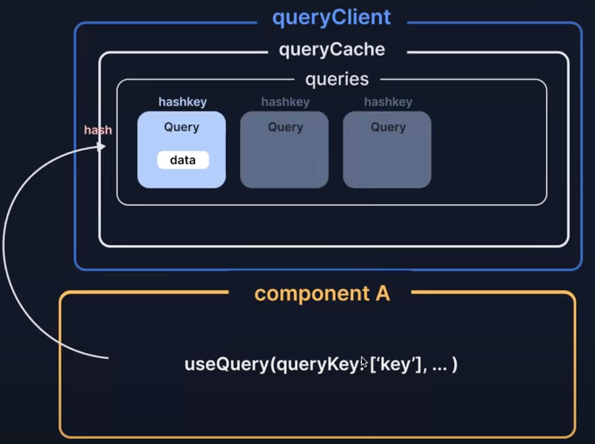{: style="display: block; margin-left: auto; margin-right: auto; width: 80%;" }

이렇게 useQuery가 실행되어 생성된 query 인스턴스에 key 값으로 매핑을 시키고, 이후에 fetch된 데이터를 query 객체 내부에 저장하고, context API를 이용했기 때문에 다른 컴포넌트에서도 사용할 수 있다.

#### 개발 순서

페이지 라우팅, 글로벌 레이아웃 설정, 공통 컴포넌트 구현, 개별 페이지 및 복잡한 기능 구현!

#### 배포해보기

- 페이지 타이틀
  React App은 SPA, html은 하나기 때문에 index.html의 title만 바꿔줘도 됨.
  만약 페이지 별로 title을 다르게 하고 싶다면 해당 컴포넌트에서 title 태그를 가져와서 내용을 바꿔주면 됨.
- open graph 설정
  사이트 링크를 공유했을 때 섬네일 설명 보이게 해주는 거

  ```html
  <meta property="og:title" content="감정일기장" />
  <meta property="og:description" content="나만의 작은 감정일기장" />
  <meta property="og:image" content="/thumbnail.png" />
  ```

```

요렇게 index.html에 끼윗 해주면 된다.

- 클라우드 서비스
  아주 쌈@뽕하게 잘 만들어놓은 서버의 일부분을 받아서 우리의 서비스를 배포할 수 있다. => vercel을 쓰세요~
```
