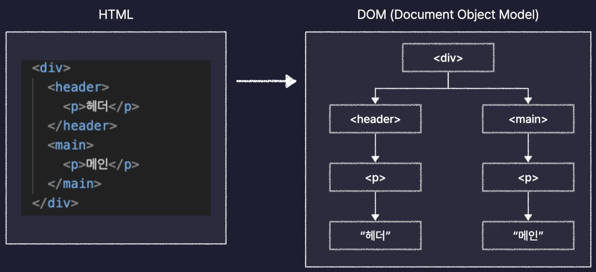

드디어 고대하던 React를 정리한다.

## React란?

Facebook(Meta)이 개발한 오픈소스 JS 라이브러리이며, 대규모 웹 서비스의 UI를 더 편하게 개발하기 위해서 만들어졌다.

### React는 왜 선택되었을까?

React를 현재 시장의 선두주자로 만든 기술적인 특징을 알아보자.

- 컴포넌트 기반의 UI
- 화면 업데이트 구현이 쉬움
- 화면 업데이트가 빠르게 처리됨

#### 컴포넌트 기반의 UI

컴포넌트란 구성요소라는 뜻으로, 화면을 구성하는 요소, UI를 구성하는 요소를 나타낸다.

{: style="display: block; margin-left: auto; margin-right: auto; width: 80%;" }

이런식으로 페이지의 요소들을 컴포넌트라는 단위로 모듈화 하여 개발하기 때문에 여러 페이지에서 공통으로 사용하는 요소를 만들 때 컴포넌트를 분리해서 만들고 여러 페이지에서 불러와서 사용하면 되는 것이다.

이게 왜 장점이냐면, 원래 다른 두 페이지를 만들 때 예를 들어 Header라는 요소는 겹치는 부분이 매우 많지만, 이걸 딱히 모듈화 할 방법이 없기 때문에, 각각 마크업 하여 중복되는 코드가 많아질 것이다.

이게 한 두페이지에는 상관이 없겠으나, 수많은 페이지가 존재하는 하나의 서비스에서 해당 부분에 수정이 발생하면 그 많은 부분들을 일일이 다 수정해야하는 말도 안되는 문제점이 생기게 된다.  
이걸 고려했을 때, 각 요소들은 컴포넌트로 모듈화 하여 레고 조립하듯이 페이지를 구성하는 것은 너무나도 큰 이점이다.

#### 화면 업데이트 구현이 쉽다

여기서 업데이트란, 사용자의 행동(클릭, 드래그, 스크롤, 호버 등등)에 따라 웹 페이지가 스스로 모습을 바꿔 상호작용하는 것을 의미한다.  
해당 업데이트를 구현하기 쉬운 이유는 React는 선언형 프로그래밍 방식으로 동작하기 때문이다.

여기서 선언형 프로그래밍이란, 과정을 생략하고 목적만 간결하게 명시하는 방법으로, 프로그램의 결과나 상태를 설명하지만 이를 어떻게 얻을지 세부적인 절차는 생각하지 않는다.

이와 상충되는 방식은 명령형 프로그래밍이 있다.  
목적을 이루기 위한 모든 일련의 과정을 설명하는 방식으로, 순차적인 명령을 통해 원하는 목표에 도달한다.

때문에 선언형 프로그래밍은 필연적으로 코드가 명시적이고 간결하여 이해하기 쉽게 될 것이다.

이게 가능한 이유는 React의 페이지는 컴포넌트들로 이루어져있고, 각 컴포넌트들은 자신의 상태를 나타내는 State라는 변수를 가진다.

{: style="display: block; margin-left: auto; margin-right: auto; width: 80%;" }

이렇게 각 컴포넌트의 state 변수에 값에 따라서 렌더링할 결과를 바꿀 수 있게 되는 것이다.

따라서 업데이트를 위한 복잡한 동작을 정의할 필요 없이, 특정 변수의 값을 바꾸는 것만으로 화면을 업데이트 시킬 수 있기에 쉽다는 것이다.

#### 화면 업데이트가 빠르다.

React는 화면 업데이트를 쉽게 구현할 수 있으면서, 동시에 빠르게도 처리할 수 있다.

이게 어떻게 가능할까???

이걸 이해하기 위해서는 브라우저의 동작에 대해 이해해야 한다.

{: style="display: block; margin-left: auto; margin-right: auto; width: 80%;" }

브라우저는 우리가 HTML과 CSS로 작성한 웹 페이지를 일련의 과정을 통해 렌더링 해주게 되는데 이 과정을 Critical Rendering Path라고 한다.

먼저 우리의 HTML과 CSS를 각각 DOM과, CSSOM으로 변환한다.

{: style="display: block; margin-left: auto; margin-right: auto; width: 80%;" }

DOM은 HTML을 브라우저가 이해하기 쉽게 변환한 것으로 트리구조의 오브젝트 모델로 변경했다 하여 Document Object Model이라고 부른다.

CSSOM 또한 마찬가지로 브라우저가 이해하기 쉬운 형태로 변환 것으로 CSS Object Model이라고 부른다.

다음 위에서 변환한 DOM과 CSSOM을 이용하여 Render Tree를 만들게 된다.  
이는 웹페이지의 설계도, 청사진의 역할을 하게 된다.

앞서 변환한 DOM에는 요소들의 위치, 배치, 모양에 대한 모든 정보가 담겨있을 것이고, CSSOMd에는 요소들의 스타일과 관련한 모든 정보가 들어있으니, 그 둘을 합친 Render Tree에는 화면에 렌더되어야 하는 요소들의 모든 정보가 들어있게 되는 것이다.

다음으로 Layout 작업을 통해, 웹 페이지라는 공간에 Render Tree 에 들은 요소들의 배치를 잡는 작업을 하게된다.

다음으로 Painting을 통해 실제로 화면에 요소를 그려내게 되는 것이다.

그럼 업데이트는 어떻게 발생하는 것일까??

JS가 DOM을 수정하게 되면 업데이트가 발생하여

{: style="display: block; margin-left: auto; margin-right: auto; width: 80%;" }

Critical Rendering Path의 과정을 다시 진행하게 되어, Render Tree를 다시 생성하고, Layout을 다시잡고 Painting을 다시하게 된다.

이 떄, Layout을 다시 잡는 것을 Reflow라고 하고, Painting을 다시 하는 것을 Repaint라고 한다.

이 두 과정은 오래 걸리는 과정이기 때문에, 자주 실행되면 성능 저하의 요인이 된다.

즉 DOM의 수정을 최소화 하는 방향으로 코드를 짜야 할 것이다.

{: style="display: block; margin-left: auto; margin-right: auto; width: 80%;" }

다양한 업데이트들이 매번 DOM을 수정하게 하는 것이 아닌, 모아서 수정을 해야 한다는 것이다.

하지만 이건 이상에 대한 얘기 이고, 실제 대규모 서비스에서는 이 과정이 매우 어려울 것이다.

그런데 React에서는 Virtual DOM을 통해서 우리가 이걸 신경쓰지 않아도 알아서 자동으로 해준다!!!!🥹🥹🥹🥹

Virtual DOM이란 간단하게 실제 DOM 객체를 복사해서 만든 객체라고 생각을 하면 쉽고, 이 가상 DOM에 동시에 발생한 update들을 반영을 해서 다 ~ 모든 다음에 실제 DOM에 수정을 하게 되니, 여러번의 수정이 있더라도 DOM은 한 번만 수정되는 것이 가능한 것이다.

### React의 사용!

React도 결국 JS의 라이브러리이기 때문에

- Node.js 패키지 생성
- React 라이브러리 설치
- 기타 도구 설치 및 설정

의 일련의 과정을 통해 사용할 수 있으나, 마지막 요소가 너무 복잡하고 까다롭다.

이걸 해결해 주기 위한 프론트엔드 개발 툴로 Vite라는게 존재한다.
기본 설정이 완료된 React App을 생성해 주는 역할이다.

이는 React 공식 문서에서도 권장되고 있으니 믿고 쓰자😃

```js
npm create vite@latest
```

를 통해서 최신 버전의 vite를 이용하여 React App을 만들며, 프로젝트 명, 프레임워크, 언어 선택 등이 가능하다.

```js
{
  "name": "section04",
  "private": true,
  "version": "0.0.0",
  "type": "module",
  "scripts": {
    "dev": "vite",
    "build": "vite build",
    "lint": "eslint .",
    "preview": "vite preview"
  },
  "dependencies": {
    "react": "^18.3.1",
    "react-dom": "^18.3.1"
  },
  "devDependencies": {
    "@eslint/js": "^9.11.1",
    "@types/react": "^18.3.10",
    "@types/react-dom": "^18.3.0",
    "@vitejs/plugin-react": "^4.3.2",
    "eslint": "^9.11.1",
    "eslint-plugin-react": "^7.37.0",
    "eslint-plugin-react-hooks": "^5.1.0-rc.0",
    "eslint-plugin-react-refresh": "^0.4.12",
    "globals": "^15.9.0",
    "vite": "^5.4.8"
  }
}
```

완료가 되면, 미리 설정된 React App이 만들어 짐을 알 수 있고, Node.js의 패키지 이기 때문에 package.json이 만들어진다.

살펴보면, module system으로는 ES module system을 사용하고 있고, dependencies안에 devDependencies는 개발 할 때만 사용할 라이브러리가 선언 된 곳으로 배포할 때 요 부분은 포함 되지 않는다.

근데 우리 프로젝트에는 node_modules와 package-lock.json이 없는 것을 볼 수 있는데 아직 설치가 안된 것이다!

이제 폴더 구조를 살펴보자

public 폴더는 이미지 파일이나, 폰트, 동영상 등 코드가 아닌 정적인 파일을 저장하는 폴더라고 보면 된다.

src 폴더는 우리가 작성할 코드를 보관하는 폴더이다.  
내부에도 assets라는 폴더가 있는데 여기도 이미지 등의 정적 파일을 보관한다.

eslinttrc.cjs 파일도 있는데, eslint라는 도구의 설정 파일로 개발자들 사이의 코드 스타일을 통일하는데 도움을 주는 도구이다.

index.html은 React App의 기본 틀 역할을 하는 파일이다.

이제 React App을 실행 시켜 볼 건데 scripts 속성의 값을 보면 dev, build, lint, preview가 있는데 dev가 바로 개발용으로 실행할 수 있는 방법이다. 따라서 npm run dev를 하면 되겠죠??

### React의 구동원리

#### 어떻게 실행중인 서버에 접속했을까?

{: style="display: block; margin-left: auto; margin-right: auto; width: 80%;" }

우리의 React App의 내부에는 Web Server가 있었고, npm run dev를 통해 이를 실행 시킬 수 있었으며, localhost:5173은 이 서버에 접속할 수 있는 주소였다.

해당 주소를 살펴보면, 먼저 localhost는 내 컴퓨터를 의미하며, 뒤의 숫자는 port nuber을 의미한다.  
이 포트번호는 해당 컴퓨터에 여러 서버가 돌아가고 있다면, localhost로만 주소를 보내면 어떤 서버로 접속해야 할 지 알 수가 없다.  
이걸 구분하기 위해서 모든 프로그램이 실행 될 때마다 자동으로 고유한 포트 번호를 붙여준다.

물론, 당연히 localhost는 자기 자신을 가리키는 주소이니, 컴퓨터 마다 다를 것이고, 다른 컴퓨터에서는 접속할 수 없겠죠?

#### 화면에 요소를 렌더하는 원리

처음 접속을 하면, React App은 index.html을 우리의 브라우저에게 보내주게 된다.

index.html을 보면 div 내부가 비어있음을 알 수 있는데 그럼 어떻게 우리 브라우저에 저 요소들이 보이는 걸까?

이건 script로 불러와지고 있는 main.jsx에 의해 동적으로 추가 된다.

```js
// main.jsx
import { StrictMode } from "react";
import { createRoot } from "react-dom/client";
import App from "./App.jsx";
import "./index.css";

createRoot(document.getElementById("root")).render(
  <StrictMode>
    <App />
  </StrictMode>
);
```

해당 파일을 살펴보면, createRoot를 통해 인자로 받은 HTML 요소를 React의 root로 만들어 주고 있다. 이 때 HTML 요소는 index.html의 root를 id로 가지는 div가 전달 되었음을 알 수 있다.

render()을 통해 App 컴포넌트를 렌더링 하고 있다.

```jsx
// App.jsx
import { useState } from "react";
import reactLogo from "./assets/react.svg";
import viteLogo from "/vite.svg";
import "./App.css";

function App() {
  const [count, setCount] = useState(0);

  return (
    <>
      <div>
        <a href="https://vitejs.dev" target="_blank">
          
        </a>
        <a href="https://react.dev" target="_blank">
          
        </a>
      </div>
      <h1>Vite + React</h1>
      <div className="card">
        <button onClick={() => setCount((count) => count + 1)}>
          count is {count}
        </button>
        <p>
          Edit <code>src/App.jsx</code> and save to test HMR
        </p>
      </div>
      <p className="read-the-docs">
        Click on the Vite and React logos to learn more
      </p>
    </>
  );
}

export default App;
```

해당 요소를 살펴보면, App() 이라는 함수가 HTML 태그들을 리턴하고 있는 걸 알 수 있는데, react에서는 HTML 태그를 리턴하는 함수를 컴포넌트라고 부르며, 이 함수는 App 컴포넌트라고 부를 수 있게 된다.
