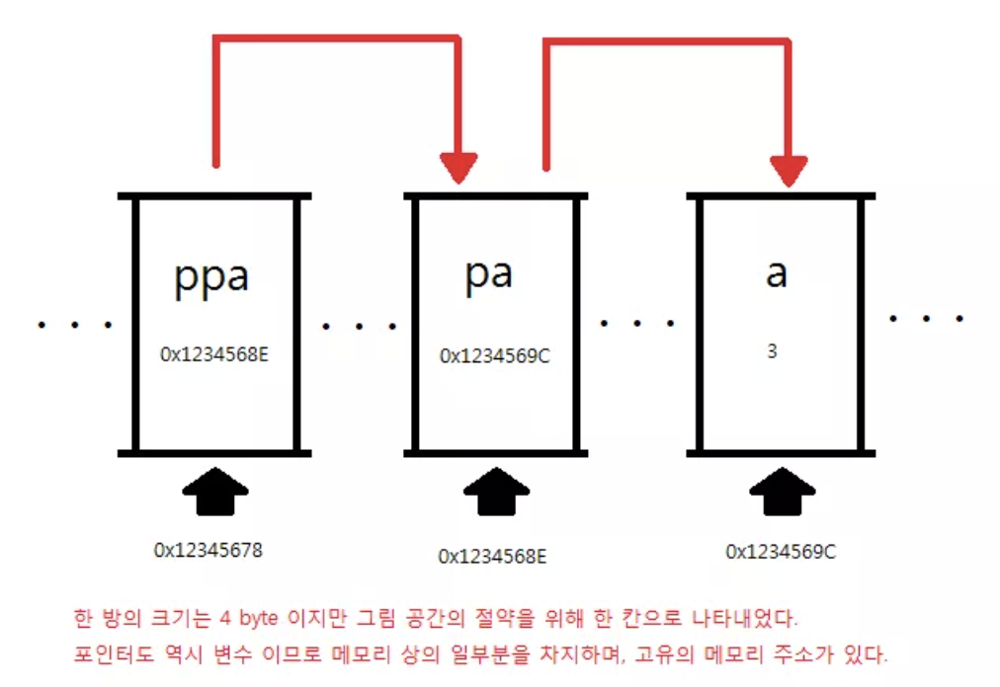
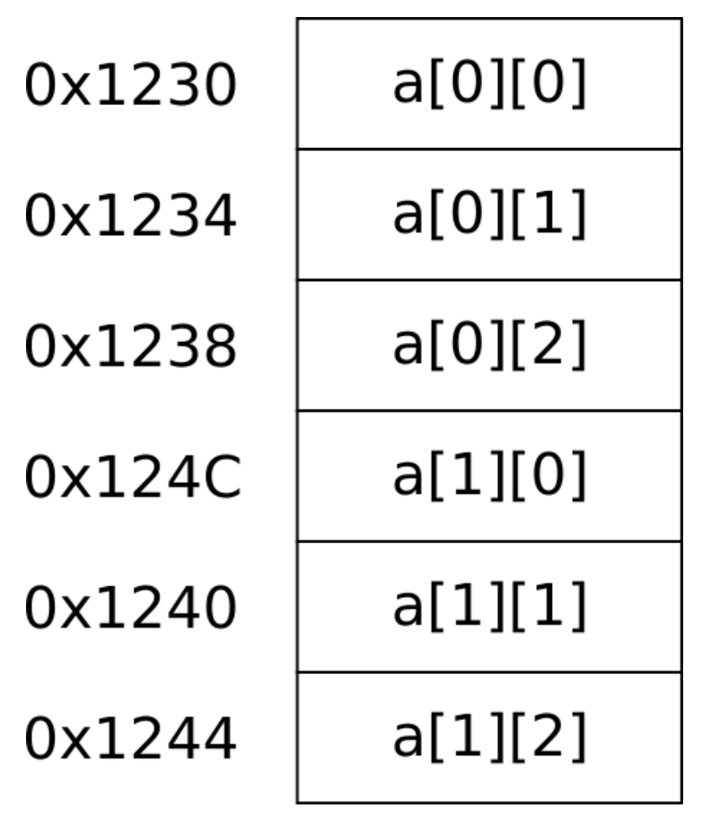
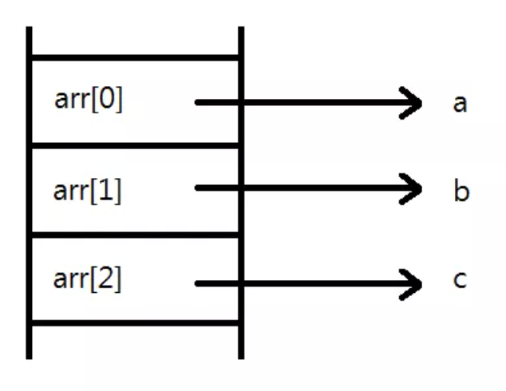
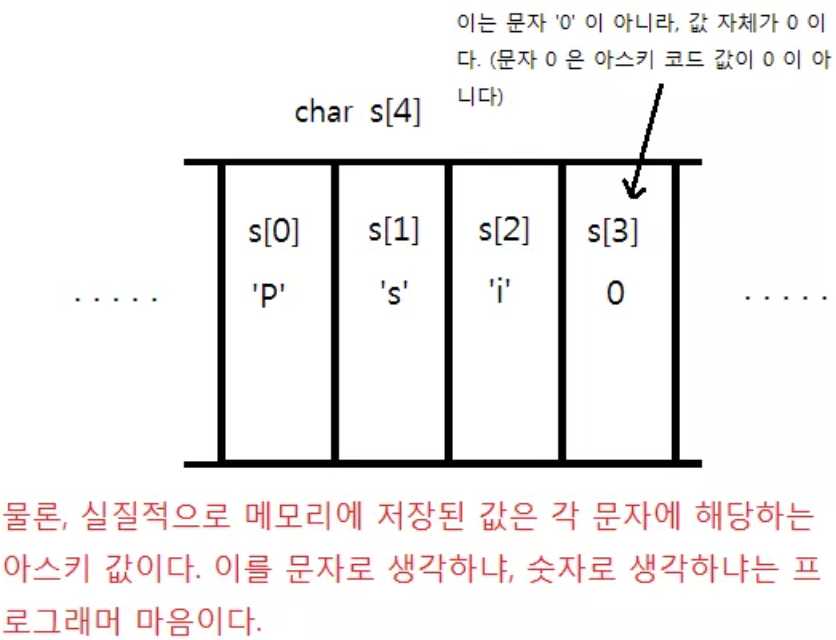
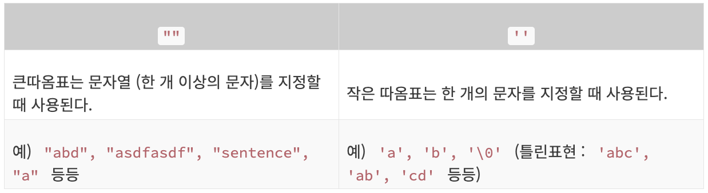
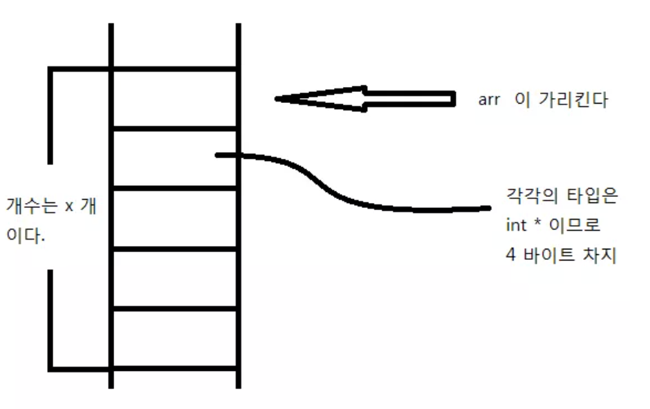
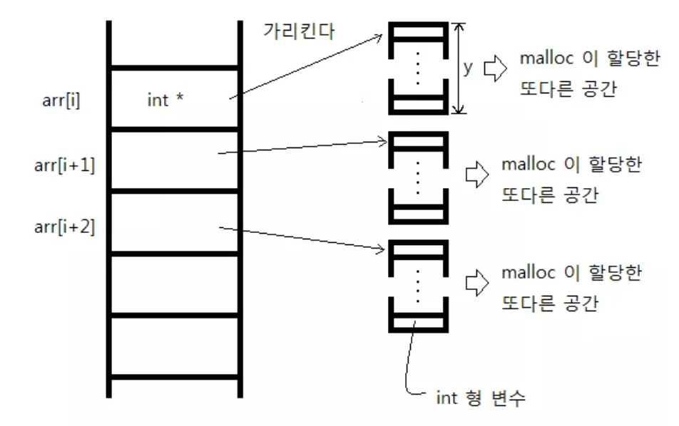
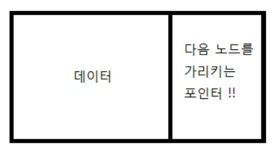

오늘은 어제에 이어서 c의 포인터에 대해 공부해 보았다.

#### 포인터의 포인터(더블 포인터)

더블포인터는 말 그대로 포인터를 가리키는 포인터이다.

```c
int **p;
```

이런 형태로 선언 한다.

```c
#include <stdio.h>

int main()
{
    int a;
    int *pa;
    int **ppa;

    pa = &a;
    ppa = &pa;

    a = 3;

    printf("a: %d // *pa : %d // **ppa : %d \n", a, *pa, **ppa);
    printf("&a : %p // pa : %p // *ppa : %p \n", &a, pa, *ppa);
    printf("&pa : %p // ppa : %p \n", &pa, ppa);

    return 0;
}

```

위 코드를 통해서 pa가 가리키는 값과 ppa에 역참조를 두번해서 가리키는 값이 같은 걸 확인할 수 있고, \*ppa는 pa와 함께 a의 주소값을 가지고, ppa는 pa의 주소값을 가지는 걸 눈으로 확인 할 수 있다.

<p align="center">
</p>

```c
#include <stdio.h>

int main()
{
    int arr[3] = {1, 2, 3};
    int(*parr)[3] = &arr;

    printf("arr[1] : %d \n", arr[1]);
    printf("parr[1] : %d \n", (*parr)[1]);
}
```

이때 &참조 연산자가 있기 때문에 arr의 타입변환은 일어나지 않고, 포인터가 크기가 3인 배열을 가리켜야 하는 것이다.

```c
int (*parr)[3] = &arr;
```

이 라인에서 저 문장을 수행하는 것이다. 이 때 꼭 괄호로 감싸주어야지 그냥 쓰게 된다면 int \* 원소 세개를 가지는 배열이 되어 버릴 것이다.

#### 2차원 배열

1차원 배열이 여러개 있다고 생각을 하면 되지만 주의 할 점은 컴퓨터의 메모리 구조는 1차원이기 때문에 2차원배열이던, 다차원 배열이던 모두 연속적으로 메모리에 존재한다.

<p align="center">
</p>

또한 arr[0]은 arr[0][0]의 주소값을 가지고, arr[1]은 arr[1][0]의 주소값을 가진다.  
이를 통해 1차원 배열에서의 arr과 마찬가지로, sizeof나 &를 만나는게 아니라면 암묵적으로 각 배열의 첫번째 원소를 가리키는 포인터로 타입 변환이 된다는 걸 알 수 있다.

앞서서 int arr[10] 이라는 배열이 있으면 arr[x]의 주소값은 arr + 4x라는 것을 배웠다. 그렇다면 2차원 배열에서는 어떻게 될까?  
int arr[a][b] 일 때 arr[x][y]의 주소값은 arr + 4bx + 4y가 된다.

그렇기 때문에 arr[x][y]의 주소값을 알기 위해선 x, y, b의 값을 알아야 한다는 걸 알 수 있다.  
2차원 배열을 가리키는 포인터를 통해서 원소에 접근을 하기 위해서는 원소의 크기, b의 값 두가지가 필요한 것이다.

```c
#include <stdio.h>
int main() {
  int arr[2][3] = {{1, 2, 3, 4, 5, 6}};
  int(*parr)[3];  // 괄호를 꼭 붙이세요

  parr = arr;  // parr 이 arr 을 가리키게 한다.

  printf("parr[1][2] : %d , arr[1][2] : %d \n", parr[1][2], arr[1][2]);

  return 0;
}
```

위에서 보면

```c
/* (배열의 형) */ (*/* (포인터 이름) */)[/* 2 차원 배열의 열 개수 */];
// 예를 들어서
int (*parr)[3];
```

아까 언급했던 필요한 요소들을 넣어 둔 것이다.  
따라서 parr은 int 형 이차원 배열을 가리키는데, 그 배열의 한 행의 길이가 3이라는 것을 알 수 있다.

근데 잘 보면 아까 앞에서 했던 길이가 3인 배열을 가리키는 포인터라는 걸 알 수 있다.

이 때 2차원 배열에서 arr은 배열의 첫번째 원소 즉 첫 번째 행을 가리키기 때문에 길이가 3인 배열이다.

허나

```c
#include <stdio.h>
int main() {
  int arr[2][3] = {{1, 2, 3}}, {{4, 5, 6}};
  //  배포때문에 {} 더 넣은거    |   |   빼고 생각
  int **parr;

  parr = arr;

  printf("parr[1][1] : %d \n", parr[1][1]);  // 버그!

  return 0;
}
```

이렇게 하게 된다면, parr[1][1]은 \*(\*(parr + 1) + 1))과 같은 문장이고, parr + 1에서 parr 은 int*을 가리키는 포인터이고 +1을 하게 되면 실제주소 + 8과 같게 된다. 따라서 \*(parr + 1)은 3이 될 것이고, *(parr + 1) + 1을 하게 되면 int만큼 4가 증가 하기 때문에, 7번째 있는 값을 읽으라는 것이 되어서 오류가 발생한다.

## 포인터 배열

```c
#include <stdio.h>
int main() {
  int *arr[3];
  int a = 1, b = 2, c = 3;
  arr[0] = &a;
  arr[1] = &b;
  arr[2] = &c;

  printf("a : %d, *arr[0] : %d \n", a, *arr[0]);
  printf("b : %d, *arr[1] : %d \n", b, *arr[1]);
  printf("b : %d, *arr[2] : %d \n", c, *arr[2]);

  printf("&a : %p, arr[0] : %p \n", &a, arr[0]);
  return 0;
}
```

int arr[3]이 int형 원소를 3개 가지는 배열이였듯이, int\* 각각의 원소들이 int를 가리키는 포인터로 취급된다는 것이다.

<p align="center">
</p>

## 문자열

기본적으로 컴퓨터는 문자열을 char 배열에 쭈르륵 나열 된 채로 저장한다.

<p align="center">
</p>

근데 여기서 좀 귀찮아지는 점은 컴퓨터한테 문자열의 길이를 알려주어야 한다는 점이다.

#### Null 종료 문자

<p align="center">
</p>

그렇기 때문에 문자열의 끝에 여기까지가 문자열이야. 를 알려주는 종료문자를 넣었다.  
이 종료문자는 아스키 값이 0이고, '\0'으로도 쓴다(문자 '0'과는 절대적으로 다르다). 이를 가리켜 Null이라고 한다.

이 종료문자가 들어갈 공간이 있어야 하기 때문에 3글자라고 하더라도 배열은 4칸이 필요하게 된다.

#### 참고

```c
char sentence_4[4] = {"Psi"};
```

이렇게 쓰면 알아서 각 문자를 따옴표로 표시해서 묶어준다. 이 때, Null문자는 자동으로 추가되기 때문에 따로 넣어주지 않아도 된다.

하지만 배열의 크기는 꼭 Null을 고려해서 4로 해야한다.

출력 할 때는

```c
%c // 한 문자만을 출력
%s // Null이 나올때까지 문자를 출력
```

<p align="center">
</p>

또한 따옴표도 상황에 따라 용도가 다르니 표를 참고하는 것이 좋다.

#### 문자열의 입력

```c
#include <stdio.h>
int main() {
  char words[30];

  printf("30 자 이내의 문자열을 입력해주세요! : ");
  scanf("%s", words);

  printf("문자열 : %s \n", words);

  return 0;
}
```

위에서의 배열은 29글자 까지 저장할 수 있는 배열이다(Null 1개).

여기서 words앞에 &를 쓰지 않았는데 왜냐하면 words자체가 배열을 가리키는 포인터로 암묵적 타입변환이 되기 때문이다.

또한 주의해야 할 점은

```c
#include <stdio.h>
int main()
{
    int num;
    char c;

    printf("숫자를 입력하세요 : ");
    scanf("%d", &num);

    printf("문자를 입력하세요 : ");
    scanf("%c", &c);
    return 0;
}
```

우리가 입력값을 입력하면 그 값은 버퍼에 한번에 모았다가 뽑아쓰게 된다. 그런데, 1을 입력하고 엔터를 치면 \n까지 버퍼에 입력이 되게 된다.  
그럼 다음 문자 입력을 받는 부분은 \n을 먹고 바로 종료가 된 것이다.

허나 %s를 사용한다면 공백을 무시하고 실질적인 데이터가나오게 된다면 그 다음에 등장하는 공백문자에서 종료를 하기 때문에 개행을 무시하고 입력 받을 수 있다.

꼭 %c를 이용해야한다면 중간에 getchar()(한 문자를 얻어와서 리턴하는 함수)를 이용해서 버퍼를 비우고 사용할 수도 있지만 이왕이면 문자가아닌 문자열로 입력을 받는게 이상적이다.

#### 리터럴

```c
char str[] = "sentence";
char *pstr = "sentence";
```

위 코드를 보면 pstr에는 분명 char형 변수의 주소값이 들어가야 한다.  
이 때 저 문자열은 특정한 주소값(시작 주소값)을 나타낸다. 그렇기 때문에 에러가 발생하지 않고, %s를 통해 pstr을 출력해보면 sentence라는 문자열이 잘 출력 됨을 확인할 수 있다.

이제 "sentence"의 정체에 대해 알아보겠다

```c
#include <stdio.h>
int main() {
  char str[] = "hello";
  char *pstr = "goodbye";

  str[1] = 'a';
  pstr[1] = 'a';

  return 0;
}
```

이 코드는 pstr[1] = 'a'에서 오류가 발생하게 된다. 그렇다는 것은 pstr의 값을 변경하려 하였을 때 문제가 발생했다는 뜻이 된다.

리터럴이란 고정된 값을 가지는 것을 의미한다. c언어에서는 "" 큰따옴표로 묶인 것들을 문자열 리터럴이라고 부른다.  
컴퓨터는 이 리터럴들을 메모리 상의 특별한 곳에 따로 모아서 보관을 한다. 따라서 코드에서는 goodbye의 시작주소 좀 가져와서 pstr에 넣어라 가 가능한 것이다.

이 리터럴들이 저장되는 곳은 오직 읽기만 가능한 곳이다. 그렇기 때문에 우리가 ""를 사용해서 저장, 출력을 하면 기대한 결과가 나올 것을 보장 받을 수 있는 것이다.

따라서 아까 pstr[1] = 'a' 에서 읽기가 아닌 쓰기를 시도했을 때 감히!! 하고 에러가 발생한 것이다.

하지만 char str[] = "hello";의 경우에는 리터럴이라고 부르기가 애매하다 왜냐하면 컴파일러에서는 char str[] = {'h', 'e', 'l', 'l', 'o', '\0'}; 이렇게 해석이 되기 때문이다. 이 str안의 문자열들은 수정이 가능하게 된다.

#### 문자열 다루기

문자열의 덧셈은 불가능하다. 그 이유는

```c
char str1[] = {"abc"};
char str2[] = {"def"};
str1 = str1 + str2;
```

배열은 곧 포인터이기 때문에 str1, str2는 각 배열의 주소값을 나타낸다. 그렇기 때문에 대입연산이 불가능하다.

```c
if (str1 == str2)
```

이런식으로 비교를 하는 것 또한 의미가 없고,

```c
if (str1 == "abc")
```

이런식의 비교도 의미가 없어진다.

```c
str1 = str2;
```

int형 변수와 다르게 이렇게 복사조차 불가능 하기 때문에 사용하기가 정말 불편하다.

이를 함수를 이용해서 그래도 자유롭게 다룰 수가 있다.

#### 문자열을 복사하는 함수

함수를 만들기 전에는 3가지를 고려해야 한다.

1. 이 함수는 무슨 작업을 하는가.

2. 함수의 리턴형이 무엇이면 좋을까.

3. 함수의 인자로는 무엇을 받아야 하는가.

이 경우 우리는 a라는 문자열의 내용을 b로 복사하는 함수를 만들고 싶다.

복사가 성공적이라면 1을 리턴하도록 하고싶다. 즉 int 형의 함수를 만들겠다.

두 개의 문자열을 받아야 하므로 포인터를 사용해야 하고, char 형 배열이기 때문에 char\*를 인자로 2개 가지느 함수가 되겠다.

이제 만들어본다면

```c
int copy_str(char *dest, char *src) {
  while (*src) {
    *dest = *src;
    src++;  // 그 다음 문자를 가리킨다.
    dest++;
  }
  *dest = '\0';

  return 1;
}
```

while 문에서 *src를 통해서 null을 만날때 까지 순회를 한다. 이는 문자열을 다룰 때 자주 쓰는 방법이다.  
이후 복사를 진행하고 null을 만났을 때 종료를 했기 때문에 미처 null을 넣지 못해서 *dest에 null을 추가해준다.

```c
char str[100];
str = "abcdefg";
```

이렇게 하게 되면 str이라는 배열의 이름은 상수이기 때문에, 배열의 주소값이기 때문에 바꿀 수가 없어 에러가 발생한다.

```c
char str[100] = "abcdefg";
```

이렇게 사용했을 때는 오직 배열을 정의할 때만 사용이 가능하고, 예상한대로 작동하게 된다.

#### 문자열을 합치는 함수

```c
  /*
  while 문을 지나고 나면 dest 는 dest 문자열의 NULL 문자를 가리키고 있게 된다.
  이제 src 의 문자열들을 dest 의 NULL 문자 있는 곳 부터 복사해넣는다.
  */
  while (*src) {
    *dest = *src;
    src++;
    dest++;
  }

  /* 마지막으로 dest 에 NULL 추가 (왜냐하면 src 에서 NULL 이 추가 되지
   * 않았으므로) */
  *dest = '\0';

  return 1;
}
```

#### 문자열을 비교하는 함수

```c
int compare(char *str1, char *str2) {
  while (*str1) {
    if (*str1 != *str2) {
      return 0;
    }

    str1++;
    str2++;
  }

  if (*str2 == '\0') return 1;

  return 0;
}
```

## 구조체(struct)

#### 구조체란?

지금까지 배웠던 배열에 다른 자료형의 정보를 저장하려면 각 자료형 마다 배열을 선언을 해주어야 했다.  
C에서는 한 배열안에 원소의 타입은 모두 동일해야하기 때문에 한 배열안에 여러 타입의 원소를 저장할 수가 없다.  
이걸 해결해 주는 것이 구조체(Struct)이다.

```c
#include <stdio.h>
struct Human {
  int age;    /* 나이 */
  int height; /* 키 */
  int weight; /* 몸무게 */
};            /* ; 붙이는 것 주의하세요 */
int main() {
  struct Human Psi;

  Psi.age = 99;
  Psi.height = 185;
  Psi.weight = 80;

  printf("Psi 에 대한 정보 \n");
  printf("나이   : %d \n", Psi.age);
  printf("키     : %d \n", Psi.height);
  printf("몸무게 : %d \n", Psi.weight);
  return 0;
}
```

구조체는 위에서 말했듯이 각 원소의 타입이 제각각인 배열이다.  
그렇기 때문에 모든 원소의 타입이 뭔지 일일히 정해 주어야 한다.

```c
struct Human {
  int age;
  int height;
  int weight;
};
```

구조체에서는 원소보단 멤버 라는 표현을 쓴다.  
여기선 3개의 멤버가 있는데 각 멤버의 타입을 명시한 것이다.

```c
struct Human Psi;
```

여기서 보면 변수를 정의 할 때 int a;라고 하는 것 처럼 Psi의 타입은 struct Human(Human 구조체)이다.

```c
Psi.age = 99;
Psi.height = 185;
Psi.weight = 80;
```

배열에서 arr[1]로 원소에 접근하듯이 구조체는 .을 이용하여 각 멤버에 접근한다.

주의 할 점은 구조체를 정의 할 때는 변수를 초기화 할 수 없다는 점이다.

#### 구조체 포인터

```c
#include <stdio.h>
struct test {
  int a, b;
};
int main() {
  struct test st;
  struct test *ptr;

  ptr = &st;

  (*ptr).a = 1;
  (*ptr).b = 2;

  printf("st 의 a 멤버 : %d \n", st.a);
  printf("st 의 b 멤버 : %d \n", st.b);

  return 0;
}
```

여태까지 포인터를 사용할 때 타입을 int*, char*등으로 사용했듯이, struct test도 하나의 타입이기 때문에  
포인터를 사용할 때는 struct test \*ptr이라고 사용한다.

이 때 포인터에 주소를 저장할 때 &를 사용하는 것을 볼 수 있다. 앞서 배열에서는 배열의 이름 자체가 주소였기 때문에 사용하지 않았지만, 구조체 변수의 이름은 다르다.

이 때 연산자의 우선순위가 \* 보다 . 이 더 높기 때문에 ()를 해주지 않으면 에러가 발생한다.

허나 매번 괄호로 감싸주는 것은 귀찮기 때문에

```c
#include <stdio.h>
struct test {
  int a, b;
};
int main() {
  struct test st;
  struct test *ptr;
  ptr = &st;
  ptr->a = 1;
  ptr->b = 2;
  printf("st 의 a 멤버 : %d \n", st.a);
  printf("st 의 b 멤버 : %d \n", st.b);
  return 0;
}
```

-> 라는 새로운 기호를 만들었다.

#### 구조체의 대입

구조체도 보통의 변수들과 같이 = 을 사용할 수 있다.

```c
#include <stdio.h>
struct TEST {
  int i;
  char c;
};
int main() {
  struct TEST st, st2;

  st.i = 1;
  st.c = 'c';

  st2 = st;

  printf("st2.i : %d \n", st2.i);
  printf("st2.c : %c \n", st2.c);

  return 0;
}
```

#### 구조체를 인자로 전달하기

```c
#include <stdio.h>
struct TEST
{
    int age;
    int gender;
};
int set_human(struct TEST *a, int age, int gender);
int main()
{
    struct TEST human;
    set_human(&human, 10, 1);
    printf("AGE : %d // Gender : %d ", human.age, human.gender);
    return 0;
}
int set_human(struct TEST *a, int age, int gender)
{
    a->age = age;
    a->gender = gender;
    return 0;
}
```

여기서 주의 해야 할 점은 구조체 변수 human의 멤버들을 초기화 하기 위해 set_human 함수를 사용할 때, 인자로 human 변수의 주소를 전달 해 주어야 실제 구조체 안의 멤버의 값에 접근할 수 있다는 것이다.

## 동적할당

#### malloc(memory allocation)

동적으로 메모리를 할당하는 방법으로, 원하는 배열의 크기를 입력받아 정할 수 있는 방법이다.

```c
#include <stdio.h>
#include <stdlib.h>

int main(int argc, char **argv)
{
    int SizeOfArray;
    int *arr;

    printf("만들고 싶은 배열의 원소의 수 : ");
    scanf("%d", &SizeOfArray);

    arr = (int *)malloc(sizeof(int) * SizeOfArray);

    free(arr);

    return 0;
}
```

malloc은 stdlib.h에 정의 되어있다.

이 malloc이라는 함수는 인자로 전달된 크기의 바이트 수만큼 메모리 공간을 만든다.

코드에서 처럼 원소의 개수가 SizeOfArray 인 int 형 배열을 만들기 위해서는 (int의 크기) \* (SizeOfArray) 의 크기를 할당 해야 한다. 이때 타입의 크기를 정확히 알기 위해서 sizeof를 사용하였다.

이 함수의 리턴값은 자신이 할당한 메모리의 시작 주소를 리턴한다.

리턴형이 void * 형이기 때문에 이를 int *형으로 형변환 하여 arr에 넣어준다.

> void \*형 : 어떤 타입의 데이터든 가리킬 수 있는 타입.

그리고 arr은 malloc이 할당해준 메모리를 사용할 수 있게 된다.

저렇게 사용하게 되면 arr이 배열의 첫 번째 원소의 메모리 주소(시작 주소)를 가지게 되는 것과 마찬가지로 malloc이 만든 공간의 시작 주소를 가지게 된다고 생각 하면 좋을 것 같다.

이렇게 malloc이 할당해준 공간을 쓰고나서 반환하는 것을 free()라고 한다. 만약 돌려주지 않는다면 할당된 공간은 계속 남아서 결국에 메모리 누수를 야기하게 될 것이다.

그렇다면 malloc은 대체 메모리의 어느 곳에 공간을 할당하는 것일까??

앞서 등장했던 stack, 데이타 영역, Read Only Data 부분은 malloc 함수가 절대로 건드릴 수 없는 영역이다.

하지만 힙(heap)의 경우는 사용자가 자유롭게 할당하거나 해제할 수 있는 부분이다.

고로 우리가 만든 arr은 힙에 위치하고 있다.

#### 이차원 배열의 동적할당

- 포인터 배열을 사용한 2차원 배열 흉내내기
- 실제로 2차원 배열의 크기의 메모리를 할당하고 2차원 배열 포인터로 참조하는 방법.

2차원 배열을 동적할당하는 방법은 위의 두가지가 있다.

#### 포인터 배열의 활용

포인터 배열은 각 원소들이 포인터인 배열이다. 고로 각 원소는 다른 일차원 배열을 가리킬 수 있다.

따라서 포인터 배열을 동적으로 할당 한 뒤, 다시 포인터 배열의 원소들이 가리키는 일차원 배열을 동적으로 할당해 주면 2차원 배열과 같은 효과를 낼 수 있다.

```c
#include <stdio.h>
#include <stdlib.h>

int main()
{
    int i;
    int x, y;
    int **arr;

    printf("arr[x][y] 를 만들 것입니다. \n");
    scanf("%d %d", &x, &y);

    arr = (int **)malloc(sizeof(int *) * x);

    for (i = 0; i < x; i++)
    {
        arr[i] = (int *)malloc(sizeof(int) * y);
    }

    printf("생성 완료 \n");

    for (i = 0; i < x; i++)
    {
        free(arr[i]);
    }
    free(arr);

    return 0;
}
```

<p align="center">
</p>

<p align="center">
</p>

#### 구조체의 동적 할당

```c
#include <stdio.h>
#include <stdlib.h>
struct Something {
  int a, b;
};
int main() {
  struct Something *arr;
  int size, i;

  printf("원하시는 구조체 배열의 크기 : ");
  scanf("%d", &size);

  arr = (struct Something *)malloc(sizeof(struct Something) * size);

  for (i = 0; i < size; i++) {
    printf("arr[%d].a : ", i);
    scanf("%d", &arr[i].a);
    printf("arr[%d].b : ", i);
    scanf("%d", &arr[i].b);
  }

  for (i = 0; i < size; i++) {
    printf("arr[%d].a : %d , arr[%d].b : %d \n", i, arr[i].a, i, arr[i].b);
  }

  free(arr);

  return 0;
}
```

앞서서 구조체 역시 하나의 데이터 타입이라고 하였다. 따라서 malloc을 이용하여 동적 할당이 가능하다.

## 노드

이제 동적 할당을 이용해서 원하는 크기의 입력을 다룰 수 있게 되었지만, 만약 한개의 입력을 더 받고 싶다면 이를 위해 1000개의 데이터에서 1001개의 공간을 새로잡는 건 너무 낭비이다.

이것을 해결하는 것이 노드이다.

<p align="center">
</p>

```c
struct Node {
  int data;              /* 데이터 */
  struct Node* nextNode; /* 다음 노드를 가리키는 부분 */
};
```

노드는 첫번째 노드 부터 다음노드를 계속 가리키며 이어져서 마지막 노드는 아무것도 가리키지 않는다. 나중에 데이터를 추가하고자 한다면 새 노드를 만들어서 이어주기만 하면 된다. 또한 노드 사이에 새로운 노드를 끼워 넣는 것도 가능하다.

#### 노드의 생성

```c
struct Node *CreateNode(int data)
{
    struct Node *newNode = (struct Node *)malloc(sizeof(struct Node));

    newNode->data = data;
    newNode->nextNode = NULL;

    return newNode;
}
```

여기서 malloc을 통해 노드를 메모리에 할당하고, newNode는 이 할당된 노드를 가리키게 된다. 해당 노드에 data를 넣고 다음 노드는 NULL로 준다.

이 코드는 노드를 생성하기만 하고, 관계를 짓지 못하기 때문에 어떠한 노드 뒤의 새로운 노드르 생성하는 함수가 필요하다.

```c
struct Node *InsertNode(struct Node *current, int data)
{
    struct Node *after = current->nextNode;

    struct Node *newNode = (struct Node *)malloc(sizeof(struct Node));

    newNode->data = data;
    newNode->nextNode = after;

    current->nextNode = newNode;

    return newNode;
}
```

<p align="center">
</p>

그림을 함께 보면서 이해해 보자.

```c
struct Node *newNode = (struct Node *)malloc(sizeof(struct Node));
```

이 문장을 통해 새로운 노드 newNode를 생성한다.  
해당 노드에 data와 nextNode의 값을 넣어주고(3) 현재는 이제 newNode를 가리키도록 한다(1, 2).

이제 노드를 삭제하는 역할의 함수또한 만들어야 한다.

```c
/* 선택된 노드를 파괴하는 함수 */
void DestroyNode(struct Node *destroy, struct Node *head) {
  /* 다음 노드를 가리킬 포인터*/
  struct Node *next = head;

  /* head 를 파괴하려 한다면 */
  if (destroy == head) {
    free(destroy);
    return;
  }

  /* 만일 next 가 NULL 이면 종료 */
  while (next) {
    /* 만일 next 다음 노드가 destroy 라면 next 가 destory 앞 노드*/
    if (next->nextNode == destroy) {
      /* 따라서 next 의 다음 노드는 destory 가 아니라 destroy 의 다음 노드가
       * 된다. */
      next->nextNode = destroy->nextNode;
    }
    /* next 는 다음 노드를 가리킨다. */
    next = next->nextNode;
  }
  free(destroy);
}
```

출처 : [씹어먹는 C언어](https://modoocode.com/231 "씹어먹는 C언어")
