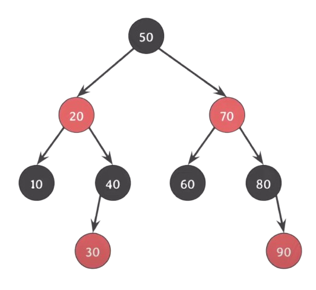

오늘 C언어를 이용한 스택, 큐, 이진트리의 구현을 해보면서 구조체의 선언과 메모리 할당에 대해 새로 이해한 내용을 정리하려한다.

## 구조체 정의

```c
typedef struct _queue
{
	QueueNode *head;
	QueueNode *tail;
} Queue;
```

이런 식으로 \_queue라는 구조체를 선언을 하였으며, 별명을 Queue로 하였다.

구조체의 정의는 컴파일러에게

Queue라는 구조체는 이  
크기(16바이트)를 가지면서,  
멤버로 head, tail포인터를 가지고 있어.  
얘는 메모리 상에 이런식으로 배치가 될거야.  
라는 것을 알려주는 행위 이다.

정의만으로 실제로 스택에 인스턴스화가 되지는 않지만, 나중에 이렇게 쓸거야~ 를 알려주는 것이다.

그럼 이후 런타임 시간에 메모리의 할당 등이 일어나면서 사용을 하는 것이다.

> 런타임 시간에는 구조체에 대한 정보를 알고 있지 않다.  
> 컴파일러가 구조체를 보고서 정해놓은 레이아웃을 사용하는 것이다.

## 구조체의 선언

이제 특정 함수에서 구조체를 사용하는 경우에 대해 알아보겠다.

- 구조체 변수로서 사용할 때

  ```c
  Queue queue;
  ```

  이렇게 선언을 했다면 queue는 Queue 자료형의 변수로서 스택에 구조체가 인스턴스 화가 된다.  
  스택은 메모리의 할당과 해제를 자동으로 관리한다.  
  queue.head, queue.tail 로 구조체의 멤버를 사용하려면 먼저 초기화를 해주어야 한다.  
  현재 상태에서는 각 포인터에 접근을 하게 될 경우 쓰레기 값을 가지고 있기 때문에 최악의 경우 segment fault가 발생하지 않아 찾지 못하는 버그를 유발하게 된다.  
  때문에 NULL로 초기화를 해주고 사용을 하는 것이다.

  > NULL로 초기화 되지 않은 포인터를 사용할 경우 우연히 민감한 정보에 접근이 가능할 수도 있다.

- 구조체 포인터로서 사용할 때

  ```c
  Queue *queue;
  ```

  이렇게 선언을 하게 되면 우리는 Queue라는 구조체를 가리킬 수 있는 queue라는 포인터를 선언한 것이다.  
  때문에 쓰레기 값을 가리키고 있는 포인터 하나를 선언한 것이지 우리가 의도한 대로는 사용할 수 없는 상태이다.  
  이 때는 malloc을 사용하여 동적으로 메모리 공간(힙)을 할당 해 주어야 한다.

  ```c
  Queue *queue = (Queue *)malloc(sizeof(Queue));
  ```

  > 이 때, malloc이 반환하는 void* 은 암시적으로 해당 포인터 타입으로 변환이 되지만, (Queue *) 이라는 명시적인 형 변환으로 컴파일러와 다른 코드를 읽는 사람에게 해당 타입임을 알려주는 것이 좋다.

  저렇게 malloc을 사용하게 되면 Queue 구조체를 담을 수 있는(Queue의 크기만큼 = 16 바이트) 비어있는 빈 공간을 할당받게 된다.  
  이 때 중요한 점은 저 공간은 구조체를 담을 수 있는 **빈 공간** 이라는 것이다.

  > 여기서의 **빈 공간**은 무조건 비어있다는 것은 아니다.  
  > 여기서 부터 여기까지 너써~ 한 것이 때문에 다른 값이 들어있을 수도 있다.

  여기서 앞서 짚고 간 개념이 등장한다.  
  컴파일러는 우리의 구조체가 어떠한 형이고, 크기이고, 멤버는 누구이고, 메모리 공간에 어떻게 배치할 지를 알고 있다.

  그렇기 때문에 이후 우리가

  ```c
  Queue *queue = (Queue *)malloc(sizeof(Queue));
  queue->head = NULL;
  queue->tail = NULL;
  ```

  로 각 멤버 포인터들을 초기화 할 때에 빈 공간이였음에도 아 여기에 head포인터를(8바이트) 저장하고 얘는 NULL을 가리키는 구나!(tail도 마찬가지)가 가능한 것이다.

  또한 이 경우 free를 통해 사용후에는 메모리 해제를 해주며 메모리 누수를 방지해야 한다.(힙은 사용자가 임의로 할당, 해제하는 공간)

## RB tree

#### RB tree의 정의

레드블랙트리(Red-Black Tree)는 이진탐색트리의 한 종류로 스스로 균형을 잡는 트리이다.

> 균형(Balance) : BST의 경우 모든 노드가 한쪽으로 치우치는 worst case가 발생하는 단점(O(n))이 있다.  
> 이걸 방지하기 위해 스스로 균형을 맞추며 삽입, 삭제, 검색이 O(logn)이 될 수 있도록 한다.

{: style="display: block; margin-left: auto; margin-right: auto; width: 60%;" }

#### RB tree의 속성

1. 모든 노드는 Red 혹은 Black 이다.
2. 루트 노드는 Black 이다.
3. 모든 nil(leaf) 노드는 Black 이다.
   > nil 노드 :  
   > {: style="display: block; margin-left: auto; margin-right: auto; width: 60%;" }  
   > RB tree에서만 쓰는 특별한 개념.  
   > 존재하지 않음을 의미하는 노드로 자녀가 없을 때 자녀를 nil노드로 표기 한다.  
   > RB tree에서는 이 nil노드를 값이 있는 노드와 동등하게 취급한다.  
   > 때문에 RB tree에서는 leaf 노드는 nil 노드 이다.
4. Red 노드의 자녀들은 Black 이다(Red가 연속적으로 존재할 수 없다).
5. 임의의 노드에서 자손 nil 노드들까지 가는 경로 상의 Black 수는 같다(자신은 제외).

   > Black height :  
   > 특정 노드에서 임의의 자손 nil 노드까지 내려가는 경로 상의 Black 수(자신은 제외).  
   > 5번 속성을 만족 할 경우에만 성립하는 개념.

   > 색을 바꾸면서 5번 속성 유지하기.  
   > {: style="display: block; margin-left: auto; margin-right: auto; width: 60%;" }  
   > {: style="display: block; margin-left: auto; margin-right: auto; width: 60%;" }  
   > RB tree가 5번 속성을 만족하고, 두 자녀가 같은 색을 가질 때, 부모와 두 자녀의 색을 바꿔줘도 여전히 만족한다.  
   > 그림을 보면 부모의 입장에서 부모와 자녀의 색을 바꿨음에도 Black의 수가 하나 늘어나긴 했지만 모두 black height가 같음을 알 수 있다.  
   > 자식의 입장에서 또는 서브트리의 입장에서는 달라진 것이 없다.

#### RB tree 의 균형

- 삽입 :  
  일반적인 BST와 동일하며, 삽입 후 속성의 위반 여부를 확인하고 재조정하여 다시 속성을 만족하도록 만든다.  
  삽입하는 노드의 색은 무조건 Red 이다.

  > 삽입하는 노드가 Red여야 하는 이유 :  
  > 삽입을 한 이후에도 5번 속성을 만족하기 위해서 Red로 하는 것.

  - 2번 속성을 만족하지 않을 경우 : 색을 Black으로 바꾼다.
    {: style="display: block; margin-left: auto; margin-right: auto; width: 40%;" }  
    사진과 같이 삽입하는 노드는 Red이며, 자동으로 nil노드(무조건 Black)가 달린다(3번 속성을 만족).  
    만약 루트노드라면 2번 속성을 위반하기 때문에 색을 Black으로 바꿔주면 모든 속성을 만족한다.

  - 4번 속성을 만족하지 않을 경우:

    - Case.3 :  
      {: style="display: block; margin-left: auto; margin-right: auto; width: 60%;" }  
      {: style="display: block; margin-left: auto; margin-right: auto; width: 60%;" }  
      이런 식으로 red가 한 쪽으로 몰려 버렸을 경우(4번 속성 위반) 구조를 바꾸면서도 BST의 특징을 유지시키려면 **회전**을 시켜야 한다.

      1. 20과 50의 색을 바꿔준다.
      2. 50을 기준으로 오른쪽으로 회전한다.

      삽입 된 Red 노드가 부모의 왼쪽(오른쪽) 자녀이며, 부모도 Red이고 할아버지의 왼쪽(오른쪽) 자녀이며, 삼촌(부모의 형제)는 Black이라면(위 그림과 같다면)

      부모와 할아버지의 색을 바꾼 후 할아버지 기준 오른쪽(왼쪽)으로 회전한다.

    - Case.2 :  
      {: style="display: block; margin-left: auto; margin-right: auto; width: 60%;" }  
      Case.3와 다른 점은 삽입 된 노드를 기준으로 할아버지까지의 경로가 꺾였다는 점이다.  
      그렇다면 꺾인 부분을 펴서 Case.3와 같이 해결하면 되겠네 ???  
      {: style="display: block; margin-left: auto; margin-right: auto; width: 60%;" }

      1. 20을 기준으로 왼쪽으로 회전한다(이제 Case.3).
      2. 40과 50의 색을 바꾼다.
      3. 50을 기준으로 오른쪽으로 회전한다.

      삽입 된 Red 노드가 부모의 오른쪽(왼쪽) 자녀이며, 부모도 Red이고 할아버지의 왼쪽(오른쪽) 자녀, 삼촌은 Black이라면(위 그림과 같다면)

      부모를 기준으로 왼쪽으로 회전한 뒤 Case.3와 같이 해결.

    - Case.1 :  
      {: style="display: block; margin-left: auto; margin-right: auto; width: 40%;" }  
      이 경우에는 4번 속성을 위반하는 건 같지만, Red가 한 쪽으로 몰려있지 않다.  
      4번 속성을 만족하면서 5번 속성도 만족시키기 위해서는

      > RB tree가 5번 속성을 만족하고, 두 자녀가 같은 색을 가질 때, 부모와 두 자녀의 색을 바꿔줘도 여전히 만족한다.

      를 이용한다.

      1. 10과 50을 Black으로 바꾸고, 20을 Red로 바꾼다.  
         {: style="display: block; margin-left: auto; margin-right: auto; width: 40%;" }
      2. 루트노드가 Red가 되어버려 2번 속성을 위반한다.-> 20을 Black으로 바꾼다.  
          {: style="display: block; margin-left: auto; margin-right: auto; width: 40%;" }  
         그럼 이제 모든 속성을 만족한다.

      삽입된 Red노드의 부모도 Red, 삼촌도 Red이면(위 그림과 같다면), 부모와 삼촌을 Black으로 바꾸고 할아버지를 Red로 바꾼 뒤 할아버지에서 다시 확인(Root 이거나, 할아버지의 부모도 Red)한다.

- 삭제 :  
  일반적인 BST와 동일하며, 삭제 후 속성의 위반 여부를 확인하고 재조정하여 다시 속성을 만족하도록 만든다.

  > 노드를 삭제할 때 어떤 색이 삭제 되는지가 속성 위반 여부를 확인하는데 중요!

  삭제하려는 노드의 자녀의 수(유효한 값을 가지는 자녀)를 먼저 따져본다.

  - 자녀가 없거나 하나일 때 : 삭제되는 색은 삭제 된 노드의 색.
  - 자녀가 둘일 경우 : 삭제되는 색은 삭제되는 노드의 successor(오른쪽 서브트리의 가장 작은 값)의 색.

  이제 삭제되는 색을 따져보자.

  - Red가 삭제될 때 : 어떠한 속성도 위반하지 않는다.
  - Black이 삭제될 때 : 2, 4, 5번 속성이 위반 될 수 있다.

    - 2번 속성이 위반 :
      루트 노드를 그냥 검은색으로 바꿔주면 된다.

    위 같은 특수한 경우가 아니라면 항상 5번 속성을 위반하게 된다(Black의 수를 세리는데 Black을 지워버렸으니 당연).

    - 5번 속성이 위반 : 삭제 된 색의 위치를 대체한 노드에 extra black을 부여한다.

      > extra black : black height를 계산할 때 하나의 black으로 카운트 된다.

      {: style="display: block; margin-left: auto; margin-right: auto; width: 50%;" }

      > doubly black : extra black이 부여된 black 노드.

      {: style="display: block; margin-left: auto; margin-right: auto; width: 50%;" }

      > red and black : extra black이 부여된 red 노드.

      red and black의 경우는 그냥 black으로 바꿔버리면 모든 게 해결이 된다.  
      하지만 doubly black의 경우는 *extra black을 어떻게 없앨 것인지*가 관건이다.

      이에 4가지 경우가 존재한다.

      - doubly black의 오른쪽(왼쪽) 형제가 black이고, 그 형제의 오른쪽(왼쪽) 자녀가 red일 때(Case.4) :

        {: style="display: block; margin-left: auto; margin-right: auto; width: 50%;" }

        > c, b는 red일 수도 있고, black 일 수도 있다. 둘이 색이 같다는 뜻이 아니다.

        red를 왼쪽으로 doubly black의 위로 옮겨서 extra black을 주고 red and black을 그냥 black으로 바꾸면 되지 않을까???

        RB tree가 5번 속성을 만족하고, 두 자녀가 같은 색을 가질 때, 부모와 두 자녀의 색을 바꿔줘도 여전히 만족한다는 5번 속성의 특징을 응용해 보자!

        {: style="display: block; margin-left: auto; margin-right: auto; width: 50%;" }

        D를 자식과 색을 바꾸는 것이다. 근데 이 때 c가 red인지 black인지 모르기 때문에 extra black을 준다(5번 속성을 여전히 만족).

        {: style="display: block; margin-left: auto; margin-right: auto; width: 50%;" }

        이제 왼쪽으로 넘겨주고 싶은데, BST의 특징을 그대로 유지해야 하기 때문에 회전을 사용해야 한다.  
        회전을 하기 전에 먼저 red가 왼쪽으로 넘어갈 수 있도록 B와 D의 색을 바꿔준다.

        {: style="display: block; margin-left: auto; margin-right: auto; width: 50%;" }

        이제 B를 기준으로 왼쪽으로 회전을 시켜 준다.

        {: style="display: block; margin-left: auto; margin-right: auto; width: 50%;" }

        이제 A, C의 extra black을 B로 올려서 red and black으로 만든 후 black으로 바꿔버리면 해결이 된다.

        이걸 이제 결론적으로 정리를 하면,

        오른쪽(왼쪽) 형제는 부모의 색으로, 오른쪽(왼쪽) 형제의 오른쪽(왼쪽) 자녀는 black으로, 부모는 black으로 바꾼 후에 부모를 기준으로 왼쪽(오른쪽)으로 회전한다.

      - doubly black의 오른쪽(왼쪽) 형제가 black이고, 그 형제의 왼쪽(오른쪽) 자녀가 red일 때, 그 형제의 오른쪽 자녀는 black일 때(Case.3) :

        {: style="display: block; margin-left: auto; margin-right: auto; width: 50%;" }

        Red를 오른쪽 형제로 옮겨 줄 수 있으면 Case.4로 생각하고 풀 수 있겠구나!

        {: style="display: block; margin-left: auto; margin-right: auto; width: 50%;" }

        doubly black의 형제의 오른쪽(왼쪽) 자녀를 Red가 되게 만들어서 Case.4를 적용하여 해결한다.

      - doubly black의 형제가 black이고, 그 형제의 두 자녀 모두 black일 때(Case.2) :

        {: style="display: block; margin-left: auto; margin-right: auto; width: 50%;" }

        extra black과 형제의 black을 모아서 부모에게 전달.  
        그림 상 D는 red가 되는 것이다.

        {: style="display: block; margin-left: auto; margin-right: auto; width: 50%;" }

        결론적으로 doubly black과 그 형제의 black을 모아서 부모에게 전달해서 부모가 extra black을 해결하도록 위임(red and black일 경우 black으로 바꾸면 해결, doubly black일 경우 루트 노드이면 black으로, 아닐경우 case1, 2, 3, 4 중 하나로 해결 한다.

      - doubly black의 형제가 red이고, 그 형제의 두 자녀 모두 black일 때(Case.1) :

        {: style="display: block; margin-left: auto; margin-right: auto; width: 50%;" }

        doubly black의 형제를 black으로 만든 후 case 2, 3, 4 중 하나로 해결하면 되겠다!

        그렇게 하기 위해서는 B를 기준으로 왼쪽(오른쪽)으로 회전을 하면 되겠다!

        근데 5번 속성을 계속 만족해야 하기 때문에 B, D의 색을 미리 바꿔주고 회전을 하자!

        {: style="display: block; margin-left: auto; margin-right: auto; width: 50%;" }

        그럼 이제 doubly black의 형제가 black이 됬기 때문에 case 2, 3, 4 중 하나로 해결이 가능하다.

출처 : [쉬운 코딩](https://www.youtube.com/@ez. "쉬운 코딩")
