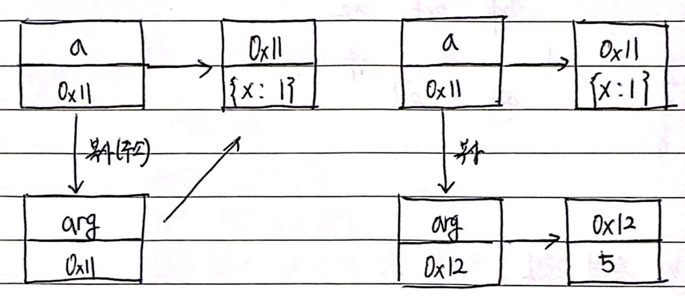
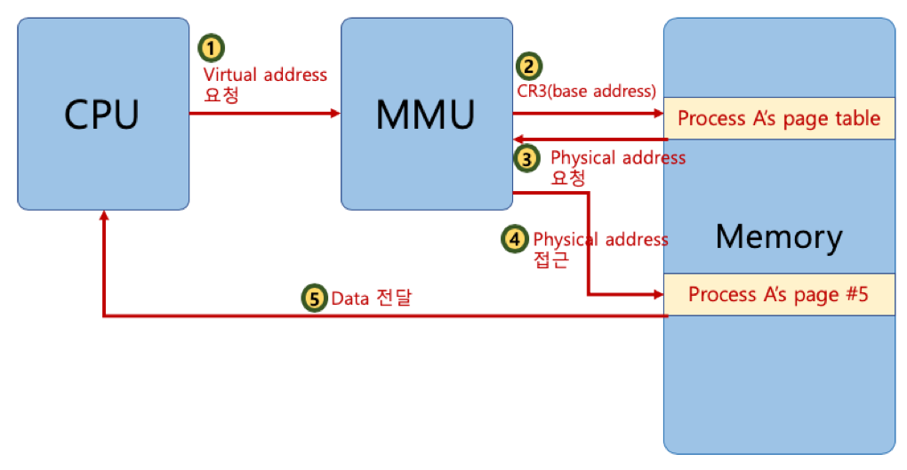
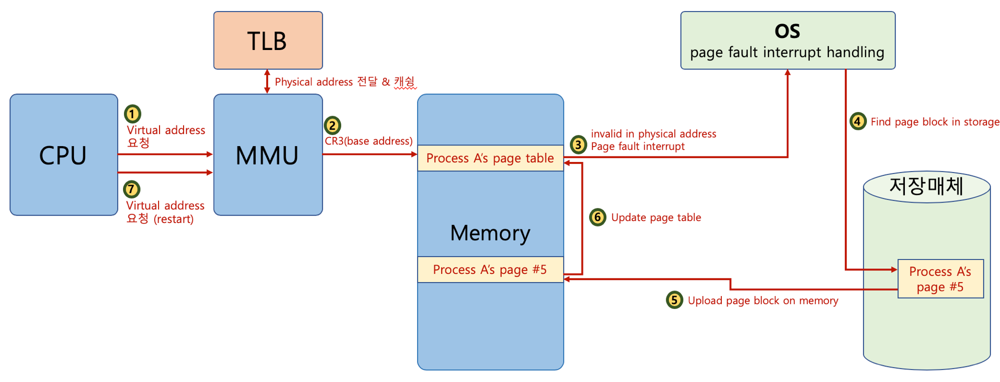
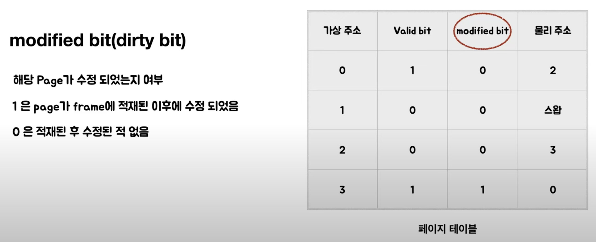

## 인자 전달 방식

함수에서 인자를 불러 올 때 어떤 방식으로 호출 하는가?

### Call by Value(복사)

함수의 인자를 받을 때 변수에 담긴 값을 스택에 복사하여 넘겨준다.

- 장점 : 원본 값을 변경할 수 없기 때문에 안전하다.
- 단점 : 복사를 하니까 메모리 공간을 차지 한다.

### Call by Reference(주소값)

함수의 인자를 받을 때 변수의 주소값을 넘겨준다.  
때문에 함수 내에서 해당 인자를 조작하면 원본 주소값의 원본 값 자체가 변한다.

- 장점 : 복사가 아닌 직접 참조이기 때문에 빠르다.
- 단점 : 원래 값이 변하는 리스크가 있다.

C에서는 사용자가 직접 컨트롤을 할 것이고 다른 언어에서는 어떨까?

### Python

Python에서는 Call by Assignment를 사용한다.

#### Call by Assignment(난둘다)

- Immutable Object : Call by Value 형식의 핸들링.
- Mutable Object : Call by Reference 형식의 핸들링.

### JavaScript

JS에서는 Call by Value만을 사용한다고 한다.

> Call by Sharing이란 말이 있으나 정식 명칭이 아니라 주의.  
> 뒤에서 설명하겠다.

예를 들어가며 살펴보자

```js
function change(arg) {
  arg = 3;
  console.log(arg); // 3
}

// function change() {
//     let arg = 1;
//     arg = 3;
//     console.log(a);
// } 이거랑 같은거야

a = 1;
change(a);
console.log(a); // 1
```

위와 같이 원시값은 주소 대신 값 자체를 복사하여 전달하기 때문에 함수 내부에서의 변경사항은 기존의 argument와 다른 값이여서 영향을 주지 못한다.

> 원시값 : 객체가 아니면서 메서드 또는 속성도 가지지 않는 데이터
> (string, number, bigint, boolean, undefined, symbol, null)

그렇다면 객체의 속성을 변경하게 된다면??

```js
function change(arg) {
  arg.x = 5;
  console.log(arg);
}

// function change() {
//     let arg = a;
//     arg.x = 5;
//     console.log(arg); // {x:5}
// } 이거랑 같은거야

a = { x: 1 };
change(a);
console.log(a); // {x:5}
```

객체 타입의 인자는 주소값을 갖는 새로운 변수가 되는데, 이 때 같은 객체를 바라보고있다.  
때문에 함수 내부에서 속성값을 변화시키면 외부의 속성값도 같이 변한다.

```js
function change(arg) {
  arg = 5;
  console.log(arg);
}

// function change() {
//     let arg = a;
//     arg = 5;
//     console.log(arg); // 5
// } 이거랑 같은거야

a = { x: 1 };
change(a);
console.log(a); // {x:5}
```

허나 값 자체를 수정하려 하는 경우 참조 관계가 깨지게 된다. 즉 함수내부의 변동사항이 외부의 값에 영향을 주지 않는다.

{: style="display: block; margin-left: auto; margin-right: auto; width: 60%;" }  
그림으로 2번과 3번 코드를 나타내면 다음과 같다.

위 코드들을 살펴보면 결과적으로 3번의 반례를 통해 js에는 call by reference가 존재 하지 않으며 2번을 통해 참조 타입의 인자 또한 복사를 통해 전달하기 때문에 결국 call by value만이 존재함을 알 수 있다.  
이 혼동을 방지하기 위해 call by sharing이라는 용어가 생겼지만 정식 용어가 아니다.

참고 문서: CSAPP, [MDN web docs](https://developer.mozilla.org/ko/docs/Glossary/Primitive "MDN"), [ZeroCho](https://www.youtube.com/watch?v=-w-oJp6OVd4&t=385s "ZeroCho")

## 가상메모리

### 가상메모리의 정의

프로세스를 실행 할 때 필요한 최소한의 메모리에 집중한 기법으로, 프로세스가 실행 될 때 해당 프로세스의 전체가 메모리에 올라가지 않아도 된다는 점에 착안 한 것이다.  
때문에 필요한 일부분 만이 메모리에 올라가고 나머지는 디스크(보조 기억장치)에 남게 된다.

결론적으로는 실제 메모리공간보다 훨씬 큰 프로세스도 실행할 수 있는 것이다.  
각 프로세스는 가상메모리를 통해 메모리 공간 전체를 독점하고 있다고 생각하기 때문에 프로세스간 간섭 또한 방지할 수 있다.

> 가상 메모리의 크기 : 32비트에서는 2^32인 4GB, 64비트에서는 2^64가 이론적인 크기 이지만, 실제로는 운영체제 등이 차지하기 때문에 2^48 또는 2^57 정도를 가진다.

### MMU(Memory Management Unit)

간단하게 가상주소를 물리주소로 변환하는 기능을 한다.  
메모리를 일일히 변환하는 것은 부하가 크기 때문에, 램을 여러 부분으로 나누고 각 단위를 하나의 독립 된 부분으로 처리한다.

### 페이징

페이징은 가상 메모리와 물리 메모리를 같은 크기(보통 4KB)로 분할 하고, 일대일로 매핑하여 단편화를 최소화 하기 위한 기술이다.

가상주소를 MMU를 거쳐 반환된 물리주소를 바탕으로 어떤 페이지를 가져와서 어떤 프레임에 넣었는지의 기록이 필요한데 이 기록이 **페이지 테이블** 이다.

{: style="display: block; margin-left: auto; margin-right: auto; width: 60%;" }

페이지 테이블은 빈번하게 접근하기 때문에 속도를 위해 물리 메모리에 상주하고 있으며, MMU는 CPU로 부터 받은 가상주소를 바탕으로 페이지테이플에서 반환된 물리 메모리를 참고하여 데이터를 CPU에게 돌려준다.

#### 요구 페이징

요구 페이징은 처음부터 모든 데이터를 메모리에 적재하지 않고, 프로세스의 실행 후 메모리를 요청하면 페이지 테이블에 할당 되었다는 표시만 하고, 실제로 가상 메모리를 물리 메모리에 할당하지는 않는 것을 의미한다.

#### 페이지 폴트

{: style="display: block; margin-left: auto; margin-right: auto; width: 60%;" }

MMU는 받은 가상주소가 페이지 테이블 내에서 제대로 가리킬 수 없는 경우 trap을 발생시켜 이를 운영체제에게 알리고 운영체제는 cpu의 동작을 잠시 멈춘다.

페이지 폴트는 두 가지 경우로 나눌 수 있다.

- 페이지 테이블에 해당 가상 주소가 없는경우.  
  페이지 테이블에 없다는 것은 요구하는 데이터가 메모리에 올라온 적이 없고 저장 공간에 저장이 되어 있다는 것을 의미한다. 이를 **하드 페이지 폴트** 라고 하며, 운형체제는
  유효한 가상주소인지, 유효하다면 디스크(저장소)에서 해당 페이지를 읽어 물리 메모리에 로드하고, 페이지 테이블에 해당 엔트리를 추가하게 된다.
- 페이지 테이블에 해당 가상 주소가 있는데 물리주소는 스왑영역을 가리키는 경우.  
  물리주소가 스왑영역을 가리킨다는 것은 **소프트 페이지 폴트** 라고 하며, 해당 페이지가 스왑아웃 된 상태라는 것을 의미한다. 운영체제는 디스크(스왑영역)에서 해당 페이지를 다시 물리 메모리로 로드 하고, 페이지 테이블의 정보를 갱신한다.

위 두 가지 방법으로 페이지 폴트를 해결하고 나면 다시 cpu를 실행시켜 마치 페이지 폴트가 발생하지 않았던 것 처럼 프로세스가 계속 작동하도록 해준다.

#### 페이지 교체 정책

앞선 페이지 폴트를 해결하기 위해 물리 메모리에 페이지를 스왑 인 하려 할 때, 더 이상 공간이 없다면 가장 사용하지 않을 것이라 판단되는 페이지를 디스크로 스왑 아웃 한 후 빈 자리에 새로운 페이지를 채우게 된다. 이 떄, 사용하지 않는 페이지를 판단하는 것이 페이지 교체 알고리즘이다.

#### TLB(Translation Lookaside Buffer)

TLB는 페이지 정보 캐쉬라 부르며 가상 주소의 물리 주소로의 변환은 빠르게 하기 위해서 사용하는 캐쉬 이다.  
최근에 일어난 변환테이블을 저장해 둠으로서 cpu가 가상주소로 접근을 하려할 때 메모리를 거치지 않고 바로 물리 주소를 반환해 주는 것이다.  
때문에 사실 위에서 말했던 MMU의 동작에는 바로 가상주소를 페이지 테이블에서 찾는 것이 아니라, TLB에 해당 가상주소의 정보가 있는지 먼저 확인 후 검사를 하게 된다.

#### 참고자료

{: style="display: block; margin-left: auto; margin-right: auto; width: 60%;" }  
위 그림을 보면 vaild bit 과 modified bit 이 있음을 알 수 있다.  
valid bit 이 1일 경우 가상주소가 물리 메모리를 가리킴을 의미하고, 0일 경우 스왑 영역을 가리킴을 의미한다.  
modified bit이라는 개념은 해당 페이지가 수정이 되었는지 여부를 나타내며, 1일 경우 쓰기 작업이 필요함을 의미한다.  
따라서 스왑 아웃이 될 때 쓰기 작업을 하게 된다.  
이를 통해 필요하지 않은 작업의 쓰기 작업을 방지해 준다.

참고 문서: CSAPP, [우아한 테크 유투브](https://www.youtube.com/watch?v=_SyFgWccEs8 "우아한 테크"), [잔재미 코딩스쿨](https://www.fun-coding.org/post/virtualmemory.html#gsc.tab=0 "잔재미코딩")
