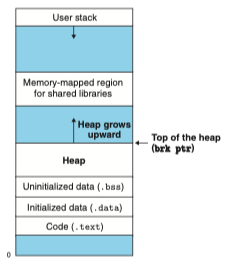

## free list

아래께 공부했던 메모리 할당 정책 중 등장했던 개념으로 가용 블록을 탐색할 때 사용하는 리스트 였다. 어제는 묵시적 리스트(Implicit free list)로 가정하고 설명했지만, 오늘은 좀 더 알아보도록 했다.

### 묵시적 리스트(Implicit free list)

할당된 블록과 가용블록이 연속적으로 메모리에 나열되어 있는 형태로, 메모리를 할당하거나 해제할 때 전체를 순차적으로 탐색하면서 가용 블록을 찾거나, 할당 된 블록을 해제해야 하기 때문에 탐색 시간이 블록의 수에 비례하는 단점이 있다.  
만약 블록의 수가 사전에 알려져 있고, 작고 특수한 경우에는 나쁘지 않다.

### 명시적 리스트(Explicit free list)

모든 가용블록들이 이중 연결 리스트를 이용해서 관리된다. 그럼 first fit 할당 시간을 전체 블록 수에 비례하는 것에서 가용블록의 수에 비례하도록 바꿀 수 있다.  
이는 메모리를 할당 및 해제할 때 효율적이고, 해제 시에도 자유 목록데 추가하기만 하면 되기 때문에 유리하지만 정렬 정책의 선택에 따라 달라질 수 있다.

## demand-zero memory

### 정의

말 그대로 필요할 때(demand) 할당하고 0으로 초기화(zero)해 주는 메모리를 말한다.  
이는 어제 정리했던 요구 페이징의 결과 이다. 요구가 발생한 것은 가상메모리 안의 페이지 테이블 뿐 물리 메모리에는 추가적인 할당이 발생하지 않았으니 무요구 가 성립한다.

#### lazy allocation

{: style="display: block; margin-left: auto; margin-right: auto; width: 70%;" }  
[출처](https://medium.com/@besartdollma/lazy-dynamic-memory-allocation-in-c-32bb4228108b)  
리눅스의 메모리 관리 시스템은 최대한 게으른 방식으로 동작하도록 설계 되어 있다.  
시스템이 메모리 할당 요청을 받았을 때 정말 실제로 필요해 질 때까지 물리 메모리의 할당을 미루는 것으로 메모리를 절약하고 정말 필요한 시점에서만 사용하게 된다.

sbrk등의 시스템 호출을 통해 커널에 메모리 할당을 요청하면 즉시 물리 메모리를 할당하지 않고, 특정 가상 메모리 영역을 할당한 사실만을 기록하여 아직 물리 메모리가 할당 되지 않은 상태에서 사용자에게 할당 완료를 알린다.  
사용자는 프로그램이 메모리를 할당 받았다고 착각하고 할당 된 주소에 읽기 또는 쓰기 작업을 시도한다. 허나 메모리 주소에 접근하려 하면 페이지 폴트가 발생하고 그제서야 사용되지 않는 물리 메모리 페이지를 찾아 0으로 채운다.  
이제야 요청했던 명령어를 다시 실행하여 정상적인 동작이 가능케 한다.

효율적인 메모리 사용과 보안을 강화할 수 있다는 이점이 있지만, 페이지 폴트의 발생으로인한 오버헤드와 메모리 초기화 비용을 인지해야 한다.

## 동적 메모리 할당(Dynamic Memory Allocation)

사실 앞선 개념들에 비해 먼저 학습했어야 했지만, 순서가 조금 뒤집혔다.

### 동적 메모리 할당의 정의

프로그램이 실행되는 도중에 메모리를 필요에 따라 할당하고 해제하는 과정을 의미한다.

### 동적 메모리 할당을 하는 이유

프로그램을 실제로 실행시키기 전에 자료구조의 크기를 알 수 없는 경우가 종종 있다.  
이 때 가장 간단한 해결법은 최대 크기를 갖는 정적 배열을 만드는 것이다.  
정적 메모리 할당은 컴파일 시 stack에 얼마만큼의 크기로 할당을 할지가 정해지고 프로그램 종료시 까지 할당 된 상태를 유지하기 때문에, 이 방법으로는 임의의 최대 크기보다 더 큰 파일을 읽으려고 할 때, 더 큰 최대값으로 새로 컴파일을 해야한다.  
큰 규모의 소프트웨어에서 이런 방법은 관리가 어려워 진다.

그래서 나온 대책이 런타임 시에 heap에 데이터를 동적으로 할당하는 것이다. 이 메모리의 크기는 가용한 가상 메모리의 양에 의해서만 제한되며, 할당, 해제가 가능하다.

> heap :  
> 힙은 프로그램 실행 중(런타임)에 동적으로 할당할 수 있는 메모리 영역으로, 가상메모리의 일부로서 프로그램이 시작 될 때 할당 된다.

{: style="display: block; margin-left: auto; margin-right: auto; width: 70%;" }
