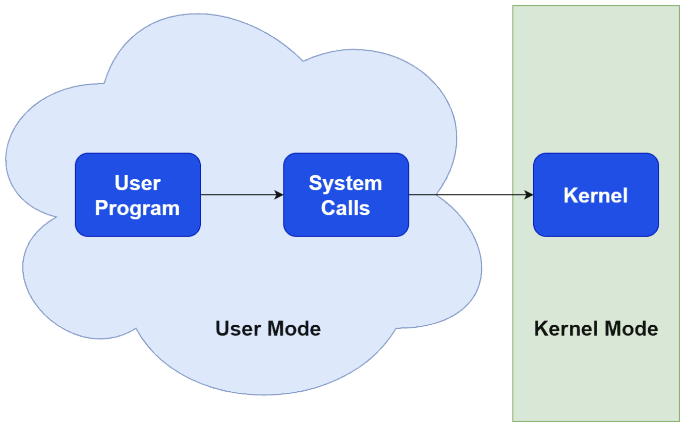
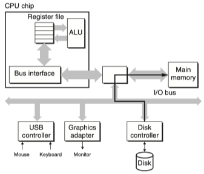

오늘은 6주차 키워드를 마무리 한다.

## 시스템 콜(System Call)

### 시스템 콜의 정의

시스템 콜은 운영체제의 커널이 제공하는 서비스에 접근하기 위해 응용 프로그램의 요청에 따라 커널에 접근 하기위한 인터페이스이다.

{: style="display: block; margin-left: auto; margin-right: auto; width: 70%;" }

### 시스템 콜이 필요한 이유

일반적으로 사용하는 프로그램은 응용프로그램인데 유저레벨에서는 필요한 모든 기능을 사용 할 수 없기 때문에 커널에게 도움 받는다.  
이 과정은 유저모드에서 수행할 수 없기 때문에 커널 모드로 전환 한 후에 권한이 생긴다.

그럼 왜 권한이 제한되어있을까??

프로그램이 하드웨어 자원에 직접 접근하면 보안과 안정성 문제가 있을 수 있다.  
메모리의 경우에는 프로그램이 임의로 읽거나 쓰면 다른 프로그램의 데이터를 오염시킬 수도 있고, 악의적인 시스템 콜이 호출 될 경우 제한되어야 하기 때문에 커널 모드에서만 실행 할 수 있다.

> 사용자 모드(User Mode)와 커널모드(Kernel Mode)
>
> - 유저모드  
>   PC register이 사용자 프로그램이 올라가 있는 메모리 위치를 가리키고 있으면 사용자 프로그램을 실행중이며 CPU가 유저모드에서 수행중이라고 한다.  
>   이 때 프로그램이 시스템 콜을 호출하면 소프트웨어 인터럽트가 발생한다.
> - 커널모드  
>   PC register가 운영체제가 존재하는 부분을 가리키고 있다면 현재 운영체제의 코드를 수행중이라고 하고 CPU가 커널모드에서 수행중이라고 한다.  
>   앞서 발생한 인터럽트로 운영체제가 커널모드로 전환되어 시스템 콜을 처리한다.  
>   시스템 콜이 완료되면 다시 사용자 모드로 전환하고 결과를 프로그램에 반환한다.

### 시스템 콜의 종류

- 프로세스 관리 : 프로세스의 생성, 실행, 종료
- 파일 관리 : 파일을 읽고 쓰고 닫는 등의 파일 작업
- 장치 관리 : 장치 드라이버와 상호작용하여 하드웨어 장치에 접근
- 메모리 관리 : 메모리 할당과 해제, 매핑을 관리
- 네트워크 관리 : 네트워크 소켓을 생성, 데이터 송수신
- 통신 : 프로세스 간의 데이터 소통

## DMA(Direct Memory Access)

### DMA의 정의

{: style="display: block; margin-left: auto; margin-right: auto; width: 70%;" }

CPU의 개입 없이 주변장치가 시스템 메모리에 직접 데이터를 읽고 쓸 수 있게 하는 하드웨어 기능으로, 특히 대용량 데이터 전송에 효율적이며 DMA 컨트롤러가 대신하여 CPU 부담을 줄여 시스템 성능을 향상시킨다.

### DMA 작동 과정

주변장치가 데이터를 전송할 준비가 되면 DMA 컨트롤러가 메모리 주소를 지정하고 데이터를 전송한다.  
데이터 전송이 완료되면, DMA 컨트롤러가 CPU에 인터럽트를 보내 전송이 완료되었음을 알린다.

### 장단점

장점

- 효율성 : 대용량 데이터 처리에 CPU의 부담을 줄이고, 다른 작업에 집중할 수 있게 한다.
- 저지연 : 입출력 장치와 메모리간의 빠른 데이터 전송이 가능하다.

단점

- 복잡성 : DMA 컨트롤러 관리와 구성이 복잡할 수 있다.
- 자원 충돌 : 메모리 버스의 점유로 인해 다른 장치들의 메모리 접근이 지연될 수 있다.

## 이더넷

### 이더넷의 정의

같은 지역의 네트워크인 LAN을 유선으로 구현하는 흐름을 규격화한 기술이다.

물리적인 네트워크 장치와 프로토콜을 규정하여 다양한 제조사의 장비 간에도 호환이 잘 되고 확장성이 좋다.

지금은 여기까지만 이해하면 될 것 같다.

출처 : [systemcall](https://www.baeldung.com/cs/system-call-vs-system-interrupt), [유저모드와 커널모드](https://velog.io/@nnnyeong/OS-%EC%8B%9C%EC%8A%A4%ED%85%9C-%EC%BD%9C-System-Call), [이더넷](https://brunch.co.kr/@swimjiy/49), CSAPP
