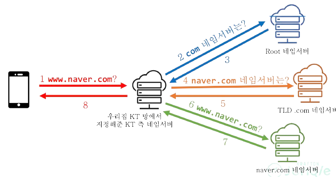

7주차는 네트워크에 관한 주차이다.

명지대학교 문대경 교수님 (UC Berkeley CS Ph.D., (전)넥슨 개발자)의 강의 내용과 CSAPP을 참고한 내용을 정리하려 한다.

## 네트워크(Network)

### 네트워크는 무엇인가?

상호 연결되어 있는 사람들이나 사물들로 이루어진 그룹이나 시스템.  
사람/사물을 '점'으로 표시하고 그들간의 어떤 관계를 '선'으로 표시한 것이다.

Network : 개체('점') 간의 관계 ('선')을 표시한 것.
Networking : 개체('점') 간의 관계를 맺게 하는 것.

## 인터넷(Internet)

### 인터넷은 무엇인가?

Internet(work) 점들을 선으로 연결한 덩어리!

고로 **네트워크 != 인터넷**  
인터넷은 네트워크를 연결한 것.  
연결되지 않은 고립 된 네트워크도 있다는 것(내부망)!

### 인터넷의 목표

처음 군사적 목적으로 만들어진 ARPANET 이 시초.

모든 목표를 만족하라는게 아니고, 최대한 지키라고, 위에있을 수록 중요도가 높다.

1. 구성하는 네트워크 중 일부가 동작 하지 않아도 계속 작동해야한다.
2. 다양한 통신 서비스 지원.
3. 다양한 네트워크 수용 가능.
4. 중앙집중식이 아닌 분산처리 방식의 자원관리.
5. 비용 효율적.
6. 적은 비용으로 호스트 추가 가능
7. 누가 어느정도 리소스 쓰는지 추척 가능.

## IP(Internet Protocol)

### IP는 무슨 뜻일까?

네트워크를 연결하는 프로토콜(약속)이다.

{: style="display: block; margin-left: auto; margin-right: auto; width: 70%;" }

- 어떤 물리적 연결 기술이든 IP만 구현하면 다양한 서비스(소프트웨어)를 돌릴 수 있다.
- 어떤 서비스(소프트웨어)든 IP로만 구현하면 다양한 물리적 연결 기술로 된 네트워크에서 동작한다.

## 아키텍처

### 아키텍처는 무엇인가?

아키텍처의 딱딱한 정의는 _the fundimental organization of a system, embodied in its components, their relationships to each other and the environment, and th principles governing its design and evolution._  
즉 _구성요소들 간의 관계, 환경, 설계와 발전을 관리하는 원칙으로 이루어진 시스템의 근본적인 구조_ 이다.

> 참조 : [마틴 파울러 강의](https://www.youtube.com/watch?v=4E1BHTvhB7Y)

- 어떤 컴포넌트가 존재하는지?
- 컴포넌트들은 서로 어떻게 상호작용하는지?

를 결정하는 것이 아키텍쳐의 설계이다.

### 계층형 아키텍쳐

아키텍쳐 스타일 중 하나로 대표적으로 인터넷이 계층형이다.

작은 기능을 쌓아올리는(layered)구현이 바로 계층형 아키텍쳐이다.

#### 계층화(layering)의 장점

- 단순화  
  각 계층은 자기가 제공할 기능만 생각하면 된다.(functionality)  
  각 계층은 자기 바로 아래 계층을 어떻게 쓰는지만 알면 된다.(interface)

- 문제 해결의 편의성  
  문제가 있는 계층만 디버깅을 하면 된다.  
  각 계층이 단순하기 때문에 문제를 해결하기 쉽다.

- 진화의 편의성  
  각 계층은 위 계층에 알려준 "어떻게 쓰는지"만 유지하면 된다.  
  그 안에서 자유롭게 기능을 개선/추가가 가능하다.

#### 계층화의 단점

- 잠재적 비효율성  
  각 계층을 넘나드는 것이 비효율 적일 수 있다.  
  어떤 계층을 건드리면 그것을 사용하는 위의 모든 계층이 영향을 받는다.  
  (ex. 만약 어떤 기능이 필요해서 아래층에 뭔갈 넣었다. 아래층에서는 올바르게 줬다고 하더라도 위층에서 받은 결과가 원한 결과인지 판단하는 기준이 다르다.)  
  때문에 성능상 절대적으로 필요한 것이 아니라면 하위계층에 뭘 넣지 않는다.

#### OSI 7 계층 모형(OSI Reference Model)

이름에 *Reference*가 들어간 것을 볼 수 있듯이, 참조. 즉 기준 모델이다.  
실제 구현으로 존재 하는 것이 아닌 우리가 계층 구조를 만드는 기준이 된다는 것이다.

만들 때도 1대1로 다 만들 필요는 없고 묶어서 쓸 수도 있는 거야.

#### TCP/IP에서의 OSI Model 적용

{: style="display: block; margin-left: auto; margin-right: auto; width: 70%;" }

- L2 : Network Interface
- L3 : Network
- L4 : Transport
- L7 : Application

#### 계층 구조에서 데이터 처리

{: style="display: block; margin-left: auto; margin-right: auto; width: 50%;" }

- 보내는 쪽  
  헤더(보내는 사람과 받는 사람을 기재한 송장)와 함께 더 큰 박스에 넣어서 보내게 된다.
- 전송  
  최종 박스(제일 큰 박스)를 보고 받는사람의 정보를 참조하여 전송한다.
- 받는 쪽  
  바깥쪽 박스를 제거하고 작은 박스를 꺼내 위 계층에 전달한다.

#### 각 계층의 주요 요소

{: style="display: block; margin-left: auto; margin-right: auto; width: 70%;" }

사진에서 볼 수 있듯이 박스에 넣는다는 표현 처럼 아래층 계층에서 윗 계층의 박스를 포함하고 있고, 각각의 프로토콜 헤더는 그림과 같다.

{: style="display: block; margin-left: auto; margin-right: auto; width: 70%;" }

#### 각 계층의 주요 요소를 알아내는 법

- 어떤 Port 번호를 써야하지?  
  Port 번호는 정해놓고 쓴다.
- 어떤 IP를 써야하지?  
  정해진 IP를 알고 사용하거나, 서버 이름으로부터 IP를 알아낸다.
- 어떤 MAC을 써야하지?
  IP에서 알아낸다.

#### DNS(Domain Name System)

그 지역의 이름을 기억하고 있다가 IP정보를 알려주는 서버 즉 지역마다 이름을 따로 관리한다.

사람한테는 숫자 나열보다 이름이 기억하기가 쉽다. 하지만 the Internet은 IP로 통신하네??  
이때 *이름과 IP주소를 매칭해서 기억*하고 있다가 필요할 때 이름에서 IP주소를 찾아서 주는 역할을 하는 서비스가 **DNS**이다.  
**DNS 서버**는 이 이름과 IP의 매칭을 기억하는 데이터베이스 이다.  
그럼 서버이름으로 IP주소를 알아내려는 행위를 **DNS resolution**이라고 한다.  
ex) naver.com(도메인)으로 접근을 한다. 그럼 DNS서버에서 네이버 서버의 IP 주소로 변환해서 접속할 수 있도록 한다.

{: style="display: block; margin-left: auto; margin-right: auto; width: 70%;" }

위 그림을 보면 일반 사용자가 네이버라는 도메인에 접속하려 할 때 생기는 상호작용을 볼 수 있다.

- 공유기가 KT망에 연결되는 순간 저 DNS 서버 뭐 써야 돼요? 라고 물어보고 응답을 기억하고있다.
- 집안의 기기들은 공유기에게 접속하며 DNS 서버 뭐 써야해요? 라고 물어보면 공유기는 기억하고 있던 응답을 전해준다.
- 그럼 KT의 네임서버는 뒤에서부터 하나씩 찾는다. Root 네임서버에게 com 의 네임서버는 뭐야? 라고 물어본다.
- com을 관리하는 네임서버는 TLD(Top Level Domain) .com 네임서버이기에 얘한테 다시 naver.com의 네임서버는 뭐야? 라고 물어본다.
- 그럼 네이버를 관리하는 naver.com의 네임서버에게 www.naver.com은 뭐야? 라고 물어본다.
- 비소로 네이버에 접속 할 수 있게 되는 것이다.

root->com->naver.com->www.naver.com 순서로 resolution을 하는 것이다.  
위의 예시로 보아 DNS resolution은 반복적인 작업임을 알 수 있다.

그럼 이 때 root 와 TLD를 담당하는 서버는 엄청난 부하를 받을 수 밖에 없다.  
그렇게 되면 resolution에 시간이 많이 걸리기 되고, 이를 해결하기 위해 **DNS caching**을 한다.

#### DNS Caching

DNS record는 빈번하게 바뀌는 정보가 아니기 때문에 Caching에 적합하다.

{: style="display: block; margin-left: auto; margin-right: auto; width: 70%;" }

위 사진을 보면 권한 없는 응답이라고 적혀 있는데 권한이 없는데 그냥 캐시 된걸로 알려준거야~ 라는 뜻이다.

#### Local DNS

내부 서버라고 하더라도 IP 대신에 이름을 쓰는 것이 편하다.  
그럼 local 에서만 통용되는 DNS 정보를 저장하는 방법은??

- 컴퓨터 안에 저장을 하거나
- 공용으로 내부에서 쓰고있는 DNS서버에 등록을 한다.

#### DNS와 Private IP

- Private IP의 영역  
  10.0.0.0 ~ 10.255.255.255  
  172.16.0.0 ~ 172.31.255.255  
  192.168.0.0 ~ 192.168.255.255

- Private IP는 누구나 내부 목적으로 쓸 수 있음을 의미하기 때문에 중복이 가능하고, 외부 목적으로는 사용이 불가능 하다.
  ex) 우리집 IPTime 공유기나 친구집이나 192.168.0.1 이다.

그럼 DNS에 Private IP를 기재해도 될까??

이론적으로 DNS는 (호스트 이름, IP)쌍을 기재하는 DB이기 때문에 Private IP를 기재할 수 있다.

그러나 Private IP는 외부 인터넷 망에서는 사용할 수 없기 때문에 의미가 없고, 내부서버들이 사용하는 내부 DNS 서버에서는 의미가 있다.

#### 특수한 IP 주소들

지금부터 일련의 IP 주소들은 미리 지정된 IP 주소로 공인 인터넷 망에서 사용할 수 없는 주소이다.

- 127.0.0.1
  - loopback 이라고도 하며 서버 세상에서의 "나"라는 표현과 유사하다.
  - localhost 라는 이름으로 맵핑한다.  
    ex) 프로젝트 개발 시 컴퓨터에서 실행한 웹 서버에 접속하기 위해서 localhost를 썼었다!
- 0.0.0.0
  - 목적지 IP 주소로 쓰일 떄 : 이 호스트
  - 라우팅 테이블에서 쓰일 때 : Default route
  - 서버가 리스닝하는 주소로 쓰일 때 : 내가 가진 IP중 아무꺼나

#### 호스트 이름 사용의 장단점

호스트 이름을 사용 할 때

- 장점  
  호스트 이름을 사용하기 때문에 중간에 IP 주소를 바꾸게 되더라도 클라이언트의 수정이 필요없다.  
  DNS Round-Robin(RR)이 가능하다.

  > DNS Round-Robin 이란?  
  > Round-Robin은 하나하나 돌아가는 가다가 처음으로 가서 또 다음다음다음을 의미한다.  
  > DNS Round-Robin은 여러 IP를 하나의 이름에 맵핑해서 로드 밸런싱 처럼 부하를 배분할 수 있는 기술이다.  
  > ex) 네이버의 같은 경우 여러 IP를 가진다. 복수의 요청이 들어왔을 때, 한 IP에 몰리지 않도록 하나씩 돌려가며 주는 것이다.

- 단점  
  Resolution 을 하는데 시간이 소요된다.  
  DNS 서버가 응답하지 않는 경우 서비스 장애가 발생한다.

IP 주소를 사용 할 때

- 장점  
  DNS에 대한 의존성이 없어진다.  
  DNS Resolve에 걸리는 시간이 없다.

- 단점  
  서버가 항상 같은 IP를 가져야 하기 때문에 IP 변경시 클라이언트 패치가 필요하다.  
  고정된 IP만을 사용할 경우 로드 밸런싱이 어렵다.(클라에 여러 IP를 넣어놓고 할 수도 있지만 역시 클라 패치가 필요하다.)

#### ARP(Address Resolution Protocol)

IP에서 MAC을 알아내는 기술이다.

IP보다 아래 계층에 있는(Ethernet)은 네트워크를 건너가지 못한다.  
그런데 IP는 네트워크를 연결한다. 그럼 MAC은 한 네트워크 안에서만 동작한다는 말이다.  
그렇다면 MAC이 필요할 때 IP 주소는 가지고 있기 때문에 이 IP주소 쓰는 사람은 MAC 알려줘 라고 broadcasting을 한다.  
그럼 해당 IP를 가진 호스트는 자신의 MAC주소를 포함한 응답 메세지를 돌려준다.

그럼 IP와 MAC의 매핑이 잘못 되었다면 어떻게 될까?

가령 한 컴퓨터의 네트워크 카드가 고장이 나서 교환을 하고 동일한 IP를 부여했다면, 다른 컴퓨터는 해당 IP에서 과거의 MAC주소를 기억하고 보내게 된다. 허나 과거의 MAC주소를 가진 호스트는 존재하지 않는다.  
패킷이 도달하지 못하게 된다.

#### GATEWAY

{: style="display: block; margin-left: auto; margin-right: auto; width: 50%;" }

말그대로 네트워크의 입출입을 위한 관문 서버이다.

그림에서 처럼 각각의 네트워크가 존재하고, internet은 그 네트워크들이 연결된 거라고 했는데, 사실 각각의 Gateway끼리 연결이 되어 있는 것이다.

그럼 접속해야 할 서버가 다른 네트워크에 있다면?

그냥 게이트 웨이에게 던져놓고 맡긴다.

#### Hop-by-Hop Network

{: style="display: block; margin-left: auto; margin-right: auto; width: 70%;" }

한 네트워크에서 다른 네트워크로 갈 떄, 끝까지 슈웅 가는게 아니라 단계별로 점프를 하면서 간다.

각각의 네트워크는 LAN(Local Area Network)라고 부르고, 가운데 연결 된 부분을 WAN(Wide Area Network)라고 한다.

{: style="display: block; margin-left: auto; margin-right: auto; width: 70%;" }

그럼 A에서 B로 보내는 선택을 어떻게 할까?
