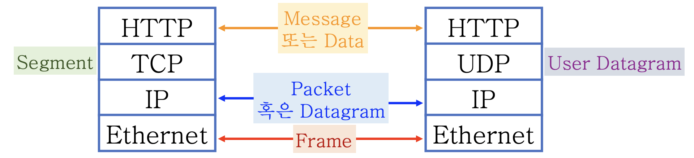
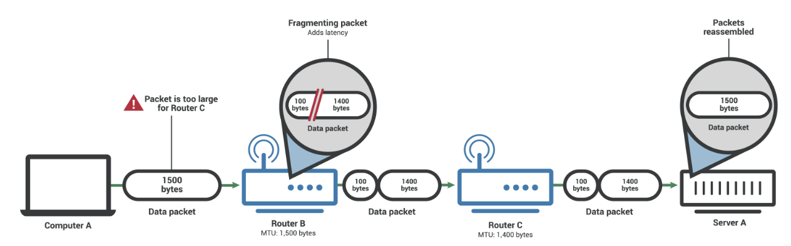
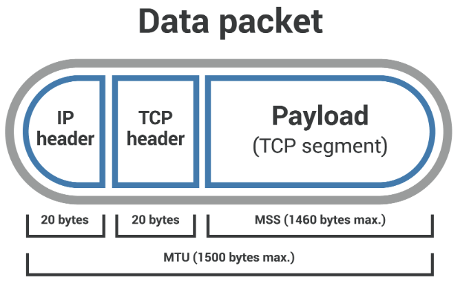
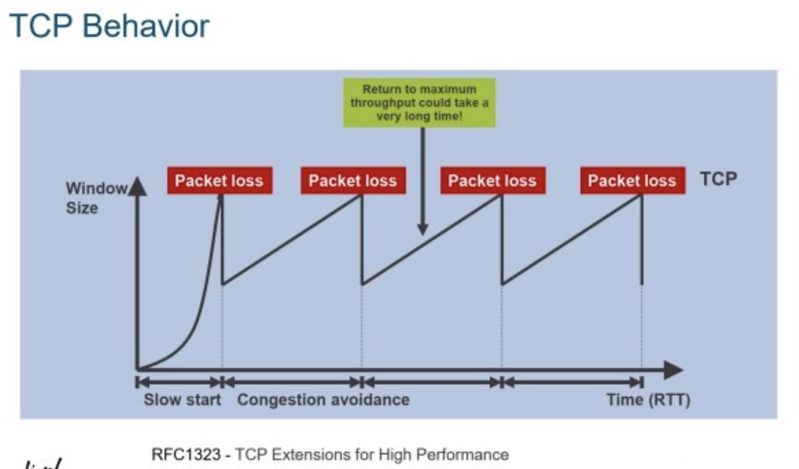
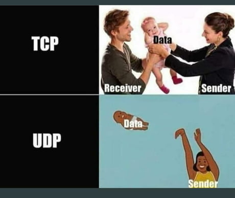
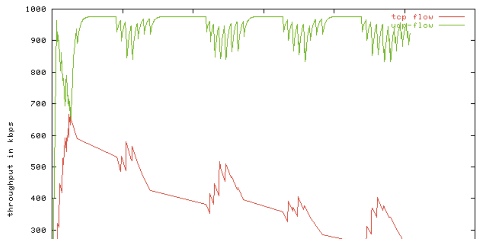

어제에 이어서 정리 한다!

#### Routing과 Forwarding

- Routing  
  길찾기 : 내가 어떤 선택 가능한 경로들을 가지고 있나?
  데이터 전송의 본질적인 부분이 아닌 컨트롤의 영역.
- Forwarding
  전송하기 : 선택 가능한 경로들 중 하나를 골라서 보낸다.
  데이터 전송의 본질적인 영역.
  목적지에 따라 골라서 보내기 때문에 Switching이라고도 한다.

#### Routing table 과 Forwarding table

앞서 말했듯이 라우팅은 길을 찾는 것이고, 포워딩은 찾은 길을 가는 것이다.  
그렇기 때문에 라우팅 테이블은 목적지까지 가기위한 다음 홉 위치를 다 기록하는 반면, 포워딩 테이블은 내부 알고리즘을 통해 선택 된 위치만을 가지고있다.

> 내부 알고리즘  
> 내부 내트워크에서의 라우팅은 어떻게 연결되었는지, 정확히 알 수 있기 때문에 최적의 경로를 선택할 수 있지만, 인터넷에서의 라우팅은 최적의 경로를 알 수 없기에 정책(Policy-based) 기반의 라우팅을 우선시 한다.  
> 이런 inter-domain간의 라우팅 단순히 속도, 비용만을 고려하는게 아니라 정책이 모든 것을 override한다.  
> => 인터넷은 가장 빠른 방식으로 통신하는 것이 아니다!  
> => 정책은 중간에 바뀔 수도있다.
> 이는 우리가 개발하는 서비스의 latency와 jitter에 영향을 준다.
> latency는 어느정도 지리적 거리와 부합하지만 무조건은 아니다!

#### Latency(Delay)와 Jitter(버벅임)

- Latency  
  얼마나 늦게 도착하는가?
- Jitter  
  Latency의 변화 정도(Latency 사이 차이의 평균값으로 계산한다.)

- Interactive한 시스템에 미치는 영향

각각 반응이 늦게 온다는 느낌, 자꾸 튄다는 느낌을 준다.

실시간 서비스의 경우 Jitter에 영향을 크게 받겠지?  
이처럼 어떤 서비스냐에 따라 latency에 집중할지, jitter에 집중할 지도 달라진다.

#### Multi-homing

개별 호스트 또한 여러 네트워크에 연결 될 수가 있다.

앞서 공부한 것 처럼 네트워크는 점들을 선으로 연결한 것이기 때문에, 개별호스트를 여러 선으로 연결한 다는 의미이다.

이걸 가능하게 하는게 NIC이다.

NIC가 여러개가 있으면 호스트를 여러 네트워크에 연결하는 것이다.  
NIC가 여러개이기 때문에 IP도 여러개이고, 호스트는 복수개의 IP를 가질 수 있는 것이다.

그렇다면 호스트는 트래픽을 어디로 내보낼지 어떻게 정할까??(어떤 NIC를 통해 내보낼 지 어떻게 정할까?)  
개별 호스트 또한 라우팅 테이블을 가지고 있다(다만 forwarding은 하지 않는다).

#### NIC(Network Interface Card)

호스트를 네트워크에 연결하기 위한 컴포넌트로, 호스트에 L2 주소를 부여할 수 있게 한다.  
보통은 하드웨어이지만, OS입장에서는 L2수준에서의 송수신만 가능하면 되기 때문에 하드웨이어인지 소프트웨어인지 알 수가 없다.  
이 때문에 가상머신(Virtual Machine)환경에서는 소프트웨어로 구현 된 가상 디바이스 (Virtual Device)로 추가/삭제가 가능하다.

### Switch

사전적 의미로는 전환하는 것을 의미하고, 네트워크에서는 이쪽, 저쪽으로 가세요 라고 트래픽의 방향을 전환하는 것을 의미한다.  
이 때도 어디로 보낼지 판단하기 위해서는 *판단의 근거*가 있어야 한다.  
이 *판단의 근거*는 바로 **해당 계층의 헤더**가 된다.  
그 계층의 숫자를 붙여서 L2 스위치, L7스위치 라고 부른다.
L7 스위치 -> L7의 헤더를 보고 트래픽을 어디로 보낼지 결정할게요!

장비를 생각하지 말고 기능에 집중하면 더 이해가 쉽다.

클라우드에서는 대부분 소프트웨어로 이 기능을 제공한다.

### 각 프로토콜 1개 데이터 단위의 이름(PDU)

PDU(Protocol Data Unit)은 각 프로토콜의 1개 데이터를 지칭한다.

{: style="display: block; margin-left: auto; margin-right: auto; width: 70%;" }

Frame은 사이즈가 고정적이다.

보통 뭉뚱그려서 패킷이라고 표현하지만, 패킷은 IP의 데이터 단위 이다.

IP가 Datagram이라고 했는데, UDP는 User Datagram 이다. 무슨 관계가 있을까??  
IP를 바로 가져다가 쓰고 싶은데, 그럴수가 없다. 그래서 Datagram의 형태로 껍데기 역할을 해주는 게 User 수준에서 Datagram을 쓴다고 해서 UDP 이다.

#### Data Link Layer(Ethernet Frame)

헤더에는 CRC가 있기 때문에 Ethernet은 frame 오류를 걸러 낼 수 있다.

> CRC(Cycle Redundancy Check)  
> 데이터의 전송, 저장 중의 오류를 검출하기 위해 사용하는 기법

또한 헤더에는 최대 길이(1500B)가 정해져 있기 때문에 그걸 넘으면 버려지므로 상위계층에서 쪼개서 보내야 한다.

#### Network Layer(IP Packet(Datagram))

IP packet의 최대길이는 Total Length가 16비트 이기 때문에 헤더 포함 64KB이며, 더 큰 데이터는 상위 계층에서 64KB단위로 쪼개서 보내야 한다.

앞서 Ethernet이 최대 1500B라고 했으니 IP packet을 여러 Ethernet frame으로 쪼개서 보내야한다.(fragmentation)

에러같은 경우는 Header 영역의 에러만 제한적으로 검출 할 수 있다.  
이는 효율성 대문으로 Hop-by-Hop 방식인 IP는 hop을 지날 때 마다 header의 TTL을 변형하여 전체를 매번 다시 계산하는 것이 부담스럽다.

또한 IP는 전송을 보장하지 않는다. header에 그런 field가 없으니까!

그럼 IP packet은 한 번에 64KB씩 보내니까 하위 data link layer의 payload 길이 제한을 넘는 경우에는 여러 개의 IP packet으로 쪼개져서 전송한다.  
받는 쪽에서는 쪼개진 data link layer의 payload를 재결합 해서 IP packet으로 복원한다.

이 때 하나라도 누락이 되면 IP packet은 전체 누락이 된다(전송 보장을 안해주니까) 그리고 누락 되었음을 알려줄 수 있는 방법은 없다(그냥 소리소문없이 갖다버림).

best-effort - IP는 최선을 다해 전송을 시도할 뿐 전송을 보장하지는 않는다.

#### Transport Protocols(L4 protocols)

- UDP(User Datagram Protocol)  
  앞서 말했듯이 Datagram을 쓰고 싶은데 IP를 바로 쓸 순 없으니 껍데기를 입히는 것이다.  
  정리해서 L3 layer(Network layer)인 IP의 기능을 L4 layer(Transport layer)에서 그대로 가져다 쓰게 하기 위해서 만들어진 프로토콜 이다.  
  그렇기 때문에 헤더가 복잡하지 않고 심플하다(하는게 없어).  
  포트를 구분하는 것, checksum(데이터의 손상여부에 대한 최소한의 검즘) 외에는 IP 속성을 그대로 가진다. 근데 IP에서 전송 보장을 하지 않았었다.  
  고로 UDP도 전송을 보장하지 않는다.  
  또한 IP의 속성을 갖기 때문에 IP 헤더 포함 64KB 이내에서는 보낸 그대로 수신측에서 받게 된다.  
  그말인 즉슨 데이터그램 단위로 데이터를 모두 받아야 읽는 것이지 그 일부를 읽을 순 없다는 뜻이다.  
  그래서 완전히 수신했다. 수신하지 못했다. 의 두 가지만 존재하는 것이다.  
  독자적으로 쪼개고 재결합 하는 기능을 제공하지 않는다(IP에 의존함) 이건 위의 특징을 생각하면 당연한 것!  
  IP와 마찬가지로 best-effort이다.
- TCP(Transmission Control Protocol)  
   전송을 제어하는 프로토콜(전송의 보장 등). 그러니까 헤더가 복잡해.  
   Sequence number과 Acknowledgment number, window size가 있는데 Sequence number을 통해서 데이터가 연속적인 것 같은 환상을 지원한다. 그래서 지금 보내는게 바이트 단위로 몇번째인지 알려준다.  
   그리고 수신하는 입장에서는 Acknowledgment number을 통해서 어디 까지 받았으니까 내가 다음 받을 것은 어디부터야! 가 되기 때문에 보내는 입장에서 어? 아까 줬는데 왜 저기부터 달라고 하지? => 누락됬구나!! 가 되어 다시 보내주게 된다.  
   Window size를 통해서는 내가 얼마를 받을 수 있어! 라고 수신자의 여력을 체크한다.

  전체 흐름을 이해하기 위해서 필요한 개념이 두 가지가 더 있다.

  - MTU(Maximum Transmission Unit)  
    네트워크에 연결된 장치가 받아들일 수 있는 최대 데이터 패킷 크기를 의미하며, 보통 1500B이다.  
    패킷의 크기는 L3의 패킷을 참조하여 만들어지며 이는 (IP헤더 + TCP 헤더)(40B) + payload의 크기 이다.

    {: style="display: block; margin-left: auto; margin-right: auto; width: 70%;" }

    가령 서버 A와 컴퓨터 A가 연결되어 있지만 데이터를 라우터 B와 라우터 C를 거쳐야 한다고 한다면 서버 A, 컴퓨터 A, 라우터 B 모두 MTU가 1500B라고 할 때, C는 MTU가 1400B라고 하자. 그럼 라우터 C의 MTU를 모르고 1500B의 패킷을 보내면 중간 단계의 라우터 B에 의해 분할되게 된다.  
    위의 예시에서 처럼 네트워크 경로 상의 아무장치나 MTU보다 패킷이 크다면 분할이 되게 된다.

  - MSS(Maximum Segment Size)  
    최대 세그먼트 크기는 MTU처럼 패킷의 헤더까지 포함하는게 아니라 페이로드의 크기만을 고려한다.  
    구체적으로는 네트워크에 연결된 장치에서 수신할 수 있는 가장 큰 TCP세그먼트의 크기이다.
    그렇기 때문에 MTU - (IP header + TCP header) = MSS 가 성립해서 보통 1460B이다.

    {: style="display: block; margin-left: auto; margin-right: auto; width: 60%;" }

  따라서 MSS와 MTU의 차이점은 패킷이 MTU를 초과하면 Fragmentation이 일어나지만, 패킷이 MSS를 초과하면 삭제되고 전달 되지 않는다는 점이다.

  자 이제 전체 흐름을 보겠다.

  TCP는 데이터 스트림을 바이트 단위로 관리하며 각 바이트에 squence number을 부여하여 데이터의 순서와 무결정을 보장한다. IP 계층으로 보내기 전 MSS 단위로 세그먼트를 만들어주고 IP계층에서는 세그먼트를 IP 패킷으로 캡슐화 한다(이러면 MTU를 초과하지 않는다).  
  이 세그먼트에 시퀸스 번호는 각 세그먼트의 시작바이트의 번호가 있다.  
  IP 계층에서는 패킷의 크기가 MTU를 초과하게 되면 프래그먼트로 나누는 프래그멘테이션이 일어난다.  
  각각의 프래그먼트는 독립적인 IP패킷으로 취급되며 수신 측에서는 이를 재조립하여 원래의 큰 IP 패킷으로 조립을 하게 된다.  
  그 후 IP 헤더를 제거하고 TCP 세그먼트를 추출하여 TCP 계층으로 전달되고, TCP는 세그먼트를 바이트 스트림 데이터로 합쳐서 응용 계층으로 주게 된다.

여기서 의문이 드는 점이 IP계층에서 64KB까지는 받는다며??? 왜 MSS 단위로 나누는 거야? 라고 한다면 프래그멘테이션이 일어나면 데이터 유실의 확률이 올라가기 때문과 또한 네트워크의 추상화를 통해 아랫 단계에서 윗 단계의 상황을 고려하지 않고 개발이 가능하도록 하기 위함이다.

#### TCP의 Connection 기반

앞의 설명에서 알 수 있듯이 TCP는 특정 상대방을 가정하고 전송한 data의 byte 단위 sequence번호, 어디까지 수신했는지 byte 단위의 ack 번호를 관리하기 때문에 기억을 하고있다 => 연결 기반이다 라고 한다(실제 물리적인 연결이 아니다! 중간에 하나가 끊어졌다고 하더라도 알려줄 방법도 없고, 경로는 바뀔 수있기 때문에 끊겼다고 보장할 수도 없다. 어디까지 보냈는지를 tracking하기 때문에 논리적인 연결을 의미하는 것이다).  
이렇게 통신 양 끝단의 state를 관리하기 때문에, TCP는 **Stateful** 하고 **conntection** 기반인 것이다.

#### TCP의 전송제어

TCP의 관심사

- 수신자의 여력(버퍼크기) : TCP header 중 Window Size 필드

- 중간에 거쳐가는 게이트웨이(라우터)들의 여력(버퍼크기) : TCP header 중 SEQ/ACK 필드

수신자가 얼마나 받을 수 있는지, 중간의 게이트웨이 등이 과부하가 왔는지를 통해 바이트 단위로 보내는 양을 조절 할 수 있고, 그게 이름의 뜻이다.

#### TCP Window Size

상대방에게 자신이 얼마나 큰 데이터를 한 번에 받을 수 있는지 알려준다.

Socket library 로는 setsockopt를 통해 변경이 가능하다.

#### TCP의 혼잡 제어

수신자는 다음에 보낼 SEQ를 의미하는 ACK를 전송하지만 바이트 단위로 ACK를 기다리고 보내면 너무 비효율 적이기 때문에, 한 번에 보낼 수 있는 데이터 양만큼 보내고 ACK를 기다린다.

이 때 ACK를 받을 때마다 한 번에 보낼 수 있는 데이터 양을 증가시킨다.(아 요정도는 잘오네~)  
그러다가 ACK가 누락되거나 순서가 뒤집혀 오면 혼잡이라고 판단하고, 한 번에 보낼 수 있는 데이터 크기를 리셋하고 이전에 보낸 데이터를 다시 보낸다.

그렇기 때문에 TCP의 한 번에 보낼수 있는 크기(congestion window)는 일정할 수 없다.  
처음부터 최고 속도로 데이터를 전송하지는 않고, congestion이 발생할때까지 키우다가 congestion이다 하면 다시 congestion window를 줄였다가 다시 키운다.

{: style="display: block; margin-left: auto; margin-right: auto; width: 60%;" }

그렇기 때문에 jitter가 발생할 수 밖에없고 interactive 한 서비스에 부적합 한 것이다.

그래서 이론적으론 위에서 제시한 큰 흐름대로 가겠지만 실제로는 TCP가 몇 개의 IP 패킷으로 갈지는 알 수가 없다.  
바이트 단위로 갈 수 도 있고, consetion window의 크기는 바뀌기 떄문이다. 대부분은 한 번에 갈 것이다.

그렇다면 송신 측에서 100B를 보낸다면 수신측에서 100B를 읽으려고 할 때 100B를 읽을 수 있을 까?

위 결과에 따라 그럴수도 있고 적게 읽힐 수도 있다.

때문에 TCP socket 프로그래밍에서는 이를 반드시! 고려한다(받기 관련 함수들이 요청한 바이트 수 만큼 받고 반환하는 것이 아니라는 것이다).

#### UDP와 TCP의 결론

UDP와 TCP는 모두 L4 프로토콜 이다.  
UDP는 L3인 IP를 L4에서 쓸 수 있게 하기 위한 껍데기이고, TCP는 혼잡 제어와 그 과정 중에 재전송이라는 기능을 제공한다(안정적이다).

UDP는 best-effort라고 했다. 요청 즉시 최선을 다해 전송을 한다.  
반면 TCP는 서서히 속도를 올린다(안정석 보장 밑 starvation 방지). 거기다가 누락되면 재전송까지 한다.  
따라서 같은 사이즈의 데이터를 전송 할 때 UDP가 빠를 수 있다.

- TCP  
  전송 속도를 서서히 올린다.  
  재전송을 제공한다.  
  혼잡 제어를 통해 트래픽을 양보한다.  
  위의 특성들 때문에 전송 속도는 진동한다.  
  위의 특성들 때문에 end-to-end의 state를 관리하므로 연결기반이다.  
  속도 상관없이 안정적인 통신에 적합하다.

- UDP  
  IP와 마찬가지로 best-effort이다.  
  안정성이 희생되더라도 빠른 통신에 적합하다.  
  end-to-end로 관리되는 state가 없기 때문에 연결기반이 아니다.

#### UDP 와 TCP의 선택

{: style="display: block; margin-left: auto; margin-right: auto; width: 60%;" }

위의 이유들로 인해 목적에 따라 둘의 선택이 달라진다.

누락되어도 상관이 없고 빨리 전송해햐 하는것 => UDP  
일반적으로 interactive 한 audio, video 등.  
누락 되는 것에 대비해서 각각의 datagram에 충분한 데이터를 넣는다(앞이 누락되어도 뒤에걸로 복구 가능하게).

누락되면 안되는 데이터를 안정적으로 전송해야 하는 것 => TCP  
file 전송, 인증 처리 등.

#### UDP vs TCP

TCP는 위에서 배운대로 congestion window를 줄이고 전송 트래픽을 줄인다.  
그럼 UDP는 신경도 안쓰고 막 보내다가 TCP가 양보한 대역폭 까지 다 먹어버린다.

{: style="display: block; margin-left: auto; margin-right: auto; width: 60%;" }

예로서 Netflix는 UDP를 사용한다.  
그럼 통신사는 너네껄 제한을 하던지 돈을 더 내라고하고싶다 => 망사용료 이슈.

#### UDP Socket

최선을 다 해서(best-effort)전송할 뿐.  
통신 상대에게 어디까지 전송했는지, 전송 받았는지 기록하지 않는다(stateless).  
단지 내주소와 상대 주소만 기재 할 뿐

- UDP 헤더 상에서 주소 요소는 source port, destination port이지만,
- IP 헤더까지 포함하면 sourceIP, destinationIP가 같이 주어진 것.

상대에 대해서 기억하는 것이 없으므로

- 하나의 socket으로 여러 상대에게 전송하는 것이 가능할 것이다.
- 다만 송수신 상대가 누군지는 매번 알려줘야 할 것이다.

하나의 전송 요청은 하나의 datagram으로 간다.  
받는 쪽에서는 아예 못 받거나, 전체를 다 받는다.(부분적으로 받는건 없다)

#### TCP Socket

SEQ, ACK를 통해 어디까지 전송했는지, 전송받았는지를 기록한다.(stateful)  
당연히 주요 요소들 (IP, port)가 필요하다.  
통신 상대와의 주고 받은 내역을 기억하고 있으므로

- socket하나로 여러 상대와 통신하는 것은 불가능하다.
- socket하나가 특정 상대를 의미하기 때문에 매 송수신 별로 주소를 쓸 필요는 없다.

- 데이터가 물 흐르듯(stream) 가는 것 처럼 보이게 한다.  
  한 번 send하더라도, byte 단위로 쪼개서 읽힐 수 있다. => 원하는 만큼 읽게끔 반복해야 한다.

#### bind() 함수

bind() 함수는 자신이 사용할 IP/Port를 지정한다.  
이 IP/Port는 통신할 때

- IP헤더의 source IP
- TCP/UDP 헤더의 source port로 사용된다.

서버의 경우 주소가 고정되어야 하므로 _보통_ 서버에서 사용한다(클라이언트에서 사용해도 된다).

0.0.0.0이 아닌 특정 주소로 bind를 하면 그 주소만 받는다.

참고 : [MSS_MTU](https://www.cloudflare.com/ko-kr/learning/network-layer/what-is-mss/), 명지대학교 문대경 교수님 강의, [UDP_TCP 사진](https://medium.com/@kobester/basics-tcp-vs-udp-d6e84d78d00a)
