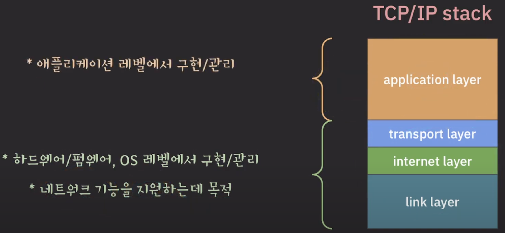

오늘은 7주차 키워드에 대해 정리해보았다.

## 서버 클라이언트 모델

### 서버와 클라이언트란?

단순하게는 네트워크에서 데이터를 주는 컴퓨터를 **서버(Server)**, 데이터를 요청하고 받는 컴퓨터를 **클라이언트(Client)** 라고 할 수 있다.

그 목적에 집중해서 본다면, 컴퓨터가 데이터를 주고 받는 행위를 하는 목적은 *특정한 기능(서비스)*를 제공하기 위함 이기 때문에, 네트워크로 연결된 컴퓨터 중 서비스를 *제공*하는 쪽이 서버, 서비스를 *요청*하고 받는(사용하는)쪽이 클라이언트가 된다.

즉 서버와 클라이언트를 구분하는 것은 그 **역할**인 것이다.  
예를 들면 서버라고 하더라도 다른 서버의 서비스를 활용한다면 그 순간 클라이언트의 역할을 하게 되는 것이다.  
또한 스마트폰도 Wifi Hot Spot을 열어주게 된다면 인터넷 연결이라는 서비스를 제공하는 서버 역할을 하게 된다.

#### 클라이언트와 서버의 입장

클라이언트는 서비스가 필요한 경우 서버에게 요청하고 받으면 되지만, 서버는 언제 어떤 클라이언트가 요청을 해도 서비스를 제공할 수 있도록 24시간 내내 네트워크를 관리하며 다수의 클라이언트에게 서비스를 제공해야한다.

{: style="display: block; margin-left: auto; margin-right: auto; width: 50%;" }

### 서버 클라이언트 모델의 등장 배경

초창기에는 집집마다 인터넷이 되는 경우가 드물었고, 때문에 일반적으로 정보를 몰아넣고 중앙에서 관리하는 중앙 집중형 컴퓨터가 빈약한 다른 컴퓨터들에게 서비스를 제공하는 형태를 갖추게 되었다.

이후 기술의 발전으로 가정에 소형 컴퓨터가 보급이 되면서 분산된 컴퓨터 환경이 등장하게 되었고, 그럼에도 여전히 파일, DB등을 공유 해야 했기 때문에 서버가 이를 관리, 제공하고 클라이언트는 필요한 자원을 요청하는 모델이 필요하게 되었다.

### 서버 클라이언트 모델이란?

한 대의 서버에 다수의 클라이언트가 접속하여 서비스를 이용할 수 잇는 방식을 서버 클라이언트 모델이라고 한다.

{: style="display: block; margin-left: auto; margin-right: auto; width: 70%;" }

그림에서 볼 수 있듯이 다수의, 다양한 클라이언트가 서버에게 서비스를 요청한다.  
이 때의 상호작용에 대해 규칙을 정해놓은 것이 프로토콜이다. 이 프로토콜을 따르기만 한다면, 종류와 사양에 관계없이 필요한 데이터를 주고 받을 수 있다.

우리가 너무 당연하게 사용하고 있는 것 중 대표적인 서버 클라이언트 모델은 WWW(월드 와이드 웹)이다.

웹 브라우저를 클라이언트, 웹 서버를 서버로서 사용하며 WWW는 다수의 웹 브라우저에게 하나의 웹 서버의 데이터를 제공한다(휴대폰이는 태블릿이는 컴퓨터든 모두 접근 할 수 있다).

### 서버 클라이언트 모델의 장단점

서버 클아이언트 모델은 서비스가 직관적이고, 중앙에서 데이터를 관리하기 때문에 데이터의 무결성을 유지 할 수 있으며, 중복 된 자원을 사용하지 않아도 되기에 효율적이다.  
또한 한 번의 업데이트로 여러 클라이언트에 동시에 적용할 수 있기에 관리, 비용 측면에서 장점을 보인다.

하지만 위 특성 때문에 생기는 단점도 존재한다.  
서버에 의존적이기 때문에 서버에 문제가 생기면 모든 클라이언트가 그 영향을 받게 되며, 과부하 문제는 서버 뿐만 아니라 네트워크에도 발생 할 수 있기 때문에 부담이 따르게 된다.

참조 : [Server_waiting_img](https://dev.to/neisha1618/client-server-architecture-efe), [Client_server_model_img](https://www.naukri.com/code360/library/client-server-model), [서버 클라이언트 모델 참고자료 1](https://www.cloudflare.com/ko-kr/learning/serverless/glossary/client-side-vs-server-side/), [서버 클라이언트 모델 참고자료 2](https://m.blog.naver.com/studiopil/220837871908), [서버 클라이언트 모델 참고자료 3](https://better-together.tistory.com/60)

## Port

### Port의 정의

{: style="display: block; margin-left: auto; margin-right: auto; width: 70%;" }

위 사진에서 보듯이 아래의 3개의 계층은 application 계층이 네트워크 서비스를 구현할 수 있도록 지원하는데 목적이 있지만, application계층은 네트워크 기능을 사용하는데 목적이 있다.

{: style="display: block; margin-left: auto; margin-right: auto; width: 70%;" }  
Port와 Socket은 저 둘 사이에 있는 개념이다.  
그렇기에 위 사진처럼 application 과 system으로 나누어서 이해를 하겠다.

{: style="display: block; margin-left: auto; margin-right: auto; width: 70%;" }

Application 계층에 프로세스가 하나 있고, 이 프로세스가 네트워크 통신을 하고 싶다면, **통로**를 통해서 시스템으로 데이터를 내려줘야 시스템의 네트워크 기능을 이용해서 주고 받을 수 있을 것이다.

프로세스와 연결되어 **통로** 역할을 해주는 것을 Port라고 부른다.

{: style="display: block; margin-left: auto; margin-right: auto; width: 70%;" }

프로세스는 하나만 있는게 아니라 여러개가 있을 수도 있고, 하나의 프로세스에 여러개의 포트가 있을 수도 있다.  
그럼 이 포트들을 어떻게 유니크(유일)하게 식별할 수 있을까? 라고 한다면 port number을 통해 식별을 한다.

#### Port(number)

16비트로 이루어진 숫자이다(0 ~ 65535).
그럼 유니크하게 포트를 식별하기 위해서는 각 호스트에서 port number을 지정해 주면 되지만, port number만으로는 인터넷 상의 수많은 포트에 비해 숫자가 부족해서 유니크 하게 식별할 수가 없다.  
이 때 IP주소를 통해서 각 host를 유니크하게 식별할 수 있다는 걸 생각해야한다!

그렇다면 각 호스트를 IP 주소를 통해서 유니크하게 식별하고, 그 호스트 내에서 port number를 부여하면 되겠네?  
그래서 IP 주소 와 port number를 이용하는 개념이 새롭게 등장한다.

## 소켓(Socket)

### 소켓의 정의

IP주소와 port number를 함께 이용하는, 인터넷 상에 존재하는 각 port를 유니크하게 식별하기 위한 주소가 곧 소켓인 것이다.
즉 각 socket은 인터넷 상에서 유니크 하다 라는 결론까지 도달할 수 있다.

> Connection  
> 어제 공부했던 TCP에서 안정적이고 논리적인 통신통로를 여기서 Connection이라고 표현했다.  
> TCP는 Connection Oriented Protocol이다!

#### TCP에서의 Connection과 Socket의 관계

{: style="display: block; margin-left: auto; margin-right: auto; width: 70%;" }

위 그림은 두 호스트가 Internet을 통해 연결되어 있는 모습을 나타낸 그림이다.

안정적으로 데이터를 전송하기 위해서는 각 Connection마다 따로 정보를 관리 해주어야 하는데 Connection을 유니크하게 식별할 수 없다면, 지금 어떤 Connection에 대해 처리를 하고있는지 시스템이 판단할 수 없을 것이다.

그렇기에 각 Connection은 유니크 하게 식별 할 수가 있어야 한다.  
이를 위해 TCP 표준에서는 한 쌍의 socket으로 connection을 유니크하게 식별할 수 있다고 한다.

이게 무슨 의미냐면, 각 호스트에서 IP 주소와 port number을 통해서 유니크한 socket을 가지고 있을 것이고, 이 유니크한 소켓 한쌍이 연결되어 connection이 만들어지기 때문에 _한 쌍의 socket으로 connection을 유니크하게 식별할 수 있다_ 라고 하는 것이다.

{: style="display: block; margin-left: auto; margin-right: auto; width: 80%;" }  
{: style="display: block; margin-left: auto; margin-right: auto; width: 80%;" }  
위 그림은 한 쌍의 Socket과 그 의미를 나타낸 것이다.

또한 하나의 socket은 동시에 여러 connection들에서 사용될 수 있다.  
이것도 당연한 얘기인데 한 프로세스에서 제공하는 서비스를 다른 여러 프로세스에서 원할 수 있기 때문에, 여러 connection에서 하나의 socket을 사용할 수 있는 상황이 생기는 것이다.

#### UDP에서의 Socket

UDP의 특징으로 Connectionless 하고 unreliable 하다는 특징이 있다는 걸 어제 정리 했었다.

- Connectionless : 연결을 맺지 않고 바로 데이터를 주고 받는다.
- Unreliable : internet protocol을 거의 그대로 사용하니까 당연하다.

그런데 UDP의 표준문서에는 socket이라는 단어가 등장하지 않는다!  
그에 반에 TCP에서는 socket이라는 용어가 자세하게 설명되어 있다. 이로 미루어 보아 socket이라는 용어가 처음 등장한 것은 TCP의 connection을 설명하기 위해 등장하였고, IP와 portnumber은 UDP에서도 동일한 개념이기 때문에 이후 UDP에 적용하게 된게 아닌가!  
팩트는 아니고 들은 강의자의 추측인 것 같으니 참고만 하면 될 것 같다(이해를 돕기 위한).

#### 정리

TCP/IP stack에서의 Socket의 개념은 TCP에서만이 아니라 UDP에서도 포함이니까 IP주소 + portnumber 뿐만 아니라 (protocol, ip address, port number)로 유니크하게 식별할 수 있다.

출처 : [쉬운코드](https://www.youtube.com/watch?v=X73Jl2nsqiE&t=117s)
