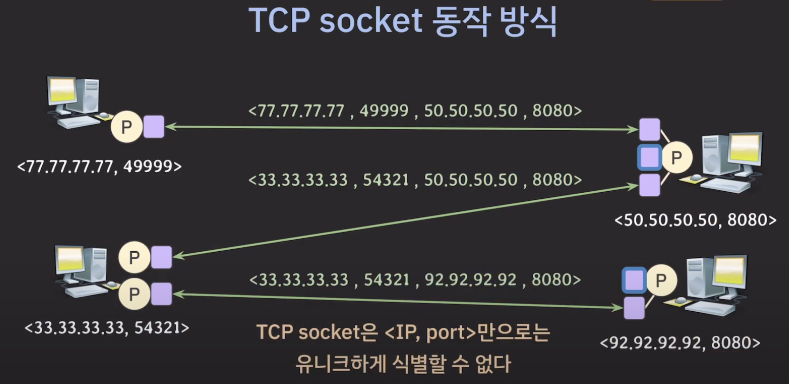
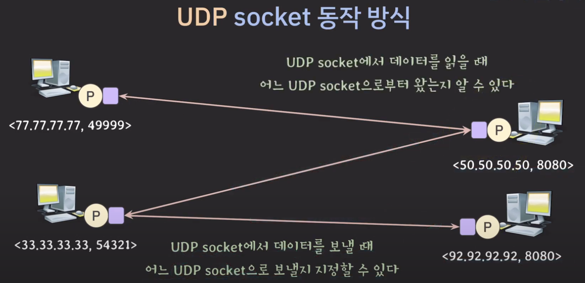
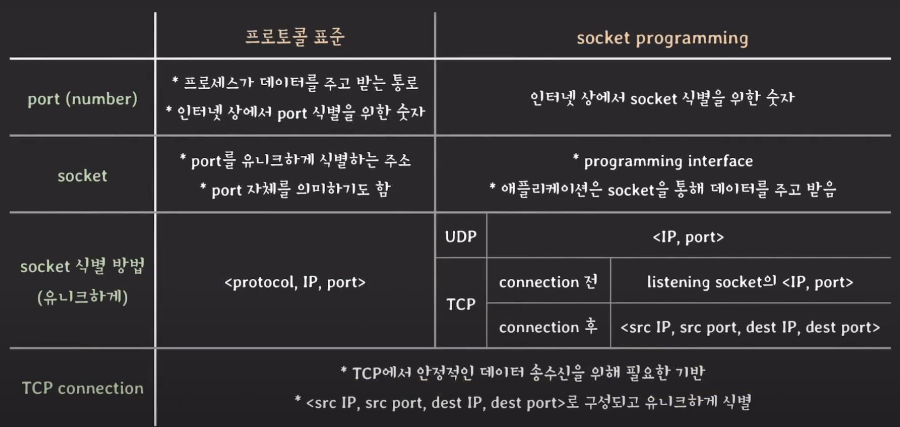

오늘은 어제에 이어서 시작한다.

# 실제 시스템이 동작 하는 관점에서의 정의

앞서 CSAPP 책에서도 봤었지만, 어플리케이션이 시스템의 기능을 함부로 써서는 안된다.  
대신 인터페이스를 통해서 시스템 기능을 사용할 수 있도록 만들어 주어야 한다.

## 소켓

어플리케이션이 네트워크 기능을 사용할 수 있도록 시스템이 제공하는 프로그래밍 인터페이스를 바로 소켓이라고 한다.  
즉 어플리케이션은 Socket을 통해서 데이터를 주고 받는다.

이 때, 프로그래밍 인터페이스라고 표현한 이유는 개발자는 *socket programming*을 통해 네트워크 상의 다른 프로세스와 데이터를 주고 받을 수 있도록 구현하기 때문이다.

대부분의 시스템은 socket의 형태로 네트워크 기능을 제공한다. 허나 보통 socket을 직접 조작해서 통신 기능을 구현할 일은 적다.

> application layer의 프로토콜은 보통 라이브러리, 모듈 형태로 해당기능이 제공되는데 뜯어보면 소켓을 활용하여 프로토콜을 구현했음을 알 수 있다.

### Port(number)

Port(number)는 socket을 식별하기 위해 부여되는 숫자이다.

### Socket의 정의

(protocol, IP address, port number)로 정의가 된다.

읭?? 똑같잖아! 그럼 표준에서의 정의와 뭐가 다른데! 라는 생각이 들었었지만, 중요한 점을 놓쳤다.  
표준에서는 저 세 요소로 유니크(유일)하게 소켓을 식별할 수 있다고 했지만, 여기선 그러지 않았다.

TCP에서는 유니크하지 않고, UDP에서는 유니크하다.

다음 그림과 함께 이유를 정리해보겠다.

#### TCP에서의 Socket

{: style="display: block; margin-left: auto; margin-right: auto; width: 70%;" }

표준에서와 다르게 실제로 TCP를 구현할 때에는 서버 쪽에 Listening socket이 존재한다.  
이름 그대로 클라이언트에서 요청이 오면 받을 수 있도록 대기하고 있는 소켓이다. 이 소켓 또한 본인의 IP주소와 port number을 가지고 있다.  
표준에서는 connection을 만들 때, 3-way-handshake를 통해 해당 소켓과 연결하여 connection이 생겼지만, 실제로는 Listening socket은 connection이 성립 될 때 같은 IP주소와 port number을 가지는 새로운 소켓을 만들어 연결을 완료하게 된다.

그렇기 때문에 TCP에서는 IP주소와 port number만으로는 유니크하게 식별할 수가 없다.(protocol은 TCP로 고정이니까)

그럼 어떻게 누가 요청을 했고 누구한테 요청을 해야할 지 구분을 할까??

(src IP Address, src Port number, dest IP Address, dest Port number)의 쌍으로 구분을 한다.  
요청을 보낼 때, 헤더에 저 정보를 담아서 보내게 되면, 비록 목적지에는 동일한 IP 주소와 port number을 가지는 소켓이 복수 있더라도 src의 정보까지 비교를 통해 누가 보냈고 어디서 받아야 할 지를 구분할 수 있는 것이다.

그렇다면 서버는 저렇게 되는 걸 알겠고, 클라이언트에서는 이런 일이 없을까?

클라이언트에서도 일정 조건을 만족한다면 해당 경우(복수의 소켓이 같은 IP주소와 port nubmer을 가지는 일)가 발생할 수 있다.

어제 공부했듯이, port number의 수는 유한하다. 가용한 port number을 모두 사용하고 나서도 더 필요하게 되면, 이미 사용한 port number을 배정하게 된다. 그럼 같은 IP 주소와 port number을 가지는 소켓이 복수 클라이언트에 생기게 되는 것이다.

그럼 서버에서는 어떤 소켓에 요청한 데이터(서비스)를 제공해야할 지 어떻게 구분할까?

마찬가지다! 보내는 IP 주소와 port number, 받는 IP주소와 port number을 헤더에 담아서 각 쌍을 비교하여 유니크하게 소켓을 식별한다.

그렇기 때문에 결론적으로 실제로 구현을 했을 때, 표준의 정의와 다르게 IP 주소와, port number만으로는 유니크하게 소켓을 구별할 수 없다는 뜻이다.

#### UDP에서의 Socket

UDP에서는 IP주소와 port number만으로 유니크 하게 소켓을 구분할 수 있다고 했다. 지금부터 그 이유를 알아보자.

{: style="display: block; margin-left: auto; margin-right: auto; width: 70%;" }

UDP가 무엇인지에 대해 다시 생각해보면 이해가 쉽다.  
신뢰할 수 없는 IP의 위에서 작동하며 신뢰할 수 있는 프로토콜을 만들기 위해 Connection이라는 개념이 등장했고, TCP는 connection을 기반으로 안정적인 데이터 송수신을 가능케 하지만, UDP는 거의 IP 그대로 동작을 하기 때문에 신뢰할 수 없는 통신이다.

그렇기에 UDP는 하나의 소켓에서 목적지 소켓을 정해서 데이터를 쏠 뿐이고, 받는 소켓에서도 아 이건 누가보낸거구나 만 판단하고 데이터가 유실되던 순서가 바뀌던 신경쓰지 않는다.

### Port(number)의 추가정보

#### Port(number)의 범위

16비트로 이루어진 숫자(0 ~ 65535) 중

- 0 ~ 1023 : Well-known ports, system ports  
  ex) HTTP(80), HTTPS(443), DNS(53)

- 1024 ~ 49151 : Registered ports(IANA에 등록 된 번호)  
  ex) My SQL DB(3306), Apache tomcat server(8080)

  > IANA(Internet Assigned Numbers Authority) : 인터넷 할당 번호 관리 기관

- 49152 ~ 65535 : Dynamic ports(등록 안 된 번호, 임시로 혹은 자동 할당 될 때 사용)

## 한눈에 보는 총 정리

{: style="display: block; margin-left: auto; margin-right: auto; width: 70%;" }

출처 : [쉬운코딩](https://www.youtube.com/watch?v=WwseO8l8rZc)
