오늘도 어제에 이어서 키워드를 공부해 봤다.

## 파일 디스크립터(File Descripter)

### 정의

파일 디스크립터는 시스템으로 부터 할당 받은 파일을 대표하는 음수가 아닌(Non-negetive Integer)0, 양의 정수이다.  
이 숫자는 프로세스에서 열린 파일의 목록을 관리하는 FD table의 인덱스로 사용된다.

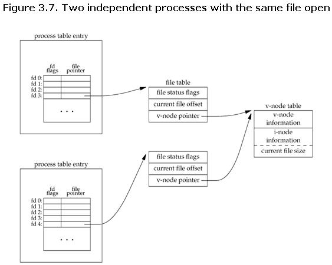{: style="display: block; margin-left: auto; margin-right: auto; width: 70%;" }

우리가 파일을 열거나 생성하면 커널은 프로세스에 파일 디스크립터를 반환한다.  
또한 열려있는 파일 디스크립터들에 대한 테이블(FD table)을 커널이 관리한다.

이후 read(), write() 등에서 해당 파일을 지칭하는 인자로 사용되게 된다.

파일 디스크립터는 가용한 파일 디스크립터들 중에서 차례대로 배정받게 되며, 파일을 close하게 되면 파일 디스크립터는 해제되어 다시 사용할 수 있게 된다.

### 기본적으로 할당 되는 파일 디스크립터

- 0 : 표준 입력(Standard Input)
- 1 : 표준 출력(Standard Output)
- 2 : 표준 에러(Standard Error)

그렇기 때문에 우리가 사용할 수 있는 부분은 3부터이다.  
파일 디스크립터의 범위는 0 ~ OPEN_MAX 이며, ulimit -n [값]으로 최대 제한을 조정할 수도 있다.

참조 : [파일디스크립터](https://stackoverflow.com/questions/5256599/what-are-file-descriptors-explained-in-simple-terms)

## 소켓의 유형

### Datagram Socket(UDP Sockets)

프로토콜 : UDP

- 비연결 지향적.
- 신뢰성이 없다.
- 속도가 빠르다.

### Stream Socket(TCP Sockets)

프로토콜 : TCP

- 연결 지향적.
- 신뢰성 있다.
- 속도 보단 안정성있는 통신을 지향.

## CGI(Common Gateway Interface)

### 배경

CGI가 나오기 이전에는 단순히 클라이언트가 정적인 컨텐츠를 요구했고, 서버는 가지고있던 정적인 컨텐츠를 찾아 응답만 해주면 됬지만, 이후 클라이언트는 단순한 정적 컨텐츠가 아닌 어떤 로직이나, 어플리케이션 프로그램의 실행 결과를 요구하여 이를 처리할 수 있는게 필요했다.  
예를 들면 회원가입 form을 작성하여 요청을 보내면 서버는 DB조회나 어떤 로직에 의해 나온 결과값을 응답으로 보내주어야 한다.

### 정의

서버와 어플리케이션 간에 데이터를 주고 받는 방식 또는 컨벤션을 의미한다.  
웹 서버의 종류가 다양하고, 프로그램 또한 다양하기 때문에 서로 입출력을 주고 받을 표준이 필요했고, 그게 CGI이다.  
이런 표준에 맞추어 만들어진 것이 CGI 스크립트이고, 어떤 프로그래밍 언어로도 만들어질 수 있다.

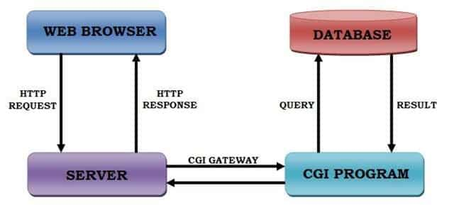{: style="display: block; margin-left: auto; margin-right: auto; width: 70%;" }

그림을 보면 알 수 있듯이, CGI 또한 하나의 인터페이스 일 뿐이고, 웹 서버와 요청을 처리할 로직을 가진 어플리케이션 프로그램 사이에서 작동을 하는 것이다.

### 장점과 단점

- 장점  
  언어, 플랫폼에 독립적이다.  
  매우 단순하고 다른 server-side 프로그래밍 언어에 비해 advanced task를 쉽게 수행할 수 있다.  
  재사용할 수 있는 CGI 코드 라이브러리가 풍부하다.  
  CGI가 웹 서버에서 실행 될 때 안전하다(웹 서버 프로세스와 독립적으로 실행되기 때문에).  
  CGI 코드를 수행하는데 특정 라이브러리가 필요하지 않기 때문에 매우 가볍다.

- 단점  
  HTTP 요청마다 새로운 프로세스를 만들기 때문에 요청이 많을 경우 성능이 급격히 저하 될 수 있다.  
  페이지 로드 사이에 데이터가 메모리에 캐시될 수 없다.

## WebServer

### 정의

웹브라우저와 같은 클라이언트로 부터 HTTP 프로토콜 요청을 받아, HTML문서 CSS등의 정적 웹 페이지를 응답해주는 소프트웨어 혹은 그 소프트웨어를 실행하는 서버 컴퓨터이다.

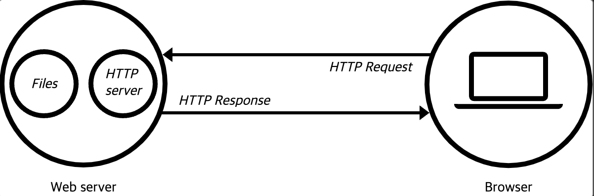{: style="display: block; margin-left: auto; margin-right: auto; width: 70%;" }

- 하드웨어 측면에서의 웹 서버  
  웹 서버의 소프트웨어와 website의 컴포넌트 파일들(HTML, CSS, images, JS files)을 저장하는 컴퓨터를 의미한다.  
  웹 서버는 인터넷에 연결되어 웹에 연결된 다른 기기들이 웹 서버의 데이터를 주고받을 수 있도록 한다.
- 소프트웨어 측면에서의 웹 서버  
  웹 사용자가 어떻게 호스트 파일들에 접근하는지를 관리한다. 개중에서도 HTTP서버는 URL과 HTTP의 소프트웨어 일부이다.

## MIME(Multipurpose Internet Mail Extensions)

### 정의

간단하게 파일 변환을 의미한다. 현재는 웹을 통해서 여러 형태의 파일을 전달하는데 사용하고 있지만, 이 용어가 생길 땐 이메일과 함께 동봉할 파일을 텍스트 문자로 변환하여 이메일 시스템을 통해 전달하기 위해 개발되어 이름이 Internet Mail Extentions란 이름을 가졌다고 한다.

### 사용 이유

예전에 Text 파일을 주고받는 데에는 ASCII 표준에 따르기만 하면 문제가 없었으나, 바이너리 파일을 네트워크를 통해 보내게 되면서 음악, 동영상, 워드 파일 등은 ASCII만으로는 전송이 안되어서 텍스트로의 변환이 필요했다.

텍스트 파일로 변환하는 것을 Encoding, 텍스트 파일을 바이너리 파일로 변환하는 것을 Decoding이라고 한다.

MIME로 인코딩한 파일은 Content-Type 정보를 앞부분에 담게 되며, 여러가지 Content-Type 타입이 있다([문서](https://developer.mozilla.org/ko/docs/Web/HTTP/Basics_of_HTTP/MIME_types#%EC%9B%B9_%EA%B0%9C%EB%B0%9C%EC%9E%90%EB%93%A4%EC%9D%84_%EC%9C%84%ED%95%9C_%EC%A4%91%EC%9A%94%ED%95%9C_mime_%ED%83%80%EC%9E%85)).

## HTTP(HyperText Transfer Protocol)

### 정의

HTTP는 웹에서 데이터를 주고 받는 서버-클라이언트 모델의 프로토콜이다. 즉 웹 브라우저가 서버와 소통하는 규칙을 의미한다.

### 동작

사용자가 웹 사이트를 방문하면 브라우저가 웹 서버로 리소스를 요청한다.  
요청을 받은 웹 서버는 HTML, CSS와 같은 리소스를 응답으로 돌려주며, 클라이언트의 요청과 서버의 응답 사이에는 여러 프록시 서버가 있다.  
프록시 서버는 캐시를 보관하거나 보안을 위해 서버의 IP주소를 숨기는 등의 역할을 하며, 이 모든 통신은 안정성을 위해 TCP연결을 사용한다.

### HTTP 요청과 응답

브라우저는 다음과 같은 HTTP 요청을 서버로 보낸다.

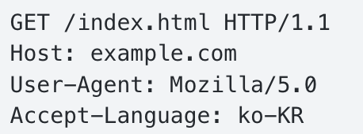{: style="display: block; margin-left: auto; margin-right: auto; width: 70%;" }

첫 번째 줄에는 HTTP 요청 메서드, URL 경로, HTTP 프로토콜 버전 정보를 적고, 두 번째 줄부터 모두 HTTP 요청의 헤더인데, key:value 쌍으로 이루어져 있다.  
헤더는 웹사이트 도메인의 호스트, 언어, 사용자의 브라우저 등 서버가 필요한 정보를 전달한다.

해당 요청에 문제가 없었다면 서버는 아래와 같은 응답을 돌려준다.

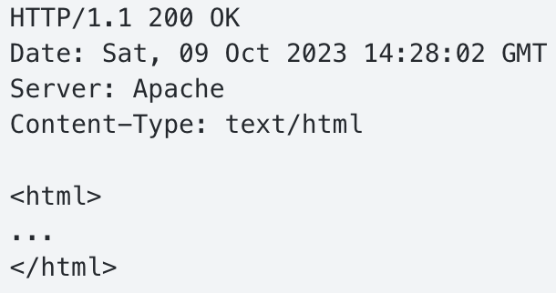{: style="display: block; margin-left: auto; margin-right: auto; width: 70%;" }

첫 줄에는 HTTP 프로토콜 버전 정보와 HTTP 상태 코드가 있다.  
둘째 줄 부터 보이는 key:value 쌍 또한 헤더이고, 응답의 헤더는 브라우저가 필요한 정보를 전달한다.  
마지막으로 응답의 Body는 브라우저가 요청한 데이터를 담는다.

#### HTTP 요청 메서드

HTTP는 요청 메서드를 정의하여, 주어진 리소스에 수행하길 원하는 행동을 나타낸다.  
각각의 메서드는 서로 다른 의미를 구현하지만, 일부 기능은 메서드 집합 간에 공유하기도 한다.  
다음은 대표적으로 사용되는 HTTP 요청 메서드이다.

- GET  
  리소스 조회 메서드(Read)로 서버에 전달하고 싶은 데이터는 쿼리 스트링을 통해서 전달한다.  
  바디를 이용해서 전달 할 수도 있지만, 서버에서 따로 구성해야 지원되어 권장하지 않는다.  
  조회에 POST를 이용할 수 있지만, GET 메서드는 캐싱이 가능하기에 GET을 사용하는 것이 유리하다.

  - 정적 데이터 조회  
    이미지, 정적 텍스트 문서등으로 쿼리 파라미터 없이 리소스 경로로 단순하게 조회가 가능하다.
  - 동적 데이터 조회  
    앞서 언급한 쿼리 파라미터를 통해 ~~~/search?q=이거&hl=ko 의 형식으로 상세한 조회 데이터를 얻는다.
  - Form 데이터 조회  
    웹문서에 form 입력칸에 데이터를 넣고 전송을 누르면 input 태그 안의 값들이 쿼리 스트링으로 서버로 전송 된다.  
     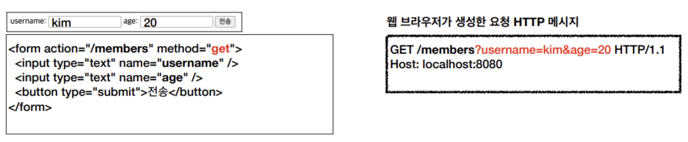{: style="display: block; margin-left: auto; margin-right: auto; width: 70%;" }

- POST  
  전달한 데이터 처리, 생성 요청 메서드(Create)로 body를 통해 서버로 요청 데이터를 전달하면 서버는 요청 데이터를 처리하여 업데이트를 한다.  
  전달된 데이터를 주로 신규 리소스 등록, 프로세스 처리에 사용한다.

  - JSON 데이터 전송  
    body에 JSON형태의 데이터를 담아 보내며, 서버는 처리 후 200 또는 201로 응답을보낸다.
  - Form 데이터 전송  
    Input 태그 안에 들어간 값들이 마찬가지로 쿼리스트링으로 서버로 전송된다.  
     {: style="display: block; margin-left: auto; margin-right: auto; width: 70%;" }

    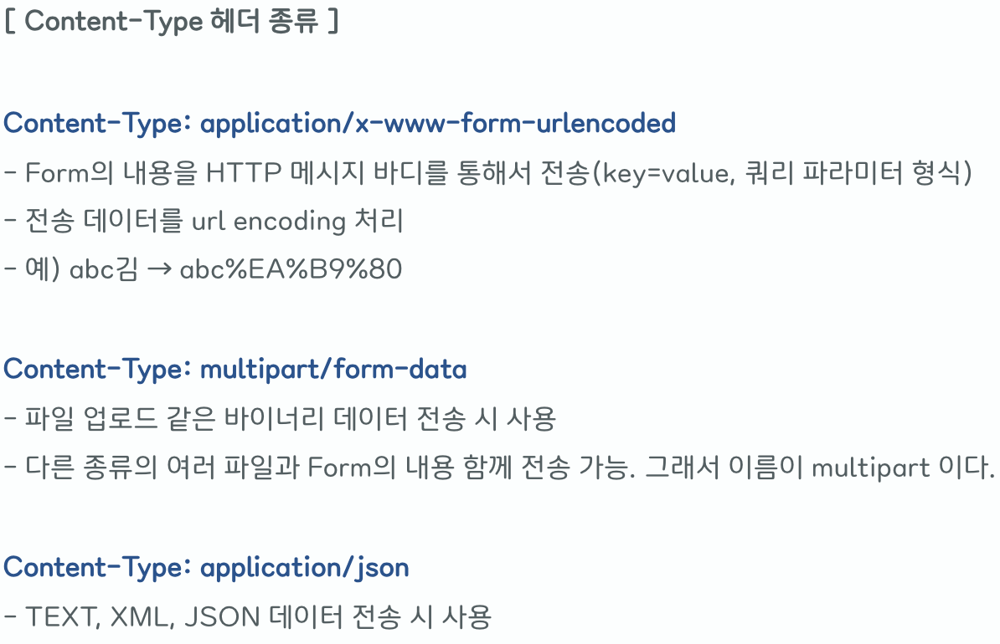{: style="display: block; margin-left: auto; margin-right: auto; width: 70%;" }

  - File 데이터 전송  
    enctype를 multipart/form-data로 작성해서 해당 폼에 파일이 있다는 것을 표시한다.  
    바이너리 데이터 전송시 사용하며, HTTP 메세지에 임의의 구분자(-----XXX)가 Form 데이터 간 구분을 지어준다.  
    여러개의 Content-Type에 대한 데이터를 보낼 수 있다.  
    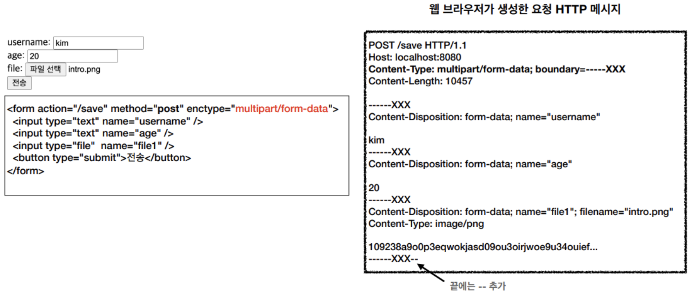{: style="display: block; margin-left: auto; margin-right: auto; width: 70%;" }

- DELETE  
  리소스를 제거하는 메소드(Delete)로 상태코드는 대부분 200을 사용하고, 상황에 따라 204를 사용한다.

#### HTTP 상태코드

특정 HTTP 요청이 성공적으로 완료되었는지를 알려주며, 정보를 제공하는 응답, 성공적인 응답, 성공적인 응답, 리다이렉트, 클라이언트 에러, 서버에러 로 나눌 수 있다.  
각 상태코드에 대한 정보는 [문서](https://developer.mozilla.org/ko/docs/Web/HTTP/Status)를 확인하면 될 것 같다.

## Proxy(프록시)

### 정의

프록시(Proxy)는 *대리*의 의미로 클라이언트와 서버 사이에 위치하여 중계기로서 대리로 통신을 수행하는 기능을 **Proxy**,그 기능을 하는 것을 **Proxy Server** 라고 부른다.

### 사용 목적

- 익명성으로 보안의 목적을 위해 사용(서버에서는 클라이언트가 누구인지 알 수 없다)
- 캐시를 이용한 속도 향상
- 차단 된 사이트를 IP 우회하여 접속
- 원하지 않는 사이트를 차단

### 종류

#### Foward Proxy

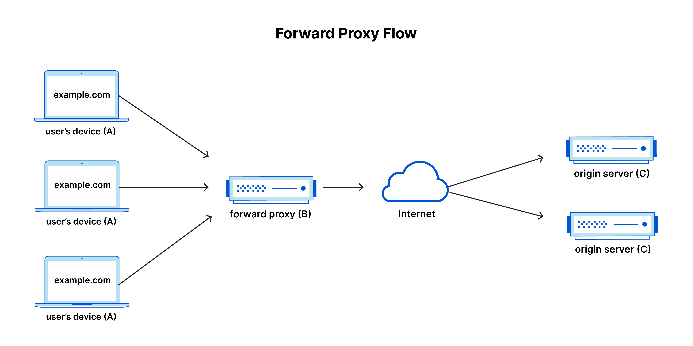{: style="display: block; margin-left: auto; margin-right: auto; width: 70%;" }

일반적인 프록시 서버를 말하며, 클라이언트와 웹 서버의 중계 역할로 클라이언트가 서비스를 요청하면, 프록시 서버가 이를 가로채서 클라이언트를 대신하여 서버와 통신한 후 결과를 돌려준다.

이 때 클라이언트가 프록시 서버에 요청한 내용을 프록시 서버에서 캐시로 저장해두면, 나중에 다시 요청이 들어오면 캐시된 데이터를 사용하여 전송 시간을 절약할 수 있다.

프록시 서버는 클라이언트가 보낸 요청의 헤더에서 서버의 주소를 읽기 때문에, 클라이언트의 요청이 있기 전까지는 서버의 주소를 알 수 없다.

캐싱 기능을 제공함과 동시에 특정 사이트는 접근이 불가능 하도록 제한을 걸 수도 있다.

#### Reverse Proxy

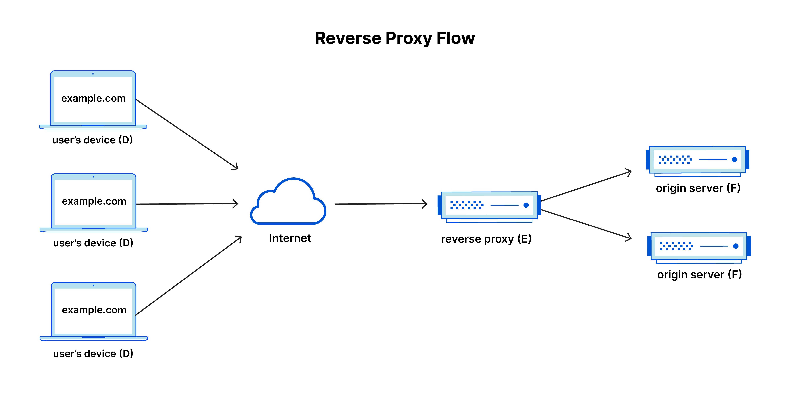{: style="display: block; margin-left: auto; margin-right: auto; width: 70%;" }

일반적인 프록시 서버와 다르게 하나 이상의 웹 서버 앞에 위치하여 네트워크 에지에서 클라이언트의 요청을 가로채는 서버이다.

> 네트워크 에지  
> 해당 장치 또는 해당 장치를 포함하는 로컬 네트워크가 인터넷과 통신하는 곳.

두 방식의 차이는 미묘하지만, 정방향 프록시는 클라이언트의 앞에서 원본 서버가 해당 특정 클라이언트와 직접 통신하지 못하도록 하는 것이지만, 역방향 프록시는 원본 서버 앞에 위치하며 그 어떤 클라이언트도 원본 서버와 직접 통신할 수 없도록 한다.

역방향 프록시는 단일 원본 서버로 륻어오는 트래픽을 여러 서버에 고르게 분산하거나, 실패한 서버 대신 다른 서버가 트래픽을 처리하게 할 수 있다. 전역 서버 부하 분산(GSLB)를 통해 전 세계 여러 서버에 분산 될 수 있으며 클라이언트를 지리적으로 가장 가까운 서버로 보낸다.  
또한 웹사이트 또는 서비스에서 원본 서버의 IP 주소를 공개할 필요가 없기 때문에, 공격자가 타겟으로 하기 어려워지며,

정방향 프록시와 마찬가지로 캐싱을 제공할 수 있기 때문에 통신 시간을 줄일 수 있으며, SSL 암호화를 함에 있어 원본 서버에서 각 클라이언트에 대한 통신의 암호화 또는 해독을 하게 되면 계산 비용이 많이 들 수 있는데, 프록시 서버에서 들어오는 모든 요청을 해독하고, 나가는 응답을 암호화 하여 원본 서버의 리소스를 아낄 수 있다.

#### 두 방식의 차이점

여기서 들었던 의문은 둘 다 결국에는 클라이언트와 서버 사이에서 요청와 응답을 대신 프록시 서버가 처리해 주는 거 아닌가? 였다.

두 방식의 차이점은 포워드 프록시의 경우 클라이언트를 대신하여 서버에 요청하며 서버로 부터 클라이언트를 숨기는 것이고, 클라이언트는 프록시 서버를 직접 지정해야 한다.  
반면 리버스 프록시의 경우 서버를 대신하여 클라이언트에 응답하며, 클라이언트로 부터 서버를 숨기는 것이고, 클라이언트는 리버스 프록시의 존재를 모르고 통신한다.

대신하는 대상이 누구인지에 초점을 맞추면 이해하기가 쉽다!

참조 : [소켓](https://www.ibm.com/docs/ko/i/7.3?topic=characteristics-socket-type), [CGI](https://electricalfundablog.com/common-gateway-interface-cgi/), [MIME](https://developer.mozilla.org/ko/docs/Web/HTTP/Basics_of_HTTP/MIME_types#%EC%9B%B9_%EA%B0%9C%EB%B0%9C%EC%9E%90%EB%93%A4%EC%9D%84_%EC%9C%84%ED%95%9C_%EC%A4%91%EC%9A%94%ED%95%9C_mime_%ED%83%80%EC%9E%85), [WebServer](https://raonctf.com/essential/study/web/webserver_server), [HTTP1](https://developer.mozilla.org/ko/docs/Web/HTTP/Methods), [HTTP2](https://docs.tosspayments.com/resources/glossary/http-protocol#http-%EC%9A%94%EC%B2%AD%EA%B3%BC-%EC%9D%91%EB%8B%B5), [HTTP\_요청](https://inpa.tistory.com/entry/WEB-%F0%9F%8C%90-HTTP-%EB%A9%94%EC%84%9C%EB%93%9C-%EC%A2%85%EB%A5%98-%ED%86%B5%EC%8B%A0-%EA%B3%BC%EC%A0%95-%F0%9F%92%AF-%EC%B4%9D%EC%A0%95%EB%A6%AC#http_%EB%A9%94%EC%84%9C%EB%93%9C_-_get), [Proxy](https://www.cloudflare.com/ko-kr/learning/cdn/glossary/reverse-proxy/), [Proxy2](https://straw961030.tistory.com/241)

---

### 2024 08 20 추가

#### GET과 POST의 차이

GET은 서버로부터 정보를 요청할 때 사용하는 메서드이고, POST는 정보를 생성/업데이트 하기 위해 사용하는 메서드이다.  
GET은 쿼리스트링의 파라미터에 내용이 노출되기 때문에 민감한 데이터를 다룰 땐 사용하지 않는다(HTTP 패킷 헤더에 담김, HTTP 메세지에 body가 없다).  
POST는 body에 데이터가 담기기 때문에 주소창에 노출이 되지는 않아서 상대적으로 안전하다고 하지만, 개발자도구를 통해 확인 할 수 있기 때문에 암호화를 해야한다. 또한 POST 요청은 'Content-Length'와 'Content-Type'같은 추가적인 헤더 정보를 필요로 한다.  
GET요청에는 길이제한(URL 길이제한)이 있고, POST요청에는 길이제한이 없다.  
GET요청은 브라우저 히스토리에 남으며, 웹 캐시에 캐시가 되어 리소스를 요청할 때 웹 캐시가 요청을 가로채서 캐시된 리소스의 복사본을 반환한다.  
POST요청은 캐시되지 않으며, 브라우저 히스토리에도 남지 않는다.  
GET 요청은 멱등이며, POST 요청은 멱등이 아니다.

> 멱등(indempotent) : 연산을 여러번 적용하더라도 결과가 달라지지 않음, 여기선 서버에 여러번 요청하더라도 서버의 상태가 바뀌지 않고 응답이 같음을 의미한다.

#### 3-Way-Handshake

TCP에서 신뢰할 수 있는 연결을 설정하기 위해서 클라이언트와 서버가 주고받는 3단계 절차를 의미한다.

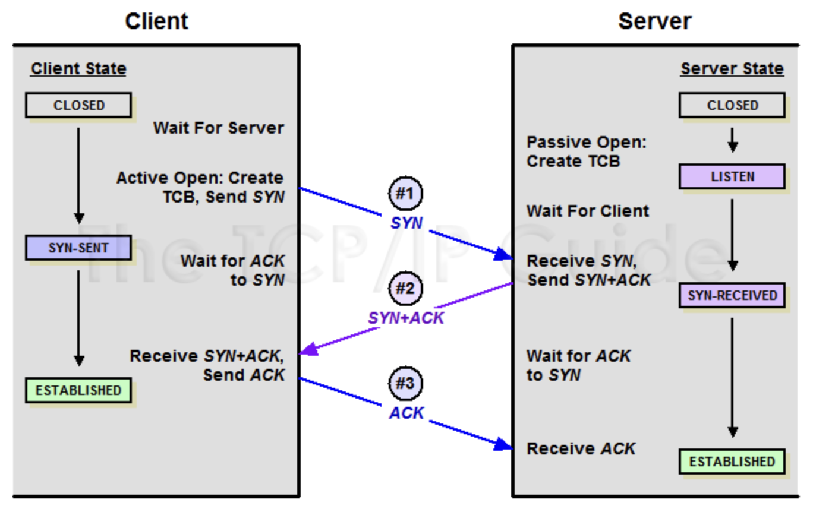{: style="display: block; margin-left: auto; margin-right: auto; width: 70%;" }

- 클라이언트가 서버에 접속을 요청하는 SYN(Synchronize sequence numbers) 패킷을 보내고 SYN/ACK 응답을 기다리는 SYN_SENT 상태가 된다. 해당 패킷에는 초기순서번호(Sequence Number, SEQ)가 포함 되어있다.
- 서버는 SYN 요청을 받고 클라이언트에게 자신의 초기 Sequence Number와 클라이언트의 SEQ에 대한 ACK number로 SEQ + 1이 설정된 패킷을 전송하고 클라이언트가 ACK로 응답하길 기다리며 서버는 SYN_RECEIVED 상태가 된다.
- 클라이언트는 서버에게 서버의 SEQ에 대한 ACK number로 SEQ + 1을 보내고, 연결이 이루어진다. 서버와 클라이언트는 ESTABLISHED가 된다.

> SEQ와 ACK  
> SEQ는 앞서 공부했던 TCP에서의 바이트 단위 번호 이며, 패킷의 순서와 손실감지를 위해 사용하는 번호이다.  
> ACK는 수신자가 다음에 받을 데이터의 바이트 위치를 나타내며, 수신자가 정상적으로 수신한 마지막 바이트의 다음 바이트를 의미한다.

#### 4-Way-Handshake

TCP에서 연결을 위해 3-way-handshake를 사용했다면, 연결 해제를 위해 사용하는 것이 4-way-handshake이다.  
그냥 연결을 탁 끊게 되어 버리면, 어 나 다줬으니까 끊을게~ : 어 나 덜받았는데..? 가 생길 수 있기 때문에 나 다줬는데 끊어도 돼? : 어 다받았어 끊어~ 를 원하는 것이다.

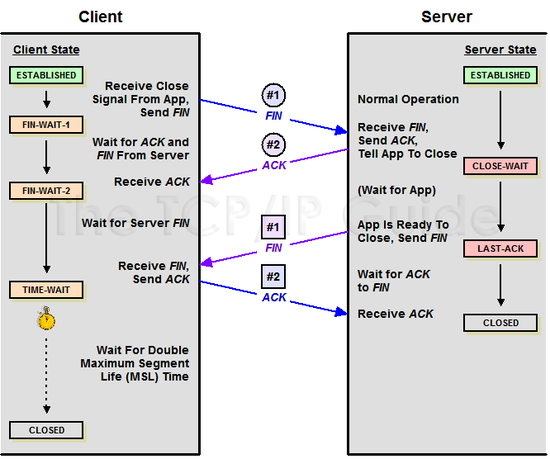{: style="display: block; margin-left: auto; margin-right: auto; width: 80%;" }

그림에선 안나타나지만 서버측에서 먼저 연결 해제를 요청할 수도 있다.

- 클라이언트가 서버에 연결 종료를 알리는 FIN 패킷을 송신한다 클라이언트는 FIN_WAIT_1 상태가 된다.
- 서버는 클라이언트의 FIN 패킷을 수신하고 ACK 패킷을 송신한다. 이 때 클라이언트는 아직 서버쪽의 데이터를 받을 수 있다 클라이언트는 FIN_WAIT_2 상태가 된다, 서버는 CLOSE_WAIT 상태가 된다.
- 서버가 클라이언트에 연결 종료 요청, FIN 패킷을 송신한다 서버는 LAST_ACK 상태가 된다.
- 클라이언트가 서버의 FIN 패킷을 수신하고 ACK 패킷을 송신한다 클라이언트가 TIME_WAIT 상태가 된다.

> TIME_WAIT 상태  
> Connection 종료를 먼저 요청 한 쪽이 Active Closer로서 도달하는 상태가 TIME_WAIT 상태로, Network에 남아 있을 수 있는 종료된 Connection의 Packet이 완전히 제거될 때까지 대기하는 상태이다.  
> 이후 생성되는 새로운 Connection에 영향을 미치지 않기 위함도 있다.
>
> 만약 TIME_WAIT가 너무 짧다면?  
> 클라이언트에서 서버로 전송한 SEQ=7인 패킷이 전송되었지만 네트워크 지연으로 서버에 늦게 도착하는 상황에서, 4-way-handshake로 연결이 종료가 되어버리면 클라이언트는 종료되었던 것과 동일한 ip/port와 서버의 ip/port를 사용해 새로운 TCP 연결을 시작하고, 우연히 서버가 받아야 할 SEQ가 7이였다면 서버는 이 지연된 패킷을 드랍하지 않고 받아들이면서 무결성이 깨지게 된다.
>
> 또는 마지막 ACK가 손실 될 수도 있다.  
> 클라이언트에서 마지막으로 서버에 보낸 ACK 패킷이 도달하지 못한다면, 서버는 아직 LAST_ACK상태로 남아있게 된다.  
> 이 상태에서 클라이언트가 새로운 연결을 시작하기위해 동일한 IP/port로 SYN 패킷을 서버로 보내면 서버는 이 패킷을 이전 연결의 연장선으로 오해할 수 있다.
> 서버는 RST(RESET)패킷을 클라이언트에게 전송하여 새 연결을 거부하게 된다(이전 연결이 완전히 종료되지 않았다고 생각하기 때문에). 그럼 클라이언트는 새로운 연결을 만들 수 없게 된다.

출처 : [TCP Handshake](http://www.tcpipguide.com/free/t_TCPConnectionEstablishmentProcessTheThreeWayHandsh-3.htm)
