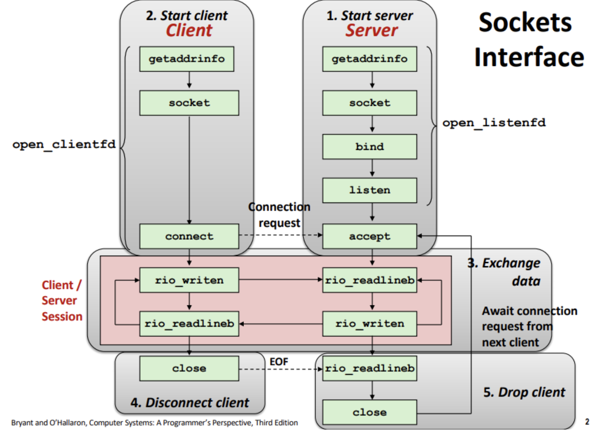

오늘부터 pintOS 시작 주간이지만, 지난 주 웹서버는 꼭 이해하고 넘어가야할 것 같아 정리한다.

## Socket(소켓)

### 소켓이란?

소켓은 네트워크 상에서 통신을 수행하는 Endpoint를 나타내는 추상화된 개념으로, 클라이언트와 서버는 소켓 식별자를 읽고 쓰면서 서로 통신을 한다.  
BSD(Berkeley Software Distribution)소켓은 UNIX 기반 시스템에서 사용되는 소켓 인터페이스의 표준으로, UNIX의 철학인 _모든것은 파일이다_ 라는 개념에 기반하여  
소켓은 File Descriptor의 형식이며, 네트워크를 포함한 모든 UNIX I/O디바이스들은 파일이기 때문에 소켓 또한 네트워크 상의 다른 프로세스와 통신하는 역할을 하는 파일로 본다.

결론적으로 기억할 것은 **소켓을 파일처럼 다룬다**!!

### 소켓 구조체

소켓의 주소는 IP 주소 + 포트 번호로 표현이 가능하다.

여기서 처음으로 들었던 의문은 왜 굳이 generic 소켓 구조체인 sockaddr을 따로 놔두고 sockaddr_in을 캐스팅하는 걸까? 였다.  
의외로 이유는 간단했는데, C언어의 역사와 관련이 있었다.  
초기의 C언어에는 void\* 타입이 없었기 때문에, 함수가 다양한 타입의 포인터를 받기 위해서는 함수 인자의 타입을 맞추기 위한 캐스팅이 필요했다고 한다.  
네트워크 주소의 다양한 형태(IPv4, IPv6 등의 인터넷 프로토콜에 특화된 구조체)들에 무관하게 사용할 수 있도록, 함수는 generic의 sockaddr을 기대하도록 한 다음 구체적인 소켓 구조체들을 sockaddr로 캐스팅을 해서 사용하는 것으로 해결한 것이다.

그럼 이제 해당 구조체들을 자세하게 뜯어보자!

```c
struct sockaddr {
    unit16_t sa_family;
    char sa_data[14];
}
```

generic 소켓 주고 구조체인 sockaddr은 connect, bind, accept함수의 인자로 넣어주기 위한 16바이트의 구조체로 앞서 말한 소켓 구조체의 원형이다.

- sa_family(16비트) : 이 소켓의 종류가 무엇인지, IPv4(AF_INET)? IPv6(AF_INET6)? 등의 주소패밀리 즉 주소 체계를 나타내는 필드이다.
- sa_data(14바이트) : 주소 데이터로서, 주소 및 포트번호 등의 데이터를 저장하기 위한 공간으로, 실제 사용시 더 구체적인 소켓 구조체에서 의미를 갖는다.

```c
struct sockaddr_in {
    uint16_t sin_family;
    uint16_t sin_port;
    struct in_addr sin_addr;
    unsigned char sin_zero[8];
}
```

IPv4를 사용하는 소켓 구조체로 다음과 같다.

- uint16_t : 16비트의 부호 없는 정수
- sin_family : 아까와 마찬가지로 소켓의 종류를 나타내지만 이 경우는 AF_INET(IPv4)로 고정이다.
- sin_port : 포트 번호를 나타내며, 네트워크 바이트 오더로 저장된다.
- sin_addr : IPv4주소를 32비트 정수로 저장하며, 네트워크 바이트 오더로 저장된다.
- sin_zero : 구조체의 크기를 sockaddr과 일치 시키는 용도의 패딩이다.

### 소켓 인터페이스 기반 네트워크 응용프로그램

{: style="display: block; margin-left: auto; margin-right: auto; width: 70%;" }

- Start server : 서버 위의 프로그램이 요청을 받아 수행하기 위해 서버가 setup 되는 과정이다.
- Start Client : 클라이언트에서 능동 소켓을 통해 서버에 요청을 보내는 과정이다.
- Exchange Data : 클라이언트와 서버 세션에서 Robust I/O를 사용하여 읽고, 쓰는 작업을 통해 서로 데이터를 교환한다.
- Disconnect Client : 클라이언트 측 소켓을 닫는다(정상적인 연결 종료).
- Drop Client : 클라이언트의 비정상적인 연결 종료나, 강제로 연결을 끊는 상황을 처리한다.

### Socket()

클라이언트와 서버가 소켓 식별자를 생성하기 위해서 사용하는 함수이다.

```c
int socket(int domain, int type, int protocol);
```

- domain : 소켓이 사용할 주소 패밀리를 지정하는 값으로 IPv4(AF_INET), IPv6(AF_INET6)등이 해당된다.
- type : 소켓의 유형을 지정하여, TCP(SOCK_STREAM), UDP(SOCK_DGRAM) 등이 있다.
- protocol : 소켓에서 사용할 특정 프로토콜을 지정하여 0을 지정하면 type에 맞는 기본 프로토콜이 자동으로 지정된다.

반환값으로 새로 생성된 소캣의 FD값(int), 실패할 경우 -1을 반환한다.

### bind()

서버의 로컬 주소와 포트번호를 할당하는 역할으로, bind 호출 시 커널이 수행을 하게 된다.

```c
int bind(int sockfd, sockaddr *addr, socklen_t addrlen);
```

- sockfd : socket()함수로 만든 소켓의 파일 디스크립터이다.
- addr : 소켓에 바인딩할 주소 정보를 담고있는 구조체 포인터이다.
- addrlen : 이름에서 알 수 있듯이 매개변수로 전달 된 주소 구조체의 크기(바이트 단위)이다.

성공시 0을 반환하고 실패시 -1을 반환한다.

위에서 서버의 ~ 라고 콕 집어 말한 이유는 클라이언트에서는 보통 필요 없는 과정이기 때문이다.  
클라이언트의 경우 연결할 서버의 주소와 포트 번호를 지정하여 요청을 보내기만 하면 되지만(ip 주소와 port 번호를 클라이언트 또는 요청하는 서버가 알 필요가 없다는 의미),  
서버는 자신이 사용하고있는 특정 주소와 특정 포트 번호를 통해서 클라이언트의 요청을 처리해야 하기 때문에 필수적인 과정이 된다.

### listen()

서버 소켓을 수신대기 상태로 설정하는 함수로, 이 상태에서는 서버가 클라이언트의 연결 요청을 대기하며, accept() 호출 시 연결 요청을 수락 할 준비를 한다.  
socket()이 만든 소켓은 기본적으로 클라이언트의 능동적인 소켓이고, 연결을 요청하는 역할을 하기 때문에 클라이언트의 요청을 기다리는 수동적 소켓임을 알려주는 역할이다.

```c
int listen(int sockfd, int backlog);
```

- int sockfd : 서버 소켓의 파일 디스크립터로 socket()의 결과 생성된 소켓이다.
- backlog : 수신 대기 큐의 최대 크기를 지정하는 정수로, 클라이언트의 연결 요청을 대기하는 공간이다.(수신 대기 상태에서 처리 될 수 있는 최대 클라이언트의 수)

성공시 0을 반환하고, 실패 시 -1을 반환한다.

### accept()

서버가 클라이언트의 연결 요청을 수락하고, 새로운 소켓을 생성하여 통신을 시작하는 과정에 사용된다.  
클라이언트와의 실제 통신을 위한 새로운 소켓 파일 디스크립터를 반환한다.

```c
int accept(int listenfd, struct sockaddr *addr, int *addrlen);
```

- listenfd : 클라이언트이 연결 요청을 받을 서버 소켓의 파일 디스크립터이다.
- addr : 클라이언트의 주소 정보를 저장할 구조체 포인터이다.
- addrlen : addr 구조체의 크기를 나타내는 변수 포인터이다.

성공시 connected descriptor를 반환하여, 이를 통해 Unix I/O함수들을 사용하여 클라이언트와 통신한다. 실패시 -1을 반환한다.

### connect()

클라이언트에서 서버에 연결 요청을 보내는 함수이다.

```c
int connect(int clientfd, const struct sockaddr *addr, socklen_t addrlen);
```

- clientfd : 클라이언트 소켓의 파일 디스크립터이다.
- addr : 서버의 주소를 가진 구조체의 포인터이다.
- addrlen : 구조체의 크기이다.

성공하면 0, 실패시 -1을 반환한다.  
이 함수의 결과로 성공하게 되면, clientfd 파일을 읽고, 쓸 수 있게 된다. 이 후 성공한 연결은 (클라 ip 주소:클라 포트번호, 서버 ip주소:서버 포트번호)의 쌍으로 유일하게 구분할 수 있다.

### 듣기와 연결 식별자를 구별하는 이유!!

이론과 실제 구현의 큰 차이점이여서 궁금했던 부분이라 정리해보았다.

listenfd와 connfd를 따로 가지는 가장 큰 이유는 서버는 기본적으로 다수의 클라이언트와 소통을 한다.  
이 많은 클라이언트와의 연결을 동시에 처리하기 위해서는 클라이언트와의 연결 마다 연결 소켓이 필요하고, 듣기 소켓을 따로 두어 하나의 소켓으로 다수 클라이언트의 연결 요청을 대기하고 관리할 수가 있게 된다.  
또한 listenfd는 서버의 생에 동안 하나만 유지되며, 서버가 종료 될 때까지 유지되고, connfd는 클라이언트와의 연결이 종료될 때 함께 종료되기 때문에 자원을 더 효율적으로 사용하는 방법이 되기도 한다.

### Robust I/O

위의 소켓 인터페이스 그림에서 보아도 그렇고, 이후 코드에 자주 등장하는 것이 *rio*였다.  
책에서(11장) 따로 크게 언급이 없었고, 생소한 라이브러리여서 정리해보았다.

이 라이브러리를 사용하는 가장 큰 목표는 안정적인 입출력을 위함이다!  
각 함수들의 사용법만 알고 넘어가도 되지만, 궁금하잖아! 한 번 알아보자.

#### 등장 배경

기본 I/O 함수들은 갑자기 호출이 중단되거나, 버퍼크기를 초과하거나, 전부를 처리하지 못하고 일부만 처리해버리는 문제점을 가지고 있다.  
이 문제를 보완하기 위해 **버퍼링**을 사용하여 안정적인 데이터 송수신을 가능케 하기 위해 등장한 것이다.

#### 주요 구성 요소

- rio_t 구조체  
  버퍼링 된 I/O를 위해 사용하는 구조체로 내부적으로 입출력 버퍼를 관리한다.
- rio_readinitb(rio_t \*rp, int fd)  
  rio_t 구조체를 초기화 하고, 파일 디스크립터에 대한 버퍼링 된 읽기 작업을 수행할 수 있도록 설정한다.
- rio_readlineb(rio_t *rp, void *usrbuf, size_t maxlen)  
  파일로부터 한 줄씩 데이터를 읽어 usrbuf에 저장한다. 최대 maxlen 바이트 까지 읽을 수 있고 한 줄 이니까 \n를 만날 때까지 읽는다.  
  한 줄씩 읽는 다는 특성 때문에 텍스트 기반 프로토콜에서 매우 유용하다(텍스트 기반 프로토콜들은 줄바꿈 문자를 통해 데이터를 구분하고, 줄 단위로 데이터를 읽어야 프로토콜의 문법을 정확히 해석할 수 있다. ex: HTTP).
- rio_readnb(rio_t *rp, void *usrbuf, size_t n)  
  파일에서 최대 n바이트 까지 데이터를 읽어 usrbuf에 저장한다. 지정된 바이트 수만큼 데이터를 읽을 때 까지 반복해서 데이터를 읽는다.
- rio_writen(int fd, void \*usrbuf, size_t n)  
  usrbuf로 부터 n바이트를 파일 디스크립터로 전송한다. 이 함수는 중간에 전송이 중단 되더라도, 지정된 바이트 수만큼 모두 전송할 때까지 계속 전송을 시도한다.

위 함수들을 살펴보면 알 수 있듯이, 높은 안정성과 단순화를 통해 개발자에게 I/O에 있어 편의를 제공하는 라이브러리였다.

### getaddrinfo()

호스트 이름, 호스트 주소, 서비스이름, 포트번호의 스트링을 소켓 주소 구조체로 변환 해 주는 함수이다.

```c
int getaddrinfo(const char *host, const char *service, const struct addrinfo *hints, struct addrinfo **result)
```

- host : 호스트 이름(도메인 이름), IP 주소 등이다.
- service : 서비스 이름 또는 포트 번호이다.
- hints : 선택적으로 사용할 수 있는 인자로 사용자의 특정 요구 사항을 지정할 수 있는 addrinfo 구조체의 포인터이다.  
  주소타입, 소켓 타입 등을 지정할 수 있으며, 사용할 땐 memset을 통해 전체 구조체를 0으로 설정하고 일부 선택한 필드만을 설정한다.
- result : host 와 service에 대응하는 소켓 주소 구조체를 가리키는 addrinfo 구조체의 연결리스트를 가리킨다.

함수의 반환된 구조체는 연결리스트 형식으로 클라이언트는 이 리스트를 방문하며, 각 소켓 주소를 가지고 connect 호출이 성공하고 연결이 성립 될 때까지 차례로 시험한다.  
서버의 겨우 bind 호출이 성공하고, 연결이 성립할 때까지 차례로 시험한다.

또한 예측 가능하듯이 이 함수는 DNS조회가 발생하여 호스트 이름을 ip 주소로 소켓 구조체에 담게 된다.  
그럼 IP 주소를 넣으면 어떻게 될까?? DNS조회는 당연히 하지 않고, 바로 소켓 구조체로 변환하게 된다.

해당 함수를 통해 궁극적으로 다양한 네트워크 환경에 대응할 수 있는 프로그램을 작성할 수 있게 되는 것이다.

### getnameinfo()

getaddrinfo 함수의 역으로 작동하는 함수로, 소켓 주소 구조체를 대응되는 호스트(IP 주소를 변환)와 서비스 이름(포트 번호를 변환) 스트링으로 변환한다.

고로 주어진 소켓 주소에서 인간이 이해할 수 있는 형태의 호스트와 서비스 이름을 얻고자 하는 함수이다.

```c
int getnameinfo(const struct sockaddr *sa, socklen_t salen,
                char *host, size_t hostlen,
                char *service, size_t servlen, int flags);
```

- sa : 변환할 소켓주소
- host : 변환된 호스트 이름을 저장할 버퍼이다.
- service : 변환된 서비스 이름 또는 포트 번호를 저장할 버퍼이다.

예를 들면 123.456.789.10의 IP 주소와 80 포트 번호가 있다면 www.example.com과 http로 변환되는 것이다.
