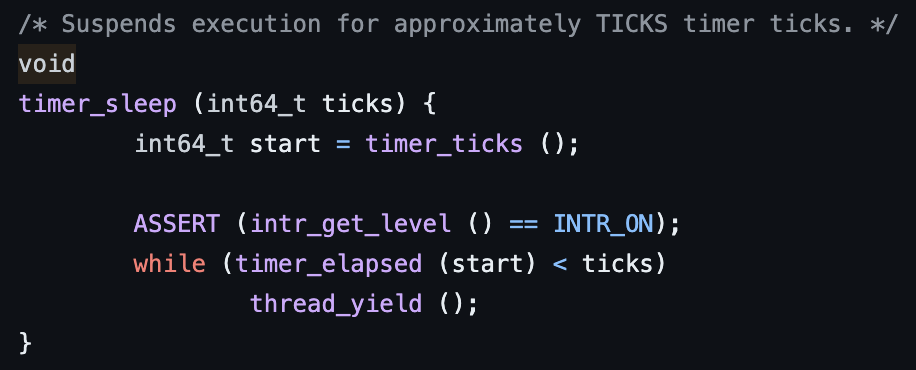
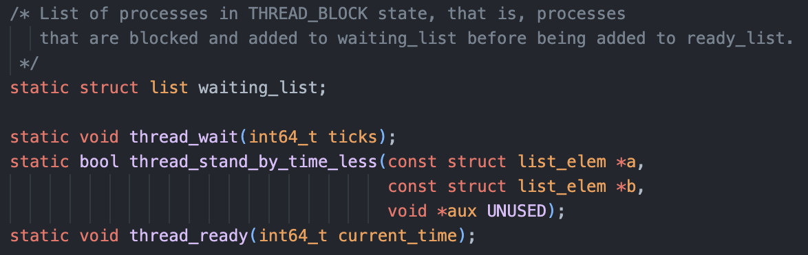

오늘은 pintOS Thread과제 중 Alarm Clock을 구현하면서 배운 점을 정리한다.

## Alarm Clock

### 역할

동시에 여러 작업을 실행 할 때 생길 수 있는 동시성 문제를 해결하기 위해서 기존에 주어진 pintOS코드에서는 busy-waiting방식을 사용하고 있었다.  
운영체제에서 한번에 한 쓰레드 만이 공유 자원에 접근할 수 있도록 하기 위해서 잠시 재웠다가 다시 깨우는 기능이 있는데, 이 기능을 Alarm Clock이라고 한다.

### 문제 상황

위에서 말했듯이 현재 코드는 busy-waiting 방식으로 Alarm Clock을 구현하였는데,

{: style="display: block; margin-left: auto; margin-right: auto; width: 80%;" }

그림에서 볼 수 있듯이, busy-waiting 방식은 CPU시간을 계속 낭비하며 각 쓰레드가 일어날 시간이 되었는지 여부에 관계없이 깨웠다가 아직 아니면 다시 재우고 를 반복한다.  
즉 Running state의 쓰레드가 sleep 명령을 받고 Ready state가 되어 Ready queue에 추가되고, 차례가 되면 일어날 시간에 관계없이 Running state가 되었다가 확인 후 다시 Ready state가 된다.

### 해결 방안

이를 해결하기 위해서는 쓰레드의 상태를 Blocked로 두어 스케쥴링에 포함되지 않도록 하고, 꺠어날 시간이 되었들 때 다시 Ready state로 만들어 필요할 때만 깨어나도록 할 수 있다.

그렇다면 코드로 위 과정을 살펴보자.

### 코드

코드 구현에 들어가기 앞서, 모든 함수들을 하나하나 다 따져가며 작동 원리를 알려고 들면 끝이 없다.  
기존에 구현되어 있는 함수들을 사용함에 있어 어떤 목적을 가지고 어떤 인자를 사용하는지만 이해하고 사용하는 것이 시간과 결과를 모두 챙길 수 있는 현명한 길이라고 생각한다!

기존코드에서 busy-waiting을 이용한 timer_sleep는 다음과 같다.

{: style="display: block; margin-left: auto; margin-right: auto; width: 80%;" }

위에서 부터 살펴보면 ticks라는 인자가 먼저 보인다.

{: style="display: block; margin-left: auto; margin-right: auto; width: 80%;" }

이 ticks라는 건 pintOS 내부에서의 시간을 나타내기 위한 값으로, 부팅이후 일정 시간 마다 1씩 증가하며, 위의 매크로를 보면 알 수 있듯이 현재 1 tick 1ms로 설정되어 운영체제는 1ms마다 timer interrupt를 통해 ticks를 1씩 증가시키고 있다.

timer_ticks()의 경우 현재 ticks 값을 반환하는 함수이며, timer_elapsed의 경우 인자로 받은 시간이후로 경과된 시간을 반환하는 함수이다.

> ASSERT 함수의 경우 디버깅을 위해 내부 조건이 false일 경우 즉시 프로그램을 중단시키고 AssertionError을 발생시킨다.  
> 이후 코드들에서도 꾸준히 만나게 될 것이다.

thread_yield는 CPU를 다른 쓰레드에게 양보하고 다른 준비 된 쓰레드가 실행 될 수 있도록 하는 함수로, while문을 통해 깨워질 시간이 될 때 까지 매 틱마다 CPU를 양보하며 ready_list의 맨 뒤에 추가되고있다..  
허나 여전히 Ready state이기 때문에 양보한 이후에 곧바로 다시 스케쥴링 될 수 있으며 위에서 말한 busy-waiting의 반복행위가 계속 되는 것이다.

{: style="display: block; margin-left: auto; margin-right: auto; width: 80%;" }

이를 해결하기 위해 팀원들과 함께 구상한 구조는 다음과 같았다.

간단하게, running 쓰레드가 CPU를 양보하게 될 때, 해당 쓰레드가 Block될 시간과 current_time을 합하여 새로운 waiting_list에 추가하고, 현재 Round Robin방식으로 4ticks마다 preemption이 발생하고 있으니 매 틱마다 waiting_list에서 현재 시간과 각 쓰레드의 시간을 비교하여 깨어날 시간이거나 지난 쓰레드들은 ready_list로 옮기겠다. 이다.

이를 구현하기 위해서는 다음의 과정이 필요했다.

1. threads 구조체에 쓰레드가 일어나야할 시간을 관리하는 필드를 추가한다.
2. 선언했으니 초기화를 한다.
3. 쓰레드를 재워 waiting_list에 추가 할 함수 구현.
4. 재운 쓰레드 중 일어날 쓰레드들을 깨워 ready_list에 추가 할 함수 구현.
5. 위 함수들을 적절히 호출.

그럼 코드로 한 번 구현해 보자.

{: style="display: block; margin-left: auto; margin-right: auto; width: 80%;" }

기존의 thread struct에 쓰레드의 대기 시간을 저장할 변수를 추가해 주었다.

{: style="display: block; margin-left: auto; margin-right: auto; width: 80%;" }

{: style="display: block; margin-left: auto; margin-right: auto; width: 80%;" }

이후 Blocked 된 쓰레드들을 저장할 waiting_list와 관련함수를 선언하고 초기화를 해주었는데, 원래 초기에는 timer.c 소스파일이 아닌 thread.c 소스파일에 선언을 하였었지만, timer.c 내부에서만 사용되고, 쓰레드의 시간과 관련되었기 때문에 timer.c에 두는 것이 더 의미적으로 적절하다 생각하여 옮기고 static으로 선언하였다.

{: style="display: block; margin-left: auto; margin-right: auto; width: 80%;" }

{: style="display: block; margin-left: auto; margin-right: auto; width: 80%;" }

다음은 쓰레드를 Block하여 waiting_list에 추가 할 thread_wait()와 관련 함수를 구현하였다.

이 때 주의할 점은 CPU가 수행할 작업이 없을 때 실행되는 idle_thread는 CPU가 완전히 유휴 상태로 들어가는 것을 방지하여 반응성을 유지하고, 스케쥴러의 안정적인 작동을 가능케 하기 때문에 sleep해서는 안된다.

또한 처음 계획한 waiting_list는 우선순위 큐로 구현하여, 이후 waiting_list를 검사하다가 현재시간이 쓰레드의 대기시간보다 더 크게 되면 순회를 멈추고 break할 수 있도록 하려 하였기에, 각 쓰레드의 우선순위를 비교하는 함수를 구현하여 list_insert_ordered 함수에서 사용할 수 있도록 하였다.

{: style="display: block; margin-left: auto; margin-right: auto; width: 80%;" }

다음은 waiting_list를 순회하며 현재시간과 비교하여 깨워 ready_list에 추가하는 thread_ready()를 구현하였다.

waiting_list는 stand_by_time을 기준으로 오름차순 정렬 되어 있기 때문에, 리스트의 첫 번째 쓰레드를 가져와 시간 검사를 시작하고, 현재 waiting_list와 ready_list는 이중연결리스트로 구현되어 직접적으로 쓰레드 끼리의 연결이 아닌 elem으로 관리가 되고 있기 때문에, 요소를 가지고 해당 요소를 포함하는 struct(thread)의 포인터를 반환하는 list_entry함수를 이용한다.

정렬이 되어있기 때문에 한번이라도 stand_by_time이 current_time보다 작게 된다면 이후는 검사할 필요가 없기 때문에 break를 하게 된다.

{: style="display: block; margin-left: auto; margin-right: auto; width: 80%;" }

이후 timer_sleep 함수를 호출하였을 때 busy_waiting이 아니라, thread_wait을 통해 Block을 시킬 수 있도록 해당 쓰레드의 대기 시간을 인자로 전달 해 주고,

{: style="display: block; margin-left: auto; margin-right: auto; width: 80%;" }

timer_interrupt에 thread_ready()를 추가하여 매 틱마다 waiting_list를 검사하고 ready_list로 옮길 수 있도록 하였다.

{: style="display: block; margin-left: auto; margin-right: auto; width: 80%;" }

검사결과를 보면 busy-waiting 시에는 항상 CPU가 점유중이였기에, 0이였던 idle ticks가 550이 되었음을 알 수 있다.  
이는 550ticks 동안 CPU가 쉬었음을 의미하며 CPU의 낭비를 줄였음을 확인할 수 있다.
