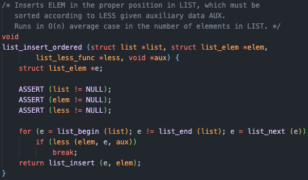

오늘은 pintOS Thread과제 중 Priority Scheduling을 구현하면서 배운 점을 정리한다.

## Priority Scheduling

### 배경지식

기존에 pintOS의 스케쥴러는 Round-Robin 방식으로 구현되어있었다.  
CPU 스케쥴링은 제한된 CPU의 자원을 효율적으로 분배하여 주어진 프로세스들에게 CPU시간을 분배하는 것을 의미하며, 다음의 성능 척도를 최적화 하여 시스템과 고객(프로그램)에게 최적의 성능을 제공한다.

- 소요시간 : 프로세스가 시작되어 완료될 때까지 걸린 전체 시간.
- 대기시간 : 프로세스가 CPU를 얻기 위해 대기하는 시간.
- 응답시간 : 프로세스가 처음 CPU를 할당받아 실행을 시작하기 까지의 시간(사용자 입장에서 가장 중요할 수 있고, 짧을 수록 시스템의 반응이 즉각적이라 느낌).

Round-Robin 스케쥴링은 선점형 스케쥴링 중 하나로, 각 프로세스에 동일한 CPU 시간을 할당한다(여기선 4ticks).  
할당된 시간이 지나면 프로세스는 ready_list의 끝으로 이동하고, 다음 프로세스가 실행되게 된다.  
이 방식은 응답 시간이 짧아여 사용자 경험이 향상되지만, 프로세스의 잦은 교체로 인한 컨텍스트 스위칭 비용이 발생하고, 처리량이 상대적으로 낮아질 수 있다.

과제의 요구사항인 Priority Scheduling은 각 프로세스에게 우선순위를 부여하고, 우선순위가 높은 프로세스가 CPU를 먼저 얻는 방식이다.

- 선점형 우선순위 스케쥴링 : 우선순위가 더 높은 프로세스가 ready_list에 들어오면 현재 실행중인 프로세스를 중단하고 우선순위가 높은 프로세스에 CPU를 할당한다. 이는 응답 시간을 줄일 수 있지만, 낮은 우선순위의 프로세스가 기아 상태에 빠질 수 있다.
- 비선점형 우선순위 스케쥴링 : 현재 실행 중인 프로세스가 종료될 때 까지 CPU를 계속 사용하며, 중간에 우선순위가 더 높은 프로세스가 있어도 뺏기지 않는다. 이는 컨텍스트 스위칭 비용이 줄어들지만 응답시간이 길어질 수 있다.

### 문제상황

현재는 우선순위에 관계없이 ready_list에 들어있는 순서대로 CPU를 차지하고 있으니, ready_list를 우선순위 순으로 정렬을 해주게 된다면? 그럼 다른 로직을 바꾸지 않더라도 우선순위 순으로 실행할 수 있을 것이다.

### 코드

그렇다면 ready_list를 관리하는 부분들을 살펴보자.

{: style="display: block; margin-left: auto; margin-right: auto; width: 80%;" }

해당 함수는 thread를 ready_list에 추가하며 Blocked 상태에서 Ready state로 바꾸는 함수이다.  
list_push_back()을 사용하여 추가하고 있기 떄문에 추가 된 쓰레드는 ready_list의 맨 뒤에 추가가 되게 되고 이렇게 되면 우선순위 순이 아닌 추가 된 순서로 쓰레드가 실행되는 것이다.

이를 해결하기 위해 list_insert_ordered()를 이용하여 정렬된 상태를 유지하며 추가할 수 있도록 해줘야 하는데

{: style="display: block; margin-left: auto; margin-right: auto; width: 80%;" }

해당 함수를 살펴보면 인자로서 크기를 비교하는 함수를 받고 있음을 알 수 있다.

ready_list는 우선순위가 높은 순으로 정렬을 해야 하므로(내림차순) 인자로 받은 쓰레드의 우선순위를 비교할 수 있는 함수를 만들어 주어야 한다.

{: style="display: block; margin-left: auto; margin-right: auto; width: 80%;" }

> UNUSED 매크로는 사용하지 않는 매개변수이지만 함수의 시그니처에는 필요할 때 컴파일러에게 의도한 것이니 에러를 발생시키지 말라. 라고 알려주는 매크로이다.

이로서 ready_list에 추가되는 값들은 내림차순으로 정렬되게 되었다.

{: style="display: block; margin-left: auto; margin-right: auto; width: 80%;" }

다음으로 실행되고 있던 쓰레드가 CPU를 양보하도록 하는 thread_yield()에서도 마찬가지로 ready_list에 단순히 맨 뒤에 쓰레드를 추가하고 있다.

CPU를 양보한 쓰레드도 우선순위에 따라 ready_list에 추가될 수 있도록 list_insert_ordered()를 이용해 추가해 주도록 한다.

{: style="display: block; margin-left: auto; margin-right: auto; width: 80%;" }

{: style="display: block; margin-left: auto; margin-right: auto; width: 80%;" }

또한 ready_list에 변동이 생긴 이후에는 현재 실행 중인 running thread보다 우선순위가 높은 쓰레드가 추가되었을 수 있으므로, runnning thread와 ready_list의 첫 번째 쓰레드의 우선순위를 비교하여 running thread의 우선순위가 낮을 경우 thread_yield()를 통해 CPU를 양보하도록 해주어야 한다.

{: style="display: block; margin-left: auto; margin-right: auto; width: 80%;" }

해당 함수는 현재 running thread와 ready_list의 첫 번째 쓰레드의 우선순위를 비교하여 running thread의 우선순위가 더 낮을 경우 true를 반환하는 함수이다.

ready_list의 변동이 있거나, running_thread의 우선순위가 바뀌는 경우는 총 3가지가 존재한다.

- thread_create
- thread_set_priority
- thread_ready

{: style="display: block; margin-left: auto; margin-right: auto; width: 80%;" }

thread_unblock 이후 thread_compare_priority()의 결과에 따라 thread_yield()를 호출하여 우선순위가 높은 쓰레드가 실행이 될 수 있도록 한다.

{: style="display: block; margin-left: auto; margin-right: auto; width: 80%;" }

다음 함수는 running_thread의 우선순위를 직접적으로 바꾸는 함수이기 때문에 꼭 우선순위의 비교를 다시 수행해 주어야 한다.

{: style="display: block; margin-left: auto; margin-right: auto; width: 80%;" }

thread_ready()에서도 waiting_list에서 쓰레드를 제거하여 ready_list에 추가하는 과정에서 변동이 발생하기 때문에 thread_unblock()이후 우선순위를 검사하는 과정을 거쳐야 한다.

위 과정들을 모두 거치고 나면 기본적인 우선순위를 검사하는

- alarm-priority
- priority-change
- priority-fifo
- priority-preempt
  의 테스트를 통과할 수 있게 된다!

## 동기화 도구들의 스케쥴링

{: style="display: block; margin-left: auto; margin-right: auto; width: 80%;" }

이번에도 팀원들과 회의를 한 결과는 위 사진과 같았다.

그럼 각각의 문제상황과 해결방안을 생각해보자!

### semaphore

{: style="display: block; margin-left: auto; margin-right: auto; width: 80%;" }

semaphore은 공유자원의 갯수를 나타내는 value와 공유자원에 접근하기 위해 대기중인 쓰레드들을 관리하는 waiters 리스트를 가진 구조체 이다.

여기서 생각해봐야 할 점은

_여러 쓰레드가 sema_down되어 대기 중 일때 이 공유자원을 사용하던 쓰레드가 작업을 완료하고 sema_up을 할 때 과연 어떤 쓰레드가 먼저 깨어나서 CPU를 차지하게 될까?_ 이다.

#### 문제상황

기존의 코드에 구현되어 있는 과정은 다음과 같다.

- 공유자원을 사용하고자 하는 스레드는 sema_down을 실행한다.
- 사용가능한 공유자원이 없다면 waiters 리스트에 list_push_back으로 추가되어 대기한다.
- 사용을 마친 쓰레드가 sema_up을 하게되면 sema->waiters에서 list_pop_front로 제일 앞의 요소를 가져온다. 즉 리스트에 들어온 순서대로 꺼내게 된다.

그렇다면 우선순위에 관계없이 대기하던 쓰레드가 공유자원에 접근하게 되는 것이다.

그럼 어떻게 해야 할까!

- waiters 리스트에 priority 기준으로 내림차순으로 추가한다.
- 이후 sema_up을 할 때 waiters리스트에 있던 동안 우선순위가 변했을 수도 있으니 list_sort()로 정렬을 해준다.
- unblock 된 쓰레드가 running thread보다 우선순위가 높은지도 체크한다.

#### 코드

{: style="display: block; margin-left: auto; margin-right: auto; width: 80%;" }

앞서 했던 방식과 동일하게 각 쓰레드의 우선순위를 비교하여 waiters 리스트에 추가 하면 되기 때문에 thread.c에서 선언한 thread_priority_less()를 그대로 사용할 수 있다.

{: style="display: block; margin-left: auto; margin-right: auto; width: 80%;" }

이렇게 수정함으로서 waiters리스트는 우선순위 기준으로 내림차순 정렬된 리스트로 유지되게 된다.

다음으로 sema_up()을 살펴보자

{: style="display: block; margin-left: auto; margin-right: auto; width: 80%;" }

sema_up에서 thread_unblock을 하기 전 waiters리스트에 있던 쓰레드들의 우선순위가 변동이 있었을 수도 있기 때문에 다시 정렬해주는 과정이 필요하다.

{: style="display: block; margin-left: auto; margin-right: auto; width: 80%;" }

또한 위에서 unblock된 쓰레드의 우선순위가 running thread보다 높을 수 있기 때문에 마찬가지로 thread_compare_priority()를 통해 우선순위를 체크해 주도록 한다.

이 과정을 통해 waiters리스트 안에서 가장 우선순위가 높은 쓰레드가 깨어나고, CPU를 점유할 수 있도록 보장할 수 있게 된다.

### lock

{: style="display: block; margin-left: auto; margin-right: auto; width: 80%;" }

lock은 lock을 소유하고있는 쓰레드를 나타내는 holder와 semaphore을 가지는 구조체 이다.

그럼 semaphore을 가져와서 사용하고 있는거네?  
lock은 sema_up, sema_down으로 끝나며 value=1이고, holder의 정보를 가진 것 외에는 semaphore와 같은 동작을 가지기 때문에 semaphore과 함께 해결되었다.

참고 : [pintos-kaist](https://casys-kaist.github.io/pintos-kaist/appendix/synchronization.html)
