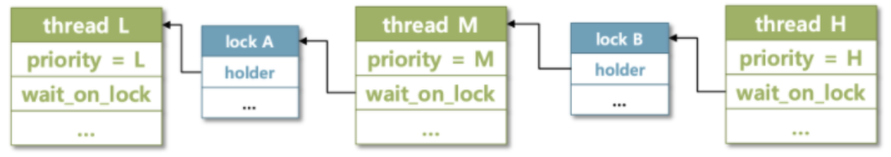

오늘은 어제 마저 못마친 condition varialbes와 donation을 정리한다.

### condition variables

{: style="display: block; margin-left: auto; margin-right: auto; width: 80%;" }

condition variables의 경우는 조건이 충족되기를 기다리는 waiters의 리스트 만을 가지는 구조체 이다.

#### 문제상황

condition variables의 경우 다른 동기화 도구들과 마찬가지로 waiters리스트를 가지지만 매우 다르다.  
바로 semaphore의 waiters는 대기중인 쓰레드들의 리스트였다면, condition varialbes의 waiters는 semaphore들의 리스트라는 점이다. 그 외에는 semaphore과 같은 사고로 진행하면 된다.

#### 코드

{: style="display: block; margin-left: auto; margin-right: auto; width: 80%;" }

{: style="display: block; margin-left: auto; margin-right: auto; width: 80%;" }

조건을 만족할 때까지 쓰레드를 재워놓는 함수인 cond_wait는 해당 조건을 기다리는 대기열 waiters에 semaphore_elem 변수인 waiter의 elem을 추가한다.

이 과정을 이해하기 위한 예시를 들어보자면, 특정 배열이 존재하고 해당 배열에 데이터를 넣는(PUSH) 또는 빼는(POP)작업은 여러 쓰레드가 하게 되면 데이터가 꼬일 가능성이 있다.

그래서 뮤텍스를 지키며 사용할 수 있도록 조건 변수가 존재한다.

예시에서는 배열이 꽉 찬 상태라면 PUSH 쓰레드를 멈추고, 반대로 비어있다면 POP 쓰레드를 멈춰야 할 것이다.

PUSH 쓰레드가 배열에 데이터를 추가하다가 배열이 가득 차게 되면 cond_wait()을 호출하여 쓰레드를 재울 것이다.  
그럼 자신을 감쌀 세마포어를 생성하여 0으로 초기화 하고, 해당 조건의 waiters리스트에 자신을 추가한다.  
본인을 대기 리스트에 추가하면서도 임계영역을 보호하면서 안전하게 리스트에 세마포어를 추가하기 위해 아직 lock은 계속 소유하고 있다.  
이후 lock을 해제하고, sema_down()을 하면서 while문에서 빠져나오지 못하고 Blocked상태가 되게 된다.

{: style="display: block; margin-left: auto; margin-right: auto; width: 80%;" }

만약 이후 POP 쓰레드가 데이터를 빼서 공간이 생기게 되면 cond_signal()을 호출하여 해당 조건의 대기열에서 세마포어를 찾아 sema_up을 하며 세마포어의 값이 1이 되어 while문을 탈출하고, 다시 lock_acquire()을 통해 임계영역에 접근할 락을 획득하게 된다.

이 구현을 통해 뮤텍스를 유지하면서도 임계영역에 접근을 무작정 반복시도하는(busy-waiting)을 하지 않고, 조건이 충족 될 때 까지 대기하여 CPU 자원을 낭비하지 않게 된다.  
이제 계속 궁금했던 왜 굳이 쓰레드가 아닌 세마포어를 이용하여 대기열을 만들었는지를 알 수 있다.  
이유는 각 세마포어는 하나의 쓰레드만을 기다리며, 쓰레드들이 독립적으로 대기하고 깨어날 수 있도록 하여 동시성 문제를 해결하고, 효과적으로 쓰레드를 대기하게 하고 깨우는 과정을 sema_up(), sema_down()을 통해 가능하게 할 수 있다.

그렇다면 우선순위를 위해서는 waiters리스트에 넣고 뺄 때 우선순위 순으로 관리해주기만 하면 되는 것이다!

{: style="display: block; margin-left: auto; margin-right: auto; width: 80%;" }

{: style="display: block; margin-left: auto; margin-right: auto; width: 80%;" }

이제 실행해 보면 sema와 condvar 테스트를 통과하는 것을 볼 수 있다!

## donation

donation이란 priority inversion 문제를 해결하기 위해서 만들어진 방법으로, 내가 소유한 lock을 더 우선순위가 높은 쓰레드가 요청할 때 해당 쓰레드에게서 우선순위를 양도받아 작업을 수행하고 lock을 해제하며 우선순위를 반환하는 방식을 의미한다.

우선 priority inversion문제에 대해 이해해야 한다.

H > M > L 순으로 우선순위가 높은 세 쓰레드가 존재하고, 사용할 수 있는 공유자원이 A, B가 있다고 가정하자.

{: style="display: block; margin-left: auto; margin-right: auto; width: 60%;" }

먼저 L이 실행되려고 한다.

{: style="display: block; margin-left: auto; margin-right: auto; width: 60%;" }

L은 공유자원 A를 사용하며 A의 lock을 소유하고 있다.  
그런데 우선순위가 가장 높은 H가 CPU를 사용하기 위해 대기열에 들어왔다.

{: style="display: block; margin-left: auto; margin-right: auto; width: 60%;" }

그럼 L은 H에게 우선순위가 밀려 CPU를 양보하고 Ready_list로 가게 된다. H 또한 공유자원 A에 접근하려는데 ??? lock은 L이 소유하고 있다.

{: style="display: block; margin-left: auto; margin-right: auto; width: 60%;" }

H는 공유자원 A를 원하는 waiters에서 대기하고 L이 다시 실행된다.  
근데 중간 우선순위인 M이 CPU를 사용하려고 한다.

{: style="display: block; margin-left: auto; margin-right: auto; width: 60%;" }

그럼 L은 또 M에게 CPU를 양보하고 Ready_list로 간다.  
이 때 H는 M도 A를 대기하게 될 테니 내 뒤로 오겠구나~ 하고 있었다.

그런데 M은 A에 관심조차 없었고 공유자원 B를 사용하려 한다. 당연히 사용이 가능하고 M은 계속 CPU를 사용하게 된다.

H는 굉장히 억울하다.

우선순위가 더 낮은 M이 먼저 실행되어 버리는 것이다.  
이게 priority inversion이다.

여기서 더 문제가 생기는 상황을 가정해보자.

H, M 보다는 우선순위가 낮고, L 보다는 높은 다른 쓰레드들이 대기하고 있다고 해보자.  
이들은 모두 공유자원 B를 사용하고 싶어 한다.

{: style="display: block; margin-left: auto; margin-right: auto; width: 60%;" }

그럼 이들은 L보다 우선시 되어 B의 waiters에 들어가 대기하게 된다.  
그럼 이들이 모두 작업을 수행할 때 까지 L은 작업을 수행하기 못하고 A의 lock을 붙잡고 있게 된다.  
그럼 H 쓰레드는 울면서 starvation이 발생하게 된다.

이런 현상을 방지하기 위해서 donation을 하는 것이다.

L이 A에서 작업을 수행하고 있다가 H가 A를 요청하면 H의 우선순위를 양도받아 M 보다 먼저 작업을 계속 수행할 수 있게 된다. L이 작업을 마치고 lock을 반환하면 당연히 H가 작업을 수행할 것이고, 그럼 모두가 행복하게 되는 것이다.

이것이 priority donation 이다.

pintOS docs에서는 priority donation이 일어날 수 있는 두 가지 상황을 제시하고 있다.

### Multiple donation

{: style="display: block; margin-left: auto; margin-right: auto; width: 60%;" }

L 쓰레드가 작업을 위해 lock A와 B를 모두 소유하고 있었을 경우에 M과 H가 lock A, lock B를 요청한다면 우선순위를 L에게 양도하고 대기하게 된다.  
그럼 L은 두 우선순위 중 높은 우선순위 33을 가지며 작업을 수행하다가 lockB를 반환하며 우선순위 33을 H에게 돌려주고 H는 작업을 수행하게 된다.  
이 때 L의 우선순위는 M에게 받은 32가 되게 된다. 이후는 마찬가지로 진행되게 된다.

만약 lockA를 먼저 반환했다면 우선순위 32를 M에게 돌려주고 33의 우선순위를 계속 가지고 있기 때문에 계속 작업을 하다가 우선순위 33을 H에게 돌려주고 우선순위는 31로 돌아온다.

위 두가지 경우 모두 H가 M보다 먼저 실행되어 역전이 발생하지 않는다.

이것이 multiple donation의 단적인 예시이다.

### Nested donation

{: style="display: block; margin-left: auto; margin-right: auto; width: 80%;" }

nested donation은 위(H->L, M->L)이 아닌 (H->M->L)로 연결되는 경우를 의미한다.

그림의 상황을 살펴보면 L이 lockA를 소유하며 작업을 수행하던 중 M이 오면 CPU를 양보하고 M이 작업을 수행한다. 그러던 중 M이 lockA를 요청하면 donaion이 일어나 우선순위가 같아진다. 그럼 lock을 소유하고 있던 L이 다시 CPU를 얻게 되고 작업을 마저하게 된다.

이때 H가 들어왔다. 그럼 L은 또 H에게 CPU를 양보한다. 그러다 H가 lock B를 요청하게 되면 lock B는 M이 소유하고 있었기 때문에 donation이 일어난다.  
그럼 M이 실행하려고 보니 lock A가 필요한데, 그건 L이 가지고 있다.  
그럼 결국 L은 H의 우선순위를 가지게 된다.  
이후 L이 작업을 마치고 lock A를 반환하면 M이 작업을 수행하고 lock B를 반환하여 H가 실행되게 된다.  
이렇게 연결된 형태가 되는 것이 nested donation이다.

### 코드

{: style="display: block; margin-left: auto; margin-right: auto; width: 80%;" }

위에서 말한 priority donation을 구현하기 위해서는 우선 thread 구조체에 다음 필드를 추가해야 한다.

- initial_priority : 기부 받기전 쓰레드의 우선순위를 저장하기 위한 변수
- lock_in_need : 현재 쓰레드가 어떤 lock을 요청하는지 저장하기 위한 변수(대기 중에는 Blocked 상태이므로 하나의 lock만 요청할 수 있다)
- donors_list : 현재 쓰레드에게 우선순위를 양도한 쓰레드들의 리스트
- donor_elem : donors_list를 관리하기 위한 elem

그럼 언제 쓰레드가 두 개 이상의 lock을 소유할까??  
처음 누구도 lock을 소유하지 않은 상태에서 복수의 lock을 요청하면 가지게 된다!

{: style="display: block; margin-left: auto; margin-right: auto; width: 80%;" }

선언을 해주었으니 사용하기위해 초기화를 해준다.

{: style="display: block; margin-left: auto; margin-right: auto; width: 80%;" }

donation 기능을 추가해 보자!

해당 lock을 요청하게 되었을 때 lock을 소유한 사람이 없다면 바로 lock을 획득하게 되고, lock을 가진 holder가 존재한다면 요청한 쓰레드의 lock_in_need에 lock을 저장해주고, donors_list에 요청한 쓰레드를 추가한다. 물론 donors_list는 내림차순으로 정렬하여 관리한다.

{: style="display: block; margin-left: auto; margin-right: auto; width: 80%;" }

앞에서 우선순위를 비교하는 함수를 만들긴 했었지만, 여기서는 donor_elem을 통해 리스트를 관리하고 있기 때문에 같은 로직을 donor_elem을 사용하여 구현해야 한다.

그리고 donation이 일어나는데 이건 밑에서 알아보도록하고 지금은 넘어가자.

sema_down을 통해 요청한 쓰레드는 Blocked 상태로 대기하고 나중에 sema_up이 되어 깨어나고 나면 요청한 쓰레드의 lock_in_need를 비워주고 lock을 얻는다.

여기서 의문점은 lock 소유 쓰레드와 요청쓰레드의 우선순위를 비교할 필요가 없나???

생각을 천천히 해보면 해답을 알 수 있다.  
lock_acquire()이 실행되었다는 것은 현재 CPU를 사용하고 있던 쓰레드가 lock을 요청했다는 것이다.  
CPU를 점유하고 있다는 것은 현재 우선순위가 가장 높은 쓰레드라는 것이기 때문에 당연히 lock을 소유한 쓰레드 보다 우선순위가 높을 수 밖에 없다!

{: style="display: block; margin-left: auto; margin-right: auto; width: 80%;" }

위 함수는 priority를 다른 쓰레드에게 빌려주는 함수인데, 주의할 점은 nested donation의 경우처럼 lock에 연결된 모든 쓰레드에게 donation이 발생한다는 점이다!

만약 쓰레드의 lock_in_need 가 NULL이 아니라면 해당 쓰레드도 다른 쓰레드가 소유한 lock을 요청한 상태라는 것이기 때문에 따라가면서 우선순위를 전해주어야 한다.

이를 위해 for문을 순회하는데 pintOS에서는 깊이를 8로 정해주었다.

왜 하필 8일까??

너무 깊숙히 돌게 되면 stack overflow가 발생할 수 있고, 너무 얖게 검사하면 안쪽의 lock 소유 쓰레드까지 가지 못할 수 있다.  
stack overflow가 나지 않으면서 충분히 검사할 수 있는 깊이가 8이였던 것이다.

{: style="display: block; margin-left: auto; margin-right: auto; width: 80%;" }

lock을 반환할 때는 donation 받기 이전 priority 또는 다음 가장 높은 우선순위로 바꿔주어야 한다.

만약 donate를 받았다면 해당 lock을 원하며 나에게 우선순위를 양도해준 쓰레드를 donors_list에서 찾아서 제거해야 한다.
만약 donors_list에 남은게 없다면 initial_priority로 돌려주어야 한다.

해당 과정을 수행하는 함수들이 remove_from_donor_list()와 refresh_priority()이다.  
하나씩 아래에서 알아보자.

{: style="display: block; margin-left: auto; margin-right: auto; width: 80%;" }

해당 함수는 단순히 donors_list를 순회하며 lock을 요청했던 쓰레드를 찾아 리스트에서 제거하는 함수이다.

{: style="display: block; margin-left: auto; margin-right: auto; width: 80%;" }

해당함수는 현재 쓰레드의 우선순위를 donors_list의 쓰레드의 우선순위 중 가장 높은 우선순위로 설정하는  
즉 우선순위를 갱신하는 함수이다.

현재 우선순위를 원래의 우선순위로 설정해 준 다음 donors_list안의 순서가 바뀌었을 수도 있으니, 한 번 정렬을 해준 다음 제일 앞의 쓰레드의 우선순위를 가져와 현재 쓰레드의 우선순위와 비교하여 쓰레드의 우선순위가 더 높다면 현재 쓰레드의 우선순위를 해당 우선순위로 바꿔준다.

여기서 의문점은 왜 굳이 현재 우선순위랑 비교를 하는거야? 무조건 더 높은거 아니야?? 이다.

이걸 찾기위해서 정말 시간을 많이 썼었는데, 결론적으로 간단한 이유였다.  
우리는 thread_set_priority()에서 running thread의 우선순위를 직접적으로 변경하기 때문에 만약 바뀐 우선순위가 더 크다면 해당 우선순위를 사용해야 하는 것이다.

그럼에도 문제가 발생했었는데 또 정말 단순한 문제였다.

{: style="display: block; margin-left: auto; margin-right: auto; width: 80%;" }

running thread의 우선순위를 바꿔 주었는데, 우선순위를 복구할 때는 initial_priority에 저장 된 바뀌기 이전의 우선순위를 복구하고 있었기 때문에 생기는 문제였던 것이다!

하루종일 다른 로직을 검사하고 있었는데, initial_priority도 같이 바꿔주면 해결되는 한 줄 때문이였다.....

이렇게 priority scheduling 과제가 끝이 났다.

월요일에는 advanced scheduler을 구현하고 정리해보자!
