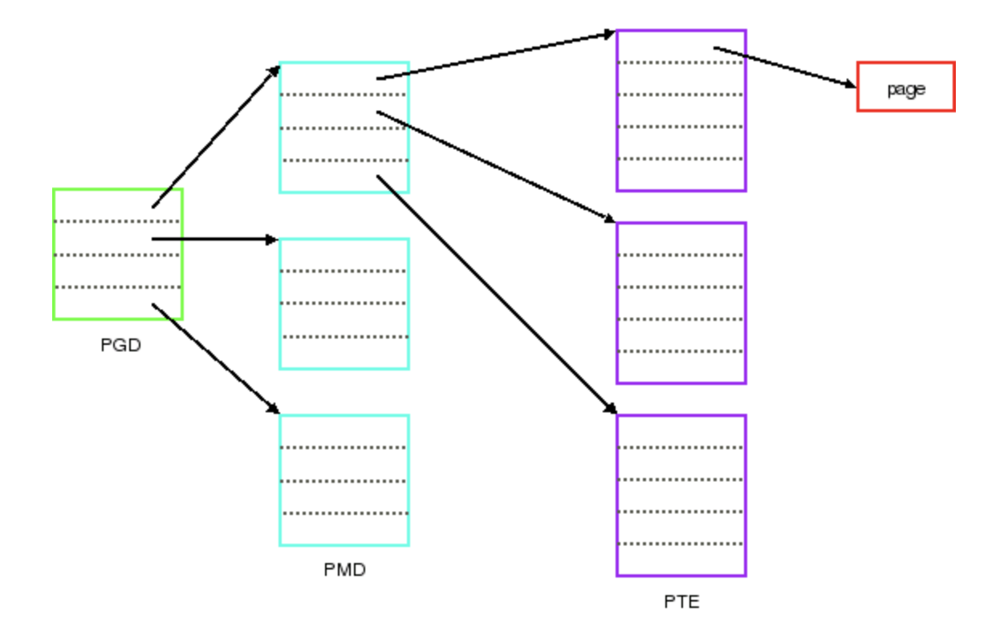
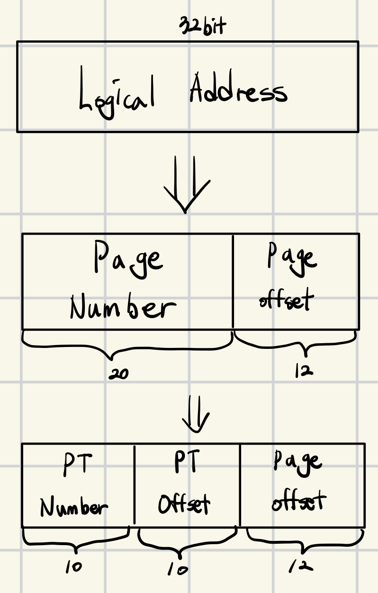

오늘은 pintOS 2주차 USER PROGRAMS의 이론을 정리하려한다.

## USER PROGRAMS

### 프로젝트 소개

Threads 프로젝트까지는 운영체제 커널 영역을 다루고 있었기 때문에 시스템에 전체에 대한 권한을 가지고 작업을 했었다.  
그러나 이번 User programs 프로젝트에서는 유저 프로그램을 실행할 수 있는 시스템 영역을 다룰 것이다.  
그러기 위해 프로그램이 OS와 시스템 콜을 통해 상호작용하도록 할 것이다.

이번 프로젝트는 지난 프로젝트의 위에 만들어야 하고, 지난 프로젝트의 테스트도 모두 통과해야 한다.  
또한 추가 챌린지가 존재하지만 스켈레톤 코드가 존재하지 않고, TODO가 없는 코드라고 해도 수정해야 할 수도 있다는 점에 유의해야 한다.

### 배경 지식

지금까지의 코드는 운영체제의 커널의 일부였다. 그렇기 때문에 모든 테스트 코드는 커널의 일부로서 시스템의 모든 부분에 대한 권한이 있었다.  
이제 운영체제 위에서 유저 프로그램을 사용하기 시작하면 더 이상 그렇지 못하기 때문에 이를 관리하는 것이 이번 과제이다.

동시에 여러 프로세스가 실행될 수 있게 할 것이고, 각 프로세스는 하나의 쓰레드를 가진다(멀티 쓰레드 프로세스는 지원하지 않는다).  
유저 프로그램은 각각 자신이 독점해서 사용하고 있다는 착각을 하도록 되어 있다. 그렇기에 동시에 여러 프로세스들을 실행하면 메모리, 스케쥴링 등의 상태를 관리하여 이 착각을 유지 할 수 있도록 하여야 한다.

지난 프로젝트에서는 테스트 코드를 직접적으로 커널에 컴파일하여서 커널 내의 특정 함수 인터페이스를 필요로 했었다.  
지금부터는 유저 프로그램을 실행시켜 운영체제를 테스트 할 것이기 때문에 훨씬 자유도가 높을 것이다.  
유저 프로그램 인터페이스는 뒤에 나올 사항들을 만족시켜야 하지만 그것만 아니면 커널 코드를 어떻게 바꿔도 상관 없다.  
모든 코드는 #ifdef VM 으로 싸여져 있는 블록에 존재 해서는 안된다. 해당 블록의 코드들은 다음 프로젝트에서 가상메모리 하위 시스템을 활성화 하고 나서 추가 될 것이다. 만약 코드가 #ifdef VM으로 묶여있다면 다음 프로젝트에서 생략될 것이다.

#### Virtual Address

이걸 이해하기 전에 계층적 페이지 테이블(Hierarchical Page Table)에 대한 이해가 선행 되어야 한다.

만약 페이지 테이블이 연속적이라면 보통 페이지의 크기가 4KB 이므로 32비트 주소체계와 64비트 주소체계일 때 각각 페이지 오프셋을 제외한 (32 - 12 = 20)(64 - 12 = 52) 비트 만큼 페이지 테이블이 가리킬 수 있으므로 총 페이지의 갯수는 $2^{20}$, $2^{52}$이다.  
각 페이지 테이블의 엔트리는 32, 64비트를 차지하므로 $2^{20}*4 byte = 4MB$, $2^{52}*8byte = 36PB$로 페이지 테이블의 크기가 어마어마함을 알 수 있다.

{: style="display: block; margin-left: auto; margin-right: auto; width: 60%;" }

그 대안으로 나온 것이 계층적 페이지 테이블로, Page number을 다시 두 부분으로 나누어 페이지 테이블의 테이블을 만드는 것이다. 밑에서 우리가 보게 될 메모리는 4부분으로 나뉜 4계층 페이지 테이블이다.

가장 상위의 테이블은 outer page table 이라고 하고 그 하위의 페이지 테이블을 inner page table이라고 부르는데, outer page table의 입장에서 inner page table들은 하나의 페이지와 마찬가지기 때문에 물리 메모리에서 불연속적으로 존재할 수 있다.

{: style="display: block; margin-left: auto; margin-right: auto; width: 60%;" }

다음은 32비트 주소체계에서의 2계층 페이지 테이블의 예시로 PT Number은 outer page table의 인덱스가 될 것이고, PT Offset은 inner page table의 몇 번째 entry인지를 나타내는 값이다.

이렇게 나누는 행위를 통해 각 페이지 테이블은 $2^{10} * 4 byte = 4KB$로 크기가 대폭 감소(이전에는 4MB)했고, 10, 10, 12 로 나뉘는 이유는 12비트는 페이지 내 오프셋으로 4KB의 페이지를 완전히 표현이 가능하고, 10비트로 1024가지의 엔트리를 표현할 수 있고, 각 엔트리는 4바이트이므로 페이지 테이블의 크기는 4KB로 페이지의 크기와 일치하게 된다.

이렇게 만들어진 outer page table은 커널 메모리에 저장되고, inner page table들은 유저 메모리에 저장되게 된다.

```mathematica
63          48 47            39 38            30 29            21 20         12 11         0
+-------------+----------------+----------------+----------------+-------------+------------+
| Sign Extend |    Page-Map    | Page-Directory | Page-directory |  Page-Table |  Physical  |
|             | Level-4 Offset |    Pointer     |     Offset     |   Offset    |   Offset   |
+-------------+----------------+----------------+----------------+-------------+------------+
              |                |                |                |             |            |
              +------- 9 ------+------- 9 ------+------- 9 ------+----- 9 -----+---- 12 ----+
                                      Virtual Address
```

64비트의 가상 주소는 위 그림처럼 구성되어 있다.  
이를 위한 함수와 매크로는 다음과 같다.

```c
#define PGSHIFT 0
#define PGBITS 12
```

PGSHIFT는 첫 offset 비트의 인덱스를 나타내고, PGBITS는 offset 비트의 수를 나타낸다.

```c
#define PGMASK  BITMASK(PGSHIFT, PGBITS)
```

페이지 오프셋 부분의 비트만 추출하기 위해 사용하는 비트 마스크(0xfff)

```c
#define PGSIZE (1 << PGBITS)
```

바이트 단위로 나타낸 페이지의 크기 $2^{12} byte = 4KB$

```c
#define pg_ofs(va) ((unit64_t) (va) & PGMASK)
```

가상주소 va에서 페이지 오프셋을 추출하고 반환한다.

```c
#define pg_no(va) ((unit64_t) (va) >> PGBITS)
```

가상주소 va에서 페이지 번호를 추출하고 반환한다.

```c
#define pg_round_down(va) (void *) ((uint64_t) (va) & ~PGMASK)
```

va가 속한 페이지의 시작 주소를 반환한다. 즉 va의 페이지 오프셋을 0으로 설정한다.

```c
#define pg_round_up(va) ((void *) (((uint64_t) (va) + PGSIZE - 1) & ~PGMASK))
```

va를 가장 가까운 페이지 경계로 올려 반환한다.

> 페이지 경계 : 4KB의 페이지라면 다음 페이지가 시작하는 곳이 경계

```c
#define KERN_BASE LOADER_KERN_BASE
```

pintOS에서는 가상메모리를 사용자 가상메모리와 커널 가상메모리로 나누고 있으며, 이 둘의 경계는 KERN_BASE로 정의 한다.

```c
#define is_user_vaddr(vaddr) (!is_kernel_vaddr((vaddr)))
```

가상주소 vaddr가 사용자 가상 주소인지 확인한다.

```c
#define is_kernel_vaddr(vaddr) ((uint64_t)(vaddr) >= KERN_BASE)
```

가상주소 vaddr가 커널 가상 주소인지 확인한다.

```c
#define ptov(paddr) ((void *) (((uint64_t) paddr) + KERN_BASE))
```

주어진 물리 주소 paddr에 대응하는 커널 가상주소를 반환한다.

```c
#define vtop(vaddr) \
({ \
	ASSERT(is_kernel_vaddr(vaddr)); \
	((uint64_t) (vaddr) - (uint64_t) KERN_BASE);\
})
```

주어진 커널 가상 주소 vaddr에 대응하는 물리주소를 반환한다.

```c
#define is_user_pte(pte) (*(pte) & PTE_U)
#define is_kern_pte(pte) (!is_user_pte (pte))
```

페이지 테이블 엔트리 pte가 사용자 페이지 인지, 커널 페이지 인지 확인한다.

```c
#define is_writable(pte) (*(pte) & PTE_W)
```

페이지 테이블 엔트리 pte가 쓰기 가능한지 확인한다.

```c
typedef bool pte_for_each_func (uint64_t *pte, void *va, void *aux);
bool pml4_for_each (uint64_t *pml4, pte_for_each_func *func, void *aux);
```

PML4 테이블의 각 유효한 엔트리에 대해 지정된 pte_for_each_func를 호출하여 모든 엔트리에 대해 FUNC 작업을 수행하고 작업 도중 중단되면 false, 작업이 완료되면 true를 반환한다.

### 소스 파일

전체적인 흐름을 알기 위해선 내가 다룰 코드를 보는 것이 제일 좋다. 다음은 대부분의 작업이 이루어질 코드의 위치이다.

- process.c, process.h  
  이 파일들은 ELF 바이너리 파일을 로드하고 프로세스를 시작하는 작업을 수행한다. 프로세스를 생성하고 실행하는 기능이 여기에 포함되어 있다.

- syscall.c, syscall.h  
  사용자 프로세스가 커널 기능에 접근하고자 할 때 시스템 콜을 호출하게 되는데, 이 파일은 그런 시스템 콜을 처리하는 코드의 골격을 제공한다. 현재는 단순히 메시지를 출력하고 사용자 프로세스를 종료하는 역할만 하지만, 프로젝트 2에서 이 코드를 확장하여 시스템 콜이 필요한 모든 작업을 처리하도록 해야 한다.

- syscall-entry.S  
  이 파일은 시스템 콜 핸들러를 부트스트랩하는 작은 어셈블리 코드가 포함되어 있다. 이 코드를 깊이 이해할 필요는 없다.

- exception.c, exception.h  
  사용자 프로세스가 권한이 없는 작업을 시도할 때, 커널로 트랩되어 예외나 폴트가 발생한다. 이 파일들은 그러한 예외를 처리한다. 현재는 모든 예외가 단순히 메시지를 출력하고 프로세스를 종료하지만, 일부 프로젝트 2의 솔루션에서는 page_fault()를 수정할 필요가 있을 수 있다.

- gdt.c, gdt.h  
  x86-64 아키텍처는 세그먼트 방식의 구조를 가지고 있다. 글로벌 디스크립터 테이블(GDT)은 사용 중인 세그먼트를 설명하는 테이블이다. 이 파일들은 GDT를 설정한다. 프로젝트에서 이 파일들을 수정할 필요는 없지만, GDT가 어떻게 작동하는지 알고 싶다면 코드를 읽어볼 수 있다.

- tss.c, tss.h  
  태스크 상태 세그먼트(TSS)는 과거 x86 아키텍처에서 태스크 전환을 위해 사용되었다. 그러나 x86-64에서는 태스크 전환이 더 이상 사용되지 않지만, TSS는 여전히 링 전환 중 스택 포인터를 찾는 데 사용된다. 사용자 프로세스가 인터럽트 핸들러에 진입할 때 하드웨어는 TSS를 참조하여 커널의 스택 포인터를 찾는다. 프로젝트에서 이 파일들을 수정할 필요는 없지만, TSS가 어떻게 작동하는지 알고 싶다면 코드를 읽어볼 수 있다.

### 파일 시스템의 사용

사용자 프로그램은 파일 시스템에서 로드되고 구현해야 하는 많은 시스템 호출이 파일 시스템을 다루기 때문에 프로젝트의 파일 시스템 코드에 대한 인터페이스가 필요하다.  
하지만 이건 이 프로젝트의 목적에서 벗어나기 때문에 간단하지만 잘 굴러가는 파일 시스템을 filesys 디렉토리에 만들어 줬다!  
filesys.h와 file.h 인터페이스를 살펴보며 어떻게 파일 시스템의 사용법과 제한사항을 이해할것.

잘 만들어놨으니까 딴길로 새지않도록 filesys코드는 수정하지 말 것.

현재 파일 시스템 구현의 한계점을 다음에 나열한다.

- 내부 동기화가 없음  
  여러 프로세스가 동시에 파일 시스템 코드를 실행하면 충돌이 발생할 수 있기 때문에 해당 코드를 실행할 때는 동기화를 사용해 한 번에 하나의 프로세스만 코드에 접근할 수 있도록 해야한다.
- 파일 크기가 생성시 고정됨  
  파일의 크기가 생성시 고정되며 변경이 불가능하다. 또한 루트 디렉토리도 파일로 표현되기 때문에 생성할 수 있는 파일의 수가 제한적이다.
- 파일 데이터는 단일 연속 구역으로 할당됨  
  파일에 저장되는 데이터는 디스크의 연속적인 섹터 범위에 할당 되어야 한다. 따라서 장기간 파일 시스템을 사용하면 외부단편화가 문제가 될 수 있다.
- 서브 디렉토리를 생성할 수 없음
- 파일 이름은 14자로 제한됨
- 시스템이 작업 중 크래시 되면 디스크가 손상될 수 있고, 복구 하는 방법 또한 제공하지 않음

중요한 기능이 또 하나 추가되어 있는데, Unix와 유사하게 filesys_remove()함수를 사용하여 열려있는 파일을 삭제하면 그것을 열고 있는 쓰레드들이 닫을 때 까지 블록이 할당 해제 되지 않고 접근 가능하다.

즉 파일이 삭제가 되었는데 어떤 프로세스가 해당 파일의 파일디스크립터를 가지고 있다면 계속 해당 FD를 사용하며 읽기, 쓰기 작업이 가능하다. 그 파일은 이름이 없고, 다른 어떤 프로세스도 열 수 없겠지만, 계속 존재하다 해당 파일 디스크립터가 종료되거나 시스템이 종료되면 삭제 된다.

이전 프로젝트에서는 모든 테스트 프로그램들이 커널 이미지에 있었지만, 이번 프로젝트에서는 유저 영역에서 실행되는 테스트 프로그램들을 pintOS 가상 머신에 추가하여야 한다.  
이 과정을 쉽게 하기 위해서 테스팅 스크립트들(make check 등)이 자동으로 수행해준다. 보통 이해할 필요가 없지만 개별 테스트를 진행하는데 도움이 될 것이다.

pintOS 가상 머신에 파일을 추가하기 위해서는 다음의 과정이 필요하다.

- 가상 디스크 생성
  ```c
  pintos-mkdisk filesys.dsk 2
  ```
  pintos-mkdisk 프로그램을 사용하여 파일 시스템이 포함된 가상 디스크를 생성하고, 해당 디스크 filesys.disk는 2MB의 pintOS 파일 시스템 파티션을 가진다.
- 파일 시스템 포맷

  ```c
  pintos --fs-disk filesys.dsk -- -f -q
  ```

  pintos 명령어를 사용하여 가상 머신을 실행할 때 --fs-disk 옵션으로 디스크를 지정하고, -f -q 옵션으로 파일 시스템을 포맷한다.

- 파일 복사  
  가상 디스크의 파일 시스템에 파일을 복사해서 넣거나 꺼낼 수단이 필요할 것이다.

  ```c
  pintos -p tests/userprog/args-single:args-single -- -q
  ```

  -p 옵션을 통해 넣고, -g 옵션을 통해 꺼내게 된다.  
  넣을 때는 파일 이름뒤에 어떤 이름으로 복사해 가져올지를 : 뒤에 적어주게 된다.

- 테스트 실행  
  파일을 복사한 후 가상 머신에서 복사한 파일을 실행 할 수 있다. 예를 들어서 args-single 프로그램을 onearg 인수와 함께 실행하려면 다음과 같다.

  ```c
  pintos --fs-disk filesys.dsk -- -q -f run 'args-single onearg'
  ```

  만약 파일 시스템 디스크를 나중에 사용할 필요가 없어서 임시 파일 시스템 파티션을 만들고 싶다면, --filesys-size=n 옵션을 사용해서 예를 들어 10MB 크기의 임시 파일 시스템을 만들고 파일을 복사한 후 실행하려면 다음과 같다.

  ```c
  pintos --fs-disk=10 -p tests/userprog/args-single:args-single -- -q -f run 'args-single onearg'
  ```

### User Program의 작동방식

메모리에 넣을 수 있는 크기이고, 여기서 구현한 시스템 콜만을 사용한다면 pintOS에서 다른 C 프로그램을 돌릴 수도 있다.  
예를 들면 malloc()은 실행할 수 없다. 시스템 콜 중에 메모리 할당을 허용하는게 없기 때문이다.  
또한 floating point 작업을 수행하는 프로그램들도 실행할 수 없다. 이는 커널이 프로세서의 floating point를 쓰레드 스위칭 시 저장했다가 복원하지 않기 때문이다.

pintOS에서는 userprog/process.c 에 제공된 로더를 사용하여 ELF 실행 파일을 로드할 수 있다.  
ELF는 Linux, Solaris 등 여러 운영체제에서 목적파일, 공유 라이브러리 및 실행파일에 사용되는 파일 형식이다.

실제로 x86_64 ELF 실행 파일을 출력하는 모든 컴파일러와 링커를 사용하여 pintOS용 프로그램을 생성할 수 있다(제공되어있다).  
테스트 프로그램을 가상 파일시스템에 복사할 때까지는 작업을 할 수 없다는걸 인지해야 한다. 따라서 다양한 프로그램을 파일 시스템에 복사해야 실제로 유용한 작업을 할 수 있다.

디버깅 중에 filesys.dsk 파일이 손상되거나 쓸 수 없게 되었을 때를 대비해서 멀쩡한 파일 시스템 디스크를 만들어 두고, 필요할 때마다 이를 복사해서 사용할 수 있다.  
이 클린 파일 시스템 디스크를 사용하면, 파일 시스템이 잘못되었을 때마다 새로 만들 필요 없이 간편하게 초기상태로 복원할 수 있다.

### 가상 메모리 레이아웃

pintOS에서의 가상메모리는 사용자 가상 메모리와 커널 가상 메모리 두 개의 영역으로 나뉜다.

- User Virtual Memory(사용자 가상 메모리)  
  이 영역은 가상 주소 0 부터 KERN_BASE 까지의 범위를 차지한다.  
  KERN_BASE는 기본값으로 0x8004000000 을 가지고, 나머지 영역은 커널 가상 메모리가 차지한다.  
  사용자 가상 메모리는 각 프로세스마다 따로 존재하며, 프로세스가 전환 될 때마다 해당 프로세스의 사용자 가상 주소 공간도 함께 전환된다. 이 전환은 pml4_activate() 함수에서 프로세서의 페이지 디렉토리 베이스 레지스터를 변경하여 이루어진다. thread 구조체는 프로세서의 페이지 테이블에대한 포인터를 가지고있다.
- Kernel Virtual Memory(커널 가상 메모리)  
  커널 가상메모리는 전역적으로 사용된다. 즉 어떤 사용자 프로세스나 커널 스레드가 실행 중이던 상관없이 항상 동일한 방식으로 매핑된다.  
  pintOS에서는 커널 가상 메모리는 물리 메모리와 1대1로 매핑된다.  
  이는 가상 주소 KERN-BASE가 물리주소 0에 접근하고, KERN_BASE + 0x1234 는 물리주소 0x1234에 접근하는 방식으로 해당 머신의 물리메모리 크기까지 동일하게 적용된다.

사용자 프로그램은 오직 자신의 가상 메모리만 접근할 수 있다. 만약 사용자 프로그램이 커널 가상 메모리에 접근하려고 시도하면 페이지 폴트가 발생하며, 이는 page_fault()함수에서 처리되고 해당 프로세스는 종료된다.  
커널 쓰레드는 커널 가상 메모리뿐만 아니라, 만약 사용자 프로세스가 실행중이라면 해당 프로세스의 사용자 가상메모리에도 접근할 수 있다.
하지만 커널 내에서라도 매핑되지 않은 사용자 가상 주소에 접근하려고 하면 페이지 폴트가 발생한다.  
이 구조를 통해 각 프로세스가 자신의 메모리 공간에서만 작업할 수 있도록 하면, 다른 프로세스와의 메모리 충돌을 방지하고, 커널은 모든 프로세스의 메모리를 관리 및 보호한다.

### 전형적인 메모리 레이아웃

각 프로세스는 자기 가상메모리를 원하는 대로 짜도 된다.  
다음은 사용자 가상 메모리가 어떻게 되어있는지를 보여준다.

```c
USER_STACK +----------------------------------+
           |             user stack           |
           |                 |                |
           |                 |                |
           |                 V                |
           |           grows downward         |
           |                                  |
           |                                  |
           |                                  |
           |                                  |
           |           grows upward           |
           |                 ^                |
           |                 |                |
           |                 |                |
           +----------------------------------+
           | uninitialized data segment (BSS) |
           +----------------------------------+
           |     initialized data segment     |
           +----------------------------------+
           |            code segment          |
 0x400000  +----------------------------------+
           |                                  |
           |                                  |
           |                                  |
           |                                  |
           |                                  |
       0   +----------------------------------+
```

- Code Segment(코드 세그먼트)  
  유저 프로그램의 코드가 저장되는 영역으로, pintOS에서는 가상주소 0x400000에서 시작한다.  
  이 값은 일반저긍로 Ubuntu 시스템에서 사용되는 값으로 특별한 의미를 가지지는 않는다.  
  코드 세그먼트는 메모리의 낮은 주소에서부터 위로 확장된다.
- Initialized Data Segment(초기화 된 데이터 세그먼트)  
  초기화 된 전역 변수와 정적 변수가 저장되는 메모리 영역이다.  
  이 세그먼트는 코드 세그먼트 바로 위에 위치한다.
- Uninitialized Data Segment(초기화 되지 않은 데이터 세그먼트, BSS)  
  초기화 되지 않은 전역 변수와 정적 변수가 저장되는 영역이다.  
  데이터 세그먼트의 위에 위치하며 프로그램이 실행 될 때 자동으로 0으로 초기화 된다.  
  보통 시스템 콜을 통해서 조절이 가능하지만 여기선 구현하지 않는다.
- Stack(스택)  
  함수 호출 시 사용되는 지역변수, 리턴주소 등이 저장되는 메모리 영역으로, 메모리의 상단에서 시작하여 아래로 확장된다.  
  해당 프로젝트에서는 스택의 크기가 고정 되어 있지만, 프로젝트3 에서 동적으로 확장되게 구현할 것이다.

유저 프로그램의 메모리 레이아웃은 linker script에 의해서 설정된다.  
링커 스크립트는 프로그램의 세그먼트 이름과 위치를 지정하여 링커가 어떻게 메모리를 배치할 지 결정한다.

### 사용자 메모리에 접근하기

시스템 콜을 처리할 때 커널은 종종 사용자 프로그램이 제공한 포인터를 통해 메모리에 접근해야 한다.  
이 때 커널은 매우 신중해야한다. 왜냐하면 사용자가 다음과 같은 잘못된 포인터를 전달 할 수 있기 때문이다.

- NULL 포인터 : 메모리 주소가 0인 포인터
- Unmapped Virtual Memory : 매핑되지 않은 가상 주소를 가리키는 포인터
- 커널 가상 메모리 영역의 포인터 : KERN_BASE 이상의 주소를 가리키는 포인터

이런 잘못된 포인터들이 커널이나 다른 실행중인 프로세스에 손상을 주지 않도록 프로세스를 종료하고 자원을 할당 해제 해야 한다.

#### 접근법

- 포인터의 유효성을 확인 한 후 역참조  
  사용자가 제공한 포인터의 유효성을 먼저 확인 한 다음, 그 포인터를 역참조한다.  
  즉 메모리에 실제로 접근하기 전에 해당 포인터가 올바른지 확인하는 것이다.  
  이 방법이 구현이 간단하고, 명확한 오류 처리가 가능하다.
- 포인터가 KERN_BASE 이하인지 확인 후 역참조  
  포인터가 KERN_BASE 이하인지(사용자 메모리 포인터인지)를 확인한 뒤 역참조를 하는 것이다.  
  만약 잘못된 포인터라면 페이지 폴트가 발생하며, 이 페이지 폴트를 처리하는 코드를 수정하여 처리할 수 있다.  
  이 방법은 프로세서의 메모리 관리 유닛(MMU)을 활용하기 때문에 성능이 더 빠르고, 실제 커널(리눅스 등)에서 이 방법을 사용한다.

#### 리소스 누수 방지

위 두 가지 방법 중 어떤걸 선택하더도, 리소스 누수 방지를 해야한다.  
예를 들어 시스템 콜이 lock을 획득하거나 malloc()으로 메모리를 할당한 후 잘못된 포인터를 만난다면, 해당 리소스를 반드시 해제해주어야 한다.

첫 번째 방법을 사용할 경우 리소스 해제는 상대적으로 간단하다.  
반면 두 번째 방법을 사용하여 페이지 폴트가 발생한느 경우에는 메모리 접근에서 오류 코드를 반환할 방법이 없기 때문에 리소스 해제가 어려울 수 있다.

후자를 선택하는 사람을 위한 코드가 제공되었다.

```c
/* Reads a byte at user virtual address UADDR.
 * UADDR must be below KERN_BASE.
 * Returns the byte value if successful, -1 if a segfault
 * occurred. */
static int64_t
get_user (const uint8_t *uaddr) {
    int64_t result;
    __asm __volatile (
    "movabsq $done_get, %0\n"
    "movzbq %1, %0\n"
    "done_get:\n"
    : "=&a" (result) : "m" (*uaddr));
    return result;
}

/* Writes BYTE to user address UDST.
 * UDST must be below KERN_BASE.
 * Returns true if successful, false if a segfault occurred. */
static bool
put_user (uint8_t *udst, uint8_t byte) {
    int64_t error_code;
    __asm __volatile (
    "movabsq $done_put, %0\n"
    "movb %b2, %1\n"
    "done_put:\n"
    : "=&a" (error_code), "=m" (*udst) : "q" (byte));
    return error_code != -1;
}
```

- get_user()  
  사용자 가상 주소(uaddr)에서 바이트를 읽어 유효한 주소인 경우 값을 반환하고 그렇지 않으면 -1을 반환한다.
- put_user()  
  주어진 바이트를 사용자 주소(udst)에 쓴다. 성공시 true, 페이지 폴트가 발생하면 false가 반환된다.

위 함수들은 uaddr이나 udst가 KERN_BASE 이하임을 확인한 상태에서만 사용해야 한다.  
또한 페이지 폴트가 발생했을 때 커널이 rax 레지스터를 -1로 설정하고, 이전 값을 %rip에 복사하도록 page_fault()함수를 수정해야 한다.  
이 과정은 페이지 폴트 발생시 프로세스가 비정상 종료되는 것이 아니라, 함수의 반환값을 저장하는데 사용되는 rax 레지스터를 -1로 설정하여 메모리 접근이 실패했음을 알리고, CPU가 다음에 실행할 명령어의 주소를 나타내는 레지스터인 %rip에 페이지 폴트가 발생한 명령어의 주소를 복사하여 이후 코드에서 즉 폴트가 발생하기 전으로 돌아가서 해당 상황을 처리할 수 있게 한다.  
이를 통해 프로그램이 안전하게 종료되거나, 적절하게 처리할 수 있게 하는 것이다.

출처 : [계층적 페이지 테이블 사진](https://lwn.net/Articles/106177/), [kaist-gitbook](https://casys-kaist.github.io/pintos-kaist/project2/introduction.html)
