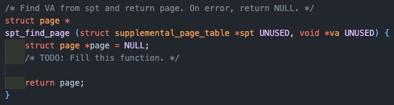

오늘은 이번주에 pintOS 3번째 과제 vm을 구현한 부분까지 전체 흐름과 과정을 정리하려고 한다.

## 개요

지난 프로젝트까지는 pml4라는 페이지 테이블을 통해 가상메모리와 물리 메모리 간의 매핑을 관리하였는데, 이제 page fault과 자원관리를 다루기 위해서 각각의 페이지에 대한 추가 정보를 가지는 supplementary page table의 추가가 필요하다.

#### Supplementary page table

pintOS의 spt의 역할은 크게 두 가지가 있다.

- page fault 발생 시 커널이 spt 에서 오류가 발생한 가상 페이지를 조회하여 어떤 데이터가 있어야 하는지 확인할 수 있어야 한다.
- 프로세스가 종료될 때, 커널이 spt를 참조하여 어떤 리소스를 free할 지 정할 수 있어야 한다.

  - 추가적인 역할
    - 서로 다른 두 페이지 테이블 엔트리(서로다른 두 프로세스)가 같은 물리주소를 가리킬 수도 있는데, 이 때 누가 어떤 물리 메모리를 참조하는지 기록한다.
    - 기존 page table은 물리메모리를 향한 일방적인 pointing이기 때문에 값의 변동이 있으면 panic이 발생했다. 때문에 원래 어떤 데이터가 물리메모리에 있어야 했는지를 기록한다.

### 구현 방향성

spt를 구현함에 있어서 선택지가 4가지가 있었다.

- array : 가장 구현이 간단하지만, 공간복잡도가 크다는 단점이 있다. 시간 복잡도는 O(1)이다.
- linked list : 역시 간단하지만, 탐색을 함에 일일히 탐색을 해야하기 때문에 O(n)으로 오래 걸린다.
- hash table : key->value의 구조로 value = get(key)가 O(1)으로 빠르고, array와 다르게 연속적인 공간을 가질 필요가 없기 때문에 공간복잡도도 유리하다.
- Bitmap : 데이터를 비트에 매핑시키는 자료구조로 비트를 통해 저장하기 때문에 공간복잡도에서 매우 유리하며, 자료가 많지 않을 때는 효율적이나 많아질수록 복잡해진다.

때문에 각각의 특성을 고려하여 가장 적합한 자료구조로 hash table을 선택하게 되었다.

#### hash table

이렇게 선택 받은 자료구조임에도 명확한 단점이 존재한다.  
서로 다른 key 값에 대해서 같은 index 값이 도출되어 충돌이 발생할 수 있다는 점이다.

이는 충돌이 발생했을 경우 연결리스트로 연결하여 해결(chaining)할 수 있으나, 최악의 경우에는 한 인덱스에 모두 연결리스트로 저장되어 시간 복잡도가 O(n)이 될 수 있다는 단점이 있다.

> 이렇게 모든 방법에는 정답이 없고 장단점이 항상 존재하니 꼭 상황에 맞는지 고려해 보고 사용하는 습관을 기르자!

hash table에는 총 3가지 고려할 요소가 존재하게 된다.

- hash function을 통해 나온 index.
- 해당 index에 값을 저장하게 되는 bucket(array).
- 충돌이 발생할 경우 생기게 되는 연결리스트(hash_elem을 가지게 될 것).

이제 시작해보자!

## 구현

### Supplemental page table

#### struct supplemental_page_table

{: style="display: block; margin-left: auto; margin-right: auto; width: 80%;" }

위해서 hash_table을 이용해 구현하기로 했기 때문에, hash 구조체를 추가해 준다.

```c
struct supplemental_page_table {
    struct hash spt_hash;
}
```

#### struct page

{: style="display: block; margin-left: auto; margin-right: auto; width: 80%;" }

spt 에 해당 page를 연결해 줄 수 있도록 hash_elem을 추가해 준다!

```c
struct page {
    ...
    struct hash_elem hash_elem;
}
```

spt는 key : page->va, value : struct page 를 가지는 형태로 사용될 것이다.

#### struct hash

그럼 이제 우리가 사용할 hash 구조체를 살펴보자.

{: style="display: block; margin-left: auto; margin-right: auto; width: 80%;" }

위에서 언급했듯이, hash table은 array와 array에 달리는 linked list의 조합으로 이루어져 있는데, page의 가상 주소(va)를 hash function을 통해서 hash table의 index로 변경하여 해당 index와 매핑된 bucket의 hash_elem을 통해서 해당 page를 찾을 수 있게 되는 구조이다.  
물론 연결리스트는 hash_elem의 연속이다.

{: style="display: block; margin-left: auto; margin-right: auto; width: 80%;" }

해당 주석은 pintOS에 구현되어있는 hash table에 대한 설명인데, 살펴보면 chaining에 사용되는 연결리스트는 동적 할당을 사용하는 대신, hash table에 들어갈 수도 있는 모든 page 구조체는 hash_elem을 멤버로가지고, hash_entry 매크로를 통해 hash_elem으로 부터 page 구조체를 찾을 수 있음을 알려주고 있다(project1, 2에서도 자주 사용하던 방법).

#### hash init

{: style="display: block; margin-left: auto; margin-right: auto; width: 80%;" }

위에서 살펴본 hash 자료구조를 초기화 해주는 함수로, 인자로 주어지는 hash_hash_func, hash_less_func가 앞으로 구현해야할 함수가 되겠다.

근데 살펴보면 init 내부에서 malloc(동적할당)을 사용하고 있다.

{: style="display: block; margin-left: auto; margin-right: auto; width: 60%;" }

안쓴다며????

해서 다시 읽어보니 malloc을 하고 있는 것은 bucket이다. bucket은 array 였다.  
hash function을 통해 hash_index가 된 va 값을 기준으로 가지는 array인 bucket에 hash_elem의 연속인 연결리스트가 붙는다.

즉 chaining에 사용되는 연결리스트에는 page 생성될 때 만들어지는 hash_elem이 사용된다. 고로 동적할당을 하지 않는다.

{: style="display: block; margin-left: auto; margin-right: auto; width: 100%;" }

#### page_hash

{: style="display: block; margin-left: auto; margin-right: auto; width: 80%;" }

다음으로 init에 필요한 함수를 구현한다.

```c
unsigned page_hash(const struct hash_elem *e, void *aux UNUSED)
{
	const struct page *p = hash_entry(e, struct page, hash_elem);
	return hash_bytes(&p->va, sizeof(p->va));
}
```

hash_elem을 통해서 해당 page를 찾고, page의 va를 hash_bytes를 통해 해시 값으로 반환하는 함수가 되겠다.

#### page_less

{: style="display: block; margin-left: auto; margin-right: auto; width: 80%;" }

```c
bool page_less(const struct hash_elem *a, const struct hash_elem *b)
{
	const struct page *a_ = hash_entry(a, struct page, hash_elem);
	const struct page *b_ = hash_entry(b, struct page, hash_elem);
	return a_->va < b_->va;
}
```

마찬가지로 hash_elem을 통해 두 page를 찾아 각각의 가상주소의 크기를 비교하는 함수이다.

#### insert_page, delete page

spt를 만들고 나면, page를 table에 넣고 뺄 함수가 필요할 것이다.

```c
bool insert_page(struct hash *h, struct page *p)
{
	if (!hash_insert(h, &p->hash_elem))
		return true;
	else
		return false;
}
```

```c
bool delete_page(struct hash *h, struct page *p)
{
	if (!hash_delete(h, &p->hash_elem))
		return true;
	else
		return false;
}
```

#### supplemental_page_table_init()

이제 spt를 초기화 해주는 함수를 만든다. 위에서 구현한 함수를 호출하는 wrapper 역할이 되겠다.

{: style="display: block; margin-left: auto; margin-right: auto; width: 80%;" }

```c
void supplemental_page_table_init (struct supplemental_page_table *spt UNUSED)
{
	hash_init(&spt->spt_hash, page_hash, page_less, NULL);
}
```

자명한 것은 spt init()은 spt가 처음 만들어 질 때 함께 수행되어야 할 것이다.  
그럼 과연 spt 는 언제 만들어질까?

- 처음 process가 생성 될 때(initd).
- fork로 만들어질 때(fork).

각각의 코드를 살펴보면 spt init()이 이미 추가 되어있으니 넘어가면 된다.

{: style="display: block; margin-left: auto; margin-right: auto; width: 80%;" }

#### spt_find_page

만들어진 spt를 사용하기 위한 함수들이 이제 필요하다. 먼저 해시 테이블에서 원하는 페이지를 찾는 함수이다.

{: style="display: block; margin-left: auto; margin-right: auto; width: 80%;" }

```c
struct page *spt_find_page(struct supplemental_page_table *spt UNUSED, void *va UNUSED)
{
	struct page *page = (struct page *)malloc(sizeof(struct page));
	struct hash_elem *e;

	page->va = pg_round_down(va);

	e = hash_find(&spt->spt_hash, &page->hash_elem);

	free(page);

	return e != NULL ? hash_entry(e, struct page, hash_elem) : NULL;
}
```

va를 가지고 원하는 page를 찾을 수 있도록, dummy page를 만들어서 va는 round_down을 통해 VPN(offset을 제외한 부분)을 추출하여 사용하고, spt에서 해당 page를 찾는 함수이다.

{: style="display: block; margin-left: auto; margin-right: auto; width: 60%;" }

근데 dummy page는 왜쓰는 거임???

을 알기 위해서는 우선 hash_find가 어떻게 작동하는지를 생각해볼 필요가 있다(물론 깃북에도 나와있다).

{: style="display: block; margin-left: auto; margin-right: auto; width: 80%;" }

{: style="display: block; margin-left: auto; margin-right: auto; width: 80%;" }

{: style="display: block; margin-left: auto; margin-right: auto; width: 80%;" }

우선 spt에서 원하는 page를 찾기 위한 hash_find는 hash_elem을 인자로 받는다.

하지만 우리는 va만을 알고 있다.

그렇다면 dummy page를 만들어 해당 page의 va를 우리가 가진 va로 저장해주고, dummy page가 멤버로 가지는 hash_elem을 hash_find에게 넘겨준다.

그럼 우리가 원하는 page를 찾는게 아니라 dummy page가 나오는거 아닌가요?? 라고 생각할 수 있다.  
하지만 hash_find가 호출하는 find_bucket을 살펴보면, bucket_idx를 구하기 위해 위에서 만든 hash function을 사용하는 것을 볼 수 있다.

```c
unsigned page_hash(const struct hash_elem *e, void *aux UNUSED)
{
	const struct page *p = hash_entry(e, struct page, hash_elem);
	return hash_bytes(&p->va, sizeof(p->va));
}
```

그리고 hash func은 hash_elem을 가지는 page의 va, 즉 처음에 우리가 인자로 가지고 있던 va를 기준으로 hash 값을 리턴하게 된다.

그럼 find_bucket이 리턴하는 값은 hash_table에서 우리가 인자로 받은 va를 변환한 hash 값을 인덱스로 가지는 버켓(연결리스트를 가짐)가 될 것이다.

이제 find_elem을 통해 해당 연결리스트를 순회하면서 가상 주소의 대소 비교를 통해 우리가 찾고자 하는 page의 hash_elem을 알 수 있게 되고, 존재한다면 그 hash_elem을 가지는 page를 리턴하게 되는 것이다.

{: style="display: block; margin-left: auto; margin-right: auto; width: 100%;" }

근데 깃북을 살펴 보면

{: style="display: block; margin-left: auto; margin-right: auto; width: 80%;" }

#### spt_insert_page

테이블에 page를 추가하는 insert_page를 호출하는 wrapper로 생각하면 된다.

{: style="display: block; margin-left: auto; margin-right: auto; width: 60%;" }

dummy page를 만듦에 있어서 굳이 malloc을 해줄 필요가 없음을 알 수 있다.

```c
struct page *spt_find_page(struct supplemental_page_table *spt UNUSED, void *va UNUSED)
{
	struct page page;
	struct hash_elem *e;

	page.va = pg_round_down(va);

	e = hash_find(&spt->spt_hash, page.hash_elem);

	return e != NULL ? hash_entry(e, struct page, hash_elem) : NULL;
}
```

두 방식의 차이는 동적할당이냐, 스택에 자동으로 할당되냐의 차이인데, 우리가 사용하는 dummy page는 find 함수 외부에서 다시 사용할 일이 없다.  
그렇다면 스택에 할당하여 함수 종료시 자동으로 해제되게 하는 것이 오버헤드를 조금이라도 줄일 수 있을 것이고, free를 까먹어 발생하는 메모리 누수의 원인이 되지 않을 것이다.  
따라서 이렇게 쓰는 것이 좀 더 나은 방법이 될 수 있음을 알 수 있다.

```c
bool spt_insert_page(struct supplemental_page_table *spt UNUSED, struct page *page UNUSED)
{
return insert_page(&spt->spt_hash, page);
}
```

## 개요

#### Frame Management

깃북을 살펴보면 모든 페이지는 메모리가 구성 될 때 메모리에 대한 메타데이터를 갖고 있지 않다고 한다.  
그렇기 때문에 물리 메모리 내의 각 프레임의 정보(사용중인지, 어떤 페이지가 매핑되어있는지)를 갖는 frame table이 필요하며, frame table의 주요 목적은 사용가능한 frame을 찾는 것이다.  
이를 통해 사용가능한 프레임이 없을 때 eviction을 효율적으로 하기 위함이 최종 목표인 요소이다.

### 구현 방향성

깃북의 내용대로 frame table이 frame entry를 가질 수 있도록 리스트로 구성한다.

또한 구현에 앞서 다시 떠올려 볼 개념은

가상 메모리 :

- 커널 영역 : 물리 메모리와 1대1 매핑.
  - 유저 풀
  - 커널 풀
- 유저 영역

메모리는 반으로 나누어 유저풀과 커널풀 영역을 가지며, 커널 풀이 페이지가 부족해지면 커널 함수의 작동에 제한이 생기게 되기 때문에 유저풀 부터 할당하여 사용한다.

고로 palloc_get_page(PAL_USER)은 커널영역의 유저 풀 영역에서 물리 메모리를 할당하여 kva값을 반환.

이 때, frame 구조체는 malloc을 해서 할당하지만, 실제 frame인 물리 메모리 공간은 palloc을 사용함을 알 수 있다.

이건 밑에서 더 자세하게 얘기하도록 하겠다.

우리가 위에서 사용하던 page 구조체의 va + KERNBASE = kva.

## 구현

### frame table

#### struct frame table

현재 기존 코드에 frame table 구조체 조차 존재하지 않기 때문에 선언 해 주는 것이 우선이다.

```c
struct list frame_table;
```

#### struct frame

{: style="display: block; margin-left: auto; margin-right: auto; width: 80%;" }

기존의 frame 구조체는 kva(커널 가상 주소), 해당 프레임과 매핑된 page만을 멤버로 가졌지만, frame_table에 연결 시켜주기 위해서 frame_elem을 추가 한다.

```c
struct frame {
    void kva;
    struct page *page;
    struct list_elem frame_elem;
}
```

#### vm_get_frame

palloc()을 이용해서 프레임을 할당받아온다. 만약 가용한 페이지가 없다면 페이지를 스왑하고 이를 반환한다. 유저 풀이 가득 차 있다면, frame을 디스크로 내리고 반환하기 때문에 결국 항상 유효한 물리 주소를 반환하는 함수이다.

프레임 테이블은 모든 물리 메모리 프레임을 추적하는 자료구조이다.  
각 프레임의 가용여부, 어떤 프로세스가 사용 중인지, 어떤 페이지와 매핑이 되어있는지 등의 정보를 관리하여 eviction에 도움을 준다.

그 특성상 메모리의 할당과 해제가 빈번하게 발생하기 때문에 동적으로 크기를 조정할 수 있어야 하고, 페이지 교체 알고리즘으로 FIFO(가장 먼저 페이지를 할당 받았던 프레임을 evict 할거임)를 선택할 것이기 때문에 동적으로 크기를 조절할 수 있고, 맨 앞, 맨 뒤의 삽입 삭제가 O(1)에 가능한 연결리스트로 프레임 테이블을 구현하기로 하였다.

```c
static struct frame *
vm_get_frame(void)
{
	struct frame *frame = (struct frame *)malloc(sizeof(struct frame));

	frame->kva = palloc_get_page(PAL_USER);
	/* TODO: Fill this function. */

	if (frame->kva == NULL)
	{
		frame = vm_evict_frame();
		frame->page = NULL;
		return frame;
	}

	list_push_back(&frame_table, &frame->frame_elem);

	frame->page = NULL;

	ASSERT(frame != NULL);
	ASSERT(frame->page == NULL);
	return frame;
}
```

전체 로직은 자명하지만 문득 드는 의문이 있었다.

palloc은 page alloc의 줄임말이다. 근데 그럼 페이지니까 가상 공간을 할당하는거 아니야?? malloc을 쓰면되지 그럼 palloc이 왜 존재해????

{: style="display: block; margin-left: auto; margin-right: auto; width: 60%;" }

여기서 내가 malloc에 대해, palloc에 대해 제대로 이해하지 못하고 있음을 느꼈다. 그래서 다시 한 번 정리해보았다.

먼저 우리의 메모리는 4KB단위로 나뉘어있다. 그리고 사용할 때도 4KB단위로 사용되기 때문에 외부단편화가 없다.  
10KB를 사용해야 한다면, 실제로는 12KB를 받게 되고, 2KB는 내부단편화가 된다.  
그렇기 때문에 현재 pintOS 코드에서도

```c
size_t page_zero_bytes = PGSIZE - page_read_bytes;
```

를 통해 내부단편화가 발생한 부분을 추적해 0으로 채우고 있다(새로운 프로세스가 이전 프로세스의 작업을 읽지 않도록).

우리의 커널 가상 주소는 물리메모리와 1대1로 매핑되며, 물리 메모리의 추상화라고 생각 할 수 있겠다.  
추상화의 목적에는 보안, 호환성이있다고 볼 수 있다.

palloc은 페이지 단위로 물리메모리를 할당하여 매핑된 커널 가상 주소를 반환한다(운영체제가 직접 물리 메모리주소로 접근하는 것은 불가능하다).

malloc은 자신이 확보한 영역(heap)에서 동적으로 요청받은 크기(보통 작은 크기)의 메모리를 유저 프로세스에게 할당한다.
이를 위해 사용하던 정책이 first-fit, next-fit, best-fit 등이 있었고, 만약 요청 받은 메모리를 수용할 heap 영역이 부족하게 되면, 운영체제에게 요청하여 page단위 메모리를 받아 힙의 영역을 확장하게 된다.  
그럼 두 번의 번역이 필요하다는 것이다(물리메모리주소->커널가상주소->유저가상주소).

그렇기 때문에 malloc은 사실 내부적으로 palloc을 호출 하는 경우가 생기는 것이다.

따라서 get_frame에서 palloc을 통해서 물리메모리를 가져온 것은 사실 물리 메모리와 매핑된 커널 가상 주소를 가져온 것이고, 때문에 frame->kva에 저장을 하는 것이다.

{: style="display: block; margin-left: auto; margin-right: auto; width: 100%;" }

#### vm_evict_frame

{: style="display: block; margin-left: auto; margin-right: auto; width: 80%;" }

```c
static struct frame *
vm_evict_frame(void)
{
	struct frame *victim = vm_get_victim();
	/* TODO: swap out the victim and return the evicted frame. */

	swap_out(victim->page);
	return victim;
}
```

이제 get_frame에서 가용한 페이지가 없을 경우 스왑을하고 빈 프레임을 반환하는 함수를 구현해야 한다.

사용하기 위해 비워지는 frame이 곧 victim이며, vm_get_victim을 통해 스왑의 대상이 될 프레임을 고르고, swap_out 매크로에 프레임과 매핑된 page 구조체를 전달함으로서 page의 멤버인 page_operation의 type에 맞는 swap_out 함수에 접근하여 해제를 수행할 수 있게 되는 것이다.

{: style="display: block; margin-left: auto; margin-right: auto; width: 80%;" }

{: style="display: block; margin-left: auto; margin-right: auto; width: 80%;" }

{: style="display: block; margin-left: auto; margin-right: auto; width: 80%;" }

#### vm_get_victim

{: style="display: block; margin-left: auto; margin-right: auto; width: 80%;" }

pml4에서 제거할 대상을 찾는 함수로 LRU 방식의 근사치인 clock algorithm(연결리스트에서 가장 오래 전에 참조된 대상을 제거)을 사용하여 구현하였다.

```c
static struct frame *vm_get_victim(void)
{
	struct frame *victim = NULL;
	/* TODO: The policy for eviction is up to you. */
	// project 3
	struct thread *curr = thread_current();
	struct list_elem *e = start;

	for (start = e; start != list_end(&frame_table); start = list_next(start))
	{
		victim = list_entry(start, struct frame, frame_elem);
		if (pml4_is_accessed(curr->pml4, victim->page->va))
			pml4_set_accessed(curr->pml4, victim->page->va, 0);
		else
		{
			return victim;
		}
	}
	for (start = list_begin(&frame_table); start != e; start = list_next(start))
	{
		victim = list_entry(start, struct frame, frame_elem);
		if (pml4_is_accessed(curr->pml4, victim->page->va))
			pml4_set_accessed(curr->pml4, victim->page->va, 0);
		else
		{
			return victim;
		}
	}
	return victim;
}
```

프레임 테이블을 순회하면서, 시작지점인 start는 init에서 리스트의 시작점으로 초기화 되어있고, 전역으로 관리되고 있다.  
끝까지 순회하면서 최근에 사용된(1)인 페이지는 0으로 다시 바꾸어주고 넘어가며 0인 페이지를 계속 찾는다.  
이렇게 하면 다음에 다시 접근했을 때 0인 페이지는 사용되지 않았다는 것이므로, LRU 방식과 근사하게 구현이 가능하다.

만약 첫 번째 for문에서 찾지 못했다면, 프레임 테이블의 시작부터, 첫 번째 순회에 탐색을 시작했던 부분까지 순회하면서 다시 찾아보고, 그래도 없다면 마지막으로 검사한 프레임을 반환한다.

#### vm_claim_page

{: style="display: block; margin-left: auto; margin-right: auto; width: 80%;" }

페이지와 frame을 연결해주는 함수로 spt table에서 인자로 받은 va를 이용해 해당 페이지를 찾고, vm_do_cliam_page 내부에서 vm_get_frame을 통해 대상 프레임을 가져와 매핑해주게 된다.

```c
bool vm_claim_page(void *va UNUSED)
{
	struct page *page;
	/* TODO: Fill this function */
	page = spt_find_page(&thread_current()->spt, va);

	if (page == NULL)
	{
		return false;
	}

	return vm_do_claim_page(page);
}
```

#### vm_do_claim_page

{: style="display: block; margin-left: auto; margin-right: auto; width: 80%;" }

```c
static bool vm_do_claim_page(struct page *page)
{
	struct frame *frame = vm_get_frame();

	/* Set links */
	frame->page = page;
	page->frame = frame;

	/* TODO: Insert page table entry to map page's VA to frame's PA. */
	struct thread *current = thread_current();
	pml4_set_page(current->pml4, page->va, frame->kva, page->writable);

	return swap_in(page, frame->kva);
}
```

프레임과 페이지를 매핑해주고

{: style="display: block; margin-left: auto; margin-right: auto; width: 80%;" }

install_page를 통해 해당 유저가상주소에 매핑된 페이지가 이미 존재하지는 않는지 확인 후 페이지 테이블에 매핑을 기록하게 된다.
