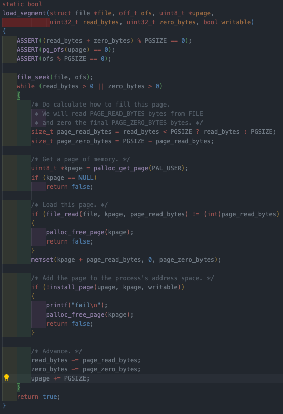
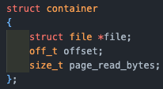

오늘은 어제에 이어서 이번주에 pintOS vm (Anonymous page)을 구현하면서 겪은 내용을 정리한다.

## 개요

이번에는 디스크와 연결되지 않은 익명 페이지에 대해서 구현을 하게 된다.  
해당 페이지는 대표적으로 힙, 스택 등에서 사용되며, 동적이고 비영구적인 메모리 영역에서 사용된다.

#### Anonymous page

Anonymous page는 커널로부터 프로세스에게 할당 된 일반적인 메모리 페이지로, heap을 거치지 않고 할당받은 공간이다.  
head, stack은 anonymous page의 집합이라고 생각해도 좋다.

또한 anonymous page는 디스크 기반이 아니기(파일과 연결되어 있지 않은)때문에 0으로 초기화 되어있다(이전 프로세스의 작업 내용이 읽혀지면 보안문제).

프로세스가 mmap()으로 커널에게 anonymous page를 할당해달라고 하면 커널은 가상메모리 주소 공간을 부여하지만, 해당 공간은 lazy 하게 loading된다.  
유저 프로세스는 할당이 되었다 생각을 하고 해당 주소로 요청을 보내게 되고, page fault가 발생하면 그제서야 빈 frame을 연결해주는 일련의 과정이 되겠다.

anonymous page는 private, shared 두 가지 방식으로 할당 받을 수 있으며, 서로 다른 프로세스간에 공유할 수 있는 페이지인가를 나타내는 지표이다.  
힙, 스택은 프로세스별로 별도로 존재하기 때문에 private 방식으로 할당받을 것이고, shared 방식은 프로세스간 통신을 위해 사용되는 페이지가 되겠다.

## 구현

### Anonymous page

#### struct anon_page

```c
struct anon_page {
    struct page anon_p;
};
```

우선 진행을 위해 비어있는 anon_page에 익명 페이지를 추가해준다.

다음으로는 page의 초기화와 함께 lazy loading을 구현할 것이다.

페이지 초기화의 흐름으로는 3가지를 볼 수 있는데,

- vm_alloc_page_with_initializer  
  인자로 받은 페이지 타입에 맞게 새 페이지를 초기화 한 뒤 다시 유저 프로그램으로 제어권을 넘기는 함수
- page fault 발생
- uninit_initialize가 호출되며, vm_alloc_page_with_initializer 호출.
  - anonymous page : anon_initializer()
  - file_backed page : file_backed_initializer()

#### vm_init

```c
void vm_init(void)
{
	vm_anon_init();
	vm_file_init();
#ifdef EFILESYS /* For project 4 */
	pagecache_init();
#endif
	register_inspect_intr();
	/* DO NOT MODIFY UPPER LINES. */
	/* TODO: Your code goes here. */
	list_init(&frame_table);
	start = list_begin(&frame_table);
}
```

처음 가상 메모리를 초기화 해주는 함수로, 프레임 테이블을 함께 초기화 해주도록 하자.

{: style="display: block; margin-left: auto; margin-right: auto; width: 80%;" }

pintOS를 실행하면 부팅이완료되며(vm 초기화는 완료되었음) main 프로그램이 실행될 것이다.
process_exec()에서는 load() 가 실행되며, load()는 load_segment()를 호출한다.  
이는 세그먼트에 파일을 load 하는 함수로 이전 프로젝트에서는 위에서 보듯이 직접 페이지를 할당하고 해당 페이지에 데이터를 적재하는 방식으로 lazy loading을 사용하고 있지 않았다.  
이번 프로젝트에서 쓰는 load_segment()는 vm_alloc_page_initiallizer()을 호출한다.

#### vm_alloc_page_with_initializer

인자로 주어진 type에 맞춘 uninitialized page를 하나 만들고, 나중에 해당 페이지에 대해 page fault가 발생하면, 주어진 vm_type에 맞게 초기화를 하게 된다(그 전까지는 UNINIT 타입이라는 뜻).

```c
bool vm_alloc_page_with_initializer(enum vm_type type, void *upage, bool writable,
									vm_initializer *init, void *aux)
{

	ASSERT(VM_TYPE(type) != VM_UNINIT)

	struct supplemental_page_table *spt = &thread_current()->spt;

	/* Check whether the upage is already occupied or not. */
	if (spt_find_page(spt, upage) == NULL)
	{
		/* TODO: Create the page, fetch the initialier according to the VM type */
		struct page *page = (struct page *)malloc(sizeof(struct page));

		typedef bool (*initializerFunc)(struct page *, enum vm_type, void *);
		initializerFunc initializer = NULL;

		switch (VM_TYPE(type))
		{
		case VM_ANON:
			initializer = anon_initializer;
			break;
		case VM_FILE:
			initializer = file_backed_initializer;
			break;
		}
		/* TODO: and then create "uninit" page struct by calling uninit_new.
		 * you should modify the field after calling the uninit_new.*/
		uninit_new(page, upage, init, type, aux, initializer);

		page->writable = writable;

		/* TODO: Insert the page into the spt. */
		return spt_insert_page(spt, page);
	}
err:
	return false;
}
```

먼저 해당 페이지가 spt에 존재하지 않음을 확인하고 시작한다.  
통과한다면, malloc으로 페이지 크기만큼 받아오고, UNINIT 상태이다.

이후 type에 맞는 initializer을 switch 문에서 바꿔주고, 끝나고 나면 uninit_new()에서 인자를 통해 정보를 새로 만들 페이지에 넣어준다.

인자를 보면 uninit_new의 init에 lazy_load_segment()가 들어가는 것을 볼 수있다.

나중에 page fault 가 발생하고, 이 페이지가 든 segment가 물리 프레임에 load되지 않은 상황이라면 해당 함수가 실행될 때 segment도 메모리에 lazy load될 것이다.

페이지의 쓰기 여부를 설정해주고, 마지막으로 spt에 새로운 페이지를 추가한다.

#### uninit_initialize

프로세스가 UNINIT 타입의 페이지에 처음 접근하면 page fault가 발생한다.  
page fault handler는 해당 페이지를 디스크에서 프레임으로 swap_in 하는데, UNINIT 타입의 swap_in 함수가 uninit_initialize()이다.  
즉 UNINIT 페이지를 초기화 해 페이지의 타입을 주어진 인자의 타입으로 바꾼다. 여기서 segment도 load 되지 않은 상태라면 lazy_load_segment도 진행한다.

```c
static bool uninit_initialize (struct page *page, void *kva) {
	struct uninit_page *uninit = &page->uninit;

	/* Fetch first, page_initialize may overwrite the values */
	vm_initializer *init = uninit->init;
	void *aux = uninit->aux;

	/* TODO: You may need to fix this function. */
	return uninit->page_initializer (page, uninit->type, kva) &&
		(init ? init (page, aux) : true);
}
```

uninit_page 구조체를 가져와 vm_initializer(lazy_load_segment가 들어있거나 NULL)과, aux(페이지 초기화에 필요한 추가정보)를 얻고, 이를 바탕으로 페이지 초기화 함수에 인자를 전달하여, init이 NULL 이 아닐 경우, 물리메모리에 로드하게 된다.  
NULL 이란 것은 이미 로드되었거나 초기화 된 상태라는 뜻이기에 추가적인 작업이 필요하지 않다.

위 함수까지의 흐름을 살펴보면, page_fault_handler -> vm_try_handle_fault -> vm_do_claim_page -> swap_in -> uninit_initialize -> 각 type의 initializer와 vm_init 호출 의 흐름이 될 것이다.

프로세스가 페이지에 접근을 하고, uninit page일 경우 page fault handler가 호출된다.  
vm_do_claim_page에서는 페이지와 물리 프레임을 연결해주고, uninit_initialize에서 인자로 받은 타입에 맞는 초기화를 진행할 것이다(빈 페이지에 실제로 데이터나 코드를 채워넣은 과정).

이제 살펴보면, 이전 프로젝트 까지는 물리 프레임 부터 할당을 받고 파일을 해당 프레임에 load하고, 페이지 테이블에 가상주소와 물리 주소를 매핑하는 방식이였는데, 이제는 page fault가 발생했을 때가 되어서야 vm_entry에서 정보를 참조하여 디스크에서 데이터를 읽어 물리 프레임에 로드 하는 방식이 되었다.

그럼이제 load 하는 함수들을 수정할 차례이다!

#### load_segment

원하는 시점에 필요한 만큼만 load하기 위해서 lazy loading을 구현한다.  
load_segment는 기존의 kpage 에 모든 file 을 load시키고 upage와 매핑하던 방식에서,

- load_segment는 파일을 page단위로 끊어서 uninit page로 만들고 vm_alloc_page_with_initializer()의 인자로 lazy_load_segment함수와 file에 대한 정보를 전달.
- vm_alloc_page_with_initializer은 정보를 spt에 넣는다.
- page fault가 발생하면, lazy_load_segment 함수를 불러와서 원하는 file을 kpage에 load.

{: style="display: block; margin-left: auto; margin-right: auto; width: 80%;" }

해당 구조체는 file에 대한 정보를 저장하기 위한 구조체이다.

```c
static bool load_segment(struct file *file, off_t ofs, uint8_t *upage,
			 uint32_t read_bytes, uint32_t zero_bytes, bool writable)
{
	ASSERT((read_bytes + zero_bytes) % PGSIZE == 0);
	ASSERT(pg_ofs(upage) == 0);
	ASSERT(ofs % PGSIZE == 0);

	while (read_bytes > 0 || zero_bytes > 0)
	{
		/* Do calculate how to fill this page.
		 * We will read PAGE_READ_BYTES bytes from FILE
		 * and zero the final PAGE_ZERO_BYTES bytes. */
		size_t page_read_bytes = read_bytes < PGSIZE ? read_bytes : PGSIZE;
		size_t page_zero_bytes = PGSIZE - page_read_bytes;

		/* TODO: Set up aux to pass information to the lazy_load_segment. */
		struct container *container = (struct container *)malloc(sizeof(struct container));
		container->file = file;
		container->page_read_bytes = page_read_bytes;
		container->offset = ofs;
		if (!vm_alloc_page_with_initializer(VM_ANON, upage,
											writable, lazy_load_segment, container))
			return false;

		/* Advance. */
		read_bytes -= page_read_bytes;
		zero_bytes -= page_zero_bytes;
		upage += PGSIZE;
		ofs += page_read_bytes;
	}
	return true;
}
```

#### lazy_load_segment

```c
bool lazy_load_segment(struct page *page, void *aux)
{
	/* TODO: Load the segment from the file */
	/* TODO: This called when the first page fault occurs on address VA. */
	/* TODO: VA is available when calling this function. */
	// project 3
	struct file *file = ((struct container *)aux)->file;
	off_t offsetof = ((struct container *)aux)->offset;
	size_t page_read_bytes = ((struct container *)aux)->page_read_bytes;
	size_t page_zero_bytes = PGSIZE - page_read_bytes;

	file_seek(file, offsetof);
	if (file_read(file, page->frame->kva, page_read_bytes) != (int)page_read_bytes)
	{
		palloc_free_page(page->frame->kva);
		return false;
	}
	memset(page->frame->kva + page_read_bytes, 0, page_zero_bytes);

	return true;
}
```

전체 lazy loading의 전체 흐름을 다시 정리하자면

- file_backed page

  - mmap syscall
  - do_mmap : 해당 파일의 정보를 별도의 구조체(container)에 저장하고 전달.
  - vm_alloc_page_with_initializer : page구조체를 생성하고, lazy_load_segemnt(), type 별 initializer(여기선 file_initializer), container을 page 구조체에 저장하고, spt에 추가.
  - 해당 page에 접근하려 시도 후 page fault 발생.
  - page_fault_handler에서 vm_handle_fault 함수를 호출.
  - vm_do_claim을 통해 물리 메모리와 매핑된 kva를 page와 연결.
  - initializer과 lazy_load_segment()가 물리 메모리의 프레임에 file을 load.
  - 정상적인 접근 가능.

- anonymous page

  - setup_stack 또는 load_segment
  - vm_alloc_page_with_initializer : page구조체를 생성하고, lazy_load_segemnt(), type 별 initializer(여기선 anon_initializer), container을 page 구조체에 저장하고, spt에 추가.
  - 해당 page에 접근하려 시도 후 page fault 발생.
  - page_fault_handler에서 vm_handle_fault 함수를 호출.
  - vm_do_claim을 통해 물리 메모리와 매핑된 kva를 page와 연결.
  - initializer과 lazy_load_segment()가 물리 메모리의 프레임에 file을 load.
  - 정상적인 접근 가능.

보듯이 생성과, initialize 를 제외하고는 동일한 로직을 거친다.

그럼 두 부분이 극명한 차이를 보이는 주의점은 뭐가 있을까?

- file_backed page는 파일과 연결된 페이지로, 파일의 데이터를 메모리에 저장한다.
- anon_page는 파일과 연결되지 않은 페이지로(스택, BSS 영역, 동적할당), 메모리에만 존재한다.

- page fault가 발생하면 file_backed page는 파일로 부터 데이터를 다시 로드(file_initializer) 할 수 있다.
- anonymous page는 파일이 없기 때문에 스왑과 메모리에서 관리(anon_initializer)한다.  
  즉 파일에서 데이터를 다시 로드하는 것이 아니라, 스왑 영역에서 데이터를 복원한다.

fork를 수행할 때도 부모 프로세스의 page table을 자식에게 복사를 하게 되는데, 이 때

- file_backed page는 자신과 연결된 파일에 대한 정보를 다 가지고 있기 때문에, fork 시 page 구조체와 파일의 정보(파일 포인터, offset 등)가 그대로 복사된다.  
  부모의 spt 또한 복사하여 자신의 페이지 테이블에 추가하며, 자식 프로세스에서 페이지 폴트가 발생하면 파일에서 데이터를 다시 읽어와 메모리에 로드한다(lazy loading).

- anonymous page의 경우 파일과 연결되어 있지 않기 때문에 파일에서 읽어오는 것이 불가능하다.  
  대신에 부모의 물리 메모리 페이지에 데이터가 들어있기 때문에 물리 메모리 페이지의 내용을 자식의 새로운 페이지에 그대로 복사한다.  
  즉 새로운물리 페이지를할당하고 내용을 복사한 뒤 자식의 가상주소와 매핑한다.
  그렇기 때문에 cow가 구현되지 않은 상황에서 fork 된 자식은 부모와 같은 가상 주소를 가지지만 독립된 물리 프레임을 가지고 자식의 변동사항은 부모에게 영향을 주지 않는다.
