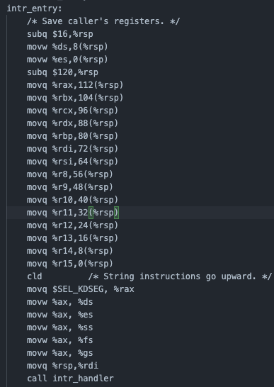
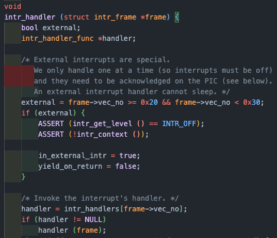
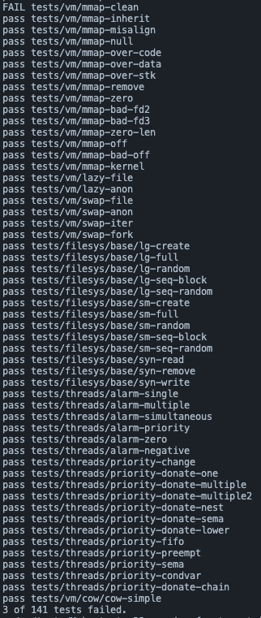

오늘도 이어서 pintOS vm의 stack growth 를 다루어 보겠다.

이전 프로젝트 까지는 스택이 USER_STACK 으로 부터 시작하는 단일 페이지로, 프로그램은 이 크기에 종속되어 실행되었으나, 이젠 스택이 부족하면 확장할 수 있도록 한다.

그럼 왜 동적으로 할당하는 것이 스택 사이즈를 정적으로 고정하는 것 보다 좋을까??

미리 고정으로 할당을 해놓으면 언제 얼마나 필요할 지 알 수도 없을 뿐더러 쓰지도 않는 빈 공간을 스택을위해서 유지를 해야할 수도 있다. 즉 낭비라는 것이다.

스택또한 하나의 페이지이다(anonymous page). 유저 스택에는 유저 프로그램이 돌아가면서 함수가 호출 되면 리턴값이 스택에 쌓이게 될 텐데, 이건 결국 스택 페이지에 접근해서 해당 내용을 작성하는 것이다.  
즉 스택 포인터인 rsp가 내려오면서 해당 위치에 정보를 넣는 것이다.  
그런에 우리가 할당해준 영역보다 rsp가 더 아래로 접근하면?? page fault가 발생할 것이다. 이 때 조건을 검사하고 스택이 확장 되는 것이다.

주의할 점은 접근한 주소(page fault가 발생한 주소)가 유저 가상 주소 공간인가를 생각 해보아야 한다는 것이다.  
만약 맞다면 intr_frame의 rsp값을 그대로 사용하면 될 것이다.  
이 때는 유저 프로세스와 운영체제사이만을 왔다갔다하지 다른 유저 프로세스로 cpu가 넘어가지 않기 때문에 page fault가 발생해서 커널 모드로 전환 될 때, 유저 프로그램의 rsp값은 intr_frame에 저장되게 된다.  
하지만 커널 주소공간에서 page fault가 발생하게 되면 애초에 커널 영역이기 때문에 유저 영역의 스택 포인터 값을 intr_frame에 저장할 과정이 있을 수가 없다.  
그렇기 때문에 커널로 처음 전환이 발생할 때 thread 구조체에 rsp 값을 저장하는 멤버를 추가하여 추적할 수 있도록 하여 해결한다.

> 유저 스택과 커널 스택  
> 유저스택은 각 프로세스가 유저모드에서 사용하는 스택으로 독립적이다.  
> 커널스택은 cpu마다 하나씩 존재하며 시스템 콜, 페이지 폴트, 인터럽트 등의 커널 모드로 전환 될 때 사용되며, 프로세스에 종속되지 않고, cpu에 속하는 스택이다.  
> 컨텍스트 스위칭 시 스택 포인터와 레지스터 값을 커널 스택에 저장했다가 다시 복원하게 된다.  
> [참고자료](https://stackoverflow.com/questions/4941992/what-is-the-difference-between-kernel-stack-and-user-stack)

#### vm_try_handle_fault

intr_frame의 rsp 멤버가 유저 스택을 가리키고 있다면 그대로 가져와서 사용하면 되지만, 커널 스택을 가리키고 있다면?(커널에서 page fault가 발생) 우리는 유저스택을 키우는 것이 목적이니 thread 구조체에 저장해둔 rsp 값을 가져오도록 한다.

또한 대부분의 OS는 유저 프로세스 당 스택의 크기를 제한하고 있다. pintOS에서는 1MB이다.

결국 총 스택의 크기가 1MB(0x100000)이기에, USER_STACK 의 아래로 1MB이내에 있는지를 체크하면 된다.  
한 가지 놓치지 말아야 할 점은 유저프로그램이 스택 포인터의 아래 영역에 쓰기 작업을 할 때 버그가 생기는데 그 이유는 push 명령어를 통해 8바이트 씩 스택 포인터의 위치를 조정하고, 그 사이에 주소값을 넣는데, 내려간 주소가 1MB를 넘어가게 된다면 이는 정상적인 push 인스트럭션이 아니기 때문에 유효하지 않은 케이스임을 알 수 있다.

만약 위 조건을 모두 통과한 유효한 요청일 경우는 vm_stack_growth를 호출하여 확장해 준다.

그럼 정말 vm_try_handle_fault에 intr_frame이 정말 유저 스택의 스택 포인터를 담는지 확인해보자!

page fault가 발생하면, intr_stubs.S의 어셈블리 코드에서 현재 CPU의 컨텍스트를 intr_frame에 저장하고, intr_handler을 호출한다.

{: style="display: block; margin-left: auto; margin-right: auto; width: 80%;" }

{: style="display: block; margin-left: auto; margin-right: auto; width: 80%;" }

intr_handler에서는 vec_no를 확인해서 현재 interrupt에 해당하는 page fault 함수를 호출 한다.

여기선 14번에 PF 핸들러가 저장되어 있으며, 해당 vec_no을 확인하여 page fault 함수를 호출하고 frame 을 전달한다.

page fault 함수에서는 vm_try_handle_fault를 호출하여 user-level의 컨텍스트를 intr_frame에 전달하기 때문에 vm_try_handle_fault에서도 인자로 받은 f에서 스택 포인터에 접근할 수 있다.

```c
bool vm_try_handle_fault(struct intr_frame *f UNUSED, void *addr UNUSED, bool user UNUSED, bool write UNUSED, bool not_present UNUSED)
{
    struct supplemental_page_table *spt UNUSED = &thread_current()->spt;
    struct page *page = spt_find_page(&thread_current()->spt, addr);

    /* TODO: Validate the fault */
    if (addr == NULL || is_kernel_vaddr(addr))
        return false;

    /** Project 3: Copy On Write (Extra) - 접근한 메모리의 page가 존재하고 write 요청인데 write protected인 경우라 발생한 fault일 경우*/
    if (!not_present && write)
        return vm_handle_wp(page);

    /** Project 3: Copy On Write (Extra) - 이전에 만들었던 페이지인데 swap out되어서 현재 spt에서 삭제하였을 때 stack_growth 대신 claim_page를 하기 위해 조건 분기 */
    if (!page)
    {
        /** Project 3: Stack Growth - stack growth로 처리할 수 있는 경우 */
        /* stack pointer 아래 8바이트는 페이지 폴트 발생 & addr 위치를 USER_STACK에서 1MB로 제한 */
        void *stack_pointer = user ? f->rsp : thread_current()->stack_pointer;
        if (stack_pointer - 8 <= addr && addr >= USER_STACK - MAX_STACK_POINT && addr <= USER_STACK)
        {
            vm_stack_growth(thread_current()->stack_bottom - PGSIZE);
            return true;
        }
        return false;
    }

    return vm_do_claim_page(page); // demand page 수행
}
```

#### thread 구조체 수정

앞에서 언급했듯이 이제 thread 구조체에 void *rsp_stack 멤버를 추가하여 스택 포인터 값을 저장해 준다.  
*stack_bottom과 \*rsp_stack을 별도로 관리해 주는 이유는 stack_bottom은 말 그대로 스택의 가장 아래 값을 항상 가리키고, rsp_stack 값은 스택의 사용에 따라서 변동되며 현재 포인터의 위치를 저장한다.

#### vm_stack_growth

해당 함수는 stack_bottom 보다 1페이지 아래에 UNINIT 페이지를 하나 만들고, type은 ANON으로 한다.  
또한 스택의 페이지임을 알 수 있는 마커를 추가한다.  
이후 바로 claim 한다.

```c
static void
vm_stack_growth(void *addr UNUSED)
{
    bool success = false;
    if (vm_alloc_page(VM_ANON | VM_MARKER_0, addr, true))
    {
        success = vm_claim_page(addr);

        if (success)
        {
            /* stack bottom size 갱신 */
            thread_current()->stack_bottom -= PGSIZE;
        }
    }
}
```

이전에 구현 했던 코드들 중에서도 수정해야 하는 내용이 있다.

#### check_address

```c
void check_address(void *addr) {
    thread_t *curr = thread_current();

    if (is_kernel_vaddr(addr) || addr == NULL || pml4_get_page(curr->pml4, addr) == NULL)
        exit_syscall(-1);
}

struct page *check_address(void *addr) {
    THREAD *curr = thread_current();

    if (is_kernel_vaddr(addr) || addr == NULL)
        exit_syscall(-1);

    return spt_find_page(&curr->spt, addr);
}
```

syscall에서 사용하던 check_address 함수는 기존에 원래 단순히 페이지 테이블에서 페이지 매핑을 확인하는 방식이였지만 이는 lazy_loading, swap, stack growth와 같은 메모리 관리 방식의 변경에 대응할 수 없기 때문에, spt를 이용하여 해당 주소의 페이지를 찾고 존해여부를 확인한다.

#### check_valid_buffer

해당 함수는 버퍼가 유효한지 및 쓰기 권한이 있는지를 확인하여 잘못된 메모리 접근으로 인한 오류를 방지하기 위한 함수로, buffer은 메모리의 시작 주소만을 가리키고, size 크기만큼 연속된 메모리 범위에 접근해야 하므로, for을 통해 올바르게 할당되어 있는지 확인한다.

```c
void check_valid_buffer(void *buffer, size_t size, bool writable) {
    for (size_t i = 0; i < size; i++) {
        /* buffer가 spt에 존재하는지 검사 */
        struct page *page = check_address(buffer + i);

        if (!page || (writable && !(page->writable)))
            exit_syscall(-1);
    }
}
```

따라서 해당 read와 write 의 syscall에서 buffer의 유효성을 검사해준다.

#### anon_page

이제 익명페이지를 위한 처리를 해보겠다.

```c
struct anon_page {
    size_t slot;
}
```

해당 멤버는 스왑 영역에 익명페이지가 저장 될 때, 그 위치를 추적하기 위한 필드 이다.

slot이란 스왑 영역을 일정한 크기의 단위로 나누어 관리하는 개념으로, 각 페이지는 스왑 영역의 슬롯에 저장되고, 해당 슬롯의 번호를 기록하는 것이다.

#### anon_initializer

프로세스가 UNINIT 타입의 페이지에 접근해서 page fault가 발생하면, page fault handler에 의해서 호출되는 함수이다.

```c
bool anon_initializer (struct page *page, enum vm_type type, void *kva) {
    /* 데이터를 모두 0으로 초기화 */
    struct uninit_page *uninit = &page->uninit;
    memset(uninit, 0, sizeof(struct uninit_page));

    page->operations = &anon_ops;

    struct anon_page *anon_page = &page->anon;
    /** Project 3: Swap In/Out - ERROR로 초기화  */
    anon_page->slot = BITMAP_ERROR;

    return true;
}
```

uninit page를 0으로 초기화 한 뒤, 페이지를 익명 페이지로 설정해주고, 스왑디스크에 아직 해당 페이지가 없다는 의미인 BITMAP_ERROR을 설정해준다.

해당 함수가 실행 되기까지의 과정을 정리해보면, page_fault -> vm_try_handle_fault->vm_claim_page->vm_do_claim_page->swap_in

swap_in은 page->operations->swap_int을 실행 시키는데 처음 받아온 모든 page는 uninit page이기 때문에 uninit_new에서 설정한 operations의 uninit_ops가 실행된다.  
여기서 uninit_initialize가 호출되고, page의 타입에 따라 initializer와 vm_init을 부른다. 현재는 anon이므로 anon_initializer가 불러지게 된다.

큰 흐름은 uninit page에 접근하여 page fault handler가 호출 되고, vm_do_claim_page에서 해당 page와 물리 프레임을 연결시켜주며, uninit_initialize에서 type에 맞게 page를 초기화 한다.

#### anon_destroy

아래에서 swap을 구현할 때 자세한 내용을 적겠지만, 사용하던 비트맵과 frame을 반환하며, 중요한 점은 clear_page를 통해서 참조하던 kva를 모두 제거해야 한다는 것이다.  
그렇지 않으면, 자식이 exit를 하면서 kva를 파괴시키기 때문에 부모가 사용할 수 없는 일이 발생한다.

```c
static void
anon_destroy (struct page *page) {
    struct anon_page *anon_page = &page->anon;

    /** Project 3: Swap In/Out - 점거중인 bitmap 삭제 */
    if (anon_page->slot != BITMAP_ERROR)
        bitmap_reset(swap_table, anon_page->slot);

    /** Project 3: Anonymous Page - 점거중인 frame 삭제 */
    if (page->frame) {
        list_remove(&page->frame->frame_elem);
        page->frame->page = NULL;
        free(page->frame);
        page->frame = NULL;
    }

    /** Project 3: Copy on Write (Extra) - destroy 시 pml4 clear하여 참조하던 kva들을 모두 해제한다.
     * 그렇지 않으면 자식에서 `exit`시 참조한 부모의 kva가 파괴되어 자식이 부모에서 해당 kva에 접근할 수 없기 때문이다. */
    pml4_clear_page(thread_current()->pml4, page->va);
}
```

## 개요

이제 Anonymous page에 관련된 내용은 끝이났고, Memory-mapped page를 다룰 차례이다.

즉 실제로 디스크에 존재하는 파일의 데이터를 담는다.  
파일과 메모리를 왜 매핑을 할까??  
파일을 메모리처럼 접근할 수 있게 되기 때문에, 별도로 읽기, 쓰기 syscall을 사용하지 않고도 읽기 쓰기 작업을 메모리처럼 할 수 있게 된다.

쓰기 작업으로 인해 파일의 내용이 변경되면, 매핑이 해제(unmap)을 할 때 디스크에 변경사항이 반영된다.

## 구현

#### Mapping

파일과 메모리의 매핑은 syscall 인 mmap()을 통해 이루어딘다.  
mmap은 do_mmap()을 호출하며 이 때 주의점이 존재한다.

- addr가 없다.
- addr가 page-aligned 되지 않았다.
- offset이 page-aligned 되지 않았다.
- addr가 user 영역이 아니다.
- addr + length 가 user 영역이 아니다.
- addr에 할당된 페이지가 이미 존재한다.
- fd에 해당하는 file이 없다.
- file의 길이가 0이거나 0보다 작다.

```c
void
syscall_handler (struct intr_frame *f UNUSED) {
	// TODO: Your implementation goes here.
	// printf ("system call!\n");
#ifdef VM
	thread_current()->stack_pointer = f->rsp;
#endif
switch (f->R.rax)
	{
        ...

#ifdef VM
	case SYS_MMAP:
		f->R.rax = mmap_syscall(f->R.rdi,f->R.rsi,f->R.rdx,f->R.r10,f->R.r8);
		break;

        ...

#endif
	default:
		exit_syscall(-1);
		break;
	}
}

void *mmap_syscall(void *addr, size_t length, int writable, int fd, off_t offset){
	struct supplemental_page_table spt = thread_current()->spt;
    if (!addr || pg_round_down(addr) != addr || is_kernel_vaddr(addr) || is_kernel_vaddr(addr + length))
        return NULL;

    if (offset != pg_round_down(offset) || offset % PGSIZE != 0)
        return NULL;

    if (spt_find_page(&thread_current()->spt, addr))
        return NULL;

    struct file *file = get_file_from_fd(fd);

    if ((file >= STDIN && file <= STDERR) || file == NULL)
        return NULL;

    if (file_length(file) == 0 || (long)length <= 0)
        return NULL;

    return do_mmap(addr, length, writable, file, offset);
}

```

#### do_mmap

file_backed page도 anonymous page와 같이 lazy loading을 이용하는데, 매핑을 해제하는 munmap이 호출되거나 프로세스가 종료될때까지 파일을 닫거나 제거하더라도 매핑은 해제되기 않기 때문에 한 매핑에서 파일의 내용을 변경하면 다른 매핑에도 영향을 주지 않도록, file_reopen을 이용하여 새로운 fd를 얻게 하여 독립적인 매핑을 유지할 수 있도록 한다.

읽어올 길이인 length가 한 페이지 사이즈를 넘어갈 경우에는 한 파일의 내용이 여러 페이지에 걸쳐서 매핑되게 된다.  
매핑을 진행할 때는 간단하게 페이지 주소(addr)에 PGSIZE를 더한 위치에(다음 페이지) 이어서 매핑하면 된다.

이렇게 설정한 정보들로 addr 페이지가 할당되고, 처음으로 접근할 때 page fault가 발생해서 저장해 둔 정보로 파일을 읽어와 메모리에 로딩한다.

```c
void *
do_mmap(void *addr, size_t length, int writable, struct file *file, off_t offset)
{
    lock_acquire(&filesys_lock);
    struct file *copied_file = file_reopen(file);
    void *start_addr = addr;

    size_t read_bytes = (length > file_length(copied_file)) ? file_length(copied_file) : length;
    size_t zero_bytes = PGSIZE - read_bytes % PGSIZE;

    ASSERT((read_bytes + zero_bytes) % PGSIZE == 0);
    ASSERT(pg_ofs(addr) == 0);    // upage가 페이지 정렬되어 있는지 확인
    ASSERT(offset % PGSIZE == 0); // ofs가 페이지 정렬되어 있는지 확인

    struct lazy_load_arg *lazy_load_arg;
    while (read_bytes > 0 || zero_bytes > 0)
    {
        size_t page_read_bytes = read_bytes < PGSIZE ? read_bytes : PGSIZE;
        size_t page_zero_bytes = PGSIZE - page_read_bytes;

        lazy_load_arg = (struct lazy_load_arg *)malloc(sizeof(struct lazy_load_arg));
        if (lazy_load_arg == NULL)
            goto err;
        lazy_load_arg->file = copied_file;
        lazy_load_arg->offset = offset;
        lazy_load_arg->length = page_read_bytes;

        if (!vm_alloc_page_with_initializer(VM_FILE, addr, writable, lazy_load_segment, lazy_load_arg))
            goto err;

        read_bytes -= page_read_bytes;
        zero_bytes -= page_zero_bytes;
        addr += PGSIZE;
        offset += page_read_bytes;
    }
    lock_release(&filesys_lock);
    return start_addr;

err:
    free(lazy_load_arg);
    lock_release(&filesys_lock);
    return NULL;
}
```

#### Unmapping

매핑을 끊을 때, 수정사항이 있다면 기존의 파일에 수정된 사항을 반영해야 한다.  
반영한 뒤에는 프로세스의 가상페이지 목록에서 페이지를 제거한다.

#### file_backed_initializer

수정사항을 파일에 다시 기록하기 위해서는 매핑을 해제하는 시점에 해당 페이지에 매핑된 파일의 정보를 알 수 있어야 하기 때문에 file_backed page가 초기화 될 때 page 구조체에 추가한다.

```c
bool file_backed_initializer(struct page *page, enum vm_type type, void *kva)
{
    struct uninit_page *uninit = &page->uninit;
    /* Set up the handler */
    page->operations = &file_ops;

    struct file_page *file_page = &page->file;
    struct lazy_load_arg *lazy_load_arg = (struct lazy_load_arg *)page->uninit.aux;
    file_page->file = lazy_load_arg->file;
    file_page->offset = lazy_load_arg->offset;
    file_page->length = lazy_load_arg->length;

    return true;
}
```

프로세스가 종료될 때도 마찬가지로 매핑이 해제되어야 하기 때문에 이를 위한 함수를 만든다.

#### file_backed_destroy

```c
static void
file_backed_destroy(struct page *page)
{
    struct file_page *file_page UNUSED = &page->file;

    if (pml4_is_dirty(thread_current()->pml4, page->va))
    {
        file_write_at(file_page->file, page->va, file_page->length, file_page->offset);
        pml4_set_dirty(thread_current()->pml4, page->va, false);
    }

    if (page->frame)
    {
        list_remove(&page->frame->frame_elem);
        page->frame->page = NULL;
        page->frame = NULL;
        free(page->frame);
    }

    pml4_clear_page(thread_current()->pml4, page->va);
}
```

```c
void
syscall_handler (struct intr_frame *f UNUSED) {
	// TODO: Your implementation goes here.
	// printf ("system call!\n");
#ifdef VM
	thread_current()->stack_pointer = f->rsp;
#endif
switch (f->R.rax)
	{
#ifdef VM
	case SYS_MMAP:
		f->R.rax = mmap_syscall(f->R.rdi,f->R.rsi,f->R.rdx,f->R.r10,f->R.r8);
		break;
	case SYS_MUNMAP:
		munmap_syscall(f->R.rdi);
		break;
#endif
	default:
		exit_syscall(-1);
		break;
	}
}
```

#### do_munmap

```c
void do_munmap(void *addr)
{
    struct thread *curr = thread_current();
    struct page *page;

    lock_acquire(&filesys_lock);
    while ((page = spt_find_page(&curr->spt, addr)))
    {
        if (page)
            destroy(page);

        addr += PGSIZE;
    }
    lock_release(&filesys_lock);
}
```

같은 파일에 매핑된 페이지가 모두 해제될 수 있도록, while을 순회하면서, destroy에서 호출되는 file_backed_destroy에서 변경사항을 반영하고 제거한다.

## 개요

#### swap_in, out

물리메모리를 최대한 효율적으로 사용하기 위한 메모리 회수기술이 메모리 스와핑이다.  
메인 메모리의 모든 프레임이 할당 되면 사용자 프로그램의 메모리 할당 요청을 더 이상 처리할 수 없기 때문에, 사용되지 않는 메모리 프레임을 교체하는 방법이다.

메모리가 부족할 때 메모리 할당 요청을 받게 되면, 스왑디스크로 내보낼 victim을 찾고, 메모리 프레임의 상태를 디스크에 복사하게 된다.  
만약 다시 스왑아웃 된 페이지에 접근하려 하면 내용을 다시 메모리로 가져와 복구한다.

물론 이는 anon일 수도 있고, file_backed 일 수도 있다.

#### vm_anon_init

익명페이지는 백업 저장소가 없기 때문에 익명 페이지의 스왑을 위해서는 스왑 디스크라는 임시 백업 저장소를 만든다.

```c
void
vm_anon_init (void) {
	/* TODO: Set up the swap_disk. */
    swap_disk = disk_get(1, 1);
    slot_max = disk_size(swap_disk) / SECTORS_IN_PAGE;
    swap_table = bitmap_create(slot_max);
}
```

disk_get을 통해 스왑 디스크 장치를 가져오는 부분으로, 컨트롤러 번호/장치 번호를 인자로 받고있다.  
따라서 swap_disk 변수는 스왑 디스크를 가리키는 핸들을 저장하게 된다.

slot_max는 스왑 디스크에서 사용할 수 있는 슬롯의 최대 개수를 계산하는 코드로, 스왑 디스크는 페이지 단위로 데이터를 저장하기 때문에, 디스크의 전체 크기에서 한페이지를 저장하는데 필요한 섹터의 수로 나누어 가능한 슬롯의 개수를 구한다.

SECTORS_IN_PAGE는 한 페이지가 몇 개의 섹터로 이루어져 있는지를 나타내며, 4KB의 페이지가 512바이트의 섹터로 이루어져 있기 때문에, 해당 상수는 8이 된다.

이후 주어진 크기만큼 비트맵을 생성하여 그 주소를 swap_table 변수에 저장한다.

> bitmap : 스왑 슬롯이 사용 중인지 아닌지를 나타내는 일종의 배열로, 각 비트가 하나의 슬롯을 나타내며, 0 / 1 로 사용여부를 표기한다.

우리는 슬롯할당 정책으로 first-fit을 사용한다.  
이는 주욱 검색하면서 가장 먼저 나온 0에 해당하는 슬롯을 할당하는 것인데, 비트맵을 사용하게 되면 각 슬롯의 상태를 1비트로 저장하기 때문에 메모리를 최소한으로 사용하고, 접근이 매우 빠르며 구현이 간단하고, 대량으 슬롯을 관리하기에 유리하기 때문에 bitmap을 사용하여 스왑 테이블을 구현하는 것이다.

#### anon_swap_in

anon page를 스왑 디스크에서 물리 메모리로 복원하는 역할로, anon page 구조체의 slot 번호를 통해 스왑 디스크에서 어떤 슬롯을 사용중인지 찾는다.  
sector은 스왑 디스크에서 페이지가 저장된 섹터의 시작 위치를 찾기 위해서 슬롯 번호에 페이지 당 섹터 수를 곱하여 구하게 된다.

이후 유효성 겁사를 통해 유효한지, 사용중인지 확인을 하고 해당 슬롯을 더 이상 사용하지 않도록 비트맵에서 해당 슬롯의 비트를 false로 설정한다.

스왑 디스크에서 메모리로 데이터를 읽는 과정이 for문내의 코드로, SECTORS_IN_PAGE(8) 만큼 반복하며, 각 섹터를 읽어 메모리에 복사한다.

이후 슬롯 번호를 BITMAP_ERROR로 표기하여 더 이상 저장되지 않았음을 나타 낸다.

```c
static bool
anon_swap_in (struct page *page, void *kva) {
    struct anon_page *anon_page = &page->anon;
    size_t slot = anon_page->slot;
    size_t sector = slot * SECTORS_IN_PAGE;

    if (slot == BITMAP_ERROR || !bitmap_test(swap_table, slot))
        return false;

    bitmap_set(swap_table, slot, false);

    for (size_t i = 0; i < SECTORS_IN_PAGE; i++)
        disk_read(swap_disk, sector + i, kva + DISK_SECTOR_SIZE * i);

    sector = BITMAP_ERROR;

    return true;
}
```

#### anon_swap_out

```c
static bool
anon_swap_out (struct page *page) {
    struct anon_page *anon_page = &page->anon;

    size_t free_idx = bitmap_scan_and_flip(swap_table, 0, 1, false);

    if (free_idx == BITMAP_ERROR)
        return false;

    size_t sector = free_idx * SECTORS_IN_PAGE;

    for (size_t i = 0; i < SECTORS_IN_PAGE; i++)
        disk_write(swap_disk, sector + i, page->va + DISK_SECTOR_SIZE * i);

    anon_page->slot = free_idx;

    page->frame->page = NULL;
    page->frame = NULL;
    pml4_clear_page(thread_current()->pml4, page->va);

    return true;
}
```

anon page를 메모리에서 스왑디스크로 내보내는 역할을 수행하며, 물리 메모리에서 페이지를 제거하고 페이지의 데이터를 스왑디스크에 저장하는 흐름을 가진다.

bitmap_scan_and_flip()를 사용하여 비트맵에서 비어있는 스왑 슬롯을 찾고, 이는 값이 0인 비트를 찾아 비트를 1로 설정하고 슬롯의 인덱스를 반환하는 역할을 한다.

물론 아까 말한 것 처럼 first-fit 정책을 사용할 것이기 때문에 0인덱스 부터 시작하여 빈 슬롯을 찾는다.

만약 빈 슬롯이 없다면 BITMAP_ERROR값을 가지게 되며, false를 반환하게 된다.

sector 변수는 페이지가 저장 될 스왑 디스크의 시작 섹터를 나타낸다.

스왑 디스크는 페이지 단위로 관리되며, 한 페이지가 여러 섹터로 나뉘어 저장되므로, 슬롯 인덱스에 섹터 수를 곱하여 페이지가 저장될 섹터의 시작위치를 계산한다.

이제 for문을 순회하며, 스왑디스크의 지정된 섹터에 데이터를 기록한다(한 페이지 만큼).

추후에 페이지가 필요해지면 스왑 인 과정에서 찾을 수 있도록 slot 번호를 저장한다.

이제 사용하지 않는 프레임을 해제한다. 프레임과의 연결을 끊고, 프레임 자체를 해제 한 후, 현재 프로세스의 pml4에서 해당 페이지의 매핑을 제거한다.

#### file_backed_swap_in

파일 기반 페이지의 스왑 인 작업을 수행하기 위해서 lazy_load_segment()를 호출하여, 실제 파일에서 데이터를 읽어 물리 메모리에 적재한다.

```c
static bool
file_backed_swap_in(struct page *page, void *kva)
{
    struct file_page *file_page UNUSED = &page->file;
    return lazy_load_segment(page, file_page);
}
```

#### file_backed_swap_out

스왑아웃을 하기 전 파일에 수정사항이 있었다면 체크하고 반영한 뒤 해제하는 함수로, pml4_is_dirty 를 사용해서 dirty bit을 통해 수정이 되었는지 확인하고 기록 후 다시 초기화 하여 준다.

이후 프레임간의 연결을 해제하고 pml4에서의 매핑도 해제한다.

```c
static bool
file_backed_swap_out(struct page *page)
{
    struct file_page *file_page UNUSED = &page->file;
    if (pml4_is_dirty(thread_current()->pml4, page->va))
    {
        file_write_at(file_page->file, page->va, file_page->length, file_page->offset);
        pml4_set_dirty(thread_current()->pml4, page->va, false);
    }

    page->frame->page = NULL;
    page->frame = NULL;
    pml4_clear_page(thread_current()->pml4, page->va);

    return true;
}
```

## 개요

#### copy on write(COW)

앞에서도 미리 설명했었지만, fork를 수행함에 있어서 부모의 페이지 중 할당 된 페이지는 자식에게도 똑같은 내용으로 복사하여 2개의 물리 메모리가 존재하도록 구현 했었다.  
이는 비효율적인 방법으로, 처음에는 자식과 부모가 같은 물리 메모리를 공유하도록 하였다가, 쓰기 작업을 요청하면 page fault를 통해 handle 하여 새로운 물리 메모리를 할당하여 주도록 수정하는 것이 cow 의 개념이다.

앞서 대부분의 함수는 구현하였고, 실제로 새로운 물리 프레임을 할당하는 로직이 포함된 handler만 구현해 주도록 한다.

#### vm_handle_wp

```c
bool vm_handle_wp(struct page *page UNUSED)
{
    if (!page->accessible)
        return false;

    void *kva = page->frame->kva;

    page->frame->kva = palloc_get_page(PAL_USER | PAL_ZERO);

    if (page->frame->kva == NULL)
        page->frame = vm_evict_frame(); // Swap Out 수행

    memcpy(page->frame->kva, kva, PGSIZE);

    if (!pml4_set_page(thread_current()->pml4, page->va, page->frame->kva, page->accessible))
        return false;

    return true;
}
```

먼저 페이지 구조체에 부모의 기존 writable 여부를 저장한 accessible 멤버를 확인하여, 애초에 쓰기 작업이 가능한 페이지인지를 먼저 확인한다. 불가능 한 경우는 더 이상 처리할 수도 없고 처리할 필요도 없기 때문에 false로 return 한다.

현재 kva 주소를 미리 저장하여, 밑에서 새로운 물리 프레임에 데이터를 복사해야하기 때문에 미리 저장해 놓는다.

이제 새로운 물리 프레임을 할당 받고(user pool)에서, 모두 0으로 초기화 한다.

실패 할 경우 swap out을 통해서 공간을 확보한다.

이후 기존 페이지의 데이터를 복사하여 페이지 테이블에 새로운 매핑을 추가하게 된다.

여기까지가 pintOS vm 프로젝트의 마무리가 되겠다.

{: style="display: block; margin-left: auto; margin-right: auto; width: 80%;" }

merge 관련 케이스 들과 mmap-clean이 실패했는데, 시간이 초과되어서 마무리하게 되었다.. 아쉽...
